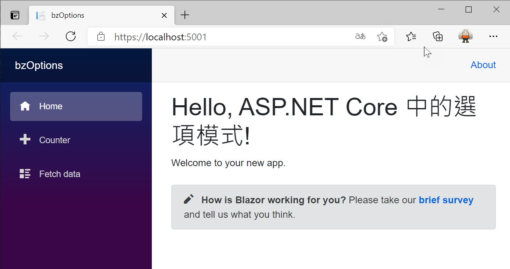
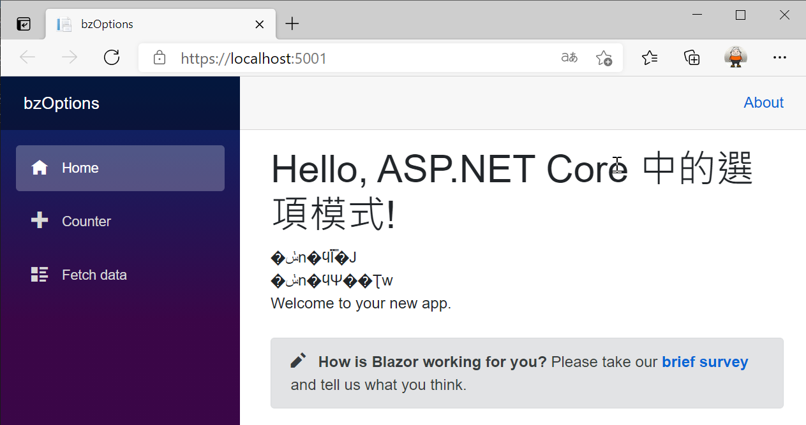
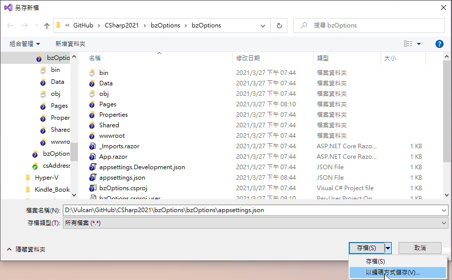
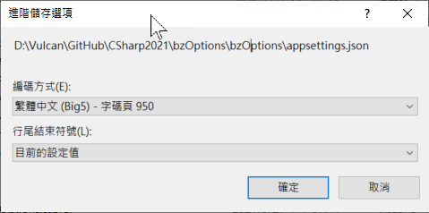
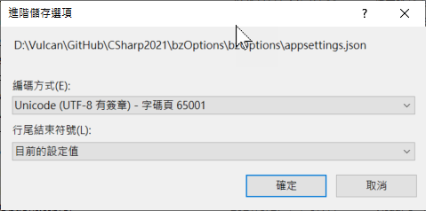
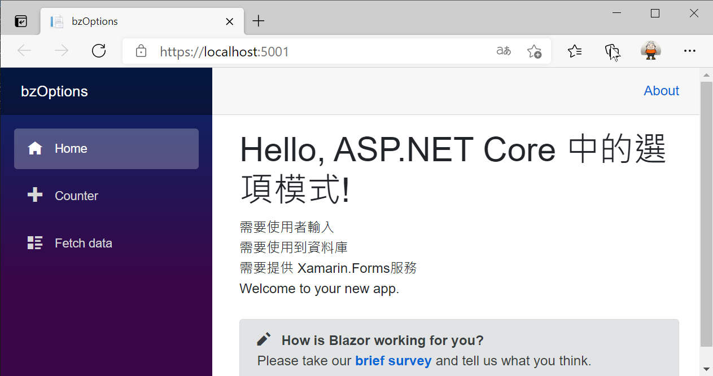

# ASP.NET Core Blazor 設定 Configuration 各種使用方式

當在進行 [Blazor](https://docs.microsoft.com/zh-tw/aspnet/core/blazor/?view=aspnetcore-5.0&WT.mc_id=DT-MVP-5002220) 專案程式設計的時候，可以將許多的設定參數，這些參數將會定義在 [appsettings.json] 檔案內，而此時可以透過 [ASP.NET Core 的設定
](https://docs.microsoft.com/zh-tw/aspnet/core/fundamentals/configuration/?view=aspnetcore-5.0&WT.mc_id=DT-MVP-5002220) 來取得相關的參數設定，在這篇文章中，將會來說明各種 ASP.NET Core 設定 Configration 的使用方式。

現在來看看如何做出這樣的範例成程式碼。

這篇文章的原始碼位於 [bzConfiguration](https://github.com/vulcanlee/CSharp2021/tree/main/bzConfiguration)

## 建立Blazor Server 應用程式專案

* 開啟 Visual Studio 2019
* 選擇右下方的 [建立新的專案] 按鈕
* 在 [建立新專案] 對話窗中
* 從右上方的專案類型下拉按鈕中，找到並選擇 [Web]
* 從可用專案範本清單內，找到並選擇 [空的 ASP.NET Core]
* 點選左下方 [下一步] 按鈕
* 在 [設定新的專案] 對話窗中
* 在 [專案名稱] 欄位中輸入 `bzConfiguration`
* 點選左下方 [下一步] 按鈕
* 在 [其他資訊] 對話窗中
* 在 [目標 Framework] 下拉選單中，選擇 [.NET 5.0 (目前)]
* 點選左下方 [建立] 按鈕

## appsettings.json 與 appsettings.Development.json 檔案內容

* 當建立一個 ASP.NET Core 專案後，會在專案跟目錄下跟目錄下請在 [bzConfiguration] 專案根目錄下找到並且打開 [appsettings.json] 檔案
* 使用底下的內容替換原先檔案內容
* 在這裡新增加了一個 [中文選項1] 設定項目，而該設定項目內有3個子節點，分別為 [Child1] 、 [Child2] 、 [節點中文3]
  > 這裡刻意的使用中文字型，而不是僅使用英文字型，因此，要來體驗看看，當在 [appsettings.json] 檔案有中文字的時候，是否會有問題產生。

```json
{
  "Logging": {
    "LogLevel": {
      "Default": "Information",
      "Microsoft": "Warning",
      "Microsoft.Hosting.Lifetime": "Information"
    }
  },
  "AllowedHosts": "*"
}
```

## 建立 中文選項1 強型別類別

* 滑鼠右擊 [bzConfiguration] 專案節點
* 點選 [加入] > [類別]
* 當出現對話出 [新增項目 - bzConfiguration]
* 在下方 [名稱] 欄位輸入 `中文選項1`
* 點選 [新增] 按鈕
* 將該類別設計為底下內容
* 這裡的設計重點，就是各個屬性名稱，都會與設定檔案 ([appsettings.json]) 內的設定節點名稱相同

```csharp
public class 中文選項1
{
    public string Child1 { get; set; }
    public string Child2 { get; set; }
    public string 節點中文3 { get; set; }
}
```

## 進行該選項對應的服務宣告

* 請在 [bzConfiguration] 專案根目錄下找到並且打開 [Startup.cs] 檔案
* 找到 `services.AddSingleton<WeatherForecastService>();` 這行敘述
* 在這行敘述的下方，加入底下程式碼

```csharp
services.Configure<中文選項1>(Configuration.GetSection("中文選項1"));
```

## 在 Blazor 頁面元件中使用 選項模式

* 請在 [bzConfiguration] 專案找到 [Pages] 資料夾
* 在該資料夾內找到並且打開 [Index.razor] 檔案
* 使用底下宣告標記與程式碼，替換該檔案原先內容

```csharp
@page "/"
@using Microsoft.Extensions.Options
@inject IOptions<中文選項1> option1

<h1>Hello, ASP.NET Core 中的選項模式!</h1>

<div>
    <div>@option1.Value.Child1</div>
    <div>@option1.Value.Child2</div>
    <div>@option1.Value.節點中文3</div>
</div>
Welcome to your new app.

<SurveyPrompt Title="How is Blazor working for you?" />

@code{
    中文選項1 我的客製化選項;
    protected override void OnAfterRender(bool firstRender)
    {
        if(firstRender == true)
        {
            我的客製化選項 = option1.Value;
        }
    }
}
```

## 執行並且測試

按下 F5 開始執行這個專案

現在將會看到底下的畫面



不過，你很快地發現到問題，這裡似乎沒有看到任何在 [appsettings.json] 所宣告的設定內容。

## 找出無法透過 ASP.NET Core 中的選項模式取出設定值的真正原因

* 請先在 [bzConfiguration] 專案根目錄下找到並且打開 [appsettings.json] 檔案
* 在該檔案中找到 [中文選項1] 這個鍵值
* 請修正 [中文選項1] 成為 [YourOption1]
* 底下是修改後的內容

```json
{
  "Logging": {
    "LogLevel": {
      "Default": "Information",
      "Microsoft": "Warning",
      "Microsoft.Hosting.Lifetime": "Information"
    }
  },
  "AllowedHosts": "*",
  "YourOption1": {
    "Child1": "需要使用者輸入",
    "Child2": "需要使用到資料庫",
    "節點中文3": "需要提供 Xamarin.Forms服務"
  }
}
```

* 請在 [bzConfiguration] 專案根目錄下找到並且打開 [Startup.cs] 檔案
* 找到 `services.Configure<中文選項1>(Configuration.GetSection("中文選項1"));` 這行敘述
* 修改為 `services.Configure<中文選項1>(Configuration.GetSection("YourOption1"));`

## 再度進行執行專案

按下 F5 開始執行這個專案

現在將會看到底下的畫面



從上面執行結果的螢幕截圖，可以看到 `@inject IOptions<中文選項1> option1` 敘述所注入 [IOptions<中文選項1>] 物件，是可以成功取得  [appsettings.json] 檔案內的設定內容。

不過，似乎看到的內容都是亂碼，而且對於第三個設定內容 ["節點中文3": "需要提供 Xamarin.Forms服務"]，也是看不到內容

## 都是檔案編碼格式不正確，修正使用 UTF-8 編碼

* 請還原剛剛的 [appsettings.json] 與 [Startup.cs] 檔案修正
* 請打開 [appsettings.json] 檔案
* 點選 Visual Studio 2019 功能表的 [檔案] > [另存 appsettings.json 為] 選項
* 在 [另存新檔] 對話中，點選右下方 [存檔] 按鈕右方的 三角形
* 再彈出子視窗中，選擇 [以編碼方式儲存]

  

* 出現 [確認另存新檔] 對話窗出現後，點選 [是] 按鈕
* 底下的 [進階儲存選項] 對話窗中，顯示了這個檔案現在使用了 [繁體中文 (Big5) - 字碼頁 950] 編碼方式儲存相關文字內容

  

* 請點選 [編碼方式] 下拉選單，切換為 [Unicode (UTF-8 有簽章) - 字碼頁 65001] 這種編碼格式
 
  

## 重新執行，並且確認是否可以正常運作

按下 F5 開始執行這個專案

現在將會看到底下的畫面



現在可以正常運作，也就是可以透過 [ASP.NET Core 中的選項模式](https://docs.microsoft.com/zh-tw/aspnet/core/fundamentals/configuration/options?view=aspnetcore-5.0&WT.mc_id=DT-MVP-5002220) 取得 [ASP.NET Core 的設定
](https://docs.microsoft.com/zh-tw/aspnet/core/fundamentals/configuration/?view=aspnetcore-5.0&WT.mc_id=DT-MVP-5002220) 宣告內容。
