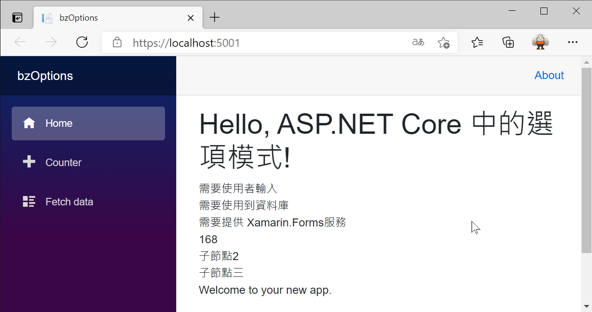

# Blazor 專案使用ASP.NET Core 中的選項模式取得巢狀設定宣告內容

在前一篇文章 [Blazor 專案使用ASP.NET Core 中的選項模式取得設定宣告內容](https://csharpkh.blogspot.com/2021/04/Blazor-ASP-NET-Core-configuration-options-GetSection.html) 中，說明如何使用 [ASP.NET Core 中的選項模式](https://docs.microsoft.com/zh-tw/aspnet/core/fundamentals/configuration/options?view=aspnetcore-5.0&WT.mc_id=DT-MVP-5002220) 來取得定義在 [appsettings.json] 檔案內 (這部分可以參考 [ASP.NET Core 的設定
](https://docs.microsoft.com/zh-tw/aspnet/core/fundamentals/configuration/?view=aspnetcore-5.0&WT.mc_id=DT-MVP-5002220)) 設定內容。

然而，若該 [appsettings.json] 檔案內所宣告的設定內容，具有巢狀的定義結構，這樣要如何能夠取出這些巢狀定義內容值呢？

現在來看看如何做出這樣的範例成程式碼。

這篇文章的原始碼位於 [bzOptionsNest](https://github.com/vulcanlee/CSharp2021/tree/main/bzOptionsNest)

## 開啟 Blazor Server 應用程式專案 並 進行修正

* 開啟 [bzOptions](https://github.com/vulcanlee/CSharp2021/tree/main/bzOptions)
* 請在 [bzOptions] 專案根目錄下找到並且打開 [appsettings.json] 檔案
* 使用底下的內容替換原先檔案內容
* 在這裡，將把 [節點中文3] 節點的設定結構，改成具有多層次的樹狀架構
* 另外，在這裡將會把每個節點的名稱，使用不同的大小寫來定義，等下來確認這樣的定義方式，會不會有任何影響

```json
{
  "Logging": {
    "LogLevel": {
      "Default": "Information",
      "Microsoft": "Warning",
      "Microsoft.Hosting.Lifetime": "Information"
    }
  },
  "AllowedHosts": "*",
  "中文選項1": {
    "Child1": "需要使用者輸入",
    "Child2": "需要使用到資料庫",
    "節點中文3": "需要提供 Xamarin.Forms服務",
    "NestNode1": {
      "subNode1": 168,
      "SubNode2": "子節點2",
      "SUBNODE3": "子節點三"
    }
  }
}
```

## 修改 中文選項1 強型別類別

* 請在 [bzOptions] 專案根目錄下找到並且打開 [中文選項1.cs] 檔案
* 將該類別設計為底下內容
* 在這裡可以看到，這裡在 [中文選項1] 類別內，建立一個屬性，其型別為 [Nestnode1]
* 而這個 [Nestnode1] 類別內的屬性名稱，將會使用微軟建議的屬性名稱命名慣例 [大小寫慣例](https://docs.microsoft.com/zh-tw/dotnet/standard/design-guidelines/capitalization-conventions&WT.mc_id=DT-MVP-5002220) ，也就是 PascalCasing

  > PascalCasing 慣例（用於參數名稱以外的所有識別碼）會將每個字組的第一個字元設為大寫 (包括長度超過兩個字母的縮寫)

```csharp
public class 中文選項1
{
    public string Child1 { get; set; }
    public string Child2 { get; set; }
    public string 節點中文3 { get; set; }
    public Nestnode1 NestNode1 { get; set; }
}
 
public class Nestnode1
{
    public int SubNode1 { get; set; }
    public string SubNode2 { get; set; }
    public string SubNode3 { get; set; }
}
```

## 修正 Blazor 頁面元件中使用 選項模式

* 請在 [bzOptions] 專案找到 [Pages] 資料夾
* 在該資料夾內找到並且打開 [Index.razor] 檔案
* 使用底下宣告標記與程式碼，替換該檔案原先內容

```csharp
@page "/"
@using Microsoft.Extensions.Options
@inject IOptions<中文選項1> option1

<h1>Hello, ASP.NET Core 中的選項模式!</h1>

<div>
    <div>@option1.Value.Child1</div>
    <div>@option1.Value.Child2</div>
    <div>@option1.Value.節點中文3</div>
    <div>@option1.Value.NestNode1.SubNode1</div>
    <div>@option1.Value.NestNode1.SubNode2</div>
    <div>@option1.Value.NestNode1.SubNode3</div>
</div>
Welcome to your new app.

<SurveyPrompt Title="How is Blazor working for you?" />

@code{
    中文選項1 我的客製化選項;
    protected override void OnAfterRender(bool firstRender)
    {
        if (firstRender == true)
        {
            我的客製化選項 = option1.Value;
        }
    }
}
```

## 執行並且測試

按下 F5 開始執行這個專案

現在將會看到底下的畫面




