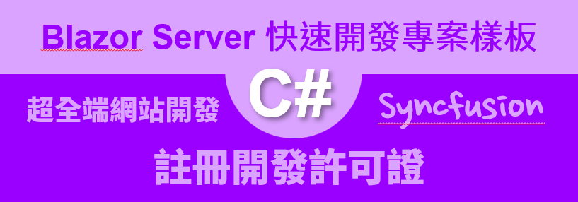
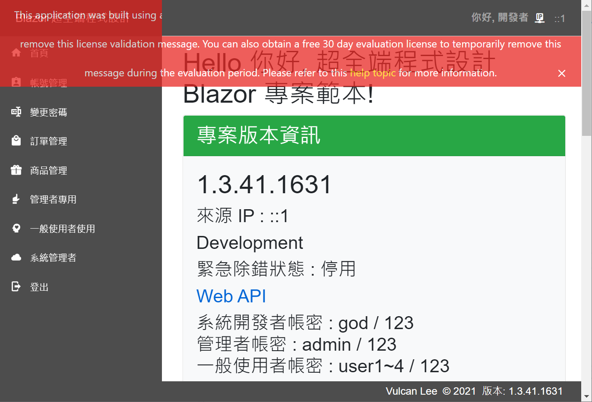
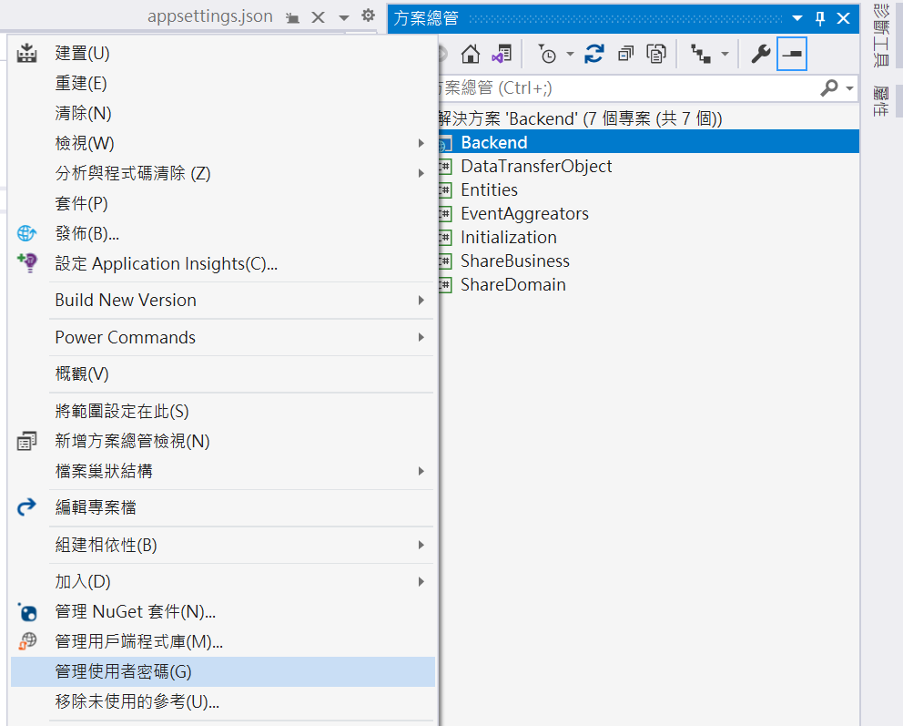
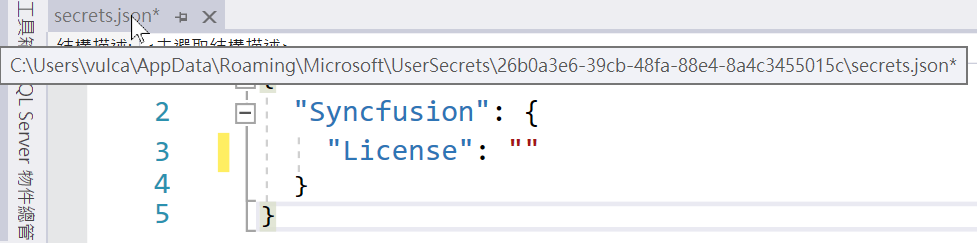
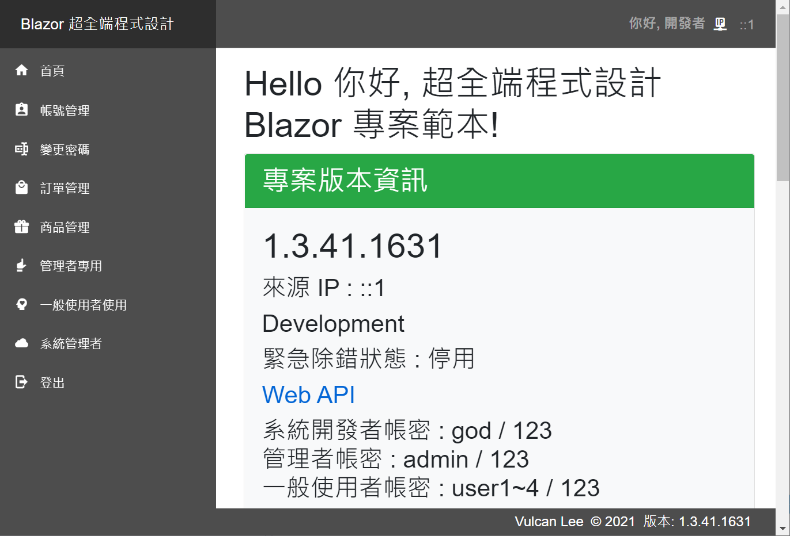

# Blazor Server 快速開發專案樣板 - Syncfusion 註冊開發許可證



[Blazor Server 快速開發專案樣板 - 相關系列文章清單](https://csharpkh.blogspot.com/2021/06/Blazor-Backend-project-template-syncfusion-NET5.html)

上一篇的文章 : [Blazor Server 快速開發專案樣板 1 - 建立一個新的專案](https://csharpkh.blogspot.com/2021/06/Blazor-Backend-project-template-syncfusion-NET5-Part1-Create-New.html)

當在使用 [Blazor Server 快速開發專案樣板] 進行 [Blazor](https://docs.microsoft.com/zh-tw/aspnet/core/blazor/?view=aspnetcore-5.0&WT.mc_id=DT-MVP-5002220) 來進行一個全端網站開發，在這個專案樣板使用到 Syncfusion 這套商業元件，因此，當 Blazor 專案有使用到 Syncfusion 的原生 Blazor 元件，但是沒有適當的使用開發許可証，就會看到如下圖的畫面，在網頁的最上方會出現紅底白字的警告訊息。

```
This application was built using a trial version of Syncfusion Essential Studio. Please include a valid license to permanently remove this license validation message. You can also obtain a free 30 day evaluation license to temporarily remove this message during the evaluation period. Please refer to this help topic for more information.
```



這裡的訊息將是說明你使用的 Syncfusion 元件，但是沒有合法的使用授權。

對於想要體驗 Syncfusion 的 Blazor 原生元件，可以如同上面文字的說明，到 Syncfusion 網站去申請個評估試用的開發授權碼；又或者可以評估你自己是否符合 [Syncfusion COMMUNITY LICENSE](https://www.syncfusion.com/products/communitylicense) 的資格

```
The Community License provides free access to all the Syncfusion products for individual developers and small businesses.
```

若符合社群開發授權資格，便可以到 [Syncfusion](https://www.syncfusion.com/) 網站來申請這樣社群開發的使用授權碼，如何取得 Syncfusion 授權碼的方式，可以參考 [Syncfusion Essential Studio Licensing Overview](https://help.syncfusion.com/common/essential-studio/licensing/license-key)

一旦取得 Syncfusion for Blazor 的軟體使用授權碼，請按照底下的步驟進行 License Key 的註冊

* 在 Blazor 專案根目錄下找到並且打開 [Startup.cs] 檔案
* 找到 [ConfigureServices] 方法，加入 `services.AddSyncfusionBlazor();`

  > 在這個專案範本中，可以搜尋 `#region Syncfusion 元件與多國語言服務` 這個關鍵字，就會發現到這個方法的呼叫敘述

* 找到 [Configure] 方法，搜尋 `#region Syncfusion License Registration` 關鍵字，就會看到底下的程式碼

```csharp
#region Syncfusion License Registration
string key = Configuration["Syncfusion:License"];
Syncfusion.Licensing.SyncfusionLicenseProvider.RegisterLicense(key);
#endregion
```

首先會透過 [ASP.NET Core 的設定](https://docs.microsoft.com/zh-tw/aspnet/core/fundamentals/configuration/?view=aspnetcore-5.0&WT.mc_id=DT-MVP-5002220) 內建機制，取得這個 Syncfusion 的 License Key。

接著，使用這個敘述 `Syncfusion.Licensing.SyncfusionLicenseProvider.RegisterLicense(key);` 敘述來註冊，若這個授權碼是合法且正確的，那麼，當執行這個專案再度執行之後，就不再會看到如上所描述的警告訊息。

可是，當在 Blazor 專案下的 [appsettings.json] or [appsettings.Development.json] 兩個檔案內，是沒有發現到如下的定義內容

```json
{
  "Syncfusion": {
    "License": "你取得的 Syncfusion 的使用授權碼"
  }
}
```

這是因為不想要把 Syncfusion 的使用授權碼加入到版控內，在此使用到了 [在 ASP.NET Core 的開發中安全儲存應用程式秘密](https://docs.microsoft.com/zh-tw/aspnet/core/security/app-secrets?view=aspnetcore-5.0&tabs=windows&WT.mc_id=DT-MVP-5002220) 的這項功能，使用了這項功能，可以用來註冊 Syncfusion 使用授權碼在開發端的電腦上，但是，這些資訊卻不會簽入到版控系統內。

## 使用 安全儲存應用程式秘密

* 滑鼠右擊 Blazor 專案節點
* 從彈出功能表中，選取 [管理使用者密碼]

  

* 此時會開啟 [secrets.json] 視窗
* 在這裡可以輸入你要保護的 ASP.NET Core 設定 JSON 

```JSON
{
  "Syncfusion": {
    "License": "你取得的 Syncfusion 的使用授權碼"
  }
}
```

  

只要完成這樣的宣告，此時，便可以重新執行這個 Blazor 專案，就不會看到 Syncfusion 不合法使用授權的警告訊息了

  

## 補充說明

對於要開發這個專案的其他開發者，當要在另外一台電腦上打開這個專案並且執行專案的時候，一樣會無法發現到 Syncfusion 的 License Key，因此，在這些新的電腦上再度進行  [在 ASP.NET Core 的開發中安全儲存應用程式秘密] 設定。

最後，當這個專案部署到遠端 IIS 主機後，此時需要透過 [ASP.NET Core 的環境變數設定](https://docs.microsoft.com/zh-tw/aspnet/core/fundamentals/configuration/?view=aspnetcore-5.0#environment-variables&WT.mc_id=DT-MVP-5002220) 方式，把 Syncfusion 產品的 License Key 註冊進去即可正常運作。


