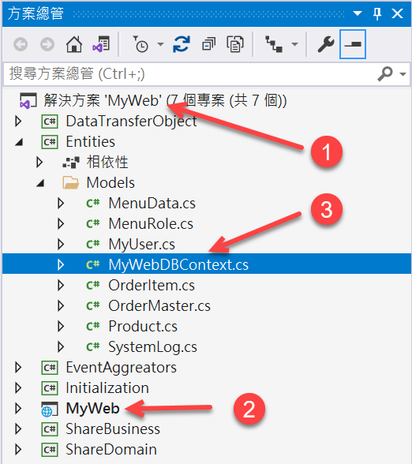

# Blazor Server 快速開發專案樣板 1 - 建立一個新的專案


使用 [Blazor](https://docs.microsoft.com/zh-tw/aspnet/core/blazor/?view=aspnetcore-5.0&WT.mc_id=DT-MVP-5002220) 來進行一個全端網站開發，可以說是相當的容易，整個過程僅需要使用到 C# / HTML / CSS 這三種語言就可以滿足相關技術上的需求，然而，對於一個網站開發工作，有著許多不同的共通需求要來進行開發與設計，因此，特別進行這個 超全端專案範本 的專案開發，針對不同常見的需求、各種 ASP.NET Core 上的設定等等，已經提供了這些程式碼，對於想要使用 Blazor Server 來進行網站開發的程式設計師，僅需要透過這個 超全端專案範本 便可以達到快速開發的目的。

這篇文章將會說明如何開始進行使用 超全端專案範本 來建立起 Blazor Server 專案的相關過程。

> 請特別注意，這個開發專案樣板的許多 UI 元件，將會使用 Syncfusion 這家公司所提供的 [Blazor 原生元件](https://www.syncfusion.com/blazor-components)，而且這套 Syncfusion 的 Blazor 元件並不是免費的，需要付費購買。

## 取得 超全端專案範本 的原始碼

首先，先把這個 Github https://github.com/vulcanlee/Blazor-Xamarin-Full-Stack-HOL Repository 複製到你的本機電腦內

接著，在這個 Repository 的目錄下，找到並且複製 Src\BackendStarter3 這個目錄到你要開發的本機路徑下

## 變更專案名稱為 MyWeb

在這裡設定要開發的專案名稱為 MyWeb

因此，請依據底下的步驟來進行操作

* 把剛剛複製過來的 BackendStarter3 目錄改名為 MyWeb
* 進入到 MyWeb 目錄內，找到 Backend.sln
* 使用 Visual Studio 開啟 Backend.sln 檔案
* 在 Visual Studio 2019 內按下 Ctrl + Shift + H
  > 你也可以點選功能表上的 [編輯] > [尋找與取代] > [檔案中取代]
  >
  > 
  >
  > 準備進行將所有的  Backend 文字替換成為 MyWeb

* 在 [尋找與取代] 視窗內，在第一個文字輸入盒內，輸入 Backend ，在第二個文字輸入盒輸入 MyWeb

  

* 點選下方的 [全部取代] 按鈕
* 一旦完成後，將會看到底下對話窗，請點選 [確定] 按鈕，關閉這個對話窗

  

* 點選 [方案] 節點，並按下 F2 ，準備進行變更這個方案的名稱為 MyWeb
* 點選 [專案] Backend 節點，並按下 F2 ，將該專案名稱並更為 MyWeb
* 在 [Entities] 專案內 [Models] 目錄下，找到 [BackendDBContext.cs] 並點選這個檔案
* 按下 F2 按鈕，修正這個檔案名稱為 [MyWebDBContext.cs]

  

* 按下 Ctrl + Shift + S 全部儲存
* 滑鼠右擊 [MyWeb] 方案節點
* 選擇 [清除方案] 選項
* 完成清除方案動作之後，滑鼠右擊 [MyWeb] 專案節點
* 選擇 [重建] 選項，確認這個專案可以成功建置出來
* 到現在為止，已經完成了這個新的 Blazor Server 專案的建立工作

## 執行專案與進行資料庫初始化

* 在工具列上找到 [IIS Express]
* 從該按鈕下拉選單選擇 [MyWeb]

  

* 點選 [MyWeb] 按鈕，啟動該 Web 專案
* 在建置工作完成後，網頁就會出現
* 首先看到的是 https://localhost:5001/ 這個首頁頁面
  
  

  這個專案樣板程式碼有做過修正，當使用者尚未登入系統而要進入這個系統的時候，將會自動切換為登入的頁面，至於如何在 Blazor Server 專案內設計出這樣的功能，將會在之後的文章做出說明。

* 此時，瀏覽器將會出現底下的畫面

  

  在這個專案範本中，特別有宣告：當在開發除錯階段，有使用 條件式編譯符號 [DEBUG] 來設定開發者帳號作為預設的登入帳號與密碼，並且也會自動顯示所輸入的密碼在文字輸入盒上，並且，也會自動把驗證碼填入到文字輸入盒內。

  這樣的設計將會方便於開發階段的除錯速度，一旦這個專案使用 [RELEASE] 模式來建置並且部署到後端 Web 伺服器上之後，當開啟登入網頁的時候，就不會顯示開發者使用的帳號與密碼，另外，驗證碼的文字輸入盒部分，也會預設為空白。

* 由於帳號、密碼、驗證碼都已經自動填入，因此，請點選 [登入] 按鈕，開始進行登入
* 很不幸的，當按下 [登入] 按鈕之後，出現了底下錯誤訊息在瀏覽器畫面上。

  

  該網頁上出現錯誤訊息文字如下：

  從這個錯誤訊息可以初步看出，這是一個 SqlClient 類別內的 API 所產生出來的錯誤訊息，根據一般開發經驗可以得到這樣的錯誤訊息是因為沒有系統所需要使用的資料庫在本機電腦上，造成無法與資料庫連線，進行取得使用者的帳號與密碼來進行身分驗證。

```
An unhandled exception occurred while processing the request.
Win32Exception: 管道的另一端上無任何處理程序。
Unknown location

SqlException: A connection was successfully established with the server, but then an error occurred during the login process. (provider: Named Pipes Provider, error: 0 - 管道的另一端上無任何處理程序。)
Microsoft.Data.SqlClient.SqlInternalConnection.OnError(SqlException exception, bool breakConnection, Action<Action> wrapCloseInAction)

InvalidOperationException: An exception has been raised that is likely due to a transient failure. Consider enabling transient error resiliency by adding 'EnableRetryOnFailure()' to the 'UseSqlServer' call.
Microsoft.EntityFrameworkCore.SqlServer.Storage.Internal.SqlServerExecutionStrategy.ExecuteAsync<TState, TResult>(TState state, Func<DbContext, TState, CancellationToken, Task<TResult>> operation, Func<DbContext, TState, CancellationToken, Task<ExecutionResult<TResult>>> verifySucceeded, CancellationToken cancellationToken)
```

* 因為這個專案使用 [Kestrel Web 伺服器](https://docs.microsoft.com/zh-tw/aspnet/core/fundamentals/servers/kestrel?view=aspnetcore-5.0&WT.mc_id=DT-MVP-5002220) 方式來啟動這個 Blazor 專案，因此，可以從 命令提示字元視窗，看到如下圖更加詳細的錯誤訊息，也就是發生例外異常當時的呼叫堆疊內容。

  

## 第一次建立資料庫與產生相關測試紀錄

* 首先，在 Visual Stdio 開發工具內
* 點選功能表的 [檢視] > [SQL Server 物件總管]

  

* 從 [SQL Server 物件總管] 視窗內，依序展開 [SQL Server] > [(localdb)\.] > [資料庫] 節點

  在本機的 localDB 資料庫伺服器中，並沒有看到這個系統要使用到的資料庫存在

  

  這個 MyWeb 專案系統所將會使用到的資料庫名稱為 [MyWebDB]，這個資料庫的名稱是使用 [ASP.NET Core 的設定](https://docs.microsoft.com/zh-tw/aspnet/core/fundamentals/configuration/?view=aspnetcore-5.0&WT.mc_id=DT-MVP-5002220) 所提供的功能來做到，也就是把連線字串使用 設定 Configuration 的方式來進行宣告。
  
  想要查看連線字串的宣告，此時，可以打開 MyWeb 專案下的 [appsettings.json] 檔案，找到這樣的定義字串 `"ConnectionStrings": {"MyWebDefaultConnection": "Data Source=(localdb)\\MSSQLLocalDB;Initial Catalog=MyWebDB" }`。

  這就是這個專案要使用到的連線到資料庫的連線字串，最後面的 [Initial Catelog] 屬性的屬性值，就是這個專案要使用到的資料庫名稱。

* 請重新執行這個專案
* 不論現在在哪個頁面，請輸入這個網址 https://localhost:5001/Initialization

  > 當然，這個頁面應該要在正式部署階段時候，應該需要移除，以避免造成資料庫會被移除或者造成破壞

  

* 現在可以點選 [資料庫重新建立與資料初始化] 按鈕
* 現在螢幕上將會出現一個忙碌圖示，表示正在資料庫的刪除、建立、產生測試紀錄的相關工作

  

* 當忙碌圖示消失之後，請在網頁瀏覽器上輸入 https://localhost:5001/Login 頁面
* 接著直接點選 [登入] 按鈕
* 現在，終於可以登入到系統內，並且可以看到這個 Blazor Server 專案範本所提供的網頁畫面

  

## 嘗試體驗使用 CRUDFS 操作功能

這裡所謂的 CRUDSS 表示 Create 建立, Retrive 查詢, Update 更新, Delete 刪除, Filter 過濾, Sort 排序,Pager 分頁 這些功能。

* 點選左邊功能表的 [商品管理] 選項
* 將會看到如下圖的畫面

  

* 嘗試點選 [新增] 按鈕來新增一筆商品
* 當 [新增紀錄] 對話窗出現之後，依據底下畫面的欄位內容，逐一輸入這些欄位值到網頁上

  
  
* 完成之後，請點選右下方的 [儲存] 按鈕
* 此時，剛剛新增的紀錄出現在最下方

  
  
* 請在螢幕上方的 [商品管理] 文字下方，找到可以排序條件的下拉選單控制項
* 請從下拉選單控制項清單中，選擇 [名稱 遞減]
* 現在可以看到如下圖，所有商品紀錄將會使用名稱由大到小的方式來顯示出來

  
  
* 找到 Product9 這筆商品紀錄，在其記錄右方，點選 [修改] 圖示，進行修改商品資料
* 現在可以看到 [修改紀錄] 對話窗出現在螢幕上
* 請依據底下螢幕截圖，修改這筆紀錄的欄位資料內容

  

* 完成後，點選對話窗右下方的 [儲存] 按鈕
* 此時，剛剛修改的紀錄出現畫面上

  

* 找到 海綿寶寶玩偶 這筆商品紀錄，在其記錄右方，點選 [刪除] 圖示，進行刪除商品紀錄
* 現在看到一個警告對話窗，確認是否要刪除這筆紀錄
* 請點選 [確認] 按鈕

  

* 此時，剛剛刪除的紀錄消失在畫面上

  
  
* 請在螢幕畫面右上方的搜索文字輸入盒內，輸入 `大` 這個文字
* 並且點選該文字輸入盒旁邊的搜尋按鈕

  

* 此時，剛剛設定的搜尋條件紀錄將會出現在畫面上
* 當然，若所顯示的紀錄超過一頁可以顯示的設定數量，就可以使用左下方的分頁控制項，進行翻頁瀏覽的操作。

## 結論

這個 Blazor Server 超全端快速開發專案樣板完全使用 C# 來進行開發，而且幾乎沒有使用到 JavaScript ，對於想要使用 Blazor Server 這個 UI Framework 框架來進行開發出一套網站程式，透過這個 Blazor Server 超全端快速開發專案樣板就可以快速地進行開發，因為在這個開發專案範本中，已經提供了單一資料表 與 一對多 的 CRUD 開發範例程式碼，透過 Syncfusion for Blazor 元件的協助，可以設計出豐富的紀錄維護的相關作業；而且，對於許多 ASP.NET Core & Entity Framework Core 上的設定程式碼也都已經建置在這個範本專案內。

當然，要能夠充分掌握與精通 Blazor 專案開發，還是要能夠需要知道這些基本核心的相關設定與設置是如何做到的，因此，在接下來的一系列文章中，將會逐一說明這個 Blazor Server 超全端快速開發專案樣板內提供的各種不同功能與開發方式是如何做到的，以及如何應用在各種開發情境上。


