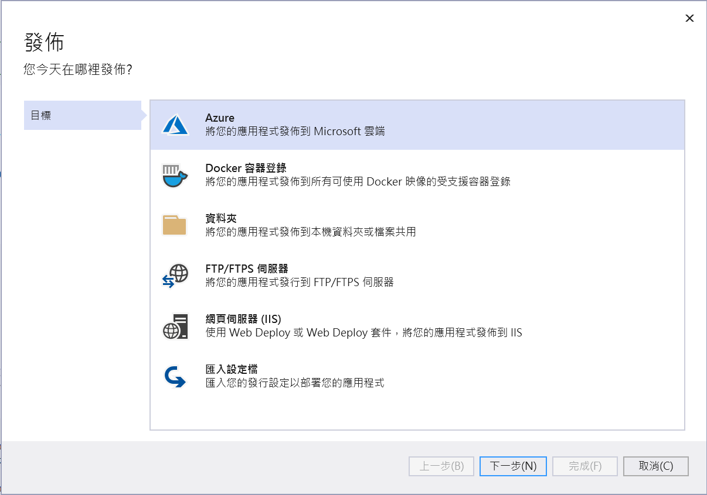

# Blazor Server 快速開發專案樣板 2 - 啟用詳細除錯資訊


當在 [Blazor](https://docs.microsoft.com/zh-tw/aspnet/core/blazor/?view=aspnetcore-5.0&WT.mc_id=DT-MVP-5002220) 來進行一個全端網站開發，一旦使用該網站的過程中，程式碼中拋出例外異常，會出現類似如下圖的畫面。


在這裡是將 Counter.razor 元件的程式碼改成

```
@page "/counter"

<h1>Counter</h1>

<p>Current count: @currentCount</p>

<button class="btn btn-primary" @onclick="IncrementCount">Click me</button>

@code {
    private int currentCount = 0;

    private void IncrementCount()
    {
        currentCount++;
        currentCount = currentCount / 0;
    }
}
```

從這樣的程式碼可以看出，當使用者點選 [Click me] 按鈕之後，會執行 `currentCount = currentCount / 0;` 敘述，這樣的程式碼將會造成產生例外異常。

接著，請在瀏覽器中按下 [F12] 按鈕，便會看到底下畫面


從這個 [開發人員工具] 網頁中，切換到 [主控台] 標籤頁次，將會從 [主控台] 的下方看到紅色的錯誤訊息文字 System.DivideByZeroException: Attempted to divide by zero

```
[2021-06-07T05:51:20.439Z] Error: System.DivideByZeroException: Attempted to divide by zero.
   at WebApplication13.Pages.Counter.IncrementCount() in D:\Vulcan\Projects\WebApplication13\WebApplication13\Pages\Counter.razor:line 15
   at Microsoft.AspNetCore.Components.EventCallbackWorkItem.InvokeAsync[T](MulticastDelegate delegate, T arg)
   at Microsoft.AspNetCore.Components.ComponentBase.Microsoft.AspNetCore.Components.IHandleEvent.HandleEventAsync(EventCallbackWorkItem callback, Object arg)
   at Microsoft.AspNetCore.Components.RenderTree.Renderer.DispatchEventAsync(UInt64 eventHandlerId, EventFieldInfo fieldInfo, EventArgs eventArgs)
```

因為在該按鈕的綁定按鈕事件中，有除數為 0 的運算式，這樣就會造成有例外異常，而且從文字 `D:\Vulcan\Projects\WebApplication13\WebApplication13\Pages\Counter.razor:line 15` 可以看到發生錯誤的行數位於 Counter.razor Razor 頁面的第 15 行，因此，開發者可以立即針對問題點開始進行除錯。

## 使用 Production 模式來執行 Blazor 專案

剛剛已經看到當在開發除錯模式執行時候，若有例外異常發生，可以透過瀏覽器的 [開發人員工具] 看到當時發生了什麼問題。現在，開始使用 [Blazor Server 快速開發專案樣板] 

* 滑鼠右擊專案節點
* 選擇 [發佈] 選項，準備進行發佈這個網站
* 請新增一個使用 [資料夾] 方式的發佈目標

  

* 點選 [發佈] 按鈕，開始進行發佈
* 一旦發佈完成之後，請點選 [目標位置] 標籤文字右邊的藍色連結文字

  

* 此時，會開啟與顯示 [檔案總管] 視窗
* 在該檔案總管的位置列輸入 `cmd` 並且按下 [Enter] 按鈕，將會開啟 [命令提示字元視窗] 並且該 [命令提示字元視窗] 的當前目錄就是現在的目錄。

  

* 當命令提示字元視窗出現之後，將會位於 [Production] 發佈結果的最終目錄，也就是準備要複製到遠端 Web 伺服器上的相關檔案
* 請輸入 `Backend.exe` 並且按下 [Enter] 按鈕
* 現在，[Kestrel Web 伺服器](https://docs.microsoft.com/zh-tw/aspnet/core/fundamentals/servers/kestrel?view=aspnetcore-5.0&WT.mc_id=DT-MVP-5002220) 啟動了

  

```
debu: Backend.Program[0]
      init main
info: Backend.Services.KeepAliveHostedService[0]
      Keep alive 服務開始啟動
info: Microsoft.Hosting.Lifetime[0]
      Now listening on: http://localhost:5000
info: Microsoft.Hosting.Lifetime[0]
      Now listening on: https://localhost:5001
info: Microsoft.Hosting.Lifetime[0]
      Application started. Press Ctrl+C to shut down.
info: Microsoft.Hosting.Lifetime[0]
      Hosting environment: Production
info: Microsoft.Hosting.Lifetime[0]
      Content root path: D:\Vulcan\GitHub\Blazor-Xamarin-Full-Stack-HOL\Src\BackendStarter3\Backend\bin\Release\net5.0\publish
```

* 打開瀏覽器，在位置列上輸入 `https://localhost:5001/` 這個網站端點
* 若因為沒有登入這個網頁，而切換到登入頁面，請輸入使用者帳號與密碼和驗證碼，並且點選 [登入] 按鈕，登入這個系統

  

* 現在將會切換到該系統的首頁
* 請捲動到首頁的最後面，將會看到 [測試強制拋出例外異常] 區段
* 在該區段的下方有個 [拋出例外異常] 按鈕，將會嘗試拋出一個例外異常

  

* 現在，在該網頁的最下方出現了 [有錯誤發生，該應用程式將不無法提供服務，請重新載入 Reload 頁面。 Reload] 文字

  

* 接著，請在瀏覽器中按下 [F12] 按鈕，啟動瀏覽器的 [開發人員工具] 視窗的出現

  

```
[2021-06-07T06:53:23.304Z] Error: There was an unhandled exception on the current circuit, so this circuit will be terminated. For more details turn on detailed exceptions by setting 'DetailedErrors: true' in 'appSettings.Development.json' or set 'CircuitOptions.DetailedErrors'. 
```

* 從這些錯誤訊息是無法得知現在發生了甚麼問題
* 但是，從 [命令提示字元] 視窗內，是可以看到例外異常的詳細訊息

  >不過，一旦這個 Blazor 專案部署到遠端網站的時候，通常是無法從 [命令提示字元視窗] 內看到這些內容，因為，在遠端 Web 伺服器上，看不到這個視窗

  

## 使用 啟用詳細除錯資訊 參數

現在要解決一個問題，那就是當 Blazor Server 專案部署到的時候，並且這個 Blazor Server 專案拋出了例外異常的時候，要如何能夠找出當時發生了甚麼問題，以及問題在哪裡呢？

其實，在 [Blazor Server 快速開發專案樣板] 內已經有內建這樣的彈性設定機制。

* 現在回到剛剛啟動 [Kestrel Web 伺服器](https://docs.microsoft.com/zh-tw/aspnet/core/fundamentals/servers/kestrel?view=aspnetcore-5.0&WT.mc_id=DT-MVP-5002220) 的 [命令提示字元視窗]，並且在這個視窗內輸入 [Ctrl] + [C] ，停止 [Kestrel Web 伺服器] 的執行
* 在 [命令提示字元視窗] 所在的目錄內找到這個 [appsettings.json] 檔案 

  

* 使用任何文字編輯器打開 [appsettings.json] 這個檔案
* 找到 `"EmergenceDebug": false,` 這個屬性定義，將其修改成為 `"EmergenceDebug": true,` ，完成後請記得要存檔

  

* 回到 [命令提示字元視窗] ，請輸入 `Backend.exe` 並且按下 [Enter] 按鈕，準備啟動 [Kestrel Web 伺服器]

  

* 當 [Kestrel Web 伺服器] 啟動之後，開啟瀏覽器，開啟 [https://localhost:5001/] 網頁
* 請捲動到首頁的最後面，將會看到 [測試強制拋出例外異常] 區段
* 在該區段的下方有個 [拋出例外異常] 按鈕，將會嘗試拋出一個例外異常
* 現在，在該網頁的最下方出現了 [有錯誤發生，該應用程式將不無法提供服務，請重新載入 Reload 頁面。 Reload] 文字
* 在瀏覽器內下 [F12] 按鍵，進入到 [開發人員工具] 模式下
* 記得要切換到 [主控台] 標籤頁次

  

* 沒有看錯，雖然現在是在 [Production] 模式下執行，透過切換 [ASP.NET Core 的設定](https://docs.microsoft.com/zh-tw/aspnet/core/fundamentals/configuration/?view=aspnetcore-5.0&WT.mc_id=DT-MVP-5002220) 內建機制，切換各種不同系統運作參數，只要重新再度啟動這個 Web 伺服器，就可以擁有不同的運作功能。
* 最重要的是可以看到當時產生的例外異常明細內容

### 使用環境變數來做參數修正

* 現在請將剛剛的 `"EmergenceDebug": true,` 設定參數，還原成為最初的 `"EmergenceDebug": false,` 設定內容

  > 修改完成後，記得要存檔

* 另外，在 [命令提示字元] 視窗，並且在這個視窗內輸入 [Ctrl] + [C] ，停止 [Kestrel Web 伺服器] 的執行

* 請在 [命令提示字元] 視窗內輸入 `set EmergenceDebug=true`

  > 這部分更多詳盡說明，可以參考 [環境變數](https://docs.microsoft.com/zh-tw/aspnet/core/fundamentals/configuration/?view=aspnetcore-5.0&WT.mc_id=DT-MVP-5002220)

* 繼續到 [命令提示字元] 視窗輸入 `Backend.exe` 並且按下 [Enter] 按鈕，準備啟動 [Kestrel Web 伺服器]
* 當 [Kestrel Web 伺服器] 啟動之後，開啟瀏覽器，開啟 [https://localhost:5001/] 網頁
* 請捲動到首頁的最後面，將會看到 [測試強制拋出例外異常] 區段
* 在該區段的下方有個 [拋出例外異常] 按鈕，將會嘗試拋出一個例外異常
* 現在，在該網頁的最下方出現了 [有錯誤發生，該應用程式將不無法提供服務，請重新載入 Reload 頁面。 Reload] 文字
* 同樣的可以看到這次例外異常所造成的詳細記錄說明。
* 回到 [命令提示字元] 視窗，並且在這個視窗內輸入 [Ctrl] + [C] ，停止 [Kestrel Web 伺服器] 的執行
* 接著取消剛剛的環境變數設定，請在 [命令提示字元] 視窗內輸入 `set EmergenceDebug=`
* 最後，按下 [Enter] 即可

對於要部署到 IIS 主機上，需要在該主機上可以使用下列的 setx 命令，在 Windows 上設定環境機碼和值，這部分的內容一樣可以參考 [環境變數](https://docs.microsoft.com/zh-tw/aspnet/core/fundamentals/configuration/?view=aspnetcore-5.0&WT.mc_id=DT-MVP-5002220) 。

### 如何設計在正式部署下，要顯示明確的例外異常資訊

* 請到 [Backend] 專案目錄下的 [Startup.cs] 檔案
* 找到 `services.AddServerSideBlazor()` 這個敘述，會看到底下的程式碼

```csharp
#region Blazor Server 註冊服務，正式部署下，是否要顯示明確的例外異常資訊
bool emergenceDebugStatus = Convert.ToBoolean(Configuration["EmergenceDebug"]);
if (emergenceDebugStatus == true)
{
    Console.WriteLine($"啟用正式部署可以顯示錯誤詳細資訊");
    services.AddServerSideBlazor()
        .AddCircuitOptions(e =>
        {
            e.DetailedErrors = true;
        });
}
else
{
    services.AddServerSideBlazor();
}
#endregion
```

  > 關於這個方法，可以參考 [ComponentServiceCollectionExtensions.AddServerSideBlazor(IServiceCollection, Action<CircuitOptions>) 方法](https://docs.microsoft.com/zh-tw/dotnet/api/microsoft.extensions.dependencyinjection.componentservicecollectionextensions.addserversideblazor?view=aspnetcore-5.0&WT.mc_id=DT-MVP-5002220)

使用了 [AddCircuitOptions] 這個方法，會使用到 [CircuitOptions 類別](https://docs.microsoft.com/zh-tw/dotnet/api/microsoft.aspnetcore.components.server.circuitoptions?view=aspnetcore-5.0&WT.mc_id=DT-MVP-5002220) 來設定相關 Blazor 電路 Circuit 的運作行為；其中，這裡使用到了 `e.DetailedErrors = true;` 來設定 DetailErrors 屬性值為真，表示需要顯示錯誤詳細訊息。

要呼叫這個方法取決於讀取 [ASP.NET Core 的設定](https://docs.microsoft.com/zh-tw/aspnet/core/fundamentals/configuration/?view=aspnetcore-5.0&WT.mc_id=DT-MVP-5002220) 是否有宣告 EmergenceDebug 這個物件值為 true，這裡需要透過 `bool emergenceDebugStatus = Convert.ToBoolean(Configuration["EmergenceDebug"]);` 敘述來取得這個設定值，根據這個屬性布林值決定 Blazor 的電路運作行為。

因為在這個 [Blazor Server 快速開發專案樣板] 中已經內建這樣的運作機制，因此，透過這個專案範本來進行 Blazor Server 網頁專案設計的時候，便可以隨時動態的進行調整。


