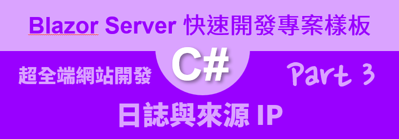

# Blazor Server 快速開發專案樣板 3 - 日誌與來源 IP



[Blazor Server 快速開發專案樣板 - 相關系列文章清單](https://csharpkh.blogspot.com/2021/06/Blazor-Backend-project-template-syncfusion-NET5.html)

上一篇的文章 : [Blazor Server 快速開發專案樣板 2 - 啟用詳細除錯資訊](https://csharpkh.blogspot.com/2021/06/Blazor-Backend-project-template-syncfusion-NET5-Part2-UseDeveloperExceptionPage-UseExceptionHandler.html)

當在 [Blazor](https://docs.microsoft.com/zh-tw/aspnet/core/blazor/?view=aspnetcore-5.0&WT.mc_id=DT-MVP-5002220) 是建立在於 [ASP.NET Core](https://docs.microsoft.com/zh-tw/aspnet/core/introduction-to-aspnet-core?view=aspnetcore-5.0&WT.mc_id=DT-MVP-5002220) 開發框架下的一套 UI 框架套件，因此，許多在進行 Blazor 專案開發過程中所面對的需求，需要知道如何使用 [ASP.NET Core] 所提供的各種 API 來進行全端網站開發。

在這一篇文章中，將要來說明如何在 Blazor 專案中使用系統日誌 Logger 這樣的功能，透過 日誌 Logger 相關 API，可以把系統發生的許多異常或者正常訊息，寫入到具備永久儲存特性的媒體，例如：檔案系統、資料庫，並且可以針對這些寫入的日誌訊息進行額外的調整與設定。

在這個 [Blazor Server 快速開發專案樣板] 中使用到了 [NLog](https://github.com/NLog/NLog/wiki/Getting-started-with-ASP.NET-Core-5) 這個套件來提升原有 ASP.NET Core 預設日誌所不足的功能

## 安裝 NLog 套件

若想要在自行開發的 Blazor 專案下使用 NLog 套件，可以依循底下的步驟來將這個套件安裝到該專案內。

* 滑鼠右擊專案內的 [相依性] 節點
* 從彈出功能表中，選擇 [管理 NuGet 套件]
* 當 [NuGet: bzNlog] 視窗出現後，切換到 [瀏覽] 標籤頁次
* 搜尋 [NLog.Web.AspNetCore] 並且安裝並且套件
* 安裝完成後，會有一個 [readme.txt] 視窗顯示出來，提示如何使用

```
Welcome to NLog for ASP.NET Core!

To get started, check one of these short tutorials:

- Getting started for ASP.NET Core 5: https://github.com/NLog/NLog/wiki/Getting-started-with-ASP.NET-Core-5
- Getting started for ASP.NET Core 3: https://github.com/NLog/NLog/wiki/Getting-started-with-ASP.NET-Core-3
- Getting started for ASP.NET Core 2: https://github.com/NLog/NLog/wiki/Getting-started-with-ASP.NET-Core-2

# More information

- How to use structured logging: https://github.com/NLog/NLog/wiki/How-to-use-structured-logging
- All config options: https://nlog-project.org/config

# Troubleshooting

Having issues to get things working? It's recommend to follow to Troubleshooting https://github.com/NLog/NLog/wiki/Logging-troubleshooting page.

For questions, StackOverflow (https://stackoverflow.com/questions/tagged/nlog) is recommend
```

### 建立 nlog.config 設定檔案

安裝好 NLog 套件之後，接下來需要做些設定

* 滑鼠右擊專案節點
* 選擇 [加入] > [新增項目]
* 此時將會顯示 [新增項目] 對話窗
* 在左邊請點選 [已安裝] > [Visual C#] > [ASP.NET Core] > [資料]
* 在該對話窗的中間部分，請選擇 [XML檔]
* 在下方 [名稱] 欄位，輸入 `nlog.config`
* 將底下內容填入到這個檔案內

```xml
<?xml version="1.0" encoding="utf-8" ?>
<nlog xmlns="http://www.nlog-project.org/schemas/NLog.xsd"
      xmlns:xsi="http://www.w3.org/2001/XMLSchema-instance"
      autoReload="true"
      throwConfigExceptions="true"
      internalLogLevel="info"
      internalLogFile="c:\temp\internal-nlog-AspNetCore5.txt">

	<!-- enable asp.net core layout renderers -->
	<extensions>
		<add assembly="NLog.Web.AspNetCore"/>
	</extensions>

	<!-- the targets to write to -->
	<targets>
		<!-- File Target for all log messages with basic details -->
		<target xsi:type="File" name="allfile" fileName="c:\temp\nlog-AspNetCore5-all-${shortdate}.log"
				layout="${longdate}|${event-properties:item=EventId_Id:whenEmpty=0}|${uppercase:${level}}|${logger}|${message} ${exception:format=tostring}" />

		<!-- File Target for own log messages with extra web details using some ASP.NET core renderers -->
		<target xsi:type="File" name="ownFile-web" fileName="c:\temp\nlog-AspNetCore5-own-${shortdate}.log"
				layout="${longdate}|${event-properties:item=EventId_Id:whenEmpty=0}|${uppercase:${level}}|${logger}|${message} ${exception:format=tostring}|url: ${aspnet-request-url}|action: ${aspnet-mvc-action}|" />

		<!--Console Target for hosting lifetime messages to improve Docker / Visual Studio startup detection -->
		<target xsi:type="Console" name="lifetimeConsole" layout="${level:truncate=4:lowercase=true}: ${logger}[0]${newline}      ${message}${exception:format=tostring}" />
	</targets>

	<!-- rules to map from logger name to target -->
	<rules>
		<!--All logs, including from Microsoft-->
		<logger name="*" minlevel="Trace" writeTo="allfile" />

		<!--Output hosting lifetime messages to console target for faster startup detection -->
		<logger name="Microsoft.Hosting.Lifetime" minlevel="Info" writeTo="lifetimeConsole, ownFile-web" final="true" />

		<!--Skip non-critical Microsoft logs and so log only own logs-->
		<logger name="Microsoft.*" maxlevel="Info" final="true" />
		<!-- BlackHole -->

		<logger name="*" minlevel="Trace" writeTo="ownFile-web" />
	</rules>
</nlog>
```

###  設定 nlog.config 設定檔案屬性

* 在方案總管中找到這個 [nlog.config] 檔案
* 請在 [屬性] 視窗中找到 [複製到輸出目錄] 這個欄位
* 設定 [複製到輸出目錄] 的設定值為 [有更新時才複製]

  

## Blazor Server 快速開發專案樣板 的 NLog 設定值說明

在 [Blazor Server 快速開發專案樣板] 內的 NLog 設定檔案如同底下內容

```xml
<?xml version="1.0" encoding="utf-8" ?>
<nlog xmlns="http://www.nlog-project.org/schemas/NLog.xsd"
      xmlns:xsi="http://www.w3.org/2001/XMLSchema-instance"
      autoReload="true"
      throwConfigExceptions="true"
      internalLogLevel="info"
      internalLogFile="c:\temp\internal-nlog.txt"
	  >
	<!--internalLogFile="${tempdir}\internal-nlog.txt"-->


	<!-- enable asp.net core layout renderers -->
	<extensions>
		<add assembly="NLog.Web.AspNetCore"/>
	</extensions>

	<!-- the targets to write to -->
	<targets>
		<!-- File Target for all log messages with basic details -->
		<target xsi:type="File" name="allfile" fileName="${var:LogRootPath}\${var:AllLogMessagesFilename}.log"
				layout="${longdate}|${event-properties:item=EventId_Id:whenEmpty=0}|${uppercase:${level}}|${logger}|${message} ${exception:format=tostring}"
				maxArchiveFiles="7"
				archiveDateFormat="yyyy-MM-dd"
				archiveNumbering="Date"
				archiveFileName="${var:LogRootPath}/${var:AllLogMessagesFilename}-{##}.log"
				encoding="utf-8"
				archiveAboveSize="2097152"
				archiveEvery="Day"
				/>

		<!-- File Target for own log messages with extra web details using some ASP.NET core renderers -->
		<target xsi:type="File" name="ownFile-web" fileName="${var:LogRootPath}/${var:AllWebDetailsLogMessagesFilename}.log"
				layout="${longdate}|${event-properties:item=EventId_Id:whenEmpty=0}|${uppercase:${level}}|${logger}|${message} ${exception:format=tostring}|url: ${aspnet-request-url}|action: ${aspnet-mvc-action}|"
				maxArchiveFiles="10"
				archiveDateFormat="yyyy-MM-dd"
				archiveNumbering="Date"
				archiveFileName="${var:LogRootPath}/${var:AllWebDetailsLogMessagesFilename}-{##}.log"
				encoding="utf-8"
				archiveAboveSize="2097152"
				archiveEvery="Day"
				/>

		<!--Console Target for hosting lifetime messages to improve Docker / Visual Studio startup detection -->
		<target xsi:type="Console" name="lifetimeConsole" layout="${level:truncate=4:lowercase=true}: ${logger}[0]${newline}      ${message}${exception:format=tostring}" />
	</targets>

	<!-- rules to map from logger name to target -->
	<rules>
		<!--All logs, including from Microsoft-->
		<logger name="*" minlevel="Trace" writeTo="allfile" />

		<!--Output hosting lifetime messages to console target for faster startup detection -->
		<logger name="Microsoft.Hosting.Lifetime" minlevel="Info" writeTo="lifetimeConsole, ownFile-web" final="true" />

		<!--Skip non-critical Microsoft logs and so log only own logs-->
		<logger name="Microsoft.*" maxlevel="Info" final="true" />
		<!-- BlackHole -->

		<logger name="*" minlevel="Trace" writeTo="lifetimeConsole, ownFile-web" />
	</rules>
</nlog>
```

首先是在最前面的 internalLogFile 參數表示這個 NLog 系統本身所產生的相關運作日誌，這裡需要寫死 Hard Code 的方式來指定這個 NLog 本身內部的日誌檔案到固定的路徑，因此，當部署到遠端 Web 伺服器的時候，那個時候就需要根據那台機器本身的環境，額外的來設定該路徑。

很不幸的，這個路徑是沒有辦法使用 [ASP.NET Core 的設定](https://docs.microsoft.com/zh-tw/aspnet/core/fundamentals/configuration/?view=aspnetcore-5.0&WT.mc_id=DT-MVP-5002220) 來進行額外的動態路徑設定，不過，對於 NLog 的其他參數，是可以使用變數的方式，透過  [ASP.NET Core 的設定] 機制，讀出相關設定值，指定到變數內來執行指定的運作方式。

接下來參考 `<targets> ... </targets>` 這個項目的內容

對於第一個 `<target xsi:type="File" name="allfile" ...` 這個項目 Element，可以看到這個屬性 [fileName] 的設定值為 `${var:LogRootPath}\${var:AllLogMessagesFilename}.log` ；對於這個路徑是由變數 LogRootPath 與 AllLogMessagesFilename 來組合而成，這兩個變數則是在 [Blazor Server 快速開發專案樣板] 內來進行指定的。

這兩個變數的實際內容值設定在 [ASP.NET Core 的設定] 內，可以打開 Blazor 專案的根結點，找到並且打開 [appsettings.json]


其中可以在這個檔案內的最後面找到 [CustomNLog] 這個節點，其中這個節點內有三個屬性值，這裡的屬性值將是指定 NLog 套件要寫入檔案的名稱。

在 [Startup.cs] 檔案內可以使用 [ASP.NET Core 的設定](https://docs.microsoft.com/zh-tw/aspnet/core/fundamentals/configuration/?view=aspnetcore-5.0&WT.mc_id=DT-MVP-5002220) 的 API 來讀取出這些設定值

```csharp
var logRootPath = Configuration["CustomNLog:LogRootPath"];
var allLogMessagesFilename = Configuration["CustomNLog:AllLogMessagesFilename"];
var allWebDetailsLogMessagesFilename = Configuration["CustomNLog:AllWebDetailsLogMessagesFilename"];
```

在這裡使用了 [ASP.NET Core 中的選項模式](https://docs.microsoft.com/en-us/aspnet/core/fundamentals/configuration/options?view=aspnetcore-5.0&WT.mc_id=DT-MVP-5002220) 方式來使用強型別方式來讀取相關 [ASP.NET Core 設定] 的內容。

首先，先建立一個這些對應設定屬性的類別，這裡將會在 [Models] 目錄下建立了一個 [CustomNLog] 類別，如下面的程式碼。

> 這裡的類別名稱可以使用任何的名稱，不過，該類別內的屬性名稱必須對應到 [ASP.NET Core 設定] 內的屬性值相同的名稱

```csharp
public class CustomNLog
{
    public string LogRootPath { get; set; }
    public string AllLogMessagesFilename { get; set; }
    public string AllWebDetailsLogMessagesFilename { get; set; }
}
```

接著，在 [Startup.cs] 類別內的 [ConfigureServices] 方法內使用底下方式來註冊 [選項介面](https://docs.microsoft.com/zh-tw/aspnet/core/fundamentals/configuration/options?view=aspnetcore-5.0#options-interfaces&WT.mc_id=DT-MVP-5002220)，在這個 [services.Configure] 延伸泛型方法內要使用 [CustomNLog] 這個類別型別

```csharp
#region 相關選項模式
services.Configure<CustomNLog>(Configuration
    .GetSection("CustomNLog"));
#endregion
```

這裡需要指定哪一塊的 [ASP.NET Core 設定] 定義內容要與這裡指定的選項綁定在一起

另外，可以在 [Startup.cs] 類別內的 [Configure] 方法內使用底下方式來取得相關設定值。


不過，需要在 [Configure] 方法內宣告 `IOptions<CustomNLog> optionsCustomNLog` 一個參數，注入一個選項物件，透過這個物件便可以取得相關 NLog 的設定內容。

為了要將這些設定值綁定到 NLog 內，需要使用類似這樣 `LogManager.Configuration.Variables["LogRootPath"] = optionsCustomNLog.Value.LogRootPath;` 的敘述，綁定到 NLog 的變數環境內；經過這樣的設定後，便可以在 [nlog.config] 內使用 `${var:LogRootPath}` 方式來取得相關設定的物件值。

因此，對於 NLog 要寫入到檔案內的各種寫入的日誌訊息，就可以透過 [ASP.NET Core 設定] 機制來動態指定要寫入的路徑與檔案名稱，這樣可謂是非常的方便。

最後繼續來看剛剛的 [target] 節點，有宣告 [maxArchiveFiles="7"] 這樣的設定，表示 NLog 系統最多保留 7 天內的 Log 檔案，也就是說，這些 Log 檔案會每天歸檔一份。

## 如何使用與寫入到 Log 檔案內

當要寫入任何活動、異常訊息到日誌系統內，需要先使用相依性注入容器，注入 ILogger 介面的註冊物件；這裡可以參考 [Pages] 資料夾內的 [Login.cshtml.cs] 檔案，這裡使用了建構式注入的方式來注入 `ILogger<LoginModel> logger` 物件，例如底下的用法

```csharp
public LoginModel(IMyUserService myUserService, ILogger<LoginModel> logger, SystemLogHelper systemLogHelper, IHttpContextAccessor httpContextAccessor)
```

當要寫入任何訊息到日誌系統的時候，可以使用類似這樣的方法 `logger.LogInformation($"{Msg}");` ，便可以把 [Msg] 變數字串值寫入到日誌系統內，至於相關的日誌 API 可以參考 [.NET Core 與 ASP.NET Core 中的記錄](https://docs.microsoft.com/zh-tw/aspnet/core/fundamentals/logging/?view=aspnetcore-5.0&WT.mc_id=DT-MVP-5002220) 這份文章。

## 取得使用者當時的來源 IP

在有些時候要寫入日誌系統的時候，希望能夠把當時使用者的來源 IP 也一併寫入，或者，有些比較特殊的訊息想要同步寫入到資料庫內，可以方便客戶管理者來查詢這些系統運作訊息，就需要額外的特別來進行設計。

在 [Blazor Server 快速開發專案樣板] 內可以透過已經做好的介面來查看到這些訊息

* 在登入這個網頁系統，在此需要使用開發者帳號 (god) 來進行登入，否則無法看到底下的內容
* 從左邊功能表點選 [系統管理者] > [系統日誌]

  

  從這裡可以透過所提供的各項功能，進行搜尋、過濾的方式，來查看特定的訊息。

  底下的螢幕截圖將會是查看特定訊息的詳細內容

  

要如何寫入這樣的客製訊息到資料庫內，而且可以取得當時使用者的 IP

這裡同樣使用 [登入] 這個 Razor 頁面這隻程式來做為講解

打開 [Login.cshtml.cs] 檔案內找到底下的程式碼，就可以將客製化訊息寫入到資料庫內

```csharp
Msg = $"身分驗證失敗，使用者({Username}不存在 : {message})";
await SystemLogHelper.LogAsync(new SystemLogAdapterModel()
{
    Message = Msg,
    Category = LogCategories.User,
    Content = "",
    LogLevel = LogLevels.Information,
    Updatetime = DateTime.Now,
    IP = HttpContextAccessor.HttpContext.Connection.RemoteIpAddress.ToString(),
});
```

其中，想要取得網頁端的來源 IP，可以注入 IHttpContextAccessor 這個介面，並且透過這個注入的物件，使用 `HttpContextAccessor.HttpContext.Connection.RemoteIpAddress.ToString()` 方法來取得用戶的來源 IP。

而對於 [SystemLogHelper.LogAsync] API 程式碼位於 Blazor 專案內的 [Helpers] 資料夾內找到 [SystemLogHelper.cs] 檔案

```csharp
public class SystemLogHelper
{
    public ISystemLogService SystemLogService { get; }
    public IMapper Mapper { get; }
    public SystemLogHelper(ISystemLogService systemLogService,
        IMapper mapper)
    {
        SystemLogService = systemLogService;
        Mapper = mapper;
    }
    public async Task LogAsync(SystemLogAdapterModel systemLogAdapterModel, Action action=null)
    {
        action?.Invoke();
        await SystemLogService.AddAsync(systemLogAdapterModel);
    }
}
```


