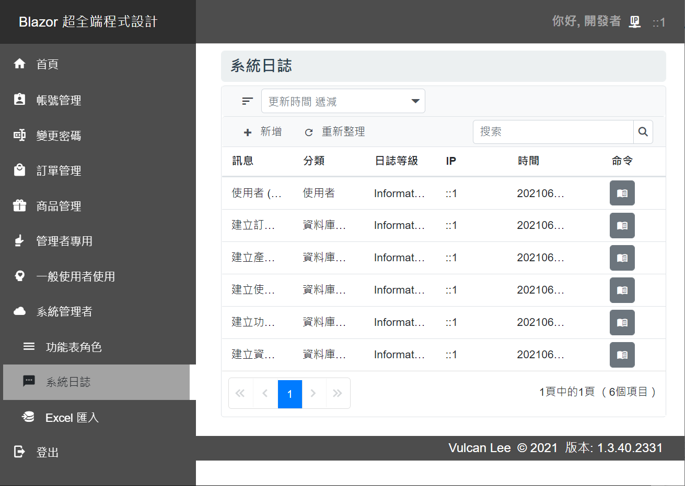
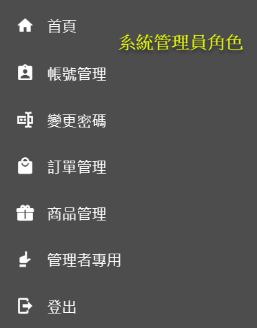
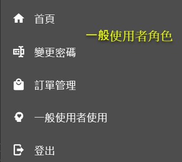

# Blazor Server 快速開發專案樣板 4 - 資料庫重建與紀錄初始化


[Blazor Server 快速開發專案樣板 - 相關系列文章清單](https://csharpkh.blogspot.com/2021/06/Blazor-Backend-project-template-syncfusion-NET5.html)

上一篇的文章 : [Blazor Server 快速開發專案樣板 3 - 日誌與來源 IP](https://csharpkh.blogspot.com/2021/06/Blazor-Backend-project-template-syncfusion-NET5-Part3-logging-Source-IP-NLog.html)

在這篇文章將會說明在進行 [Blazor](https://docs.microsoft.com/zh-tw/aspnet/core/blazor/?view=aspnetcore-5.0&WT.mc_id=DT-MVP-5002220) 專案開發的時候，通常會使用存取資料庫的紀錄，在這個 [Blazor Server 快速開發專案樣板] 內，使用了 [Entity Framework Core 5](https://docs.microsoft.com/zh-tw/ef/core/what-is-new/ef-core-5.0/whatsnew?WT.mc_id=DT-MVP-5002220) Code First 方式來進行存取資料庫，並且在開發階段將會使用本機電腦上的 localDB 資料庫來進行開發。

在 [Blazor Server 快速開發專案樣板 1 - 建立一個新的專案](https://csharpkh.blogspot.com/2021/06/Blazor-Backend-project-template-syncfusion-NET5-Part1-Create-New.html) 文章中有提到，一旦建立起一個新專案之後，需要建立起一個開發用的資料庫，這樣這個 [Blazor Server 快速開發專案樣板] 便可以開始運作了，還有相當多的運用也都會使用到資料庫來進行資料存取。

[Blazor Server 快速開發專案樣板] 內會使用到底下的資料庫綱要


這些定義的資料表 Table 並沒有多少，其主要的目的如下

* MyUser

  這個系統內的使用者，其中有個內建的帳號為 god，這表示了為開發者專用的帳號，會有這樣的帳號是因為想要設計某些功能僅能夠讓開發者可以來使用，客戶管理者或者一般帳號是看不到這些功能，就算直接輸入這些 URL，還是無法使用這些功能。

  

  從上面的螢幕截圖，是使用 god 開發者帳號登入所看到的功能表清單，其中，會有一個 [系統管理者] 功能表群組項目，點選這個名稱之後，就會展開三個子功能表項目，便可以進行額外的內部系統設定與調整。

  

  上面截圖就是當使用者就算使用系統管理者登入，並且直接輸入了 https://localhost:5001/menurole 網頁端點，因為身分沒有被授權，還是無法進行登入。

  > 不過，在這個專案範本內也做了一些額外的保護，就算使用者直接變更資料庫內的 god 紀錄，還是會受到基本的保護。

* MenuRole / MenuData

  這兩個資料表則是用來定義使用者可以看到的功能表群組清單項目，因此，這個系統可以做到不同使用者登入後，僅能夠看到該使用者授權使用的作業畫面。

* SystemLog

  這個資料表將適用於儲存 [Blazor Server 快速開發專案樣板 3 - 日誌與來源 IP](https://csharpkh.blogspot.com/2021/06/Blazor-Backend-project-template-syncfusion-NET5-Part3-logging-Source-IP-NLog.html) 文章中提到的客製化日誌紀錄，開發者可以透過適當的網頁來查詢到相關的系統運作核心訊息紀錄。

  

* Product / OrderMaster / OrderItem

  這三個資料表是用於展示如何透過這個專案設計出 單一資料表 或者 一對多資料表 的作業所使用到的資料表。

因此，可以看到這個資料庫內的資料表架構可以說是非常的簡單，可以讓開發者方便的快速進行擴充開發成為所規劃的任何系統。

接下來將會來說明這些設計過程。

## InitializationPage.razor

在這個 [Blazor Server 快速開發專案樣板] 啟動之後，輸入這個 https://localhost:5001/Initialization 網址，就可以看到這個資料庫重建與初始化的作業。

當然，這樣的作業對於該系統上線到 Production 網站上之後，這個網頁應該不能夠讓任何來存取，因此，建議可以將所有的 HTML 標記都標示在 `<environment include="Development">...<environment>` 內，這樣就可以確保這個網頁是不會出現在正式環境的系統內。

那為什麼不直接這樣的設計，這是因為作者會將這個專案部署到 Azure 上，其可以透過 https://backendhol.azurewebsites.net/ 這個網址來看到最新的這個專案系統，因為這樣因素，作者本身偶而會需要能夠在 Production 環境下來直接進行資料庫刪除、建立、產生相關測試紀錄的功能。

對於這個 [InitializationPage.razor] 頁面的相關標記與程式碼如底下內容

```html
@page "/Initialization"
@using Microsoft.Extensions.Configuration;
@using Microsoft.EntityFrameworkCore;
@using System.Threading.Tasks
@using System.Threading
@using System.Diagnostics

@inject IWebHostEnvironment env
@inject DatabaseInitService DatabaseInitService

@layout EmptyLayout

@using System.Security.Claims
@using Microsoft.AspNetCore.Hosting
@using Microsoft.Extensions.Hosting
@using Syncfusion.Blazor.Spinner

<h1 class="bg-primary text-white-50 my-1">資料庫初始化作業!</h1>

<environment include="Staging,Production">
    @if (verified == false)
    {
        <div>
            <div class="h2 text-success">@Question</div>
            <p>請輸入驗證碼</p>
            <div class="input-group mb-3">
                <input type="text" class="form-control"
                       placeholder="驗證碼" aria-label="Username" aria-describedby="basic-addon1"
                       @bind="verifyCode">
            </div>
            <div class="input-group mb-3">
                <button class="btn btn-primary"
                        @onclick="OnVerifyCode">
                    送出
                </button>
            </div>
        </div>
    }
</environment>

@if (verified)
{
    <div class="card mb-4">
        <div class="card mb-4">
            <div class="card-header bg-danger text-white">
                <span class="h2">資料庫初始化</span>
            </div>
            <article class="card-body bg-light">
                <div>
                    <button class="btn btn-danger" @onclick="Init">資料庫重新建立與資料初始化</button>
                </div>
            </article>
        </div>
    </div>
}

<div id="container">
    <SfSpinner @bind-Visible="@VisibleProperty">
    </SfSpinner>
</div>


@code {
    bool verified = false;
    string verifyCode = "";
    int Question = 0;
    bool VisibleProperty = false;

    protected override void OnInitialized()
    {
        Question = new Random().Next(10000, 90000);
        if (env.IsDevelopment())
        {
            verified = true;
            verifyCode = Question.ToString();
        }
    }
    public async Task Init()
    {
        this.VisibleProperty = true;
        await DatabaseInitService.InitDataAsync();
        this.VisibleProperty = false;
    }
    void OnVerifyCode()
    {
        try
        {
            int verifyNumber = 0;
            int answer = 0;
            verifyNumber = Convert.ToInt32(verifyCode);
            answer = 98765 - Question;
            if (verifyNumber == answer)
            {
                verified = true;
            }
        }
        catch { }
    }
}
```

一旦點選 [資料庫初始化] 按鈕之後，就會 `DatabaseInitService.InitDataAsync()` 這個方法，而這個 DatabaseInitService 服務物件將會是透過相依性注入容器來注入這個物件 (使用這個敘述來宣告注入能力 `@inject DatabaseInitService DatabaseInitService`)

## DatabaseInitService.cs

這個 InitDataAsync() 方法將會定義在 [Services] 資料夾內的 [DatabaseInitService.cs] 檔案內，底下將會僅列出這個類別內的 InitDataAsync() 方法內的部分程式碼。

```csharp
public async Task InitDataAsync()
{
    Random random = new Random();
    #region 適用於 Code First ，刪除資料庫與移除資料庫
    string Msg = "";
    Msg = $"適用於 Code First ，刪除資料庫與移除資料庫";
    Logger.LogInformation($"{Msg}");
    await context.Database.EnsureDeletedAsync();
    Msg = $"刪除資料庫";
    Logger.LogInformation($"{Msg}");
    await context.Database.EnsureCreatedAsync();
    Msg = $"建立資料庫";
    await SystemLogHelper.LogAsync(new SystemLogAdapterModel()
    {
        Message = Msg,
        Category = LogCategories.Initialization,
        Content = "",
        LogLevel = LogLevels.Information,
        Updatetime = DateTime.Now,
        IP = HttpContextAccessor.HttpContext.Connection.RemoteIpAddress.ToString(),
    });
    Logger.LogInformation($"{Msg}");
    #endregion
    ...
}
```

從上面的程式碼可以看到，一開始將會執行 `await context.Database.EnsureDeletedAsync();` 這個敘述，其中 [EnsureDeletedAsync()](https://docs.microsoft.com/zh-tw/dotnet/api/microsoft.entityframeworkcore.infrastructure.databasefacade.ensuredeletedasync?view=efcore-5.0&WT.mc_id=DT-MVP-5002220) 代表以非同步方式確保內容的資料庫不存在。 如果不存在，則不會採取任何動作。 如果存在，則會刪除資料庫。

接著將會呼叫 `await context.Database.EnsureCreatedAsync();` 這個敘述，該方法 [EnsureCreatedAsync()](https://docs.microsoft.com/zh-tw/dotnet/api/microsoft.entityframeworkcore.infrastructure.databasefacade.ensurecreatedasync?view=efcore-5.0&WT.mc_id=DT-MVP-5002220) 根據微軟文件的上面描述為：以非同步方式確保內容的資料庫存在。 如果存在，不會採取任何動作。 如果不存在，則會建立資料庫及其所有架構。 如果資料庫存在，則不需進行任何工作，以確保它與此內容的模型相容。

由於這個專案採用 Entity Framework Core 5.0 的 Code First 方式進行開發，因此，透過上面兩個敘述會把資料庫刪除並且重新起來，相關的存在於資料庫上的紀錄將會都被刪除，而且重新建立資料庫之後，該資料庫內是沒有任何紀錄的。

最後使用 [await SystemLogHelper.LogAsync()] 方法，將會寫入到系統內部的日誌資料表內。

接下來便是要進行這個新的資料庫要來建立起相關紀錄

這裡會用到底下的程式碼


依據資料表的相依關係，將會需要先建立功能表角色與相關功能表清單項目，這裡將會使用 `await 建立功能表角色與項目清單Async();` 這個方法來建立

其中將會建立三個功能表角色，分別是 開發者角色、系統管理員角色、使用者角色 ，第一個角色可以看到的功能表清單在前面已經看到了，底下將分別是另外兩個角色可以看得到的功能項目清單





接下來則是要建立 MyUser 資料表內的測試使用的相關紀錄，這裡將會使用到 `await 建立使用者紀錄Async();` 這個方法，其中當建立使用者的時候，同時會指定該使用者需要搭配的功能表角色的紀錄。

最後，使用 `List<Product> products = await 建立產品紀錄Async();` 與 `await 建立訂單紀錄Async(random, products);` 將會建立起產品與訂單用的測試紀錄。

到這裡為止，資料庫重新建立好了，測試紀錄也新增完成了，現在可以使用這個 Blazor 專案建立的網站服務，開始進行登入，並且使用相關的作業服務。

在這裡建立好的測試用的使用者帳號如下：

* 系統開發者帳密 : god / 123
* 管理者帳密 : admin / 123
* 一般使用者帳密 : user1~4 / 123

透過這樣的設計方式可以達到這的效果，當系統需求變更的時候，造成資料庫架構有變動，例如：新增資料表、刪除資料表、資料表的欄位新增或者修改或刪除、限制條件修正等等，透過這個 https://localhost:5001/Initialization 網址所提供的服務，線上直接資料庫的重新建立作業，讓整體開發過程變得相當的簡單與容易。

