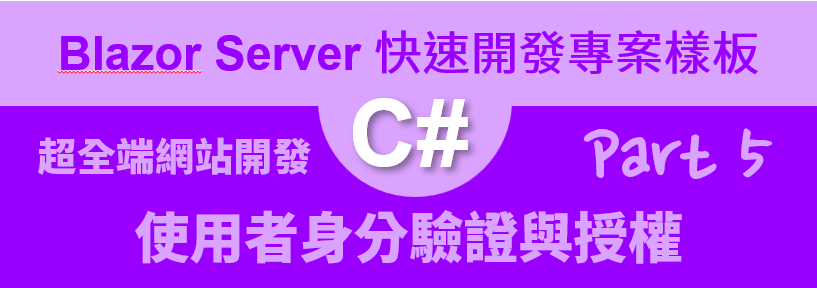
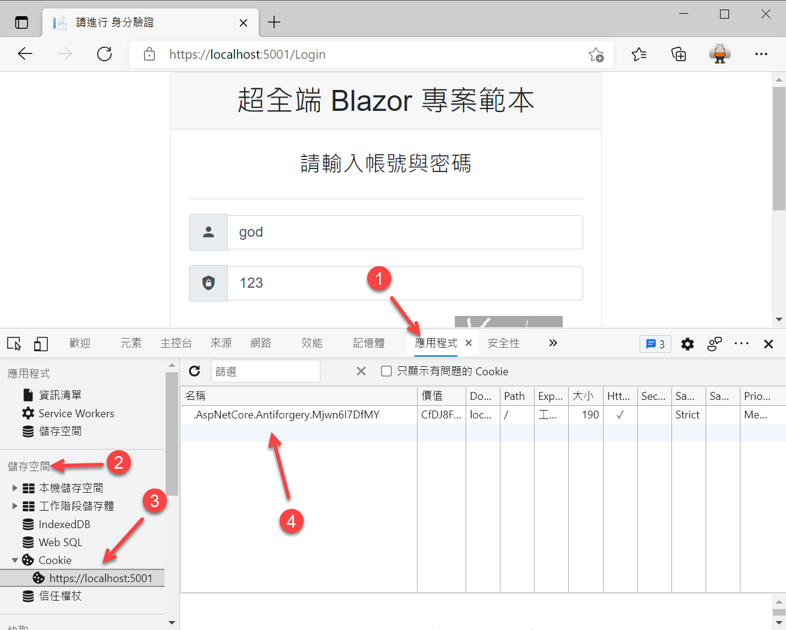

# Blazor Server 快速開發專案樣板 5 - 使用者身分驗證與授權



[Blazor Server 快速開發專案樣板 - 相關系列文章清單](https://csharpkh.blogspot.com/2021/06/Blazor-Backend-project-template-syncfusion-NET5.html)

上一篇的文章 : [Blazor Server 快速開發專案樣板 4 - 資料庫重建與紀錄初始化](https://csharpkh.blogspot.com/2021/06/Blazor-Backend-project-template-syncfusion-NET5-Part4-Database-Initialization-Entity-Framework-Core-Code-First.html)

當使用 [Blazor Server](https://docs.microsoft.com/zh-tw/aspnet/core/blazor/hosting-models?view=aspnetcore-5.0&WT.mc_id=DT-MVP-5002220) 專案開發的時候，對於要如何設計使用者的 認證 Authentication 與 授權 Authorization 這樣的需求，將會困擾許多人，這是因為一旦開啟網頁之後，這個網頁為一個 Blazor 元件頁面(有宣告 `@page "/SomeRoute"` 在這個元件的最前面)，對於 HTTP Server 伺服器而言，僅會看到一個 HTTP Request 請求，接著就會透過 [SignalR](https://docs.microsoft.com/zh-tw/aspnet/core/tutorials/signalr-blazor?view=aspnetcore-5.0&tabs=visual-studio&pivots=server&WT.mc_id=DT-MVP-5002220) 開啟 [WebSocket](https://docs.microsoft.com/zh-tw/aspnet/core/blazor/host-and-deploy/server?view=aspnetcore-5.0&WT.mc_id=DT-MVP-5002220) 方式來進行瀏覽器用戶端與伺服器端的彼此間的通訊，不論之後要導航到任何 Blazor 元件頁面，都不再會對 HTTP Server 伺服器產生 HTTP Request 請求。

對於當要設計瀏覽器端的使用者登入驗證需求的時候，將會透過瀏覽器發出一個 HTTP Request 請求到 HTTP Server 伺服器上，在伺服器上根據所收到使用者的帳號與密碼，接著到資料庫上進行比對，一旦這個使用者具有合法的身法，將會透過 HTTP Response 回應回傳一個 Cookie ( 更多這方面的說明，可以參考 [使用 cookie 驗證但不使用 ASP.NET Core Identity](https://docs.microsoft.com/zh-tw/aspnet/core/security/authentication/cookie?view=aspnetcore-5.0&WT.mc_id=DT-MVP-5002220) )，瀏覽器會根據回傳的封包內容，預設大多為會將這些認證 Cookie 儲存到瀏覽器上。

若下次使用者再度開啟一個新的瀏覽器標籤頁次，此時，瀏覽器會讀取這些 Cookie 資訊，取得已經登入的使用者資訊，此時，瀏覽器可以根據該已經通過認證使用者身分資訊，決定哪些頁面可以讓這個使用者來存取，一旦某個頁面有宣告要具備某些 Claim Role 聲明角色才能夠存取，而該使用者沒有具備這樣的聲明角色，此時將會拒絕存取這個 Blazor 頁面。

因此，當要在 Blazor Server 專案內進行設計使用者的登入／登出身分驗證需求的時候，是無法完全使用 Blazor 的開發框架 API 來做到，此時需要使用 [Razor 頁面 Page](https://docs.microsoft.com/zh-tw/archive/msdn-magazine/2017/september/asp-net-core-simpler-asp-net-mvc-apps-with-razor-pages?WT.mc_id=DT-MVP-5002220) 來進行設計，請特別注意， [Razor 頁面 Page] 與 [Razor 元件 Component](https://docs.microsoft.com/zh-tw/aspnet/core/blazor/components/?view=aspnetcore-5.0&WT.mc_id=DT-MVP-5002220) 是不同的。

## 體驗身分驗證 與 Cookie 的運作方式

https://localhost:5001/Login




## 使用者登入的 Razor 頁面程式碼

```html
@page
@model Backend.Pages.LoginModel
@addTagHelper *, Microsoft.AspNetCore.Mvc.TagHelpers
@{
    ViewData["Title"] = "身分驗證";
}
<!DOCTYPE html>
<html>
<head>
    <meta charset="utf-8" />
    <meta name="viewport" content="width=device-width, initial-scale=1.0" />
    <title>請進行 身分驗證</title>
    <link href="css/bootstrap/bootstrap.min.css" rel="stylesheet" />
    <link href="css/site.css" rel="stylesheet" />
    <link href="css/customSite.css" rel="stylesheet" />
    <link rel="stylesheet" href="fonts/MaterialDesign/css/materialdesignicons.min.css">
    <style>
        .centered {
            display: flex;
            flex-direction: column;
            justify-content: center;
            align-items: center;
            text-align: center;
            min-height: 100vh;
        }
    </style>
</head>
<body>
    <div class="centered">
        <div class="">
            <div class="card cardcenter">
                <div class="card-header">
                    <span class="h2">超全端 Blazor 專案範本</span>
                </div>
                <article class="card-body">
                    <h4 class="card-title text-center mb-4 mt-1">請輸入帳號與密碼</h4>
                    <hr>
                    <p class="text-danger text-center">@Model.Msg</p>
                    <form method="post">

                        <div class="form-group">
                            <div class="input-group">
                                <div class="input-group-prepend">
                                    <span class="input-group-text mdi mdi-18px mdi-account"> </span>
                                </div>
                                <input class="form-control m-auto" asp-for="Username" placeholder="使用者的帳號">
                            </div>
                        </div> <!-- form-group// -->

                        <div class="form-group mt-2">
                            <div class="input-group">
                                <div class="input-group-prepend">
                                    <span class="input-group-text mdi mdi-18px mdi-shield-lock"> </span>
                                </div>
                                <input class="form-control m-auto" asp-for="Password" placeholder="使用者的密碼" type="@Model.PasswordType">
                            </div>
                        </div> <!-- form-group// -->

                        <div class="row">
                            <div class="col-7 mt-2">
                                <div class="form-group mt-2">
                                    <div class="input-group">
                                        <div class="input-group-prepend">
                                            <span class="input-group-text mdi mdi-18px mdi-shield-key"> </span>
                                        </div>
                                        <input class="form-control m-auto" asp-for="Captcha" value="@Model.Captcha" placeholder="驗證碼" autocomplete="off">
                                        <input type="hidden" asp-for="CaptchaOrigin" value="@Model.CaptchaOrigin" />
                                    </div>
                                </div>
                            </div>
                            <div class="col-5 captcha">
                                
                            </div>
                        </div>

                        <div class="form-group mt-2">
                            <button type="submit" class="btn btn-primary btn-block"> 登入  </button>
                        </div> <!-- form-group// -->
                    </form>
                </article>
                <div class="card-footer">
                    <div class="mb-2"><a href="https://csharpkh.blogspot.com/">Vulcan Lee</a></div>
                    <div>版本 @Model.Version</div>
                </div>
            </div>
        </div>
    </div>
</body>
</html>
```

```csharp
using Backend.AdapterModels;
using Backend.Helpers;
using Backend.Models;
using Backend.Services;
using Microsoft.AspNetCore.Authentication;
using Microsoft.AspNetCore.Authorization;
using Microsoft.AspNetCore.Http;
using Microsoft.AspNetCore.Mvc;
using Microsoft.AspNetCore.Mvc.RazorPages;
using Microsoft.Extensions.Logging;
using ShareBusiness.Helpers;
using System;
using System.Collections.Generic;
using System.Drawing;
using System.Drawing.Imaging;
using System.IO;
using System.Linq;
using System.Reflection;
using System.Security.Claims;
using System.Security.Cryptography;
using System.Text;
using System.Threading.Tasks;

namespace Backend.Pages
{
    [AllowAnonymous]
    public class LoginModel : PageModel
    {
        private readonly IMyUserService myUserService;
        private readonly ILogger<LoginModel> logger;

        public LoginModel(IMyUserService myUserService, ILogger<LoginModel> logger,
            SystemLogHelper systemLogHelper, IHttpContextAccessor httpContextAccessor)
        {
#if DEBUG
            Username = "god";
            Password = "123";
            PasswordType = "";
#endif
            this.myUserService = myUserService;
            this.logger = logger;
            SystemLogHelper = systemLogHelper;
            HttpContextAccessor = httpContextAccessor;
        }
        [BindProperty]
        public string Username { get; set; } = "";

        [BindProperty]
        public string Password { get; set; } = "";
        [BindProperty]
        public string Version { get; set; } = "";
        [BindProperty]
        public string CaptchaOrigin { get; set; }
        [BindProperty]
        public string Captcha { get; set; }
        public string PasswordType { get; set; } = "password";
        public string CaptchaImage { get; set; }
        public string Msg { get; set; }
        public string ReturnUrl { get; set; }
        public SystemLogHelper SystemLogHelper { get; }
        public IHttpContextAccessor HttpContextAccessor { get; }

        public async Task OnGetAsync()
        {
            Version = Assembly.GetEntryAssembly().GetName().Version.ToString();
            try
            {
                // 清除已經存在的登入 Cookie 內容
                await HttpContext
                    .SignOutAsync(
                    MagicHelper.CookieAuthenticationScheme);
            }
            catch { }

            GetCaptchaImage();
        }

        public async Task<IActionResult> OnPostAsync()
        {
            Version = Assembly.GetEntryAssembly().GetName().Version.ToString();
            bool checkCaptch = true;
            if (string.IsNullOrEmpty(Captcha))
            {
                Msg = "請輸入驗證碼";
                checkCaptch = false;
            }
            else if (GetCaptchaSHA(Captcha) != CaptchaOrigin)
            {
                Msg = "驗證碼輸入錯誤";
                checkCaptch = false;
            }

            if (checkCaptch)
            {
                (MyUserAdapterModel user, string message) =
                await myUserService.CheckUser(Username, Password);

                if (user == null)
                {
                    #region 身分驗證失敗，使用者不存在
                    Msg = $"身分驗證失敗，使用者({Username}不存在 : {message})";
                    await SystemLogHelper.LogAsync(new SystemLogAdapterModel()
                    {
                        Message = Msg,
                        Category = LogCategories.User,
                        Content = "",
                        LogLevel = LogLevels.Information,
                        Updatetime = DateTime.Now,
                        IP = HttpContextAccessor.HttpContext.Connection.RemoteIpAddress.ToString(),
                    });
                    logger.LogInformation($"{Msg}");
                    return Page();
                    #endregion
                }

                if (user.Status == false)
                {
                    #region 使用者已經被停用，無法登入
                    Msg = $"使用者 {user.Account} 已經被停用，無法登入";
                    await SystemLogHelper.LogAsync(new SystemLogAdapterModel()
                    {
                        Message = Msg,
                        Category = LogCategories.User,
                        Content = "",
                        LogLevel = LogLevels.Information,
                        Updatetime = DateTime.Now,
                        IP = HttpContextAccessor.HttpContext.Connection.RemoteIpAddress.ToString(),
                    });
                    logger.LogInformation($"{Msg}");
                    return Page();
                    #endregion
                }

                string returnUrl = Url.Content("~/");

                #region 加入這個使用者需要用到的 宣告類型 Claim Type
                var claims = new List<Claim>
                {
                    new Claim(ClaimTypes.Role, "User"),
                    new Claim(ClaimTypes.NameIdentifier, user.Account),
                    new Claim(ClaimTypes.Name, user.Name),
                    new Claim(ClaimTypes.Sid, user.Id.ToString()),
                    new Claim(MagicHelper.MenuRoleClaim, user.MenuRoleId.ToString()),
                    new Claim(MagicHelper.MenuRoleNameClaim, user.MenuRole?.Name),
                };

                #region 若為 開發人員，加入 開發人員 專屬的角色
                if (MagicHelper.開發者帳號 == Username.ToLower())
                {
                    claims.Add(new Claim(ClaimTypes.Role, MagicHelper.開發者的角色聲明));
                }
                #endregion

                #region 加入該使用者需要加入的相關角色
                var menuDatas = user.MenuRole.MenuData
                     .Where(x => x.Enable == true).ToList();

                foreach (var item in menuDatas)
                {
                    if (item.IsGroup == false)
                    {
                        if (item.CodeName.ToLower() != MagicHelper.開發者的角色聲明)
                        {
                            // 避免使用者自己加入一個 開發人員專屬 的角色
                            if (!((item.CodeName.Contains("/") == true ||
                                item.CodeName.ToLower().Contains("http") == true)))
                            {
                                claims.Add(new Claim(ClaimTypes.Role, item.CodeName));
                            }
                        }
                    }
                }
                #endregion
                #endregion

                #region 建立 宣告式身分識別
                // ClaimsIdentity類別是宣告式身分識別的具體執行, 也就是宣告集合所描述的身分識別
                var claimsIdentity = new ClaimsIdentity(
                    claims, MagicHelper.CookieAuthenticationScheme);
                #endregion

                #region 建立關於認證階段需要儲存的狀態
                var authProperties = new AuthenticationProperties
                {
                    IsPersistent = true,
                    RedirectUri = this.Request.Host.Value
                };
                #endregion

                #region 進行使用登入
                try
                {
                    await HttpContext.SignInAsync(
                    MagicHelper.CookieAuthenticationScheme,
                    new ClaimsPrincipal(claimsIdentity),
                    authProperties);
                }
                catch (Exception ex)
                {
                    var msg = ex.Message;
                }
                #endregion

                Msg = $"使用者 ({Username}) 登入成功";
                await SystemLogHelper.LogAsync(new SystemLogAdapterModel()
                {
                    Message = Msg,
                    Category = LogCategories.User,
                    Content = "",
                    LogLevel = LogLevels.Information,
                    Updatetime = DateTime.Now,
                    IP = HttpContextAccessor.HttpContext.Connection.RemoteIpAddress.ToString(),
                });
                logger.LogInformation($"{Msg}");
                return LocalRedirect(returnUrl);
            }
            GetCaptchaImage();
            return Page();
        }

        #region 產生驗證碼
        public void GetCaptchaImage()
        {
            int length = 4;
            string captchaCode = CreateRandomCode(length);
#if DEBUG
            Captcha = captchaCode;
#endif
            CaptchaOrigin = GetCaptchaSHA(captchaCode);
            CaptchaImage = CreateCaptchaImage(captchaCode);
        }

        string CreateRandomCode(int length)
        {
            string randomCode = "";
            for (int i = 0; i < length; i++)
            {
                randomCode += new Random().Next(9);
            }
            return randomCode;
        }

        string CreateCaptchaImage(string captcha)
        {
            Bitmap bitmap = new Bitmap(120, 50);
            Graphics graphics = Graphics.FromImage(bitmap);
            Random random = new Random();
            string result = "";
            try
            {
                using (MemoryStream stream = new MemoryStream())
                {
                    graphics.Clear(Color.DarkGray);
                    for (int i = 0; i < 10; i++)
                    {
                        Pen whitePen = new Pen(Brushes.White,
                            random.Next(1, 4));
                        int x1 = random.Next(bitmap.Width);
                        int x2 = random.Next(bitmap.Width);
                        int y1 = random.Next(bitmap.Height);
                        int y2 = random.Next(bitmap.Height);
                        graphics.DrawLine(whitePen, x1, y1, x2, y2);
                    }

                    Font font = new Font("Arial", 12, (FontStyle.Bold | FontStyle.Italic));
                    int startX = random.Next(0, 25);
                    int startY = random.Next(0, 8);
                    graphics.DrawString(captcha, new Font("Tahoma", 30), Brushes.White, startX, startY);

                    bitmap.Save(stream, ImageFormat.Jpeg);
                    byte[] imageBytes = stream.ToArray();
                    string base64String = Convert.ToBase64String(imageBytes);
                    result = "data:image/png;base64," + base64String;
                }
            }
            catch (Exception)
            {
                throw;
            }
            return result;
        }

        string GetCaptchaSHA(string captcha)
        {
            SHA256 sha = SHA256.Create();
            byte[] bytes = sha.ComputeHash(Encoding.UTF8
                .GetBytes(MagicHelper.DefaultConnectionString + captcha + "VulcaN"));
            StringBuilder builder = new StringBuilder();
            string result = "";
            for (int j = 0; j < bytes.Length; j++)
            {
                builder.Append(bytes[j].ToString("x2"));
            }
            result = builder.ToString();

            return result;
        }
        #endregion
    }
}
```


