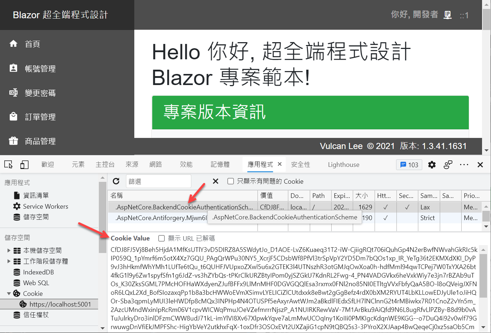
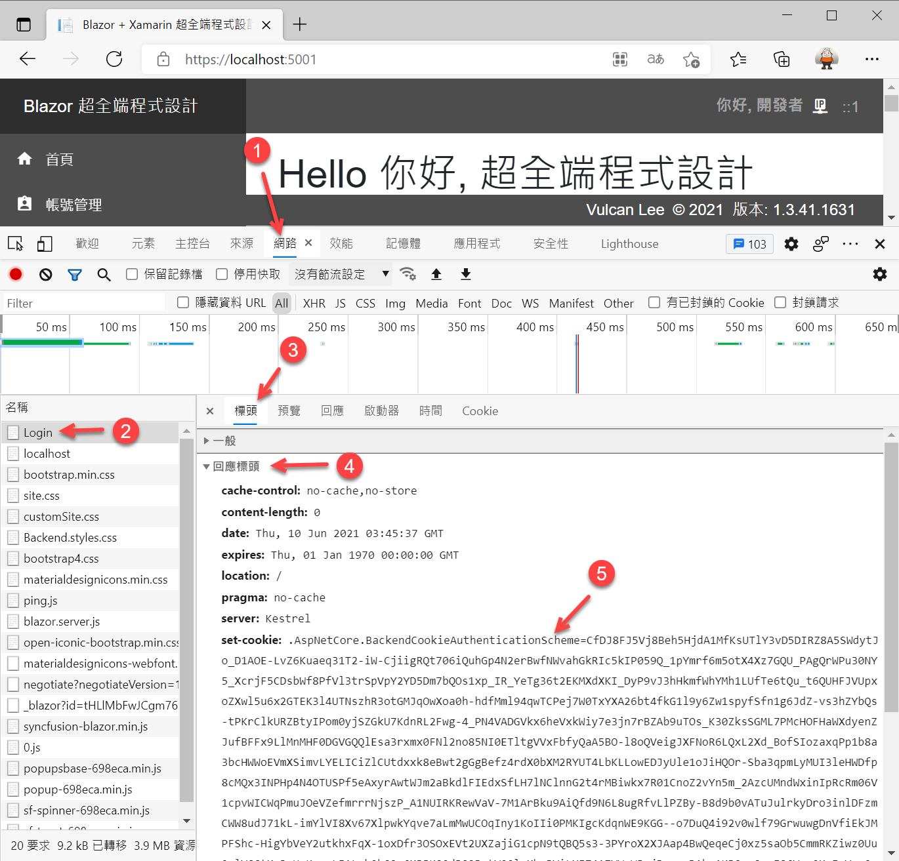

# Blazor Server 快速開發專案樣板 5 - 使用者身分驗證與授權


[Blazor Server 快速開發專案樣板 - 相關系列文章清單](https://csharpkh.blogspot.com/2021/06/Blazor-Backend-project-template-syncfusion-NET5.html)

上一篇的文章 : [Blazor Server 快速開發專案樣板 4 - 資料庫重建與紀錄初始化](https://csharpkh.blogspot.com/2021/06/Blazor-Backend-project-template-syncfusion-NET5-Part4-Database-Initialization-Entity-Framework-Core-Code-First.html)

當使用 [Blazor Server](https://docs.microsoft.com/zh-tw/aspnet/core/blazor/hosting-models?view=aspnetcore-5.0&WT.mc_id=DT-MVP-5002220) 專案開發的時候，對於要如何設計使用者的 認證 Authentication 與 授權 Authorization 這樣的需求，將會困擾許多人，這是因為一旦開啟網頁之後，這個網頁為一個 Blazor 元件頁面(有宣告 `@page "/SomeRoute"` 在這個元件的最前面)，對於 HTTP Server 伺服器而言，僅會看到一個 HTTP Request 請求，接著就會透過 [SignalR](https://docs.microsoft.com/zh-tw/aspnet/core/tutorials/signalr-blazor?view=aspnetcore-5.0&tabs=visual-studio&pivots=server&WT.mc_id=DT-MVP-5002220) 開啟 [WebSocket](https://docs.microsoft.com/zh-tw/aspnet/core/blazor/host-and-deploy/server?view=aspnetcore-5.0&WT.mc_id=DT-MVP-5002220) 方式來進行瀏覽器用戶端與伺服器端的彼此間的通訊，不論之後要導航到任何 Blazor 元件頁面，都不再會對 HTTP Server 伺服器產生 HTTP Request 請求。

對於當要設計瀏覽器端的使用者登入驗證需求的時候，將會透過瀏覽器發出一個 HTTP Request 請求到 HTTP Server 伺服器上，在伺服器上根據所收到使用者的帳號與密碼，接著到資料庫上進行比對，一旦這個使用者具有合法的身法，將會透過 HTTP Response 回應回傳一個 Cookie ( 更多這方面的說明，可以參考 [使用 cookie 驗證但不使用 ASP.NET Core Identity](https://docs.microsoft.com/zh-tw/aspnet/core/security/authentication/cookie?view=aspnetcore-5.0&WT.mc_id=DT-MVP-5002220) )，瀏覽器會根據回傳的封包內容，預設大多為會將這些認證 Cookie 儲存到瀏覽器上。

若下次使用者再度開啟一個新的瀏覽器標籤頁次，此時，瀏覽器會讀取這些 Cookie 資訊，取得已經登入的使用者資訊，此時，瀏覽器可以根據該已經通過認證使用者身分資訊，決定哪些頁面可以讓這個使用者來存取，一旦某個頁面有宣告要具備某些 Claim Role 聲明角色才能夠存取，而該使用者沒有具備這樣的聲明角色，此時將會拒絕存取這個 Blazor 頁面。

因此，當要在 Blazor Server 專案內進行設計使用者的登入／登出身分驗證需求的時候，是無法完全使用 Blazor 的開發框架 API 來做到，此時需要使用 [Razor 頁面 Page](https://docs.microsoft.com/zh-tw/archive/msdn-magazine/2017/september/asp-net-core-simpler-asp-net-mvc-apps-with-razor-pages?WT.mc_id=DT-MVP-5002220) 來進行設計，請特別注意， [Razor 頁面 Page] 與 [Razor 元件 Component](https://docs.microsoft.com/zh-tw/aspnet/core/blazor/components/?view=aspnetcore-5.0&WT.mc_id=DT-MVP-5002220) 是不同的。

## 體驗身分驗證 與 Cookie 的運作方式

首先，要來體驗與了解在 HTTP 通訊協定下，如何使用 Cookie 做到身分認證與發出授權權杖 Token 的過程。

* 使用這個網址 https://localhost:5001/Login 開啟使用者登入頁面
* 在瀏覽器下按下 [F12] 按鍵，進入 [開發人員工具] 模式
* 切換到 [應用程式] 標籤頁次
* 在 [開發人員工具] 視窗內的左邊清單中，找到 [儲存空間] > [Cookie] > [https://localhost:5001] 節點
* 將右邊的所有 Cookie 名稱項目都刪除
* 此時，按下 [F5] 重新整理這個登入頁面
* 現在瀏覽器中只剩下 [.AspNetCore.Antiforgery.Mjwn6I7DfMY] 這個名稱

  

  >關於 Antiforgery 的意義與目的和設計方法，可以參考 [防止跨網站偽造要求 (XSRF/CSRF) 攻擊 ASP.NET Core](https://docs.microsoft.com/zh-tw/aspnet/core/security/anti-request-forgery?view=aspnetcore-5.0&WT.mc_id=DT-MVP-5002220)

* 請在瀏覽器上輸入這個網址 https://localhost:5001 ，並且按下 [Enter] 開始載入這個 Blazor 專案的首頁
* 因為在 Cookie 中沒有任何關於使用成功身分驗證的相關資訊，因此，沒多久將會在網頁右上角顯示出一個快顯提示 (Toast Notification) 視窗，告知將會重新導入到登入頁面

  

* 在登入頁面中，還是沒有發現到任何關於使用者成功認證的 Cookie 資訊

  

* 請點選網頁上的 [登入] 按鈕，直接進行使用者身分驗證的登入作業

  > 因為這是在開發模式下來執行，因此，將會顯示出預設的使用者帳號、密碼與驗證碼，所以，可以很簡單的點選 [登入] 按鈕，便可輕鬆的進行登入；但是若這個專案程式碼在 Production 模式下執行，則是不會顯示這些預設帳號、密碼與驗證碼在相關的輸入欄位內

* 此時從 [開發人員工具] 視窗內的左邊清單中，找到並且點選 [儲存空間] > [Cookie] > [https://localhost:5001] 節點 ， 此時將會在右邊視窗區域中看到一個新的紀錄，名稱為 [.AspNetCore.BackendCookieAuthenticationScheme] Cookie 紀錄
* 請點選這筆 Cookie 紀錄
* 如此，便可以在下方看到這個 Cookie 的內容

  

  > 由於這個 Cookie 是由 ASP.NET Core 的核心模組所產生，包含了機密的通過身分驗證的使用者相關聲明等資訊，因此，這裡所看到的內容將會是已經加密過的內容

* 點選 [開發人員工具] 視窗內切換到 [網路] 標籤頁次，然後從左邊清單中，找到並且點選最前面的第一筆紀錄 [Login] 節點
* 在右邊視窗中點選 [標頭] 分頁頁次
* 此時，可以在下方的 [回應標頭] 區段中，看到如下的螢幕截圖畫面

  

* 在這裡會看到 `set-cookie: .AspNetCore.BackendCookieAuthenticationScheme=CfDJ8FJ5Vj8Beh5H...` 的內容，這些內容表示當使用者在登入頁面輸入正確的帳號、密碼、驗證碼，並且這個使用者允許可以使用這個系統，此時，這個登入頁面將會透過 HTTP Response Header 回應標頭，告知瀏覽器現在需要產生一個 `.AspNetCore.BackendCookieAuthenticationScheme` Cookie 紀錄，而且需要儲存在瀏覽器的儲存體內；透過這樣的機制，日後若透過瀏覽器打開這個專案任何頁面，瀏覽器便會將這些 Cookie 資訊讀取出來，並且傳送到後端 HTTP 伺服器內。

* 點選 [開發人員工具] 視窗內切換到 [網路] 標籤頁次，然後從左邊清單中，找到並且點選最前面的第二筆紀錄 [localhost] 節點
* 在右邊視窗中點選 [標頭] 分頁頁次
* 此時，可以在下方的 [要求標頭] 區段中，看到如下的螢幕截圖畫面

  

* 在這裡會看到 `cookie: .AspNetCore.Antiforgery.Mjwn6I7DfMY=CfDJ8FJ5Vj8Beh5H...` 的內容，這些內容為開啟專案首頁的時候，從瀏覽器的 Cookie 讀取出已經成功身分驗證的 Cookie 紀錄，接著，把這些資訊透過 HTTP 標頭傳送到專案首頁內，如此，在這個 Blazor 專案內便可以知道是哪個使用者已經登入了，而且登入的使用者的相關授權聲明資訊。就算關閉這個瀏覽器並且重新開啟之後，只要再度打開同樣的網頁，就不用再進行重複登入作業。

## 使用者登入的 Razor 頁面程式碼

現在來看看這樣的登入身分驗證機制要如何設計出來

* 打開在這個 Blazor 專案範本內的 [Pages] 資料夾內的 [Login.cshtml] Razor 頁面
* 底下使用 Bootstrap 的卡片 Card機制來設計輸入帳號、密碼、驗證碼的資料
* `@Model.Msg` 這裡將會顯示進行登入過程中會產生的錯誤訊息
* 為了要方便開發除錯，對於密碼的欄位的 `type="@Model.PasswordType"` 這個屬性，對於 type 屬性值使用資料綁定的方式，由 Razor Model 內的 `@Model.PasswordType` 來指定，如此，便可以在開發除錯模式下，便可以看到使用者輸入密碼的內容。
* 驗證碼圖片部分，將會在 Razor Model 模型內產生所要顯示的圖片資訊，儲存在 `@Model.CaptchaImage` 變數內，並且透過資料綁定機制顯示在網頁上。

```html
<article class="card-body">
    <h4 class="card-title text-center mb-4 mt-1">請輸入帳號與密碼</h4>
    <hr>
    <p class="text-danger text-center">@Model.Msg</p>
    <form method="post">
        <div class="form-group">
            <div class="input-group">
                <div class="input-group-prepend">
                    <span class="input-group-text mdi mdi-18px mdi-account"> </span>
                </div>
                <input class="form-control m-auto" asp-for="Username" placeholder="使用者的帳號">
            </div>
        </div> <!-- form-group// -->
        <div class="form-group mt-2">
            <div class="input-group">
                <div class="input-group-prepend">
                    <span class="input-group-text mdi mdi-18px mdi-shield-lock"> </span>
                </div>
                <input class="form-control m-auto" asp-for="Password" placeholder="使用者的密碼" type="@Model.PasswordType">
            </div>
        </div> <!-- form-group// -->
        <div class="row">
            <div class="col-7 mt-2">
                <div class="form-group mt-2">
                    <div class="input-group">
                        <div class="input-group-prepend">
                            <span class="input-group-text mdi mdi-18px mdi-shield-key"> </span>
                        </div>
                        <input class="form-control m-auto" asp-for="Captcha" value="@Model.Captcha" placeholder="驗證碼" autocomplete="off">
                        <input type="hidden" asp-for="CaptchaOrigin" value="@Model.CaptchaOrigin" />
                    </div>
                </div>
            </div>
            <div class="col-5 captcha">
                
            </div>
        </div>
        <div class="form-group mt-2">
            <button type="submit" class="btn btn-primary btn-block"> 登入  </button>
        </div> <!-- form-group// -->
    </form>
</article>
<div class="card-footer">
    <div class="mb-2"><a href="https://csharpkh.blogspot.com/">Vulcan Lee</a></div>
    <div>版本 @Model.Version</div>
</div>
```

* 這個 [Login.cshtml] Razor 頁面的相關 C# 程式碼位於 [Pages] 資料夾內的 [Login.cshtml.cs] 檔案
* 在這個 [LoginModel] 前使用了 `[AllowAnonymous]` 屬性宣告這個頁面不需要經過使用者身分驗證的程序，任何網頁瀏覽器的使用者，都可以開啟這個登入網頁
* 在建構函式內將會注入 [IMyUserService]、[ILogger<LoginModel>]、[IHttpContextAccessor] 三個物件，前者為可以存取使用者資料庫的相關紀錄，後者為可以透過 [ASP.NET Core 中的記錄](https://docs.microsoft.com/zh-tw/aspnet/core/fundamentals/logging/?view=aspnetcore-5.0&WT.mc_id=DT-MVP-5002220) 把相關訊息寫入到日誌系統內，第三個則是預設執行來存取 HttpContextAccessor，這裡需要存取服務內的 HttpContext 時，也就是要透過這個注入物件用來取得瀏覽器的來源 IP，更多這方面的資訊，可以參考 [存取 ASP.NET Core 中的 HttpContext](https://docs.microsoft.com/zh-tw/aspnet/core/fundamentals/http-context?view=aspnetcore-5.0&WT.mc_id=DT-MVP-5002220)。
* 在建構函式內也使用了 `#if DEBUG ... #endif` [條件式編譯符號] 宣告當在開發除錯模式下，使用者的帳號、密碼會使用 god 與 123 的預設值，這樣的的設計可以方便加速開發與除錯
* 底下的其他程式碼將是這個類別會用到的屬性，其中有許多屬性標示了 '[BindProperty]` 這個屬性來宣告這個屬性需要做到資料綁定的效果，更多關於這個方便的資訊，可以參考 [ASP.NET Core 中的資料繫結](https://docs.microsoft.com/zh-tw/aspnet/core/mvc/models/model-binding?view=aspnetcore-5.0&WT.mc_id=DT-MVP-5002220)

```csharp
    [AllowAnonymous]
    public class LoginModel : PageModel
    {
        private readonly IMyUserService myUserService;
        private readonly ILogger<LoginModel> logger;

        public LoginModel(IMyUserService myUserService, ILogger<LoginModel> logger,
            SystemLogHelper systemLogHelper, IHttpContextAccessor httpContextAccessor)
        {
#if DEBUG
            Username = "god";
            Password = "123";
            PasswordType = "";
#endif
            this.myUserService = myUserService;
            this.logger = logger;
            SystemLogHelper = systemLogHelper;
            HttpContextAccessor = httpContextAccessor;
        }
        [BindProperty]
        public string Username { get; set; } = "";
        [BindProperty]
        public string Password { get; set; } = "";
        [BindProperty]
        public string Version { get; set; } = "";
        [BindProperty]
        public string CaptchaOrigin { get; set; }
        [BindProperty]
        public string Captcha { get; set; }
        public string PasswordType { get; set; } = "password";
        public string CaptchaImage { get; set; }
        public string Msg { get; set; }
        public string ReturnUrl { get; set; }
        public SystemLogHelper SystemLogHelper { get; }
        public IHttpContextAccessor HttpContextAccessor { get; }
```

* 對於 [OnGetAsync()] 這個方法為當使用者開啟登入頁面的時候，就會呼叫這個方法，設計的目的有
  * 將這個 Blazor 專案組建的版本編號設定道可綁定變數 [Version] 內，如此，便可以將版本編號顯示在螢幕上
  * 強制進行登出作業，也就是要清空使用者身分驗證的 Cookie 紀錄
  * 呼叫 [GetCaptchaImage()] 將會產生驗證碼需要的資訊與圖片內容

```csharp
public async Task OnGetAsync()
{
    Version = Assembly.GetEntryAssembly().GetName().Version.ToString();
    try
    {
        // 清除已經存在的登入 Cookie 內容
        await HttpContext
            .SignOutAsync(
            MagicHelper.CookieAuthenticationScheme);
    }
    catch { }
    GetCaptchaImage();
}
```

* 一旦使用者在網頁上點選了 [登入] 按鈕，就會出發這個 [OnPostAsync()] 方法
* 在該方法的最前，首先會檢查使用者輸入的驗證碼是否正確，若不正確則會顯示在螢幕上，告知使用者輸入不正確的驗證碼，並且會再度產生一個新的驗證碼。

```csharp
public async Task<IActionResult> OnPostAsync()
{
    Version = Assembly.GetEntryAssembly().GetName().Version.ToString();
    bool checkCaptch = true;
    if (string.IsNullOrEmpty(Captcha))
    {
        Msg = "請輸入驗證碼";
        checkCaptch = false;
    }
    else if (GetCaptchaSHA(Captcha) != CaptchaOrigin)
    {
        Msg = "驗證碼輸入錯誤";
        checkCaptch = false;
    }
    if (checkCaptch)
    {
        // 這裡進行帳號、密碼驗證與進行登入處理作業
    }
    GetCaptchaImage();
    return Page();
}
```

* 一旦驗證碼輸入正確無誤，接下來會呼叫 `await myUserService.CheckUser(Username, Password);` 方法，將使用者的帳號與密碼透過 MyUserService 來進行比對，確認這個使用者是否可以登入到系統
* 若有這樣的情況發生，將會顯示適當的訊息，要求使用者重新輸入帳號與密碼

```csharp
(MyUserAdapterModel user, string message) =
await myUserService.CheckUser(Username, Password);
if (user == null)
{
    #region 身分驗證失敗，使用者不存在
    Msg = $"身分驗證失敗，使用者({Username}不存在 : {message})";
    await SystemLogHelper.LogAsync(new SystemLogAdapterModel()
    {
        Message = Msg,
        Category = LogCategories.User,
        Content = "",
        LogLevel = LogLevels.Information,
        Updatetime = DateTime.Now,
        IP = HttpContextAccessor.HttpContext.Connection.RemoteIpAddress.ToString(),
    });
    logger.LogInformation($"{Msg}");
    return Page();
    #endregion
}
if (user.Status == false)
{
    #region 使用者已經被停用，無法登入
    Msg = $"使用者 {user.Account} 已經被停用，無法登入";
    await SystemLogHelper.LogAsync(new SystemLogAdapterModel()
    {
        Message = Msg,
        Category = LogCategories.User,
        Content = "",
        LogLevel = LogLevels.Information,
        Updatetime = DateTime.Now,
        IP = HttpContextAccessor.HttpContext.Connection.RemoteIpAddress.ToString(),
    });
    logger.LogInformation($"{Msg}");
    return Page();
    #endregion
}
```

* 相關檢查工作都完成之後，確認這個帳號與密碼是個合法可以登入的使用者
* 此時要產生該使用者需要配置的 [Claim 類別](https://docs.microsoft.com/zh-tw/dotnet/api/system.security.claims.claim?view=net-5.0&WT.mc_id=DT-MVP-5002220) 聲明物件
* 在這些聲明中有包含了這個使用者在資料庫內的 Id ，使用者的名稱、帳號與這個使用者要使用的功能角色 Id

```csharp
string returnUrl = Url.Content("~/");
#region 加入這個使用者需要用到的 宣告類型 Claim Type
var claims = new List<Claim>
{
    new Claim(ClaimTypes.Role, "User"),
    new Claim(ClaimTypes.NameIdentifier, user.Account),
    new Claim(ClaimTypes.Name, user.Name),
    new Claim(ClaimTypes.Sid, user.Id.ToString()),
    new Claim(MagicHelper.MenuRoleClaim, user.MenuRoleId.ToString()),
    new Claim(MagicHelper.MenuRoleNameClaim, user.MenuRole?.Name),
};
```

* 若此時登入的帳號為 `god` ，表示這個使用者為開發人員專門使用的帳號，此時會加入這個帳號具有開發者角色的聲明，日後就會依據這個聲明來顯示這個開發人員可以使用的功能表清單

```csharp
#region 若為 開發人員，加入 開發人員 專屬的角色
if (MagicHelper.開發者帳號 == Username.ToLower())
{
    claims.Add(new Claim(ClaimTypes.Role, MagicHelper.開發者的角色聲明));
}
#endregion
```

* 現在需要根據這個使用者帳號內所設定的功能表角色資訊，逐一把這些 Claim 聲明加入到這個帳號內；透過這樣的設計，可以讓這個專案範本內每個 Blazor 頁面，使用 `@attribute [Authorize(Roles = "XXX")]` 這樣的 [指示詞 Directives](https://docs.microsoft.com/zh-tw/aspnet/core/mvc/views/razor?view=aspnetcore-5.0#directives&WT.mc_id=DT-MVP-5002220) 來限制具有特定的聲明使用者才能夠看到與使用這個網頁

```csharp
#region 加入該使用者需要加入的相關角色
var menuDatas = user.MenuRole.MenuData
     .Where(x => x.Enable == true).ToList();
foreach (var item in menuDatas)
{
    if (item.IsGroup == false)
    {
        if (item.CodeName.ToLower() != MagicHelper.開發者的角色聲明)
        {
            // 避免使用者自己加入一個 開發人員專屬 的角色
            if (!((item.CodeName.Contains("/") == true ||
                item.CodeName.ToLower().Contains("http") == true)))
            {
                claims.Add(new Claim(ClaimTypes.Role, item.CodeName));
            }
        }
    }
}
#endregion
#endregion
```

* 建立好該使用者需要配置的聲明集合物件
* 開始依據 [ASP.NET Core 驗證的總覽](https://docs.microsoft.com/zh-tw/aspnet/core/security/authentication/?view=aspnetcore-5.0&WT.mc_id=DT-MVP-5002220) 這些文件來產生出最後的 [ClaimsIdentity](https://docs.microsoft.com/zh-tw/dotnet/api/system.security.claims.claimsidentity?view=net-5.0&WT.mc_id=DT-MVP-5002220) 物件 ( 這個物件代表宣告式身分識別 )
* 最後透過 ClaimsIdentity 使用任何必要的 Claim 來建立，並呼叫 [HttpContext.SignInAsync] 方法，以登入使用者，這裡相關的更多資訊，可以參考 [使用 cookie 驗證但不使用 ASP.NET Core Identity](https://docs.microsoft.com/zh-tw/aspnet/core/security/authentication/cookie?view=aspnetcore-5.0&WT.mc_id=DT-MVP-5002220) 
* 一旦 [HttpContext.SignInAsync] 成功呼叫之後，瀏覽器就會透過 HTTP Response 回應取得此次成功登入的 Cookie 資訊

```csharp
#region 建立 宣告式身分識別
// ClaimsIdentity類別是宣告式身分識別的具體執行, 也就是宣告集合所描述的身分識別
var claimsIdentity = new ClaimsIdentity(
    claims, MagicHelper.CookieAuthenticationScheme);
#endregion
#region 建立關於認證階段需要儲存的狀態
var authProperties = new AuthenticationProperties
{
    IsPersistent = true,
    RedirectUri = this.Request.Host.Value
};
#endregion
#region 進行使用登入
try
{
    await HttpContext.SignInAsync(
    MagicHelper.CookieAuthenticationScheme,
    new ClaimsPrincipal(claimsIdentity),
    authProperties);
}
catch (Exception ex)
{
    var msg = ex.Message;
}
#endregion
Msg = $"使用者 ({Username}) 登入成功";
await SystemLogHelper.LogAsync(new SystemLogAdapterModel()
{
    Message = Msg,
    Category = LogCategories.User,
    Content = "",
    LogLevel = LogLevels.Information,
    Updatetime = DateTime.Now,
    IP = HttpContextAccessor.HttpContext.Connection.RemoteIpAddress.ToString(),
});
logger.LogInformation($"{Msg}");
return LocalRedirect(returnUrl);
```

## Blazor 使用 Cookie 認證與授權的設計方法

* 打開 Blazor 專案根目錄下的 [Startup.cs] 檔案
* 在這個 ConfigureServices 方法內，找到 `#region 加入使用 Cookie & JWT 認證需要的宣告` 文字
* 這個方法將 `services.AddAuthentication(MagicHelper.CookieAuthenticationScheme).AddCookie(MagicHelper.CookieAuthenticationScheme)` 是使用 [AddAuthentication] 與 [AddCookie] 這兩個擴充方法，宣告 Blazor 專案要使用認證與使用 Cookie 來儲存這些認證資訊；當然，對於其他頁面就可以透過取得 Cookie 資訊，知道這個通過身分驗證的相關聲明資訊。
* 在 Configure 方法內搜尋 `#region 指定要使用 Cookie & 使用者認證的中介軟體` 文字，就會看到底下的程式碼
* 這裡加入身分認證與授權會用到的 [ASP.NET Core 中介軟體](https://docs.microsoft.com/zh-tw/aspnet/core/fundamentals/middleware/?view=aspnetcore-5.0&WT.mc_id=DT-MVP-5002220)

```csharp
#region 指定要使用 Cookie & 使用者認證的中介軟體
app.UseCookiePolicy();
app.UseAuthentication();
#endregion
#region 指定使用授權檢查的中介軟體
app.UseAuthorization();
#endregion
```

## Blazor 使用頁面授權

對於要受到保護的 Blazor 頁面，需要使用 `@attribute [Authorize(Roles = "XXX")]` 這樣的 [指示詞 Directives] 來保護該頁面，只允許授予有權限的使用者才能夠開啟這些頁面

* 請重新執行這個 Blazor 專案
* 登出這個系統，開啟 `https://localhost:5001/Login` 便可以登出系統且進入到登入頁面
* 使用帳號 user1 ， 密碼 123 的資訊來登入系統
* 請在瀏覽器的網址列輸入 `https://localhost:5001/OnlyUser` 網址
* 將會看到這樣的畫面，表示這個使用者可以看到正確的內容

  

* 這個頁面 OnlyUser.razor 的使用底下的 Blazor 元件程式碼

```html
@page "/OnlyUser"
@using Microsoft.AspNetCore.Authentication.Cookies
@attribute [Authorize(Roles = "OnlyUser")]

<h2 class="text-success">該頁面僅限具有使用者權限才能看到</h2>
```

* 請在瀏覽器的網址列輸入 `https://localhost:5001/OnlyAdministrator` 網址
* 不過，這個 user1 使用者並沒有加入 `OnlyAdministrator` Claim 聲明，因此從底下的瀏覽器畫面截圖，可以看出無法看到這個頁面上的內容

  


* 這個頁面 OnlyAdministrator.razor 的使用底下的 Blazor 元件程式碼

```html
@page "/OnlyAdministrator"
@using Microsoft.AspNetCore.Authentication.Cookies
@attribute [Authorize(Roles = "OnlyAdministrator")]

<h2 class="text-primary">該頁面僅限具有管理者權限才能看到</h2>
```

* 然而，若重新使用 god 帳號登入(密碼為 123)，同樣的輸入 `https://localhost:5001/OnlyAdministrator` 網址，就可以看到真正的頁面內容

  

