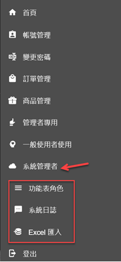
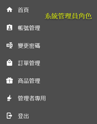
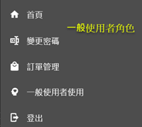
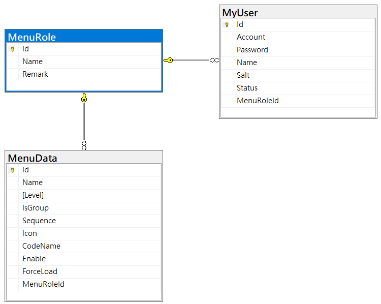

# Blazor Server 快速開發專案樣板 6 - 動態功能表

[Blazor Server 快速開發專案樣板 - 相關系列文章清單](https://csharpkh.blogspot.com/2021/06/Blazor-Backend-project-template-syncfusion-NET5.html)

上一篇的文章 : [Blazor Server 快速開發專案樣板 5 - 使用者身分驗證與授權](https://csharpkh.blogspot.com/2021/06/Blazor-Backend-project-template-syncfusion-NET5-Part5-Cookie-Authentication-Authorization-CAPTCHA-Claim-Identity-SignInAsync.html)

當使用 [Blazor Server](https://docs.microsoft.com/zh-tw/aspnet/core/blazor/hosting-models?view=aspnetcore-5.0&WT.mc_id=DT-MVP-5002220) 專案開發的時候，對於要如何設計使用者的 認證 Authentication 與 授權 Authorization 這樣的需求，將會困擾許多人，這是因為一旦開啟網頁之後，這個網頁為一個 Blazor 元件頁面(有宣告 `@page "/SomeRoute"` 在這個元件的最前面)，對於 HTTP Server 伺服器而言，僅會看到一個 HTTP Request 請求，接著就會透過 [SignalR](https://docs.microsoft.com/zh-tw/aspnet/core/tutorials/signalr-blazor?view=aspnetcore-5.0&tabs=visual-studio&pivots=server&WT.mc_id=DT-MVP-5002220) 開啟 [WebSocket](https://docs.microsoft.com/zh-tw/aspnet/core/blazor/host-and-deploy/server?view=aspnetcore-5.0&WT.mc_id=DT-MVP-5002220) 方式來進行瀏覽器用戶端與伺服器端的彼此間的通訊，不論之後要導航到任何 Blazor 元件頁面，都不再會對 HTTP Server 伺服器產生 HTTP Request 請求。

