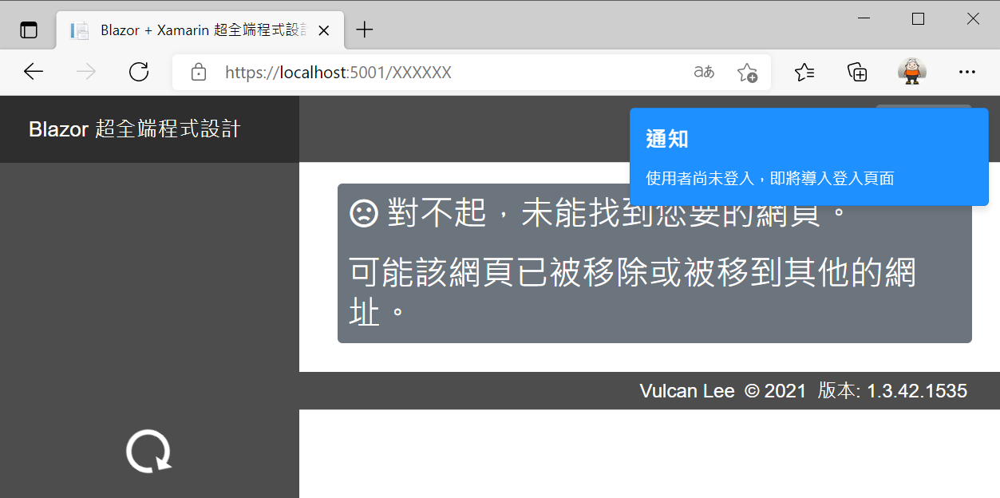
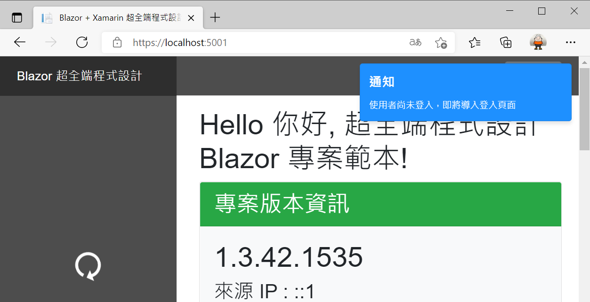
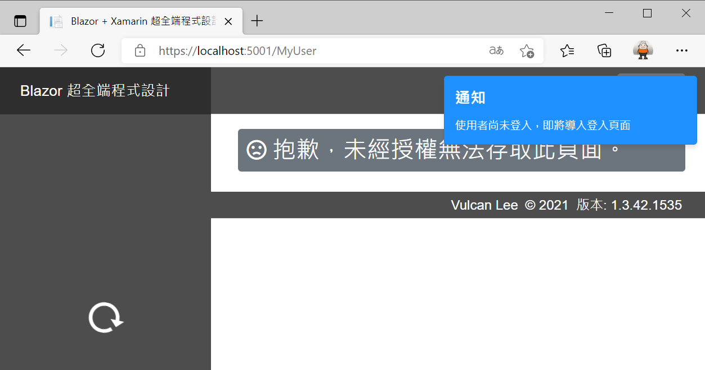
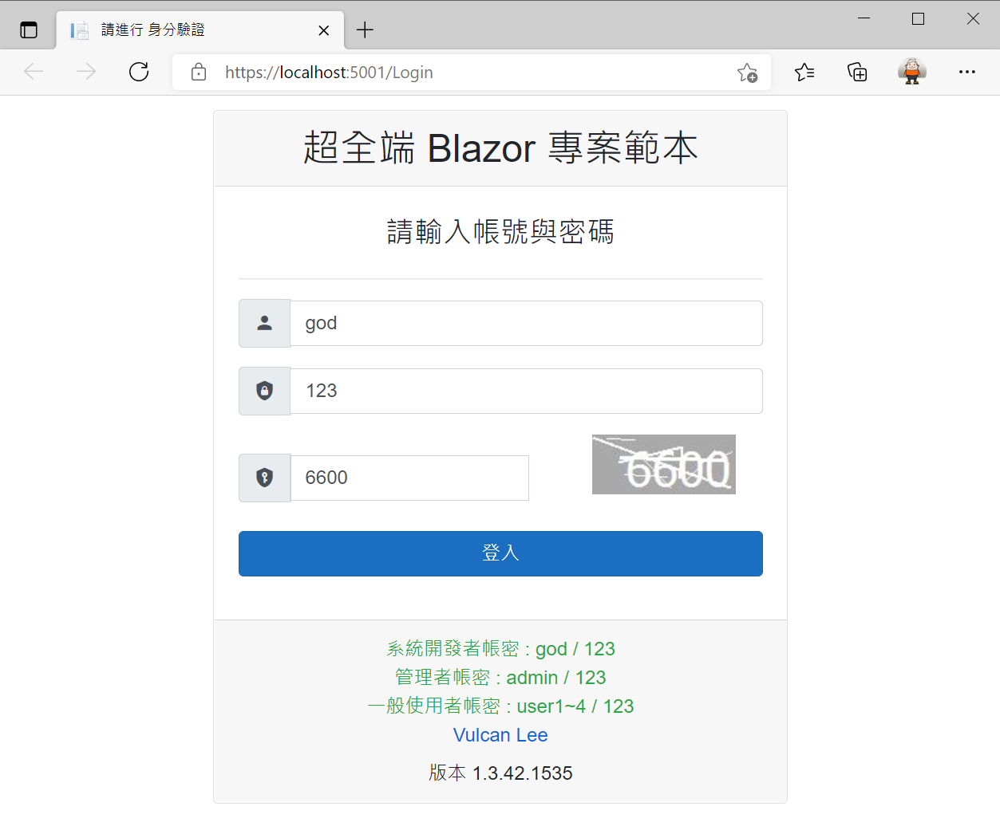
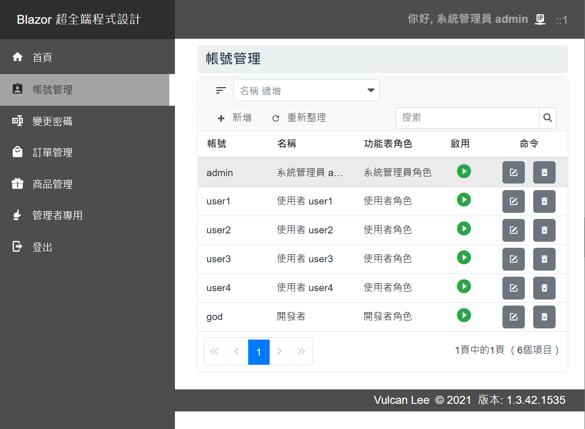
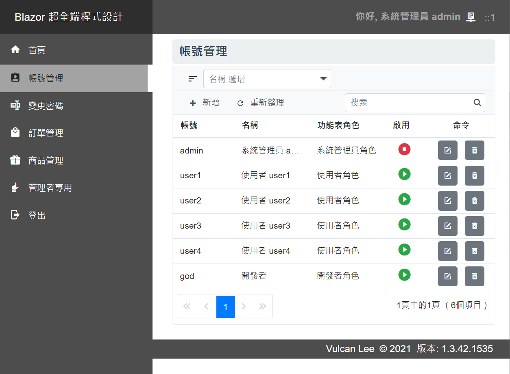
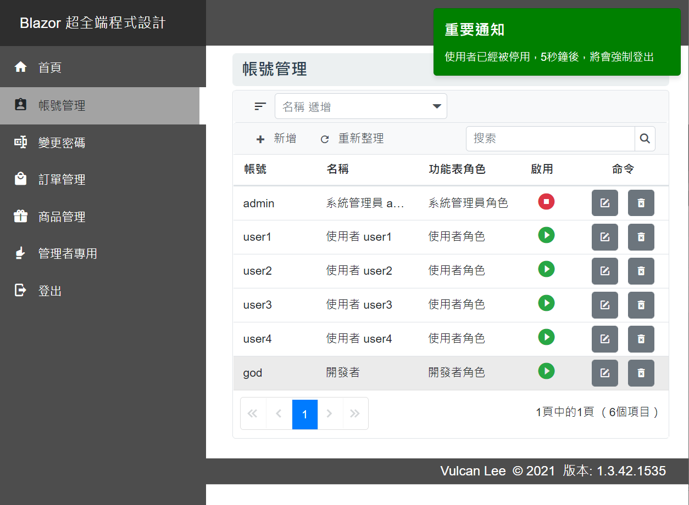

# Blazor Server 快速開發專案樣板 7 - 無登入轉首頁與踢出停用帳號


[Blazor Server 快速開發專案樣板 - 相關系列文章清單](https://csharpkh.blogspot.com/2021/06/Blazor-Backend-project-template-syncfusion-NET5.html)

上一篇的文章 : [Blazor Server 快速開發專案樣板 6 - 動態功能表](https://csharpkh.blogspot.com/2021/06/Blazor-Backend-project-template-syncfusion-NET5-Part6-Dynamic-Menu-AuthenticationStateProvider-NavigationManager-Identity-IsAuthenticated.html)

在進行 [](https://docs.microsoft.com/zh-tw/aspnet/core/blazor/hosting-models?view=aspnetcore-5.0&WT.mc_id=DT-MVP-5002220) 專案開發的時候，若使用者尚未登入這個系統，不過，使用者直接在瀏覽器位址列上輸入一個不存在的網址、存在的網址且沒有宣告僅限有登入使用者可以使用、或者一個存在的頁面但是該頁面必須僅提供有登入的使用者可以存取，遇到這些情況，當然希望可以強制使用者要能夠先進行身分驗證的登入程序，因此，將要設計這樣的情況要重新導向到登入頁面，面對這樣的需求該如何設計呢？

底下為各種不同情況，將會出現的畫面

* 底下為使用者尚未登入，但是這個網址是不存在的，此時會發出提示通知，要求使用者要能先進行登入作業



* 底下為使用者尚未登入，但是這個網址是存在的，且無須登入也可以看到這個頁面，此時會發出提示通知，要求使用者要能先進行登入作業



* 底下為使用者尚未登入，但是這個網址是存在的，但是這個頁面僅提供合法使用者可以使用，此時會發出提示通知，要求使用者要能先進行登入作業



當要做出這樣的效果時候，可以使用 [] 的開發特色，那就是進行元件化的設計方式，在此將設計一個元件，在這個元件來進行檢查，若使用者尚未登入，則會發出通知提示訊息，接著導航到登入頁面。

## 設計檢測使用者是否已經成功登入的元件

* 打開 [Blazor Server 快速開發專案樣板] 專案內的 [Components] 資料夾 > [Commons] 資料夾 > [CheckUserStatusView.razor] 檔案
* [CheckUserStatusView.razor] 檔案是一個 Blazor 元件，程式碼如下所示

```html
@using System.Threading;
@using System.Security.Claims
@using Microsoft.Extensions.Configuration
@using Microsoft.Extensions.Logging
@inject AuthenticationStateProvider AuthenticationStateProvider
@inject IMyUserService MyUserService
@inject NavigationManager NavigationManager
@inject IConfiguration Configuration
@using Prism.Events
@inject IEventAggregator EventAggregator
@inject ILogger<CheckUserStatusView> Logger
@implements IDisposable

@code {
    public ToastMessageModel ToastModel { get; set; } = new ToastMessageModel();
    Task CheckUserTask;
    CancellationTokenSource cts;
    ClaimsPrincipal user;
    bool IsRunning = true;

    protected override async Task OnAfterRenderAsync(bool firstRender)
    {
        if (firstRender)
        {
            int CheckUserStateInterval = Convert.ToInt32(Configuration["CheckUserStateInterval"]);
            var authState = await AuthenticationStateProvider.GetAuthenticationStateAsync();
            user = authState.User;
            if (user.Identity.IsAuthenticated)
            {
                #region 使用者已經登入了
                cts = new CancellationTokenSource();
                CheckUserTask = Task.Run(async () =>
                {
                    await InvokeAsync(async () =>
                    {
                        MyUserAdapterModel myUser = new MyUserAdapterModel();
                        while (cts.Token.IsCancellationRequested == false && IsRunning == true)
                        {
                            try
                            {
                                var userId = Convert.ToInt32(user.FindFirst(ClaimTypes.Sid)?.Value);
                                myUser = await MyUserService.GetAsync(userId);
                                if (myUser.Account.ToLower() != MagicHelper.開發者帳號)
                                {
                                    if (myUser.Status == false)
                                    {
                                        ToastModel.Title = "重要通知";
                                        ToastModel.Content = "使用者已經被停用，5秒鐘後，將會強制登出";
                                        EventAggregator.GetEvent<ToastEvent>().Publish(new ToastPayload()
                                        {
                                            Title = "重要通知",
                                            Content = "使用者已經被停用，5秒鐘後，將會強制登出",
                                            Timeout = 5000,
                                            Color = "Green",

                                        });
                                        await Task.Delay(5000);
                                        NavigationManager.NavigateTo("/Logout", true);
                                        IsRunning = false;
                                        continue;
                                    }
                                }
                                await Task.Delay(CheckUserStateInterval, cts.Token);
                            }
                            catch (TaskCanceledException ex)
                            {
                                IsRunning = false;
                            }
                            catch (Exception ex)
                            {
                                var Msg = $"檢查使用者被停用發生例外異常";
                                Logger.LogError(ex, $"{Msg}");
                                IsRunning = false;
                            }
                        }
                    });
                });
                #endregion
            }
            else
            {
                #region 使用者尚未登入
                await Task.Delay(1000);
                EventAggregator.GetEvent<ToastEvent>().Publish(new ToastPayload()
                {
                    Title = "通知",
                    Content = "使用者尚未登入，即將導入登入頁面",
                    Timeout = 1500,
                });
                await Task.Delay(2000);
                NavigationManager.NavigateTo("/Logout", true);
                #endregion
            }
        }
    }

    public void Dispose()
    {
        if (cts != null && cts.IsCancellationRequested == false)
        {
            cts.Cancel();
            CheckUserTask = null;
        }
    }
}
```

* 這裡使用了 Blazor 元件的生命週期事件 [OnAfterRenderAsync]，使用傳入的參數 [firstRender] 來檢查這個事件方法是否被第一次呼叫
* 若為第一次呼叫這個方法，則會使用相依性服務注入容器，注入這個物件 [AuthenticationStateProvider](https://docs.microsoft.com/zh-tw/dotnet/api/microsoft.aspnetcore.components.authorization.authenticationstateprovider?view=aspnetcore-5.0&WT.mc_id=DT-MVP-5002220)，這個物件將會提供目前使用者之驗證狀態的相關資訊，因此，可以使用 `user.Identity.IsAuthenticated` 表示式來檢查這名使用者是否經成功登入了。

接下來請搜尋 `#region 使用者尚未登入` 關鍵字，這個區塊的程式碼將會定義當開啟這個網頁的時候，使用者是在沒有登入的狀態下，此時，會透過 事件聚合器 Event Aggregator 的 Publish 方法來發布一個事件訊息到 事件聚合器 Event Aggregator 內，這裡使用底下的程式碼。

```csharp
#region 使用者尚未登入
await Task.Delay(1000);
EventAggregator.GetEvent<ToastEvent>().Publish(new ToastPayload()
{
    Title = "通知",
    Content = "使用者尚未登入，即將導入登入頁面",
    Timeout = 1500,
});
await Task.Delay(2000);
NavigationManager.NavigateTo("/Logout", true);
#endregion
```

此時，網頁畫面的右上方將會出現一個 快顯通知訊息 Toast Notification 小視窗，告知使用者即將進入到登入頁面內；然後會休息 2 秒鐘，接著使用相依性注入容器來注入一個 NavigationManager (更多說明可以參考 [URI 和流覽狀態協助程式](https://docs.microsoft.com/zh-tw/aspnet/core/blazor/fundamentals/routing?view=aspnetcore-5.0&WT.mc_id=DT-MVP-5002220) 物件的 [NavigateTo](https://docs.microsoft.com/zh-tw/dotnet/api/microsoft.aspnetcore.components.navigationmanager.navigateto?view=aspnetcore-5.0&WT.mc_id=DT-MVP-5002220) 方法流覽至指定的 URI，很重要的是，第二個參數若為 true，則會略過用戶端路由，並強制瀏覽器從伺服器載入新的頁面，而不論 URI 是否通常會由用戶端路由器處理。

最後，網頁將會回到登入頁面



## 設計檢測若使用者被停用之後，要強制登出的元件

這樣的需求 [若使用者被停用之後，要強制登出] 相信也是許多 Blazor 開發者所關注的需求，在 [Blazor Server 快速開發專案樣板] 內會定時檢查使用者的停用狀態是否已經位於停用狀態，若條件符合，將會發出一個快顯通知，並且強制登出這個系統。

從底下的操作步驟，將可以看到這樣設計出來的運作效果

* 啟動 Blazor 專案
* 若現在已經登入系統，請登出系統
* 在登入畫面使用 帳號 admin 與 密碼 123 登入系統

  

* 點選左邊功能表上的 [帳號管理] 功能表項目

  

  * 在網頁的右半部將會看到關於使用者紀錄的 CRUD 畫面
  * 找到 admin 帳號紀錄，在該紀錄的右方，會有個綠色的 啟用 按鈕
  * 請點選這個 綠色啟用 按鈕，使其變成 紅色停用 的狀態

  

  * 約莫最多 15 秒的時間，這個元件將會偵測出現在登入的帳號 (admin) 已經被停用了，因此，將會在 5 秒鐘後強制登入，轉入到登入網頁上

  

  

上面所說明的內容，都已經設計在 [CheckUserStatusView.razor] 元件內，請在這個檔案內搜尋 `#region 使用者已經登入了` 關鍵字，就會看到這些程式碼。

首先會先建立一個 [取消權杖來源 CancellationTokenSource](https://docs.microsoft.com/zh-tw/dotnet/api/system.threading.cancellationtokensource?view=net-5.0&WT.mc_id=DT-MVP-5002220) ，這個物件將會提供向 CancellationToken 發出訊號，表示應該將它取消；而要使用這個物件的原因則是，當這個 Blazor 整體頁面要離開並且結束的時候，將會透過這個物件發出一個取消權杖的訊號給有使用到這個取消權杖的非同步呼叫，以便可以結束這些非同步的呼叫，並且終止要檢查使用者是否被停用的無窮迴圈。

想要做到這樣的機制，需要在這個元件內實作 [IDisposable 介面](https://docs.microsoft.com/zh-tw/dotnet/api/system.idisposable?view=net-5.0&WT.mc_id=DT-MVP-5002220)，在這個實作方法內，將會提供相關用於釋放 Unmanaged 資源的機制，而在此將會是要發出一個取消權杖通知。請在該元件的最上方使用 Razor 指示詞 Directive `@implements IDisposable` ，接著在這個元件內設計 `public void Dispose(){...}` 方法，在這個方法內，將會檢查是否已經發出了取消權杖請求，若沒有，則會使用 `cts.Cancel();` 發出取消權杖通知，並且使用 `CheckUserTask = null;` 敘述將非同步工作物件設定為空值，以便記憶體回收 GC。

接下來將會使用 [Task.Run] 方法來建立一個非同步工作，在這個非同步工作委派方法內，將會建立一個無窮迴圈；在這個無窮迴圈內將會呼叫 `MyUserService.GetAsync(userId)` 方法，將這個已經登入的使用者 Id 到資料庫內取出該筆紀錄，然後，判斷 啟用狀態 Status 這個欄位是否為 true，若這個欄位為 false，則表示這個使用者已經被停用了，此時將會透過 事件聚合器 來發送一個 快顯通知訊息 ；接著，休息 5 秒鐘，然後呼叫 `NavigationManager.NavigateTo("/Logout", true);` 這個方法來導向到登入頁面，最後要準備離開這個無窮迴圈。

而當這個使用者的尚未被停用，則會使用 [ASP.NET Core 設定] 中定義的 `"CheckUserStateInterval": 120000` 屬性 (該屬性定義在 appsettings.json ，而在 `"CheckUserStateInterval": 15000` 則是定義在 appsettings.Development.json )，來呼叫 `await Task.Delay(CheckUserStateInterval, cts.Token);` 方法，使得這個無窮迴圈暫時休息一段時間之後，再來檢查該使用者是否以已經被停用了；至於想要調整無窮迴圈每次要休息的時間的長短，可以修改 [ASP.NET Core 設定] 的 `CheckUserStateInterval` 屬性。

## 使用這個 無登入轉首頁與踢出停用帳號 元件

在這個 [CheckUserStatusView.razor] 內，將會清楚的看到在這個元件內並沒有任何的 HTML 標籤，僅有 C# 商業邏輯程式碼，這樣的設計可以充分顯示出 Blazor 提供的元件化設計特色，將許多功能或者需求設計成為多個元件，接著在進行組合起來，就可以完成這個專案的需求。

* 請打開 [Shared] 資料夾 > [MainLayout.razor]
* 可以看到底下的程式碼

```html
@inherits LayoutComponentBase

<div class="page">
    <div class="sidebar">
        @*   <NavMenu />*@
        <ToastView />
        <CheckUserStatusView />
        <GlobalEventView />
        <NavDynamicMenu />
    </div>

    <div class="main">
        <div class="top-row px-4">
            <SigninView />
        </div>

        <div class="content px-4 mb-4">
            @Body 
        </div>

        <div class="bottom-row px-4">
            <CopywriteView />
        </div>
    </div>
</div>
```

對於這個 [MainLayout.razor] 元件，將是作為整個 Blazor 專案的頁面 [ASP.NET Core Blazor 版面配置](https://docs.microsoft.com/zh-tw/aspnet/core/blazor/components/layouts?view=aspnetcore-5.0&WT.mc_id=DT-MVP-5002220) ，任何設計的 Blazor 設計的頁面，就會在這個版面配置內 `@Body` 區段內顯示出來。

也就是說，一旦這個 ASP.NET Core 專案執行起來之後，並且進入到 Blazor 路由內，這個 [MainLayout.razor] 元件就會僅被讀入與一次，不會因為在導航到不同頁面的時候，該元件不會被重複執行。

因此，將 `<CheckUserStatusView />` 元件加入到 `<div class="sidebar"> </div>` 區段內，如此，只要進入到這個專案內的 Blazor 頁面內之後，就會讀入 [CheckUserStatusView] 元件，接著就會透過呼叫 `AuthenticationStateProvider.GetAuthenticationStateAsync()` 方法，判斷使用者是否已經登入了，接著就可以依照設計邏輯執行 無登入轉首頁與踢出停用帳號 這兩個邏輯運作。


