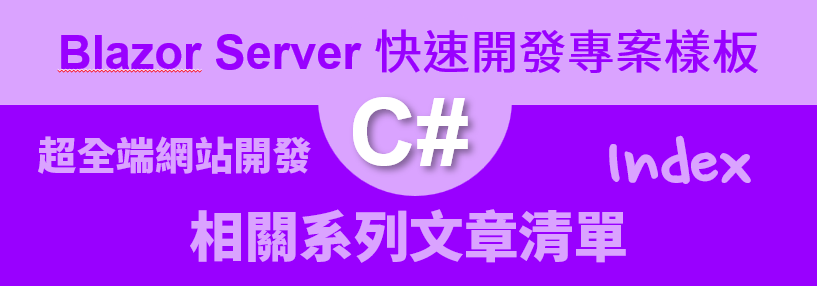
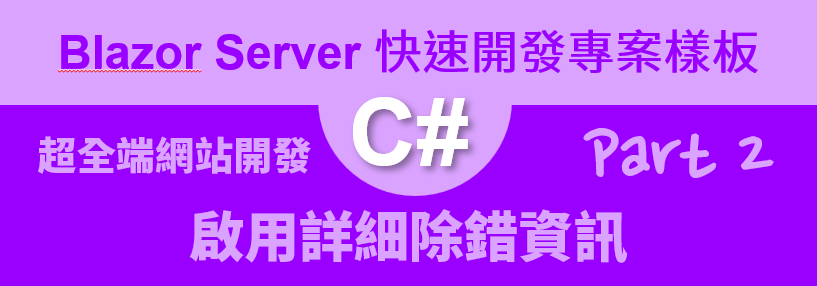
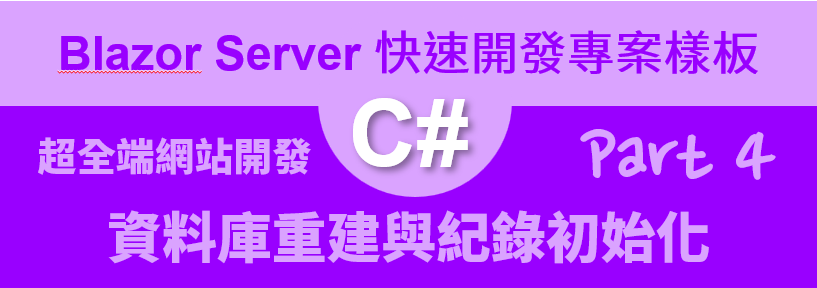
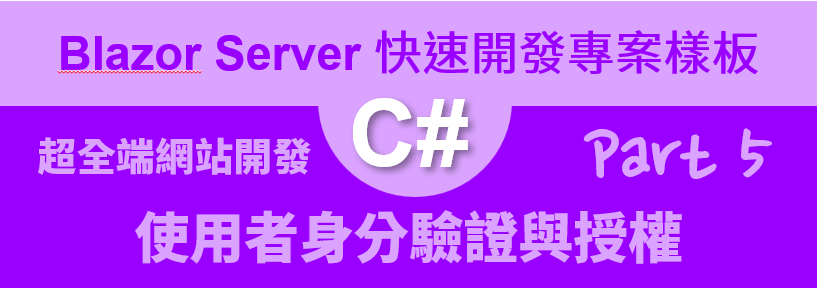
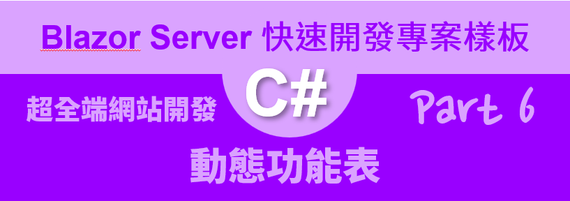
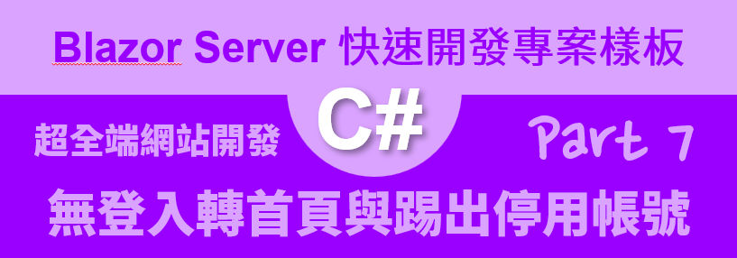

# Blazor Server 快速開發專案樣板 相關系列文章清單

* [Blazor Server 快速開發專案樣板 1 - 建立一個新的專案](https://csharpkh.blogspot.com/2021/06/Blazor-Backend-project-template-syncfusion-NET5-Part1-Create-New.html)

  

* [Blazor Server 快速開發專案樣板 2 - 啟用詳細除錯資訊](https://csharpkh.blogspot.com/2021/06/Blazor-Backend-project-template-syncfusion-NET5-Part2-UseDeveloperExceptionPage-UseExceptionHandler.html)

  

* [Blazor Server 快速開發專案樣板 3 - 日誌與來源 IP](https://csharpkh.blogspot.com/2021/06/Blazor-Backend-project-template-syncfusion-NET5-Part3-logging-Source-IP-NLog.html)

  

* [Blazor Server 快速開發專案樣板 4 - 資料庫重建與紀錄初始化](https://csharpkh.blogspot.com/2021/06/Blazor-Backend-project-template-syncfusion-NET5-Part4-Database-Initialization-Entity-Framework-Core-Code-First.html)

  

  

  

  

