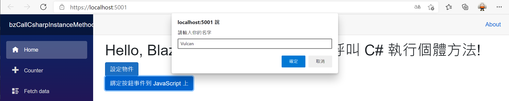

# 使用 Blazor 專案在 JavaScript 內呼叫 C# 執行個體方法

當在進行 [Blazor](https://docs.microsoft.com/zh-tw/aspnet/core/blazor/?view=aspnetcore-5.0&WT.mc_id=DT-MVP-5002220) 專案程式設計的時候，原則上許多的功能是不需要自行設計相關 JavaScript 程式碼來進行呼叫，因為 Blazor 開發框架中已經具備了許多機制，例如 [資料綁定](https://docs.microsoft.com/zh-tw/aspnet/core/blazor/components/data-binding?view=aspnetcore-5.0&WT.mc_id=DT-MVP-5002220)、[路由](https://docs.microsoft.com/zh-tw/aspnet/core/blazor/fundamentals/routing?view=aspnetcore-5.0&WT.mc_id=DT-MVP-5002220) 等相關機制，輕鬆地就能做到原先要使用 JavaScript 程式語言能夠做到的事情。

不過，Blazor 存在的目的，並不是要完全取代掉不去使用 JavaScript 程式語言功能，有些時候，需要能夠執行某一 JavaScript 程式碼之後，緊接著要能夠在 JavaScript 內來呼叫 .NET C# 的程式碼，這樣的需求在 Blazor 可以完成的實現出來，而在這裡將會有兩種情境可以使用： [靜態 .NET 方法呼叫](https://docs.microsoft.com/zh-tw/aspnet/core/blazor/call-dotnet-from-javascript?view=aspnetcore-5.0#static-net-method-call&WT.mc_id=DT-MVP-5002220) 與 [實例方法呼叫](https://docs.microsoft.com/zh-tw/aspnet/core/blazor/call-dotnet-from-javascript?view=aspnetcore-5.0&WT.mc_id=DT-MVP-5002220)

在這篇文章中，將會設計一個按鈕，該按鈕點選下去之後，將會執行所綁定 JavaScript，這部分的功能將會是最基本的 HTML 網頁設計功能，而在這個按鈕所綁定的 JavaScript 方法內 (這裡將會呼叫 showPrompt 方法)，該 JavaScript 方法將會呼叫 prompt 函式，讓使用者輸入自己的姓名文字，接著將會透過在 .NET C# 所產生的 [DotNetObjectReference](https://docs.microsoft.com/en-us/dotnet/api/microsoft.jsinterop.dotnetobjectreference?view=aspnetcore-5.0&WT.mc_id=DT-MVP-5002220) 物件，在 JavaScript 使用這樣的敘述 `DotNetObject.invokeMethodAsync('SayHello', result);` 執行該物件所擁有的 SayHello 方法，當然，該方法是使用 C# 所設計的，並且會在 .NET 環境下執行。

透過這樣的機制，便可以將 JavaScript 所取得的字串，傳遞到 .NET C# 變數內，接著透過 Blazor 所提供的資料綁定機制，將這段字串顯示在網頁上。

不過，在這裡首先需要建立起 [DotNetObjectReference](https://docs.microsoft.com/en-us/dotnet/api/microsoft.jsinterop.dotnetobjectreference?view=aspnetcore-5.0&WT.mc_id=DT-MVP-5002220) 物件，在這裡需要指定所用到的執行個體型別，也就是 BindDotNetInstance ，接下來使用 `objRef = DotNetObjectReference.Create(helloHelper);` 敘述來建立起 [DotNetObjectReference](https://docs.microsoft.com/en-us/dotnet/api/microsoft.jsinterop.dotnetobjectreference?view=aspnetcore-5.0&WT.mc_id=DT-MVP-5002220)物件。

不過，要把這個 objRef 物件傳遞到 JavaScript 函式內，將這個物件設定為 JavaScript 的全域變數，這裡又有兩種方式選擇，可以使用一個按鈕或者使用 Blazor 生命週期的事件 [ComponentBase.OnAfterRenderAsync](https://docs.microsoft.com/en-us/dotnet/api/microsoft.aspnetcore.components.componentbase.onafterrenderasync?view=aspnetcore-5.0&WT.mc_id=DT-MVP-5002220)來做到，此時要呼叫 `await jsRuntime.InvokeVoidAsync("SetDotNetObjectJS", objRef);` 即可。

另外，為了要讓這個 Blazor 元件取得傳遞於 JavaScript 環境中的字串，需要綁定一個委派方法到 `helloHelper.HelloHandler` 內。

現在來看看如何做出這樣的範例成程式碼。

這篇文章的原始碼位於 [bzCallCsharpInstanceMethodFromJavaScript](https://github.com/vulcanlee/CSharp2021/tree/main/bzCallCsharpInstanceMethodFromJavaScript)

## 建立測試用主控台應用程式專案

* 開啟 Visual Studio 2019
* 選擇右下方的 [建立新的專案] 按鈕
* 在 [建立新專案] 對話窗中
* 從右上方的專案類型下拉按鈕中，找到並選擇 [Web]
* 從可用專案範本清單內，找到並選擇 [Blazor Server 應用程式]
* 點選左下方 [下一步] 按鈕
* 在 [設定新的專案] 對話窗中
* 在 [專案名稱] 欄位中輸入 `bzCallCsharpInstanceMethodFromJavaScript`
* 點選左下方 [下一步] 按鈕
* 在 [其他資訊] 對話窗中
* 在 [目標 Framework] 下拉選單中，選擇 [.NET 5.0 (目前)]
* 點選左下方 [建立] 按鈕

## 加入客製化 JavaScript

* 滑鼠右擊 [bzCallCsharpInstanceMethodFromJavaScript] 專案下的 [wwwroot] 節點
* 從彈出功能表選擇 [加入] > [新增資料夾]
* 在新增的資料夾，設定該資料夾名稱為 js
* 接著，滑鼠右擊 [js] 資料夾節點
* 從彈出功能表選擇 [加入] > [新增項目]
* 當出現 [新增項目 - bzCallCsharpInstanceMethodFromJavaScript] 對話窗
* 在右方選擇 [已安裝] > [Visual C#] > [ASP.NET Core] > [Web] > [指令碼]
* 在中間部份選擇 [JavaScript 檔] 這個項目
* 在下方名稱欄位內輸入 [JavaScript.js]
* 最後點選右下方的 [新增] 按鈕

請將底下的 JavaScript 程式碼輸入到這個檔案內

```javascript
var DotNetObject = {}
function showPrompt(text) {
    var result = prompt(text, 'Type your name here');
    //呼叫該 .NET 執行個體(由類別 BindDotNetInstance 所產生)的 SayHello 方法
    DotNetObject.invokeMethodAsync('SayHello', result);
}
function SetDotNetObjectJS(dotnetHelper) {
    //將該 .NET 執行個體設定成為 JavaScript 的全域變數
    DotNetObject = dotnetHelper;
}
```

## 修正 _Host.cshtml 檔案

* 請在 [Pages] 資料夾內找到並且打開 [_Host.cshtml] 檔案
* 請找到 `<script src="_framework/blazor.server.js"></script>` 敘述
* 在其上方加入這個敘述 `<script src="/js/JavaScript.js"></script>`

## 修正 index.razor

* 請在 [Pages] 資料夾內找到並且打開 [index.razor] 檔案
* 把底下的程式碼替換掉原先的程式碼

```html
@page "/"
@inject IJSRuntime jsRuntime
@implements IDisposable

<h1>Hello, Blazor 專案在 JavaScript 內呼叫 C# 執行個體方法!</h1>

<div>
    <button class="btn btn-primary" @onclick="SetDotNetObject">設定物件</button>
</div>
<div>
    <button type="button" class="btn btn-primary" onclick="showPrompt('請輸入你的名字')">
        綁定按鈕事件到 JavaScript 上
    </button>
</div>
<div>
    <div class="text-success">@Name</div>
</div>

@code {
    BindDotNetInstance helloHelper = new BindDotNetInstance();
    DotNetObjectReference<BindDotNetInstance> objRef;
    public string Name = "";
    async Task SetDotNetObject()
    {
        // 進行綁定該執行個體的委派方法，以便進行 callback 呼叫
        helloHelper.HelloHandler = x =>
        {
        //將 JavaScript 程式碼取得的文字內容，設定到該 Blazor 元件內的 C# 變數中
        Name = x;
        //通知 Blazor 重新產生最新狀態的 Render Tree
        StateHasChanged();
        };
        objRef = DotNetObjectReference.Create(helloHelper);
        await jsRuntime.InvokeAsync<string>(
            "SetDotNetObjectJS", objRef);
    }
    protected override async Task OnAfterRenderAsync(bool firstRender)
    {
        if (firstRender == true)
        {
            helloHelper.HelloHandler = x =>
            {
                Name = x;
                StateHasChanged();
            };
            objRef = DotNetObjectReference.Create(helloHelper);
            await jsRuntime.InvokeVoidAsync(
                "SetDotNetObjectJS", objRef);
        }
    }
    public void Dispose()
    {
        objRef?.Dispose();
    }
    class BindDotNetInstance
    {
        public Action<string> HelloHandler;
        [JSInvokable]
        public void SayHello(string message)
        {
            var result = $"你好, {message}!";
            HelloHandler?.Invoke(result);
        }
    }
}
```

## 執行並且測試

按下 F5 開始執行這個專案

現在將會看到底下的畫面


請點選 [綁定按鈕事件到 JavaScript 上] 按鈕



最後點選確定按鈕，就會看到底下執行結果


