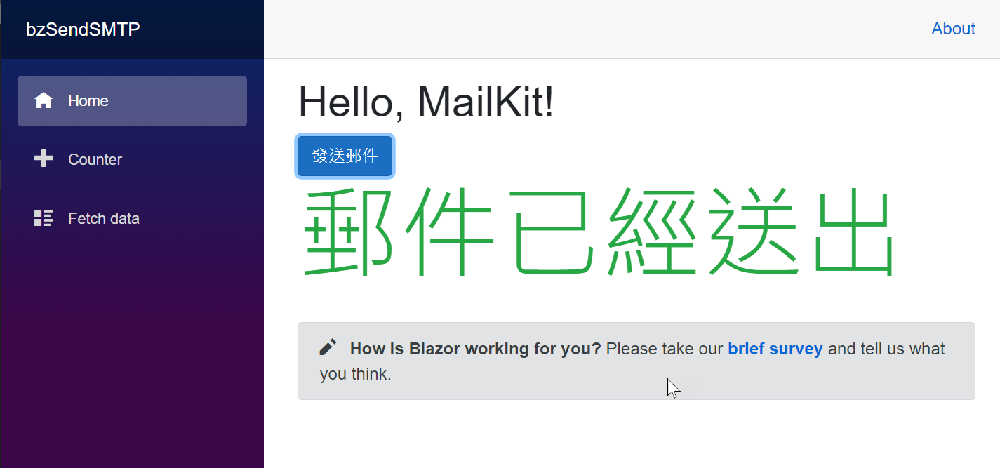
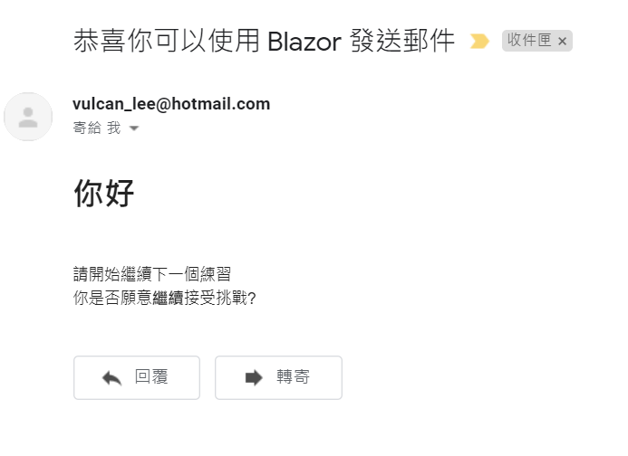

# 在 ASP.NET Core Blazor 專案內，使用 MailKit 發送具有 HTML 格式的電子郵件

當在進行 [Blazor](https://docs.microsoft.com/zh-tw/aspnet/core/blazor/?view=aspnetcore-5.0&WT.mc_id=DT-MVP-5002220) 專案程式設計的時候，需要能夠背景批次或者即時的來根據資料庫內的內容，發送出 SMTP 電子郵件，在這個文章中，將會說明如何使用 [MailKit](https://github.com/jstedfast/MimeKit) 這個套件來做到這樣的需求

現在來看看如何做出這樣的範例成程式碼。

這篇文章的原始碼位於 [bzSendSMTP](https://github.com/vulcanlee/CSharp2021/tree/main/bzSendSMTP)

## 建立Blazor Server 應用程式專案

* 開啟 Visual Studio 2019
* 選擇右下方的 [建立新的專案] 按鈕
* 在 [建立新專案] 對話窗中
* 從右上方的專案類型下拉按鈕中，找到並選擇 [Web]
* 從可用專案範本清單內，找到並選擇 [空的 ASP.NET Core]
* 點選左下方 [下一步] 按鈕
* 在 [設定新的專案] 對話窗中
* 在 [專案名稱] 欄位中輸入 `bzSendSMTP`
* 點選左下方 [下一步] 按鈕
* 在 [其他資訊] 對話窗中
* 在 [目標 Framework] 下拉選單中，選擇 [.NET 5.0 (目前)]
* 點選左下方 [建立] 按鈕

## 在 ASP.NET Core 的開發中安全儲存應用程式秘密

在這個專案內需要設定可以發送 SMTP 的相關資訊，這包含了遠端 SMTP 主機位置、使用通訊埠 Port、帳號與密碼，為了要讓這些資訊不會隨著版控一起被儲存起來，因此，這裡需要使用到 [安全儲存應用程式秘密](https://docs.microsoft.com/zh-tw/aspnet/core/security/app-secrets?view=aspnetcore-5.0&tabs=windows&WT.mc_id=DT-MVP-5002220)

* 滑鼠右擊專案節點
* 選擇 [管理使用者密碼] 彈出功能表選項
* 此時將會看到 [secrets.json] 視窗出現
* 請根據你的
* 當建立一個 ASP.NET Core 專案後，會在專案跟目錄下跟目錄下請在 [bzSendSMTP] 專案根目錄下找到並且打開 [appsettings.json] 檔案
* 使用底下的內容替換原先檔案內容
* 在這裡新增加了一個 [中文選項1] 設定項目，而該設定項目內有3個子節點，分別為 [Child1] 、 [Child2] 、 [節點中文3]
  > 這裡刻意的使用中文字型，而不是僅使用英文字型，因此，要來體驗看看，當在 [appsettings.json] 檔案有中文字的時候，是否會有問題產生。

```json
{
  "SMTPInformation": {
    "Server": "smtp.xxx.com",
    "Port": "???",
    "Accout": "user@host.com",
    "Password": "somethine"
  }
}
```

## 建立發送郵件的程式碼

* 打開 [Pages] 資料夾內的 [] 檔案
* 使用底下內容將其替換

```html
@page "/"
@using MailKit.Net.Smtp
@using MailKit
@using MimeKit
@using Microsoft.Extensions.Configuration
@inject IConfiguration configuration
<h1>Hello, MailKit!</h1>

<div>
    <button class="btn btn-primary"
            @onclick="SendMailAsync">
        發送郵件
    </button>
</div>
<div class="display-1 text-success">
    @message
</div>

<SurveyPrompt Title="How is Blazor working for you?" />

@code
{
    string message;

    void SendMailAsync()
    {
        message = "";
        var sendMessage = new MimeMessage();
        sendMessage.From.Add(new MailboxAddress("vulcan_lee@hotmail.com", "vulcan_lee@hotmail.com"));
        sendMessage.To.Add(new MailboxAddress("Vulcan Lee", "vulcan.lee@gmail.com"));
        sendMessage.Subject = "恭喜你可以使用 Blazor 發送郵件";

        sendMessage.Body = new TextPart("html")
        {
            Text = @"<h1>你好</h1></br>請開始繼續下一個練習</br>你是否願意<b>繼續</b>接受挑戰?"
        };

        string Server = configuration["SMTPInformation:Server"];
        int Port = Convert.ToInt32( configuration["SMTPInformation:Port"]);
        string account = configuration["SMTPInformation:Accout"];
        string password = configuration["SMTPInformation:Password"];
        using (var client = new SmtpClient())
        {
            client.Connect(Server, Port, false);

            // Note: only needed if the SMTP server requires authentication
            client.Authenticate(account, password);

            client.Send(sendMessage);
            client.Disconnect(true);
            message = "郵件已經送出";
        }
    }
}
```

為了要讓這些程式碼可以正常運作，需要加入適當的參考命名空間，另外，為了要取得 安全儲存應用程式秘密 內容，因此需要注入 IConfiguration 的具體實作物件。

一旦使用者點選了 [發送郵件] 按鈕，將會觸發 SendMailAsync 方法

在這個方法內，首先建立一個 MimeMessage 物件，這裡需要宣告寄件者、收件者的 Email 電子郵件，接著，設定該郵件的主旨，最後，使用 TextPart 類別，指定建立郵件本身內容為一個 HTML 格式的郵件內容，之後將會指定給 MimeMessage.Body 這個屬性

然後，就要透過 IConfiguration 來取得之前設定 安全儲存應用程式秘密 內容。

現在，可以建立一個 SmtpClient 物件，使用這個物件來發送此封電子郵件

## 進行執行專案

按下 F5 開始執行這個專案，並且點選發送郵件按鈕

現在將會看到底下的畫面



從上面執行結果的螢幕截圖，可以看到 `@inject IOptions<中文選項1> option1` 敘述所注入 [IOptions<中文選項1>] 物件，是可以成功取得  [appsettings.json] 檔案內的設定內容。

底下將會為收到的電子郵件內容




