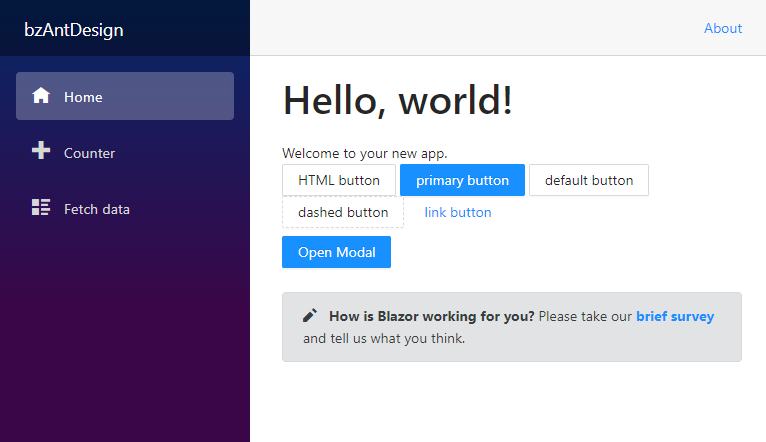
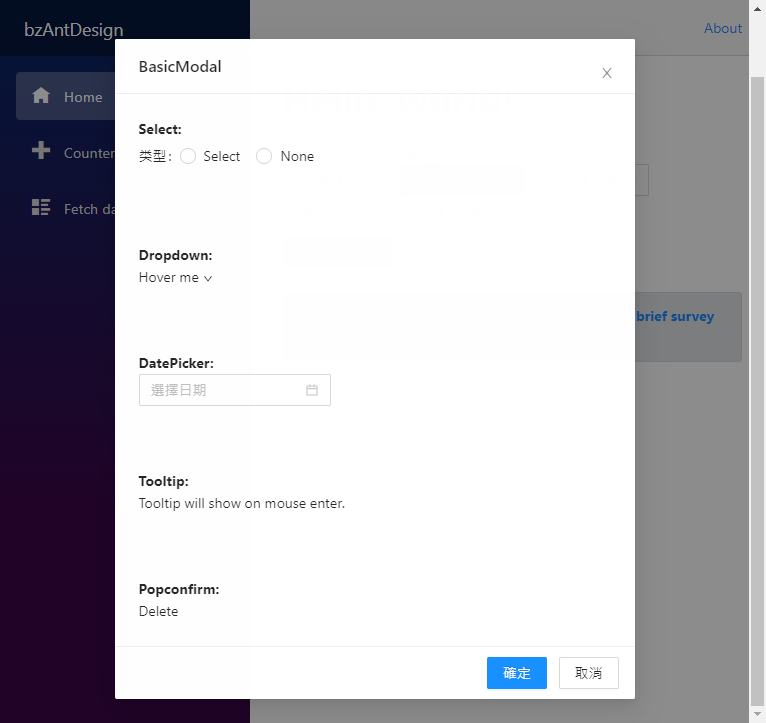

# 如何使用 Ant Design Blazor


Blazor 這個優異的 Web UI 開發框架，讓 .NET C# 開發者可以輕鬆容易地進行各種網頁專案開發，而且，網路上也存在著許多各種不同 UI 套件來滿足 Blazor 開發者的需求，在這篇文章中，將要來體驗這套 [Ant Design of Blazor](https://antblazor.com/en-US/) UI 套件，看看如何使用與執行出來的效果如何。

這篇文章的原始碼位於 [bzAntDesign](https://github.com/vulcanlee/CSharp2021/tree/main/bzAntDesign)

## 建立 Blazor Server-Side 的專案

* 開啟 Visual Studio 2019
* 選擇右下方的 [建立新的專案] 按鈕
* 在 [建立新專案] 對話窗中
* 從右上方的專案類型下拉按鈕中，找到並選擇 [Web]
* 從可用專案範本清單內，找到並選擇 [Blazor Server 應用程式]
* 點選左下方 [下一步] 按鈕
* 在 [設定新的專案] 對話窗中
* 在 [專案名稱] 欄位中輸入 `bzAntDesign`
* 點選左下方 [下一步] 按鈕
* 在 [其他資訊] 對話窗中
* 在 [目標 Framework] 下拉選單中，選擇 [.NET 5.0 (目前)]
* 點選左下方 [建立] 按鈕

## 加入所需要使用到的 NuGet 套件

* 滑鼠右擊 [bzAntDesign] 專案內的 [相依性] 節點
* 從彈出功能表中，選擇 [管理 NuGet 套件]
* 當 [NuGet: bzAntDesign] 視窗出現後，切換到 [瀏覽] 標籤頁次
* 搜尋 [AntDesign] 並且安裝並且套件

## 安裝與設定 AntDesign 元件

* 參考 [Import Ant Design Blazor into an existing project](https://antblazor.com/en-US/docs/introduce) 文件說明，準備開始進行這個元件的安裝與設定
* 打開這個專案根目錄下的 [Startup.cs] 檔案
* 找到這個方法 [ConfigureServices]
* 在其方法內加入底下程式碼

```csharp
#region 加入 Ant Design 會用到的相依性服務註冊
services.AddAntDesign();
#endregion
```

* 打開 [Pages] 資料夾下的 [_Host.cshtml] 檔案
* 在 `<head> ... </head>` 區段內加入底下 HTML 標記

```html
@*加入 Ant Design 會用到的靜態參考*@
<link href="_content/AntDesign/css/ant-design-blazor.css" rel="stylesheet" />
<script src="_content/AntDesign/js/ant-design-blazor.js"></script>
```

* 打開這個專案根目錄下的 [_Imports.razor] 檔案
* 在其檔案的最後面加入底下程式碼

```html
@using AntDesign
```

* 打開這個專案根目錄下的 [App.razor] 檔案
* 在其檔案的最後面加入底下程式碼

```html
<AntContainer /> 
```

## 建立一個可以使用對話窗的元件

* 滑鼠右擊 [Pages] 資料夾
* 從彈出功能表點選 [加入] > [Razor 元件]
* 在下方 [名稱] 欄位輸入 [DialogView.razor]
* 點選 [新增] 按鈕
* 使用底下程式碼替換這個檔案內容

```html
@inject MessageService _message

<Button Type="primary" OnClick="@(()=>{ _visible = true; })">
    Open Modal
</Button>
<Modal Title="@title"
       Visible="@_visible"
       OkText="@okText"
       OnOk="@HandleOk"
       CancelText="@cancelText"
       OnCancel="@HandleCancel">
    <b>Select:</b><br />

    <Form Model="_formModal">
        <FormItem Label="类型">
            <RadioGroup @bind-Value="@context.Type">
                <Radio Value="1">Select</Radio>
                <Radio Value="2">None</Radio>
            </RadioGroup>
        </FormItem>
        @if (context.Type == 1)
        {
            <FormItem>
                <Select DataSource="@_persons"
                        @bind-Value="@context.SelectedValue"
                        LabelName="@nameof(Person.Name)"
                        ValueName="@nameof(Person.Id)"
                        Placeholder="Select a person"
                        Style="width:120px"
                        AllowClear>
                </Select>
            </FormItem>
        }
    </Form>
    <div style="margin: 64px" />

    <b>Dropdown:</b><br />
    <Dropdown>
        <Overlay>
            <Menu>
                <MenuItem>
                    <a target="_blank" rel="noopener noreferrer" href="http://www.alipay.com/">
                        1st menu item
                    </a>
                </MenuItem>
            </Menu>
        </Overlay>
        <ChildContent>
            <a class="ant-dropdown-link" @onclick:preventDefault>
                Hover me <Icon Type="down" />
            </a>
        </ChildContent>
    </Dropdown>

    <div style="margin: 64px" />

    <b>DatePicker:</b><br />
    <DatePicker TValue="DateTime?" Picker="@DatePickerType.Date" />

    <div style="margin: 64px" />

    <b>Tooltip:</b><br />
    <Tooltip Title="@("prompt text")">
        <span>Tooltip will show on mouse enter.</span>
    </Tooltip>

    <div style="margin: 64px" />

    <b>Popconfirm:</b><br />
    <Popconfirm Title="Are you sure delete this task?"
                OkText="Yes"
                CancelText="No">
        <a>Delete</a>
    </Popconfirm>

</Modal>

@code{
    class FormModal
    {
        public string Name { get; set; }
        public int Type { get; set; }
        public int SelectedValue { get; set; }
    }

    class Person
    {
        public int Id { get; set; }
        public string Name { get; set; }
    }

    string okText = "確定";
    string cancelText = "取消";
    string title = "BasicModal";
    bool _visible = false;
    List<Person> _persons;

    RenderFragment _content =
    @<div>
        <p>Content</p>
        <p>Content</p>
    </div>;

private FormModal _formModal = new FormModal();

protected override void OnInitialized()
{
  _persons = new List<Person>
{
            new Person {Id = 1, Name = "Jack"},
            new Person {Id = 2, Name = "Lucy"},
            new Person {Id = 3, Name = "Yaoming"},
            new Person {Id = 4, Name = "Frieda"},
        };
}

private void HandleOk(MouseEventArgs e)
{
  Console.WriteLine(e);
  _visible = false;
}

private void HandleCancel(MouseEventArgs e)
{
  Console.WriteLine(e);
  _visible = false;
}
}
```

## 修正 Index.razor 頁面

* 打開 [Pages] 資料夾下的 [Index.razor] 檔案
* 使用底下程式碼替換掉這個檔案內容

```html
@page "/"

<h1>Hello, world!</h1>

Welcome to your new app.

<div>
    <Button >HTML button</Button>
    <Button Type="primary">primary button</Button>
    <Button Type="default">default button</Button>
    <Button Type="dashed">dashed button</Button>
    <Button Type="link">link button</Button>

</div>

<div class="my-2">
    <DialogView/>
</div>

<SurveyPrompt Title="How is Blazor working for you?" />
```

## 執行並且測試

* 按下 F5 開始執行這個專案
* 網頁出現之後，請點選左邊的 [Counter] 按鈕
* 現在將會看到底下的畫面

  在這裡可可以看到 Ant Design 這套元件提供的不同按鈕樣貌

  

* 接著，點選 [Open Modal] 這個按鈕，則會看到一個對話窗出現在網頁上

  

