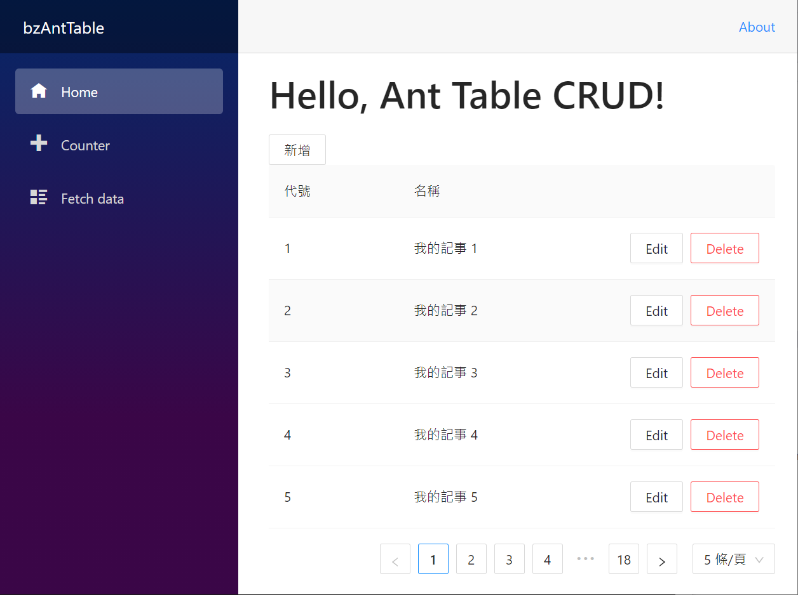
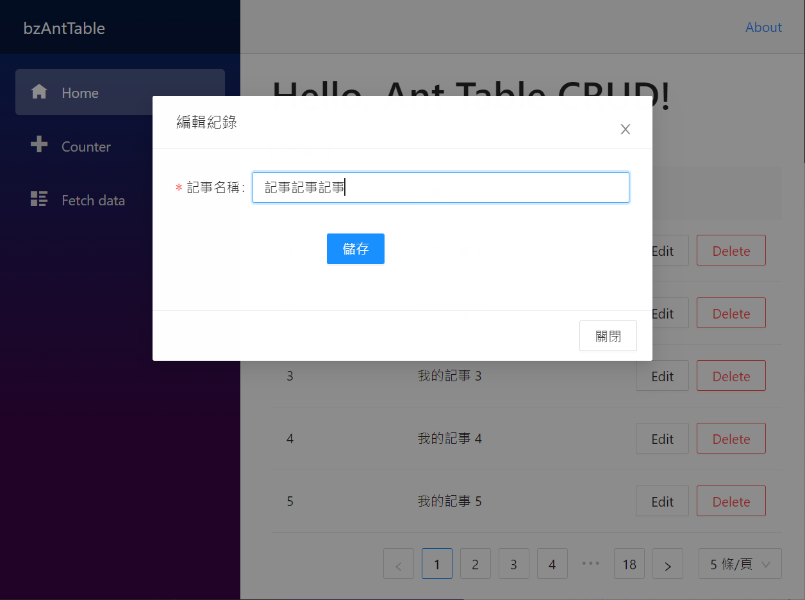
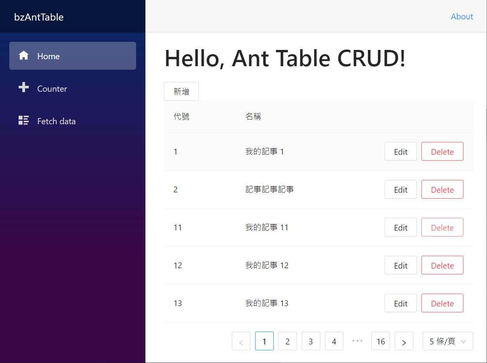

# 使用 Ant Design Blazor 設計出 CRUD 應用元件


[如何使用 Ant Design Blazor](https://csharpkh.blogspot.com/2021/06/ant-design-blazor.html)

Blazor 這個優異的 Web UI 開發框架，讓 .NET C# 開發者可以輕鬆容易地進行各種網頁專案開發，而且，網路上也存在著許多各種不同 UI 套件來滿足 Blazor 開發者的需求，在這篇文章中，將要來體驗這套 [Ant Design of Blazor](https://antblazor.com/en-US/) UI 套件，看看如何使用與執行出來的效果如何。

這篇文章的原始碼位於 [bzAntTable](https://github.com/vulcanlee/CSharp2021/tree/main/bzAntTable)

## 建立 Blazor Server-Side 的專案

* 開啟 Visual Studio 2019
* 選擇右下方的 [建立新的專案] 按鈕
* 在 [建立新專案] 對話窗中
* 從右上方的專案類型下拉按鈕中，找到並選擇 [Web]
* 從可用專案範本清單內，找到並選擇 [Blazor Server 應用程式]
* 點選左下方 [下一步] 按鈕
* 在 [設定新的專案] 對話窗中
* 在 [專案名稱] 欄位中輸入 `bzAntTable`
* 點選左下方 [下一步] 按鈕
* 在 [其他資訊] 對話窗中
* 在 [目標 Framework] 下拉選單中，選擇 [.NET 5.0 (目前)]
* 點選左下方 [建立] 按鈕

## 加入所需要使用到的 NuGet 套件

* 滑鼠右擊 [bzAntTable] 專案內的 [相依性] 節點
* 從彈出功能表中，選擇 [管理 NuGet 套件]
* 當 [NuGet: bzAntTable] 視窗出現後，切換到 [瀏覽] 標籤頁次
* 搜尋 [AntDesign] 並且安裝並且套件

## 安裝與設定 AntDesign 元件

* 參考 [Import Ant Design Blazor into an existing project](https://antblazor.com/en-US/docs/introduce) 文件說明，準備開始進行這個元件的安裝與設定
* 打開這個專案根目錄下的 [Startup.cs] 檔案
* 找到這個方法 [ConfigureServices]
* 在其方法內加入底下程式碼

```csharp
#region 加入 Ant Design 會用到的相依性服務註冊
services.AddAntDesign();
#endregion
```

* 打開 [Pages] 資料夾下的 [_Host.cshtml] 檔案
* 在 `<head> ... </head>` 區段內加入底下 HTML 標記

```html
@*加入 Ant Design 會用到的靜態參考*@
<link href="_content/AntDesign/css/ant-design-blazor.css" rel="stylesheet" />
<script src="_content/AntDesign/js/ant-design-blazor.js"></script>
```

* 打開這個專案根目錄下的 [_Imports.razor] 檔案
* 在其檔案的最後面加入底下程式碼

```html
@using AntDesign
```

* 打開這個專案根目錄下的 [App.razor] 檔案
* 在其檔案的最後面加入底下程式碼

```html
<AntContainer /> 
```

## 建立資料模型與服務

* 滑鼠右擊 [Pages] 資料夾
* 從彈出功能表點選 [加入] > [類別]
* 在下方 [名稱] 欄位輸入 [MyNote.cs]
* 點選 [新增] 按鈕
* 使用底下程式碼替換這個檔案內容

```csharp
using System;
using System.ComponentModel.DataAnnotations;

namespace bzAntTable.Pages
{
    public class MyNote : ICloneable
    {
        public int Id { get; set; }

        [Required(ErrorMessage = "事項標題不可為空白")]
        public string Title { get; set; }
        // 使用淺層複製的方式，產生出相同屬性值的物件
        public MyNote Clone()
        {
            return ((ICloneable)this).Clone() as MyNote;
        }
        // 這裡為使用明確方式來實作 ICloneable 介面
        object ICloneable.Clone()
        {
            return this.MemberwiseClone();
        }
    }
}
```

* 滑鼠右擊 [Pages] 資料夾
* 從彈出功能表點選 [加入] > [類別]
* 在下方 [名稱] 欄位輸入 [MyNoteService.cs]
* 點選 [新增] 按鈕
* 使用底下程式碼替換這個檔案內容

```csharp
using System;
using System.Collections.Generic;
using System.Linq;

namespace bzAntTable.Pages
{
    public class MyNoteService
    {
        public List<MyNote> MyNoteItems { get; set; }
        public MyNoteService()
        {
            var rnd = new Random();
            MyNoteItems = Enumerable.Range(1, 88).Select(index =>
            {
                var temperatureC = rnd.Next(-20, 55);
                return new MyNote
                {
                    Id = index,
                    Title=$"我的記事 {index}",
                };
            }).ToList();
        }

        public (List<MyNote> items, int total) Get(int pageIndex, int pageSize)
        {
            var items = MyNoteItems
                .Skip((pageIndex - 1)* pageSize)
                .Take(pageSize)
                .ToList();
            var total = MyNoteItems.Count;
            return (items, total);
        }
        public void Add(MyNote myNote)
        {
            var rnd = new Random();
            myNote.Id = rnd.Next(1000, 9999999);
            var item = MyNoteItems.FirstOrDefault(x => x.Id == myNote.Id);
            if (item == null)
            {
                MyNoteItems.Add(myNote);
            }
        }
        public void Update(MyNote myNote)
        {
            var item = MyNoteItems.FirstOrDefault(x => x.Id == myNote.Id);
            if (item != null)
            {
                item.Title = myNote.Title;
            }
        }
        public void Delete(MyNote myNote)
        {
            MyNoteItems.Remove(MyNoteItems.FirstOrDefault(x => x.Id == myNote.Id));
        }
    }
}
```

## 建立一個 CRUD 的元件

* 滑鼠右擊 [Pages] 資料夾
* 從彈出功能表點選 [加入] > [Razor 元件]
* 在下方 [名稱] 欄位輸入 [MyNoteView.razor]
* 點選 [新增] 按鈕
* 使用底下程式碼替換這個檔案內容

```html
@inject MyNoteService MyNoteService

<Button @onclick="AddAsync">新增</Button>

<div>
    <Table @ref="table"
           TItem="MyNote"
           DataSource="@myNotes"
           Total="_total"
           @bind-PageIndex="_pageIndex"
           @bind-PageSize="_pageSize"
           @bind-SelectedRows="selectedRows"
           OnPageIndexChange="PageIndexChanged"
           OnPageSizeChange="PageSizeChange">
        <Column @bind-Field="@context.Id" Title="代號" />
        <Column @bind-Field="@context.Title" Title="名稱" />
        <ActionColumn Width="100" Fixed="right">
            <Space>
                <SpaceItem><Button OnClick="async ()=>await EditAsync(context)">Edit</Button></SpaceItem>
                <SpaceItem><Button Danger OnClick="async ()=>await DeleteAsync(context)">Delete</Button></SpaceItem>
            </Space>
        </ActionColumn>
    </Table>
</div>

<div>
    @{
        RenderFragment footer =
        @<Template>
            <Button OnClick="@HandleCancel">
                關閉
            </Button>
        </Template>;
    }
    <Modal Title="@title"
           Visible="@visible"
           CancelText="@cancelText"
           OnCancel="@HandleCancel"
           Footer="@footer">

        <Form Model="CurrentMyNote"
              OnFinish="OnFinishAsync">
            <FormItem Label="記事名稱">
                <Input Placeholder="Basic usage" @bind-Value="@CurrentMyNote.Title" />
            </FormItem>
            <FormItem WrapperColOffset="8" WrapperColSpan="16">
                <Button Type="@ButtonType.Primary" HtmlType="submit">
                    儲存
                </Button>
            </FormItem>
        </Form>


    </Modal>
</div>

@using System.Text.Json;
@code {

    List<MyNote> myNotes;
    MyNote CurrentMyNote;
    public bool NewRecordMode { get; set; }

    IEnumerable<MyNote> selectedRows;
    ITable table;

    int _pageIndex = 1;
    int _pageSize = 5;
    int _total = 0;

    #region 編輯記錄對話窗
    string title = "編輯紀錄";
    bool visible = false;
    string cancelText = "關閉";
    #endregion

    protected override async Task OnInitializedAsync()
    {
        await ReloadAsync();
    }

    async Task ReloadAsync()
    {
        await Task.Yield();
        (List<MyNote> items, int total) = MyNoteService.Get(_pageIndex, _pageSize);
        myNotes = items;
        _total = total;
        StateHasChanged();
    }

    private async Task PageIndexChanged(PaginationEventArgs args)
    {
        _pageIndex = args.Page;
        await ReloadAsync();
    }

    private async Task PageSizeChange(PaginationEventArgs args)
    {
        _pageSize = args.PageSize;
        await ReloadAsync();
    }

    public void RemoveSelection(int id)
    {
        var selected = selectedRows.Where(x => x.Id != id);
        selectedRows = selected;
    }

    private async Task DeleteAsync(MyNote myNote)
    {
        MyNoteService.Delete(myNote);
        await ReloadAsync();
    }

    private async Task EditAsync(MyNote myNote)
    {
        CurrentMyNote = myNote.Clone();
        NewRecordMode = false;
        visible = true;
        await Task.Yield();
    }

    private async Task AddAsync()
    {
        CurrentMyNote = new MyNote();
        NewRecordMode = true;
        visible = true;
        await Task.Yield();
    }
    private async Task OnFinishAsync(EditContext editContext)
    {
        if (NewRecordMode == false)
        {
            MyNoteService.Update(CurrentMyNote);
        }
        else
        {
            MyNoteService.Add(CurrentMyNote);
        }
        await ReloadAsync();
        visible = false;
    }

    private void HandleCancel(MouseEventArgs e)
    {
        visible = false;
    }
}
```

## 修正 Index.razor 頁面

* 打開 [Pages] 資料夾下的 [Index.razor] 檔案
* 使用底下程式碼替換掉這個檔案內容

```html
@page "/"

<h1>Hello, Ant Table CRUD!</h1>

<MyNoteView/>
```

## 執行並且測試

* 按下 F5 開始執行這個專案
* 網頁出現之後，將會看到底下的畫面

  

* 點選任何一筆紀錄右邊的 [Edit] 按鈕，則會看到一個對話窗出現在網頁上
* 修改 記事名稱 ，接著點選 [儲存] 按鈕，此時，這筆修改的紀錄將會儲存起來

  

* 接著，點選 [Delete] 這個按鈕，則會這筆紀錄將會移除了

  

