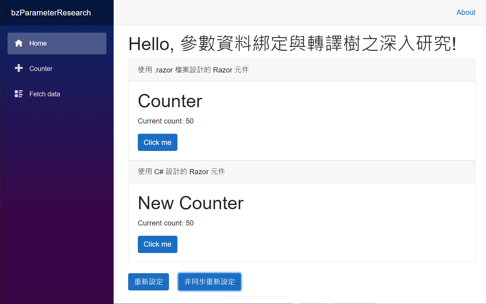

# Blazor 使用參數資料綁定來傳遞元件參數與轉譯樹呼叫之深入研究


當進行 C# 程式設計的時候，會在類別上設計許多方法，透過這個方法來執行該物件所提供的許多行為，而在設計方法的時候，可以提供不同 參數 Parameter ，讓使用該物件呼叫該方法的時候，可以使用 引數 Argument 來傳遞到參數內，使得該方法可以依據所傳入的參數來變更物件狀態或者執行行為。

當在進行 [Blazor](https://docs.microsoft.com/zh-tw/aspnet/core/blazor/?view=aspnetcore-5.0&WT.mc_id=DT-MVP-5002220) 專案程式設計的時候，可以充分善用 [Blazor] 提供的元件化設計方式 [ASP.NET Core Razor 元件](https://docs.microsoft.com/zh-tw/aspnet/core/blazor/components/?view=aspnetcore-5.0&WT.mc_id=DT-MVP-5002220) ，把一個頁面要設計的畫面內容，切割成為不同的元件，並且將這些元件組合在這個頁面上，這樣的做法將會獲得一個很大的好處，可以將複雜的問題切割成為許多元件，在設計這些元件的時候就會簡單許多了，而且在設計過程中也會容易除錯與維護。

當在設計這些 [Razor元件] 的時候，可以透過 [跨元件階層傳遞資料](https://docs.microsoft.com/zh-tw/aspnet/core/blazor/components/cascading-values-and-parameters?view=aspnetcore-5.0#pass-data-across-a-component-hierarchy&WT.mc_id=DT-MVP-5002220) 功能，設計 [Razor元件] 可以接收參數，如此便可以讓這些元件依據所傳送進來的參數內容，改變這些 [Razor元件] 的顯示樣貌與運作行為。

不過，當在使用 C# 呼叫方法的時候，就可以直接將引數傳遞到這些方法的參數內，然而，在使用不同元件間要傳遞參數的時候，究竟何時才會觸發這些參數產生變化，也就是說，元件間的參數傳遞究竟是在何時會產生效果。

例如，這裡有個 [ChildComponent.razor] 子元件，在這個元件內會有宣告一個屬性 [Property](https://docs.microsoft.com/zh-tw/dotnet/csharp/programming-guide/classes-and-structs/properties?WT.mc_id=DT-MVP-5002220) ，不過，在這個 C# Property 上面有使用 C# 屬性 [Attribute](https://docs.microsoft.com/zh-tw/dotnet/csharp/programming-guide/concepts/attributes/?WT.mc_id=DT-MVP-5002220) 來宣告這個 Index 屬性將會成為 [Razor元件] 的參數，也就是可以透過使用這個元件的時候，使用這個參數來傳遞物件值到這個子元件內。

```html
@code{
    [Parameter]
    public int Index {get; set;}
}
```

而在使用這個子元件的 父[Razor元件] 內，可以使用底下的方式來進行參數的綁定，這樣的做法為在使用 [ChildComponent] 元件的時候，在該元件名稱的右邊宣告要傳送過去給這個子元件的參數物件為何？

```html
<ChildComponent Index="@parameterIndex"/>
@code{
    int parameterIndex;
}
```

另外，還有一個很重要的問題，那就是 [ASP.NET Core Blazor 元件轉譯](https://docs.microsoft.com/zh-tw/aspnet/core/blazor/components/rendering?view=aspnetcore-5.0&WT.mc_id=DT-MVP-5002220)，當在進行元件轉譯的時候，究竟發生了甚麼事情，而且，這個 [元件轉譯] 程序何時會被觸發，能否直接呼叫這個方法呢？不過，通常會使用 [ComponentBase.StateHasChanged 方法](https://docs.microsoft.com/zh-tw/dotnet/api/microsoft.aspnetcore.components.componentbase.statehaschanged?view=aspnetcore-5.0&WT.mc_id=DT-MVP-5002220)

現在來看看如何做出這樣的範例成程式碼。

這篇文章的原始碼位於 [bzParameterResearch](https://github.com/vulcanlee/CSharp2021/tree/main/bzParameterResearch)

## 建立Blazor Server 應用程式專案

* 開啟 Visual Studio 2019
* 選擇右下方的 [建立新的專案] 按鈕
* 在 [建立新專案] 對話窗中
* 從右上方的專案類型下拉按鈕中，找到並選擇 [Web]
* 從可用專案範本清單內，找到並選擇 [空的 ASP.NET Core]
* 點選左下方 [下一步] 按鈕
* 在 [設定新的專案] 對話窗中
* 在 [專案名稱] 欄位中輸入 `bzParameterResearch`
* 點選左下方 [下一步] 按鈕
* 在 [其他資訊] 對話窗中
* 在 [目標 Framework] 下拉選單中，選擇 [.NET 5.0 (目前)]
* 點選左下方 [建立] 按鈕

## 建立測試用的子元件

* 滑鼠右擊 [Pages] 資料夾
* 在彈出功能表清單點選 [加入] > [類別]
* 在下方 [名稱] 欄位中輸入 `NewCounter.cs`
* 點選右下方的 [新增] 按鈕
* 使用底下程式碼替換掉這個檔案內容

```csharp
namespace bzParameterResearch.Pages
{
    using Microsoft.AspNetCore.Components;
    public partial class NewCounter : Microsoft.AspNetCore.Components.ComponentBase
    {
        /// <summary>
        /// 這裡將會重新產生出最新狀態的轉譯樹
        /// </summary>
        /// <param name="__builder"></param>
        protected override void BuildRenderTree(Microsoft.AspNetCore.Components.Rendering.RenderTreeBuilder __builder)
        {
            System.Console.WriteLine($"  開始執行子元件的轉譯樹建立程序 BuildRenderTree : {currentCount}");
            __builder.AddMarkupContent(0, "<h1>New Counter</h1>\r\n\r\n");
            __builder.OpenElement(1, "p");
            __builder.AddContent(2, "Current count: ");
            __builder.AddContent(3,
                   currentCount
            );
            __builder.CloseElement();
            __builder.AddMarkupContent(4, "\r\n\r\n");
            __builder.OpenElement(5, "button");
            __builder.AddAttribute(6, "class", "btn btn-primary");
            __builder.AddAttribute(7, "onclick", Microsoft.AspNetCore.Components.EventCallback.Factory.Create<Microsoft.AspNetCore.Components.Web.MouseEventArgs>(this,
                                          IncrementCount
            ));
            __builder.AddContent(8, "Click me");
            __builder.CloseElement();
        }

        /// <summary>
        /// 該 NewCounter 元件可以接收的參數
        /// </summary>
        [Parameter]
        public int currentCount { get; set; } = 0;

        /// <summary>
        /// 當參數要進行綁定的時候，將會觸發的生命週期事件
        /// </summary>
        protected override void OnParametersSet()
        {
            System.Console.WriteLine($"  子元件的參數綁定生命週期事件觸發了 OnParametersSet : {currentCount}");
        }

        /// <summary>
        /// 該元件畫面中按鈕所要綁定的點選該按鈕之觸發事件
        /// </summary>
        private void IncrementCount()
        {
            currentCount++;
        }

        /// <summary>
        /// 若直接取得該元件的參考，就可以呼叫這個公開方法，這裡是要來查看參數是否已經綁定成功了嗎？
        /// </summary>
        public void EchoCurrentCount()
        {
            System.Console.WriteLine($"  子元件內部的參數數值 : {currentCount}");
        }
    }
}
```

上面的程式碼建立了一個 [Razor元件]，疑，為什麼在這裡不是產生一個新的 [Razor元件]，而是產生一個 [C# 類別](https://docs.microsoft.com/zh-tw/dotnet/csharp/fundamentals/types/classes?WT.mc_id=DT-MVP-5002220) 呢？其實，當建立了一個 .razor 類型的檔案，就已經建立了一個 [Razor元件]，在建置這個專案的時候，編譯器會為這個 .razor 類型檔案產生出一個 C# 類別，並且這個類別會繼承 [ComponentBase](https://docs.microsoft.com/zh-tw/dotnet/api/microsoft.aspnetcore.components.componentbase?view=aspnetcore-5.0&WT.mc_id=DT-MVP-5002220) 類別 (元件的選擇性基底類別)。

因此，當然可以自行建立一個 C# 類別，在這裡將會產生一個名稱為 NewCounter 的類別，並且這個類別有繼承 Microsoft.AspNetCore.Components.ComponentBase 類別，這樣也是完成了一個 [Razor元件] 的設計。

一個 [Razor元件] 類別最重要的部分，就是要覆寫實作出 [BuildRenderTree](https://docs.microsoft.com/zh-tw/dotnet/api/microsoft.aspnetcore.components.rendering.rendertreebuilder?view=aspnetcore-5.0&WT.mc_id=DT-MVP-5002220)，在這個方法內將會產生轉譯樹 Render Tree，並且根據轉譯述的內容，判斷出與網頁上 DOM 內容的差異，直接轉譯/渲覽 DOM 上的內容，如此，網頁就會根據這個元件上面所持有的最新狀態，顯示出正確的內容在網頁上。

該類別的其他程式碼也都在上面的程式碼中有加入說明註解。

## 使用新建的子元件

* 在 [Pages] 資料夾內打開 [Index.razor] 檔案
* 使用底下程式碼替換掉這個檔案內容

```html
@page "/"

<h1>Hello, 參數資料綁定與轉譯樹之深入研究!</h1>

<div class="card">
    <div class="card-header">
        使用 .razor 檔案設計的 Razor 元件
    </div>
    <div class="card-body">
        <Counter currentCount="@counterNumber" />
    </div>
</div>

<div class="card">
    <div class="card-header">
        使用 C# 設計的 Razor 元件
    </div>
    <div class="card-body">
        <NewCounter @ref="NewCounter" currentCount="@counterNumber" />
    </div>
</div>

<div class="my-4">
    <button class="btn btn-primary" @onclick="Reset">重新設定</button>
    <button class="btn btn-primary mx-3" @onclick="ResetAsync">非同步重新設定</button>
</div>

@code{
    public int counterNumber { get; set; }
    public NewCounter NewCounter { get; set; }
    void Reset()
    {
        counterNumber = 100;
    }

    async Task ResetAsync()
    {
        Console.WriteLine(); Console.WriteLine();
        Console.WriteLine($"將計數器強制修正為 50");
        counterNumber = 50;
    }
}
```

在這個首頁元件中，分別加入了兩個計數器元件，前者為使用 .razor 所設計出來的 [Razor元件]，後者為使用 .cs 的 C# 程式語言所設計出來的 [Razor元件]；而在該頁面的最後面加入了兩個元件，其中有個 [非同步重新設定] 按鈕，當按下這個按鈕之後，將會把這個計數器的 .NET 物件變數值設定為 50。

## 執行並且測試

按下 F5 開始執行這個專案

現在將會看到底下的畫面


從 [命令提示字元視窗] 內可以看到底下的輸出內容

```
info: Microsoft.Hosting.Lifetime[0]
      Now listening on: https://localhost:5001
info: Microsoft.Hosting.Lifetime[0]
      Now listening on: http://localhost:5000
info: Microsoft.Hosting.Lifetime[0]
      Application started. Press Ctrl+C to shut down.
info: Microsoft.Hosting.Lifetime[0]
      Hosting environment: Development
info: Microsoft.Hosting.Lifetime[0]
      Content root path: D:\Vulcan\GitHub\CSharp2021\bzParameterResearch\bzParameterResearch
  子元件的參數綁定生命週期事件觸發了 OnParametersSet : 0
  開始執行子元件的轉譯樹建立程序 BuildRenderTree : 0
  子元件的參數綁定生命週期事件觸發了 OnParametersSet : 0
  開始執行子元件的轉譯樹建立程序 BuildRenderTree : 0
```

從最後面的四行文字可以看到，第一次執行 OnParametersSet 與 BuildRenderTree 這兩個方法，表示有執行了參數綁定與重新建立轉譯樹的方法，不過，會有這兩行的輸出是因為 Blazor Server 預設使用了 [ServerPrerendered](https://docs.microsoft.com/zh-tw/aspnet/core/blazor/components/prerendering-and-integration?view=aspnetcore-5.0&pivots=server&WT.mc_id=DT-MVP-5002220) 模式，根據微軟官方的文件上說明，這表示了將元件轉譯為靜態 HTML，並包含 Blazor 伺服器端應用程式的標記。 當使用者代理程式啟動時，它會使用此標記來啟動 blazor 應用程式。而第二次則是正式在元件顯示在畫面上要觸發呼叫的。

這裡可以打開 [Pages] > [_Host.cshtml] 檔案，裡面有這行 `<component type="typeof(App)" render-mode="ServerPrerendered" />` 敘述，表示了在這個 Blazor 系統中，使用了 ServerPrerendered 模式。

當點選了 [非同步重新設定] 按鈕，將會出現底下的內容

```
將計數器強制修正為 50
  子元件的參數綁定生命週期事件觸發了 OnParametersSet : 50
  開始執行子元件的轉譯樹建立程序 BuildRenderTree : 50
```

網頁將會呈現底下的結果



從這裡可以看這個按鈕的綁定事件中，僅僅有修正 [counterNumber] 變數為 50，不過，在這個按鈕事件內的程式碼並沒有看到額外的程式碼，然而，卻看到了這裡也觸發了 [OnParametersSet] 生命週期事件 與 [BuildRenderTree] 元件覆寫方法；會有這樣的效果是因為在 Blazor 開發框架中，在按鈕的事件處理完成後，就自動觸發這些方法來執行。

## 在按鈕事件最後加入子元件方法呼叫

* 請在這個 [Index.razor] 元件檔案內，找出 [ResetAsync] 方法
* 將這個方法改寫成為底下的程式碼

```csharp
async Task ResetAsync()
{
    Console.WriteLine(); Console.WriteLine();
    Console.WriteLine($"將計數器強制修正為 50");
    counterNumber = 50;
    NewCounter.EchoCurrentCount();
}
```

* 按下 [Shift] + [F5] 按鍵，停止這個專案執行
* 按下 [F5] 按鍵，再度執行這個專案
* 當點選了 [非同步重新設定] 按鈕，將會出現底下的內容

```
  子元件的參數綁定生命週期事件觸發了 OnParametersSet : 0
  開始執行子元件的轉譯樹建立程序 BuildRenderTree : 0
  子元件的參數綁定生命週期事件觸發了 OnParametersSet : 0
  開始執行子元件的轉譯樹建立程序 BuildRenderTree : 0


將計數器強制修正為 50
  子元件內部的參數數值 : 0
  子元件的參數綁定生命週期事件觸發了 OnParametersSet : 50
  開始執行子元件的轉譯樹建立程序 BuildRenderTree : 50
```

從 [命令提示字元視窗] 中可以看到，當在按鈕事件內執行了 `counterNumber = 50;` 敘述之後，改變了 [Index.razor] 元件內的變數值內容，可是，這個時候在有進行參數綁定的元件是否知道這個參數值已經有變動了呢？

從輸出文字中是每有看到這樣的結果，這也顛覆了大家的想像呢？這可以從當呼叫了 `NewCounter.EchoCurrentCount();` 敘述之後可以看的出來，因為，這裡直接執行了這個 [NewCounter.cs] 元件內公開的 [EchoCurrentCount] 方法，這個方法裡面僅有一行敘述 `System.Console.WriteLine($"  子元件內部的參數數值 : {currentCount}");` ，那就是將子元件內的計數器變數數值輸出到 [命令提示字元視窗] 內，而從輸出結果可以看出，這個時候子元件內的計數器為 0，並不是在 [Index.razor] 所設定的 50。

這一切的狀況直到這個按鈕事件都執行完成之後，觸發了 [OnParametersSet] 生命週期事件，此時，子元件內的計數器物件值才變成了 50。

在此必須建立一個很正確的觀念，不要以為在 [Index.razor] 元件內變更了 [counterNumber] 變數數值，這個時候對於有做資料綁定上的元件內，其綁定參數也已經變更了其綁定數值了，原則上，需要等到這個事件執行完畢之後，子元件所綁定的參數才會進行更新到最新內容。

## 在按鈕事件最後加入非同步方法呼叫

* 請在這個 [Index.razor] 元件檔案內，找出 [ResetAsync] 方法
* 將這個方法改寫成為底下的程式碼

```csharp
async Task ResetAsync()
{
    Console.WriteLine(); Console.WriteLine();
    Console.WriteLine($"將計數器強制修正為 50");
    counterNumber = 50;
    NewCounter.EchoCurrentCount();
    Console.WriteLine("Launch Task.Delay(100)");
    await Task.Delay(100);
    NewCounter.EchoCurrentCount();
}
```

* 按下 [Shift] + [F5] 按鍵，停止這個專案執行
* 按下 [F5] 按鍵，再度執行這個專案
* 當點選了 [非同步重新設定] 按鈕，將會出現底下的內容

```
  子元件的參數綁定生命週期事件觸發了 OnParametersSet : 0
  開始執行子元件的轉譯樹建立程序 BuildRenderTree : 0
  子元件的參數綁定生命週期事件觸發了 OnParametersSet : 0
  開始執行子元件的轉譯樹建立程序 BuildRenderTree : 0


將計數器強制修正為 50
  子元件內部的參數數值 : 0
Launch Task.Delay(100)
  子元件的參數綁定生命週期事件觸發了 OnParametersSet : 50
  開始執行子元件的轉譯樹建立程序 BuildRenderTree : 50
  子元件內部的參數數值 : 50
```

從 [命令提示字元視窗] 中可以看到，當在按鈕事件內執行了 `counterNumber = 50;` 敘述之後，改變了 [Index.razor] 元件內的變數值內容，可是，這個時候在有進行參數綁定的元件並不知道所綁定的參數值已經有變動了。

因此當呼叫了 `NewCounter.EchoCurrentCount();` 敘述之後可以看的出來 `子元件內部的參數數值 : 0`，不過，接下來將會使用 [await] 關鍵字進行一個非同步作業呼叫 `await Task.Delay(100);`，這裡使用這個 Delay 模擬非同步作業，使用非封鎖式的等待 0.1 秒的時間。

很神奇的，從 [命令提示字元視窗] 中可以看到，當呼叫非同步作業呼叫 `await Task.Delay(100);` 完成之後，[OnParametersSet] 與 [BuildRenderTree] 就被觸發執行了，最新設定的 counterNumber 變數數值已經透過參數綁定的方式，傳遞到子元件內，這可以從呼叫了 `NewCounter.EchoCurrentCount();` 敘述之後可以看的出來 `子元件內部的參數數值 : 50`

在此必須建立第二個設計技巧，在 [Index.razor] 元件內的按鈕事件委派方法裡，若第一次使用了 [await] 關鍵字進行非同步作業呼叫，一旦非同步作業執行完畢後，就會觸發 [OnParametersSet] 與 [BuildRenderTree]，並且完成元件內的參數綁定作業。

## 呼叫非同步方法作業後，再度變更要綁定參數的數值

* 請在這個 [Index.razor] 元件檔案內，找出 [ResetAsync] 方法
* 將這個方法改寫成為底下的程式碼

```csharp
async Task ResetAsync()
{
    Console.WriteLine(); Console.WriteLine();
    Console.WriteLine($"將計數器強制修正為 50");
    counterNumber = 50;
    NewCounter.EchoCurrentCount();
    Console.WriteLine("Launch Task.Delay(100)");
    await Task.Delay(100);
    Console.WriteLine($"將計數器強制修正為 100");
    counterNumber = 100;
    NewCounter.EchoCurrentCount();
    //Console.WriteLine($"將計數器強制修正為 50");
    //counterNumber = 100;
}
```

* 按下 [Shift] + [F5] 按鍵，停止這個專案執行
* 按下 [F5] 按鍵，再度執行這個專案
* 當點選了 [非同步重新設定] 按鈕，將會出現底下的內容

```
  子元件的參數綁定生命週期事件觸發了 OnParametersSet : 0
  開始執行子元件的轉譯樹建立程序 BuildRenderTree : 0
  子元件的參數綁定生命週期事件觸發了 OnParametersSet : 0
  開始執行子元件的轉譯樹建立程序 BuildRenderTree : 0


將計數器強制修正為 50
  子元件內部的參數數值 : 0
Launch Task.Delay(100)
  子元件的參數綁定生命週期事件觸發了 OnParametersSet : 50
  開始執行子元件的轉譯樹建立程序 BuildRenderTree : 50
將計數器強制修正為 100
  子元件內部的參數數值 : 50
  子元件的參數綁定生命週期事件觸發了 OnParametersSet : 100
  開始執行子元件的轉譯樹建立程序 BuildRenderTree : 100
```

經過這樣的修正，從 [命令提示字元視窗] 中可以看到，當完成非同步作業呼叫之後，接著，修正要綁定的計數器數值為 100，此時，若緊接著呼叫 `NewCounter.EchoCurrentCount();` 敘述，從子元件內來查看所綁定的參數數值，在子元件內的綁定參數數值還是為 50，並沒有變更成為 100，然而，當這個按鈕事件完成之後，卻發現到 [OnParametersSet] 與 [BuildRenderTree] 這兩個方法也被執行了。

這與前面所做的測試決然不同，因此，可以歸納出第三個設計技巧，在第一次使用 [await] 關鍵字呼叫完成非同步作業之後，Blazor 框架不會自動觸發 [OnParametersSet] 與 [BuildRenderTree] 這兩個方法，但是，若在 [await] 呼叫之後並且變更計數器的數值，Blazor 框架便會自動呼叫 [OnParametersSet] 與 [BuildRenderTree] 這兩個方法。

## 觀察兩次進行呼叫非同步方法作

* 請在這個 [Index.razor] 元件檔案內，找出 [ResetAsync] 方法
* 將這個方法改寫成為底下的程式碼

```csharp
async Task ResetAsync()
{
    Console.WriteLine(); Console.WriteLine();
    Console.WriteLine($"將計數器強制修正為 50");
    counterNumber = 50;
    NewCounter.EchoCurrentCount();
    Console.WriteLine("Launch Task.Delay(100)");
    await Task.Delay(100);
    NewCounter.EchoCurrentCount();
    Console.WriteLine("Launch Task.Delay(100)");
    await Task.Delay(100);
    NewCounter.EchoCurrentCount();
}
```

* 按下 [Shift] + [F5] 按鍵，停止這個專案執行
* 按下 [F5] 按鍵，再度執行這個專案
* 當點選了 [非同步重新設定] 按鈕，將會出現底下的內容

```
  子元件的參數綁定生命週期事件觸發了 OnParametersSet : 0
  開始執行子元件的轉譯樹建立程序 BuildRenderTree : 0
  子元件的參數綁定生命週期事件觸發了 OnParametersSet : 0
  開始執行子元件的轉譯樹建立程序 BuildRenderTree : 0


將計數器強制修正為 50
  子元件內部的參數數值 : 0
Launch Task.Delay(100)
  子元件的參數綁定生命週期事件觸發了 OnParametersSet : 50
  開始執行子元件的轉譯樹建立程序 BuildRenderTree : 50
  子元件內部的參數數值 : 50
Launch Task.Delay(100)
  子元件內部的參數數值 : 50
```

經過這樣的修正，從 [命令提示字元視窗] 中可以看到，當完成第二次非同步作業呼叫之後，是沒有觸發 [OnParametersSet] 與 [BuildRenderTree] 這兩個方法。

* 請在這個 [Index.razor] 元件檔案內，找出 [ResetAsync] 方法
* 將這個方法改寫成為底下的程式碼

```csharp
async Task ResetAsync()
{
    Console.WriteLine(); Console.WriteLine();
    Console.WriteLine($"將計數器強制修正為 50");
    counterNumber = 50;
    NewCounter.EchoCurrentCount();
    Console.WriteLine("Launch Task.Delay(100)");
    await Task.Delay(100);
    NewCounter.EchoCurrentCount();
    Console.WriteLine($"將計數器強制修正為 100");
    counterNumber = 100;
    NewCounter.EchoCurrentCount();
    Console.WriteLine("Launch Task.Delay(100)");
    await Task.Delay(100);
    NewCounter.EchoCurrentCount();
}
```

* 按下 [Shift] + [F5] 按鍵，停止這個專案執行
* 按下 [F5] 按鍵，再度執行這個專案
* 當點選了 [非同步重新設定] 按鈕，將會出現底下的內容

```
  子元件的參數綁定生命週期事件觸發了 OnParametersSet : 0
  開始執行子元件的轉譯樹建立程序 BuildRenderTree : 0
  子元件的參數綁定生命週期事件觸發了 OnParametersSet : 0
  開始執行子元件的轉譯樹建立程序 BuildRenderTree : 0


將計數器強制修正為 50
  子元件內部的參數數值 : 0
Launch Task.Delay(100)
  子元件的參數綁定生命週期事件觸發了 OnParametersSet : 50
  開始執行子元件的轉譯樹建立程序 BuildRenderTree : 50
  子元件內部的參數數值 : 50
將計數器強制修正為 100
  子元件內部的參數數值 : 50
Launch Task.Delay(100)
  子元件內部的參數數值 : 50
  子元件的參數綁定生命週期事件觸發了 OnParametersSet : 100
  開始執行子元件的轉譯樹建立程序 BuildRenderTree : 100
```

經過這樣的修正之後，發現到完成第二次非同步作業呼叫之後，緊接著變更了 counterNumber 變數數值，直到這個按鈕事件完成之後，還是會觸發 [OnParametersSet] 與 [BuildRenderTree] 這兩個方法。

現在，可以歸納出第四個設計技巧，在第二次再度使用 [await] 關鍵字呼叫完成非同步作業之後，若 counterNumber 變數數值有變動之後，Blazor 框架必定會自動觸發 [OnParametersSet] 與 [BuildRenderTree] 這兩個方法。

## 按鈕事件委派方法 - 採用同步方法呼叫

* 請在這個 [Index.razor] 元件檔案內，找出 [Reset] 方法
* 將這個方法改寫成為底下的程式碼

```csharp
void Reset()
{
    Console.WriteLine($"將計數器強制修正為 100");
    counterNumber = 100;
    NewCounter.EchoCurrentCount();
}
```

* 按下 [Shift] + [F5] 按鍵，停止這個專案執行
* 按下 [F5] 按鍵，再度執行這個專案
* 當點選了 [重新設定] 按鈕，將會出現底下的內容

```
  子元件的參數綁定生命週期事件觸發了 OnParametersSet : 0
  開始執行子元件的轉譯樹建立程序 BuildRenderTree : 0
  子元件的參數綁定生命週期事件觸發了 OnParametersSet : 0
  開始執行子元件的轉譯樹建立程序 BuildRenderTree : 0
將計數器強制修正為 100
  子元件內部的參數數值 : 0
  子元件的參數綁定生命週期事件觸發了 OnParametersSet : 100
  開始執行子元件的轉譯樹建立程序 BuildRenderTree : 100
```

這個按鈕的事件委派方法採用同步的方式來執行，若 [counterNumber] 變數有變動之後，在這個按鈕事件委派方法執行之後，就會觸發 [OnParametersSet] 與 [BuildRenderTree] 因此，子元件就會更新到最新的狀態值。

若更新 [Reset] 方法成為底下程式碼

```csharp
void Reset()
{
    Console.WriteLine($"沒有任何異動");
    NewCounter.EchoCurrentCount();
}
```

* 按下 [Shift] + [F5] 按鍵，停止這個專案執行
* 按下 [F5] 按鍵，再度執行這個專案
* 當點選了 [非同步重新設定] 按鈕，將會出現底下的內容

```
  子元件的參數綁定生命週期事件觸發了 OnParametersSet : 0
  開始執行子元件的轉譯樹建立程序 BuildRenderTree : 0
  子元件的參數綁定生命週期事件觸發了 OnParametersSet : 0
  開始執行子元件的轉譯樹建立程序 BuildRenderTree : 0
沒有任何異動
  子元件內部的參數數值 : 0
```

不意外的，當 [counterNumber] 要綁定的物件值沒有任何異動，在這個按鈕事件結束執行之後，便不會觸發 [OnParametersSet] 與 [BuildRenderTree] 這兩個方法

最後，若這個按鈕事件委派方法若強制呼叫 [StateHasChanged()] 的時候，又會如何呢？

```csharp
void Reset()
{
    Console.WriteLine($"沒有任何異動");
    NewCounter.EchoCurrentCount();
    StateHasChanged();
}
```

從底下的執行結果可以看出，當按鈕觸發事件執行完成後，還是不會執行 [OnParametersSet] 與 [BuildRenderTree] 這兩個方法

```
  子元件的參數綁定生命週期事件觸發了 OnParametersSet : 0
  開始執行子元件的轉譯樹建立程序 BuildRenderTree : 0
  子元件的參數綁定生命週期事件觸發了 OnParametersSet : 0
  開始執行子元件的轉譯樹建立程序 BuildRenderTree : 0
沒有任何異動
  子元件內部的參數數值 : 0
```


