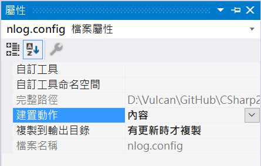
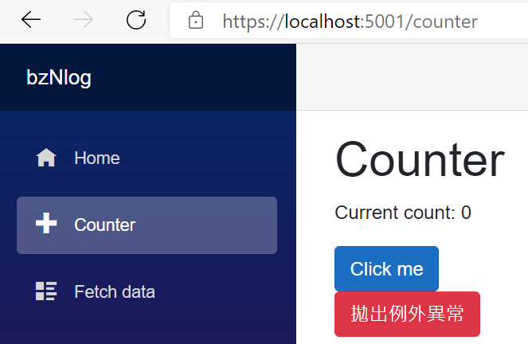
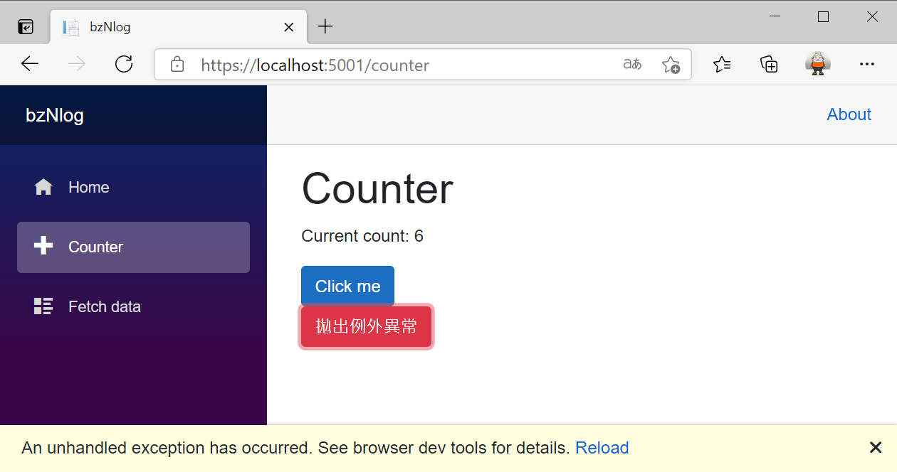
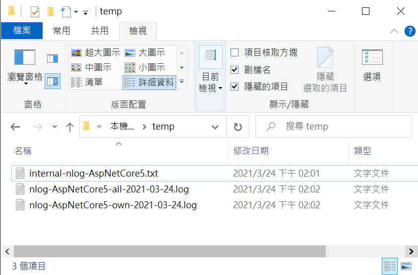

# 在 Blazor 專案內使用 NLog 進行系統執行日誌紀錄

在這篇文章中，將要來學習如何在 ASP.NET Core 專案內使用第三方 [NLog](https://github.com/NLog/NLog) 日誌套件，協助進行該專案執行過程中的相關重要訊息紀錄。

首先，在 ASP.NET Core 開發環境內，已經預設具備了訊息日誌能力，這部分可以參考 [.NET Core 與 ASP.NET Core 中的記錄](https://docs.microsoft.com/zh-tw/aspnet/core/fundamentals/logging/?view=aspnetcore-5.0&WT.mc_id=DT-MVP-5002220) 說明文章，要能夠知道各種 ASP.NET Core 中的紀錄程式設計方式、設定、宣告方式。

現在，就來開始實際建立一個 Blazor 專案，看看 [NLog](https://github.com/NLog/NLog) 如何在 Blazor 專案中使用情況。

這篇文章的原始碼位於 [bzNlog](https://github.com/vulcanlee/CSharp2021/tree/main/bzNlog)

## 建立測試用主控台應用程式專案

* 開啟 Visual Studio 2019
* 選擇右下方的 [建立新的專案] 按鈕
* 在 [建立新專案] 對話窗中
* 從右上方的專案類型下拉按鈕中，找到並選擇 [Web]
* 從可用專案範本清單內，找到並選擇 [Blazor Server 應用程式]
* 點選左下方 [下一步] 按鈕
* 在 [設定新的專案] 對話窗中
* 在 [專案名稱] 欄位中輸入 `bzNlog`
* 點選左下方 [下一步] 按鈕
* 在 [其他資訊] 對話窗中
* 在 [目標 Framework] 下拉選單中，選擇 [.NET 5.0 (目前)]
* 點選左下方 [建立] 按鈕

## 加入所需要使用到的 NuGet 套件

* 滑鼠右擊 [bzNlog] 專案內的 [相依性] 節點
* 從彈出功能表中，選擇 [管理 NuGet 套件]
* 當 [NuGet: bzNlog] 視窗出現後，切換到 [瀏覽] 標籤頁次
* 搜尋 [NLog.Web.AspNetCore] 並且安裝並且套件
* 安裝完成後，會有一個 [readme.txt] 視窗顯示出來，提示如何使用

```
Welcome to NLog for ASP.NET Core!

To get started, check one of these short tutorials:

- Getting started for ASP.NET Core 5: https://github.com/NLog/NLog/wiki/Getting-started-with-ASP.NET-Core-5
- Getting started for ASP.NET Core 3: https://github.com/NLog/NLog/wiki/Getting-started-with-ASP.NET-Core-3
- Getting started for ASP.NET Core 2: https://github.com/NLog/NLog/wiki/Getting-started-with-ASP.NET-Core-2

# More information

- How to use structured logging: https://github.com/NLog/NLog/wiki/How-to-use-structured-logging
- All config options: https://nlog-project.org/config

# Troubleshooting

Having issues to get things working? It's recommend to follow to Troubleshooting https://github.com/NLog/NLog/wiki/Logging-troubleshooting page.

For questions, StackOverflow (https://stackoverflow.com/questions/tagged/nlog) is recommend
```

## 建立 nlog.config 設定檔案

* 滑鼠右擊 [bzNlog] 專案節點
* 選擇 [加入] > [新增項目]
* 此時將會顯示 [新增項目] 對話窗
* 在左邊請點選 [已安裝] > [Visual C#] > [ASP.NET Core] > [資料]
* 在該對話窗的中間部分，請選擇 [XML檔]
* 在下方 [名稱] 欄位，輸入 `nlog.config`
* 將底下內容填入到這個檔案內

```xml
<?xml version="1.0" encoding="utf-8" ?>
<nlog xmlns="http://www.nlog-project.org/schemas/NLog.xsd"
      xmlns:xsi="http://www.w3.org/2001/XMLSchema-instance"
      autoReload="true"
      throwConfigExceptions="true"
      internalLogLevel="info"
      internalLogFile="c:\temp\internal-nlog-AspNetCore5.txt">

	<!-- enable asp.net core layout renderers -->
	<extensions>
		<add assembly="NLog.Web.AspNetCore"/>
	</extensions>

	<!-- the targets to write to -->
	<targets>
		<!-- File Target for all log messages with basic details -->
		<target xsi:type="File" name="allfile" fileName="c:\temp\nlog-AspNetCore5-all-${shortdate}.log"
				layout="${longdate}|${event-properties:item=EventId_Id:whenEmpty=0}|${uppercase:${level}}|${logger}|${message} ${exception:format=tostring}" />

		<!-- File Target for own log messages with extra web details using some ASP.NET core renderers -->
		<target xsi:type="File" name="ownFile-web" fileName="c:\temp\nlog-AspNetCore5-own-${shortdate}.log"
				layout="${longdate}|${event-properties:item=EventId_Id:whenEmpty=0}|${uppercase:${level}}|${logger}|${message} ${exception:format=tostring}|url: ${aspnet-request-url}|action: ${aspnet-mvc-action}|" />

		<!--Console Target for hosting lifetime messages to improve Docker / Visual Studio startup detection -->
		<target xsi:type="Console" name="lifetimeConsole" layout="${level:truncate=4:lowercase=true}: ${logger}[0]${newline}      ${message}${exception:format=tostring}" />
	</targets>

	<!-- rules to map from logger name to target -->
	<rules>
		<!--All logs, including from Microsoft-->
		<logger name="*" minlevel="Trace" writeTo="allfile" />

		<!--Output hosting lifetime messages to console target for faster startup detection -->
		<logger name="Microsoft.Hosting.Lifetime" minlevel="Info" writeTo="lifetimeConsole, ownFile-web" final="true" />

		<!--Skip non-critical Microsoft logs and so log only own logs-->
		<logger name="Microsoft.*" maxlevel="Info" final="true" />
		<!-- BlackHole -->

		<logger name="*" minlevel="Trace" writeTo="ownFile-web" />
	</rules>
</nlog>
```

## 設定 nlog.config 設定檔案屬性

* 在方案總管中找到這個 [nlog.config] 檔案
* 請在 [屬性] 視窗中找到 [複製到輸出目錄] 這個欄位
* 設定 [複製到輸出目錄] 的設定值為 [有更新時才複製]

  

## 更新 program.cs

* 在方案總管中找到這個 [program.cs] 檔案
* 打開這個 [program.cs] 檔案
* 底下為現在的程式碼內容

```csharp
using Microsoft.AspNetCore.Hosting;
using Microsoft.Extensions.Configuration;
using Microsoft.Extensions.Hosting;
using Microsoft.Extensions.Logging;
using System;
using System.Collections.Generic;
using System.Linq;
using System.Threading.Tasks;

namespace bzNlog
{
    public class Program
    {
        public static void Main(string[] args)
        {
            CreateHostBuilder(args).Build().Run();
        }

        public static IHostBuilder CreateHostBuilder(string[] args) =>
            Host.CreateDefaultBuilder(args)
                .ConfigureWebHostDefaults(webBuilder =>
                {
                    webBuilder.UseStartup<Startup>();
                });
    }
}
```

* 修正成為底下程式碼，讓 NLog 可以正常運作

```csharp
using Microsoft.AspNetCore.Hosting;
using Microsoft.Extensions.Configuration;
using Microsoft.Extensions.Hosting;
using Microsoft.Extensions.Logging;
using NLog.Web;
using System;
using System.Collections.Generic;
using System.Linq;
using System.Threading.Tasks;

namespace bzNlog
{
    public class Program
    {
        public static void Main(string[] args)
        {
            var logger = NLog.Web.NLogBuilder.ConfigureNLog("nlog.config").GetCurrentClassLogger();
            try
            {
                logger.Debug("NLog 系統日誌開始初始化");
                CreateHostBuilder(args).Build().Run();
            }
            catch (Exception exception)
            {
                //NLog: catch setup errors
                logger.Error(exception, "因為遇到無法處理的例外異常，所以，程式停止執行");
                throw;
            }
            finally
            {
                // Ensure to flush and stop internal timers/threads before application-exit (Avoid segmentation fault on Linux)
                NLog.LogManager.Shutdown();
            }
        }

        public static IHostBuilder CreateHostBuilder(string[] args) =>
            Host.CreateDefaultBuilder(args)
                .ConfigureWebHostDefaults(webBuilder =>
                {
                    webBuilder.UseStartup<Startup>();
                })
            .ConfigureLogging(logging =>
            {
                logging.ClearProviders();
                logging.SetMinimumLevel(Microsoft.Extensions.Logging.LogLevel.Trace);
            })
            .UseNLog();  // NLog: Setup NLog for Dependency injection;
    }
}
```

## 修正 appsettings.json

* 在專案根目錄下找到 [appsettings.json] 檔案
* 修正為底下內容

```json
{
  "Logging": {
    "IncludeScopes": false,
    "LogLevel": {
      "Default": "Trace",
      "Microsoft": "Warning",
      "Microsoft.Hosting.Lifetime": "Information"
    }
  },
  "AllowedHosts": "*"
}
```

* 在專案根目錄下找到 [appsettings.Development.json] 檔案
* 修正為底下內容

```json
{
  "DetailedErrors": true,
  "Logging": {
    "IncludeScopes": false,
    "LogLevel": {
      "Default": "Trace",
      "Microsoft": "Warning",
      "Microsoft.Hosting.Lifetime": "Information"
    }
  }
}
```

## 開始使用 日誌紀錄 功能

* 在 Blazor 專案內，找到 [Pages] 資料夾
* 打開 [Counter.razor] 檔案
* 修正成為底下程式碼

```html
@page "/counter"
@using Microsoft.Extensions.Logging;
@inject ILogger<Counter> logger;

<h1>Counter</h1>

<p>Current count: @currentCount</p>

<div>
    <button class="btn btn-primary" @onclick="IncrementCount">Click me</button>
</div>
<div>
    <button class="btn btn-danger" @onclick="RaiseException">拋出例外異常</button>
</div>

@code {
    private int currentCount = 0;

    private void IncrementCount()
    {
        currentCount++;
        logger.LogInformation($"計數器按鈕已經被按下! Counter={currentCount}");
    }
    private void RaiseException()
    {
        Exception exception = new Exception("喔喔，遇到例外異常");
        throw exception;
    }
}
```

## 執行並且測試

* 按下 F5 開始執行這個專案
* 網頁出現之後，請點選左邊的 [Counter] 按鈕
* 現在將會看到底下的畫面

  

* 請點選數次 [Counter] 按鈕
* 最後點選紅色的 [拋出例外異常] 按鈕
* 當然此時這個 Blazor 頁面會顯示有無法預期的例外異常產生出來

  

* 使用 [檔案總管] 打開 [C:\Temp] 目錄
* 將會看到有三個檔案產生

  

* 底下分別是這三個檔案的內容

* internal-nlog-AspNetCore5.txt

```
2021-03-24 14:01:33.0315 Info Message Template Auto Format enabled
2021-03-24 14:01:33.0506 Info Loading assembly: NLog.Web.AspNetCore
2021-03-24 14:01:33.1166 Info Adding target FileTarget(Name=allfile)
2021-03-24 14:01:33.1307 Info Adding target FileTarget(Name=ownFile-web)
2021-03-24 14:01:33.1307 Info Adding target ConsoleTarget(Name=lifetimeConsole)
2021-03-24 14:01:33.1849 Info Validating config: TargetNames=allfile, lifetimeConsole, ownFile-web, ConfigItems=67, FilePath=D:\Vulcan\GitHub\CSharp2021\bzNlog\bzNlog\bin\Debug\net5.0\nlog.config
```

* nlog-AspNetCore5-all-2021-03-24.log

```
2021-03-24 14:01:33.2446|0|DEBUG|bzNlog.Program|NLog 系統日誌開始初始化 
2021-03-24 14:01:35.3760|0|INFO|Microsoft.Hosting.Lifetime|Now listening on: https://localhost:5001 
2021-03-24 14:01:35.4007|0|INFO|Microsoft.Hosting.Lifetime|Now listening on: http://localhost:5000 
2021-03-24 14:01:35.4150|0|INFO|Microsoft.Hosting.Lifetime|Application started. Press Ctrl+C to shut down. 
2021-03-24 14:01:35.4258|0|INFO|Microsoft.Hosting.Lifetime|Hosting environment: Development 
2021-03-24 14:01:35.4258|0|INFO|Microsoft.Hosting.Lifetime|Content root path: D:\Vulcan\GitHub\CSharp2021\bzNlog\bzNlog 
2021-03-24 14:01:54.5580|0|INFO|bzNlog.Pages.Counter|計數器按鈕已經被按下! Counter=1 
2021-03-24 14:01:54.8048|0|INFO|bzNlog.Pages.Counter|計數器按鈕已經被按下! Counter=2 
2021-03-24 14:01:55.0641|0|INFO|bzNlog.Pages.Counter|計數器按鈕已經被按下! Counter=3 
2021-03-24 14:01:55.3102|0|INFO|bzNlog.Pages.Counter|計數器按鈕已經被按下! Counter=4 
2021-03-24 14:01:55.5468|0|INFO|bzNlog.Pages.Counter|計數器按鈕已經被按下! Counter=5 
2021-03-24 14:01:55.8066|0|INFO|bzNlog.Pages.Counter|計數器按鈕已經被按下! Counter=6 
2021-03-24 14:02:00.5067|100|WARN|Microsoft.AspNetCore.Components.Server.Circuits.RemoteRenderer|Unhandled exception rendering component: 喔喔，遇到例外異常 System.Exception: 喔喔，遇到例外異常
   at bzNlog.Pages.Counter.RaiseException() in D:\Vulcan\GitHub\CSharp2021\bzNlog\bzNlog\Pages\Counter.razor:line 27
   at Microsoft.AspNetCore.Components.EventCallbackWorkItem.InvokeAsync[T](MulticastDelegate delegate, T arg)
   at Microsoft.AspNetCore.Components.ComponentBase.Microsoft.AspNetCore.Components.IHandleEvent.HandleEventAsync(EventCallbackWorkItem callback, Object arg)
   at Microsoft.AspNetCore.Components.RenderTree.Renderer.DispatchEventAsync(UInt64 eventHandlerId, EventFieldInfo fieldInfo, EventArgs eventArgs)
2021-03-24 14:02:00.5859|111|ERROR|Microsoft.AspNetCore.Components.Server.Circuits.CircuitHost|Unhandled exception in circuit 'gVHXSluIzW3bY7wbiTH5wcsJGHO-Y9VsSwBxMn0Cots'. System.Exception: 喔喔，遇到例外異常
   at bzNlog.Pages.Counter.RaiseException() in D:\Vulcan\GitHub\CSharp2021\bzNlog\bzNlog\Pages\Counter.razor:line 27
   at Microsoft.AspNetCore.Components.EventCallbackWorkItem.InvokeAsync[T](MulticastDelegate delegate, T arg)
   at Microsoft.AspNetCore.Components.ComponentBase.Microsoft.AspNetCore.Components.IHandleEvent.HandleEventAsync(EventCallbackWorkItem callback, Object arg)
   at Microsoft.AspNetCore.Components.RenderTree.Renderer.DispatchEventAsync(UInt64 eventHandlerId, EventFieldInfo fieldInfo, EventArgs eventArgs)
```

* nlog-AspNetCore5-own-2021-03-24.log

```
2021-03-24 14:01:33.2446|0|DEBUG|bzNlog.Program|NLog 系統日誌開始初始化 |url: |action: |
2021-03-24 14:01:35.3760|0|INFO|Microsoft.Hosting.Lifetime|Now listening on: https://localhost:5001 |url: |action: |
2021-03-24 14:01:35.4007|0|INFO|Microsoft.Hosting.Lifetime|Now listening on: http://localhost:5000 |url: |action: |
2021-03-24 14:01:35.4150|0|INFO|Microsoft.Hosting.Lifetime|Application started. Press Ctrl+C to shut down. |url: |action: |
2021-03-24 14:01:35.4258|0|INFO|Microsoft.Hosting.Lifetime|Hosting environment: Development |url: |action: |
2021-03-24 14:01:35.4258|0|INFO|Microsoft.Hosting.Lifetime|Content root path: D:\Vulcan\GitHub\CSharp2021\bzNlog\bzNlog |url: |action: |
2021-03-24 14:01:54.5580|0|INFO|bzNlog.Pages.Counter|計數器按鈕已經被按下! Counter=1 |url: https://localhost/_blazor|action: |
2021-03-24 14:01:54.8048|0|INFO|bzNlog.Pages.Counter|計數器按鈕已經被按下! Counter=2 |url: https://localhost/_blazor|action: |
2021-03-24 14:01:55.0641|0|INFO|bzNlog.Pages.Counter|計數器按鈕已經被按下! Counter=3 |url: https://localhost/_blazor|action: |
2021-03-24 14:01:55.3102|0|INFO|bzNlog.Pages.Counter|計數器按鈕已經被按下! Counter=4 |url: https://localhost/_blazor|action: |
2021-03-24 14:01:55.5468|0|INFO|bzNlog.Pages.Counter|計數器按鈕已經被按下! Counter=5 |url: https://localhost/_blazor|action: |
2021-03-24 14:01:55.8066|0|INFO|bzNlog.Pages.Counter|計數器按鈕已經被按下! Counter=6 |url: https://localhost/_blazor|action: |
2021-03-24 14:02:00.5067|100|WARN|Microsoft.AspNetCore.Components.Server.Circuits.RemoteRenderer|Unhandled exception rendering component: 喔喔，遇到例外異常 System.Exception: 喔喔，遇到例外異常
   at bzNlog.Pages.Counter.RaiseException() in D:\Vulcan\GitHub\CSharp2021\bzNlog\bzNlog\Pages\Counter.razor:line 27
   at Microsoft.AspNetCore.Components.EventCallbackWorkItem.InvokeAsync[T](MulticastDelegate delegate, T arg)
   at Microsoft.AspNetCore.Components.ComponentBase.Microsoft.AspNetCore.Components.IHandleEvent.HandleEventAsync(EventCallbackWorkItem callback, Object arg)
   at Microsoft.AspNetCore.Components.RenderTree.Renderer.DispatchEventAsync(UInt64 eventHandlerId, EventFieldInfo fieldInfo, EventArgs eventArgs)|url: https://localhost/_blazor|action: |
2021-03-24 14:02:00.5859|111|ERROR|Microsoft.AspNetCore.Components.Server.Circuits.CircuitHost|Unhandled exception in circuit 'gVHXSluIzW3bY7wbiTH5wcsJGHO-Y9VsSwBxMn0Cots'. System.Exception: 喔喔，遇到例外異常
   at bzNlog.Pages.Counter.RaiseException() in D:\Vulcan\GitHub\CSharp2021\bzNlog\bzNlog\Pages\Counter.razor:line 27
   at Microsoft.AspNetCore.Components.EventCallbackWorkItem.InvokeAsync[T](MulticastDelegate delegate, T arg)
   at Microsoft.AspNetCore.Components.ComponentBase.Microsoft.AspNetCore.Components.IHandleEvent.HandleEventAsync(EventCallbackWorkItem callback, Object arg)
   at Microsoft.AspNetCore.Components.RenderTree.Renderer.DispatchEventAsync(UInt64 eventHandlerId, EventFieldInfo fieldInfo, EventArgs eventArgs)|url: https://localhost/_blazor|action: |
```


