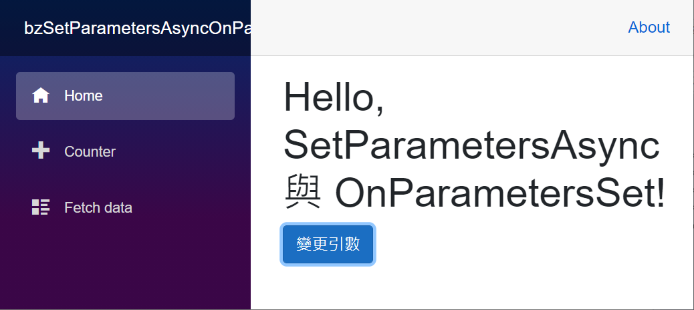

# Blazor 開發經驗分享 - 了解 Blazor 參數傳入過程


在進行 [Blazor](https://docs.microsoft.com/zh-tw/aspnet/core/blazor/?view=aspnetcore-5.0&WT.mc_id=DT-MVP-5002220) 專案開發的時候，會設計出許多的 Razor Component 元件 ( 也可以稱為 Blazor 元件)，並且將這些元件組合起來，便可以設計出相當優秀的 Web 頁面專案。

這些 [Razor 元件] 可以設計具有參數傳遞機制，讓使用這個元件 Parent 元件，可以透過傳遞或者變更參數的方式，將不同物件值傳遞到子元件內。

這裡說明的範例專案原始碼位於 [bzSetParametersAsyncOnParametersSet](https://github.com/vulcanlee/CSharp2021/bzSetParametersAsyncOnParametersSet)

## 建立 Blazor Server-Side 的專案

* 打開 Visual Studio 2019
* 點選右下方的 [建立新的專案] 按鈕
* [建立新專案] 對話窗將會顯示在螢幕上
* 從[建立新專案] 對話窗的中間區域，找到 [Blazor 應用程式] 這個專案樣板選項，並且選擇這個項目
* 點選右下角的 [下一步] 按鈕
* 現在 [設定新的專案] 對話窗將會出現
* 請在這個對話窗內，輸入適當的 [專案名稱] 、 [位置] 、 [解決方案名稱]

  在這裡請輸入 [專案名稱] 為 `bzSetParametersAsyncOnParametersSet`

* 完成後，請點選 [建立] 按鈕
* 當出現 [建立新的 Blazor 應用程式] 對話窗的時候
* 請選擇最新版本的 .NET Core 與 [Blazor 伺服器應用程式]
* 完成後，請點選 [建立] 按鈕

  稍微等會一段時間，Blazor 專案將會建立起來

## 建立 Razor 元件

* 滑鼠右擊 Blazor 專案內的 [Pages] 資料夾
* 選擇 [加入] > [Razor 元件]
* 當 [新增項目 - bzSetParametersAsyncOnParametersSet] 對話窗出現之後，請在下方名稱欄位內，輸入 `ChildComponent`
* 最後點選 [新增] 按鈕
* 請依據底下程式碼替換到這個檔案內容

```html
@code {
    [Parameter]
    public int IntParameter { get; set; }
    [Parameter]
    public string StringParameter { get; set; }
    [Parameter]
    public DateTime DateTimeParameter { get; set; }

    public override Task SetParametersAsync(ParameterView parameters)
    {
        ShowCurrentParameter();
        foreach (var param in parameters)
        {
            Console.WriteLine($"    SetParametersAsync : {param.Name}, Value: {param.Value.ToString()}");
        }
        return base.SetParametersAsync(parameters);
    }

    protected override void OnParametersSet()
    {
        base.OnParametersSet();
    }

    void ShowCurrentParameter()
    {
        Console.WriteLine($"Current IntParameter : {IntParameter}");
        Console.WriteLine($"Current StringParameter : {StringParameter}");
        Console.WriteLine($"Current DateTimeParameter : {DateTimeParameter}");
    }
}
```

這個子元件內使用 `[Parameter]` C# Attribute 來宣告了三個屬性，而且綁定了 SetParametersAsync & OnParametersSet 兩個元件生命週期事件，用來觀察何時觸發這些事件，並且了解到這些參數的變化情況。

在這個 SetParametersAsync 方法內，將會有 `ParameterView parameters` 參數，因此，可以透過 parameters 參數物件來讀取到要傳入的參數數值是多少？

## 使用這個元件

* 打開 [Pages] 資料夾內的 [Index.razor] 檔案
* 請使用底下程式碼替換到這個檔案內容

```html
@page "/"

<h1>Hello, SetParametersAsync 與 OnParametersSet!</h1>

<ChildComponent IntParameter="@IntArgument"
                StringParameter="@StringArgument"
                DateTimeParameter="@DateTimeArgument" />
<div>
    <button class="btn btn-primary" @onclick="BtnChangeArgument">變更引數</button>
</div>

@code{
    public int IntArgument { get; set; } = 99;
    public string StringArgument { get; set; } = "Initialization";
    public DateTime DateTimeArgument { get; set; } = DateTime.Now;

    void BtnChangeArgument()
    {
        Console.WriteLine();
        Console.WriteLine($"變更傳入引數");
        IntArgument = 168;
        StringArgument = "Change String Value";
        DateTimeArgument = DateTimeArgument.AddDays(1);
    }
}
```

在這個使用 [ChildComponent] 元件的首頁元件內，使用了 `<ChildComponent IntParameter="@IntArgument" StringParameter="@StringArgument" DateTimeParameter="@DateTimeArgument" />` 標記宣告的方式來使用這個元件，這裡將會傳遞三個引數到這個元件內。

另外，宣告了一個按鈕與綁定 OnClick() 按鈕事件，一旦按下這個按鈕之後，將會變更這些引數物件值，現在來觀察看看執行結果。

## 執行這個專案

* 使用 [Kestrel](https://docs.microsoft.com/zh-tw/aspnet/core/fundamentals/servers/kestrel?view=aspnetcore-5.0&WT.mc_id=DT-MVP-5002220) 的方式來執行這個專案
* 按下 [F5] 按鍵，開始執行這個 Blazor 專案
* 一旦啟動完成，就會自動開以瀏覽器

  

* 此時，從 [命令提示字元視窗] 內將會看到底下的內容輸出

```
Current IntParameter : 0
Current StringParameter :
Current DateTimeParameter : 0001/1/1 上午 12:00:00
    SetParametersAsync : IntParameter, Value: 99
    SetParametersAsync : StringParameter, Value: Initialization
    SetParametersAsync : DateTimeParameter, Value: 2021/6/24 下午 XX:10:59
Current IntParameter : 0
Current StringParameter :
Current DateTimeParameter : 0001/1/1 上午 12:00:00
    SetParametersAsync : IntParameter, Value: 99
    SetParametersAsync : StringParameter, Value: Initialization
    SetParametersAsync : DateTimeParameter, Value: 2021/6/24 下午 XX:11:00
```

前面六筆紀錄為 Blazor 預先轉譯過程中所產生的輸出紀錄，而最後面六筆紀錄則為實際要轉譯內容輸出到網頁上的輸出紀錄；從這裡可以看到，在呼叫 [SetParametersAsync] 的時候，實際上當時在子元件內的參數變數尚未發生變化，而最新狀態值的參數值將會在這個 [SetParametersAsync] 方法內的參數 `ParameterView parameters` 內。

當按下 [變更引數] 按鈕之後，將會看到底下的輸出紀錄

```
變更傳入引數
Current IntParameter : 99
Current StringParameter : Initialization
Current DateTimeParameter : 2021/6/24 下午 02:11:00
    SetParametersAsync : IntParameter, Value: 168
    SetParametersAsync : StringParameter, Value: Initialization
    SetParametersAsync : DateTimeParameter, Value: 2021/6/24 下午 XX:11:00
```


