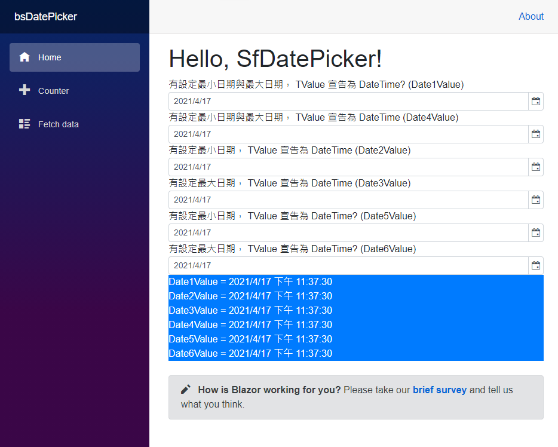
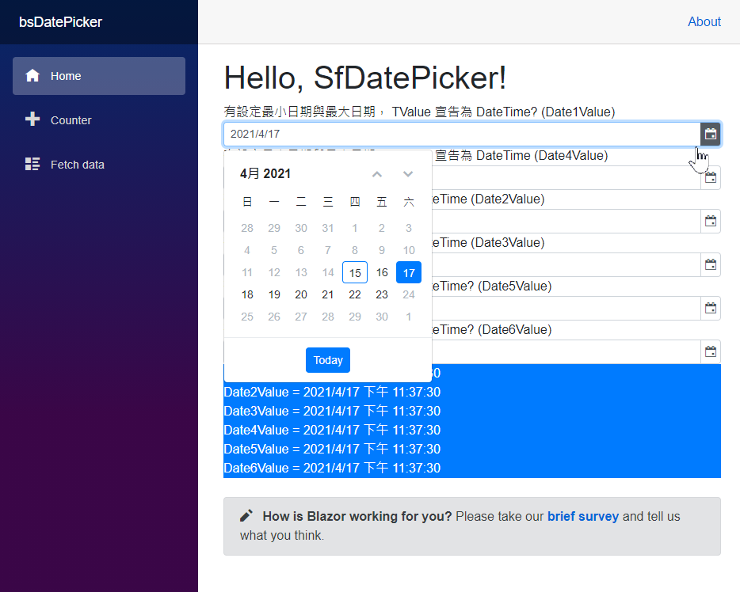
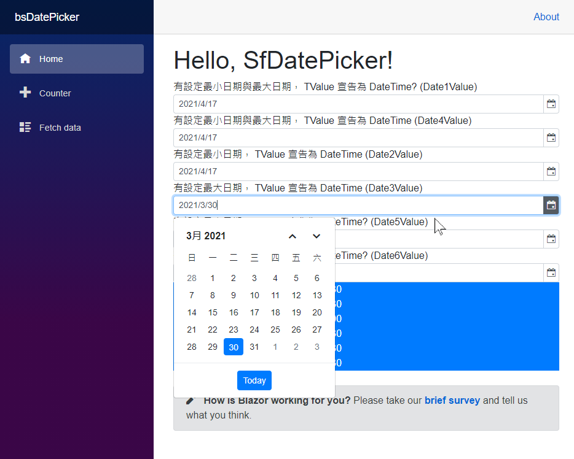

# Blazor 專案使用 SfDatePicker 選取日期

使用 Syncfusion 元件來進行 Blazor 專案開發，可以立即使用 Syncfusion 所帶來的各種豐富的 UI 元件，加入 Blazor 專案的開發，在這篇文章所要探討的就是關於 SfDatePicker 這個元件所提供的功能，該元件可以提供使用者選取一個日期到 Blazor 專案內。

這個說明專案的原始碼位於 [bsDatePicker](https://github.com/vulcanlee/CSharp2021/tree/master/bsDatePicker)

## 建立 Blazor Server-Side 的專案

* 打開 Visual Studio 2019
* 點選右下方的 [建立新的專案] 按鈕
* [建立新專案] 對話窗將會顯示在螢幕上
* 從[建立新專案] 對話窗的中間區域，找到 [Blazor 應用程式] 這個專案樣板選項，並且選擇這個項目
* 點選右下角的 [下一步] 按鈕
* 現在 [設定新的專案] 對話窗將會出現
* 請在這個對話窗內，輸入適當的 [專案名稱] 、 [位置] 、 [解決方案名稱]

  在這裡請輸入 [專案名稱] 為 `bzSyncfusion`

* 完成後，請點選 [建立] 按鈕
* 當出現 [建立新的 Blazor 應用程式] 對話窗的時候
* 請選擇最新版本的 .NET Core 與 [Blazor 伺服器應用程式]
* 完成後，請點選 [建立] 按鈕

稍微等會一段時間，Blazor 專案將會建立起來

## 進行 Syncfusion 元件的安裝

* 滑鼠右擊 Blazor 專案的 [相依性] 節點
* 選擇 [管理 NuGet 套件]
* 切換到 [瀏覽] 標籤頁次
* 搜尋 `Syncfusion.Blazor.Calendars` 這個元件名稱
* 選擇搜尋到的 [Syncfusion.Blazor.Calendars] 元件，並且安裝起來

## 進行 Syncfusion 元件的設定

* 打開專案根目錄下的 [Startup.cs] 這個檔案
* 找到 [ConfigureServices] 這個方法
* 在這個方法的最後面，加入底下程式碼，已完成 Blazor 元件會用到的服務註冊

```csharp
#region Syncfusion 元件的服務註冊
services.AddSyncfusionBlazor();
#endregion
```

* 在同一個檔案內，找到 [Configure] 這個方法
* 在這個方法的最前面，加入底下程式碼，宣告合法授權的金鑰 (License Key)

```csharp
#region 宣告所使用 Syncfusion for Blazor 元件的使用授權碼
Syncfusion.Licensing.SyncfusionLicenseProvider.RegisterLicense("YOUR LICENSE KEY");
#endregion
```

* 打開 [Pages] 資料夾內的 [_Host.cshtml] 檔案
* 在 `<head>` 標籤內，加入需要的 CSS 宣告，如底下內容
 
  >若沒有加入底下的宣告，將無法正常看到 Syncfusion 的元件樣貌

```XML
<link href="_content/Syncfusion.Blazor/styles/bootstrap4.css" rel="stylesheet" />
```

## 使用 SfCalendar 元件

* 在專案的 [Pages] 資料夾
* 打開 [Index.razor] 檔案
* 使用底下程式碼替換到 [Index.razor] 檔案內容

```XML
@page "/"
@using Syncfusion.Blazor.Calendars

<h1>Hello, SfDatePicker!</h1>

<div>
    <div>有設定最小日期與最大日期， TValue 宣告為 DateTime? (Date1Value)</div>
    <SfDatePicker TValue="DateTime?" Min='@MinDate' Max='@MaxDate' @bind-Value='@Date1Value'></SfDatePicker>
</div>
<div>
    <div>有設定最小日期與最大日期， TValue 宣告為 DateTime (Date4Value)</div>
    <SfDatePicker TValue="DateTime" Min='@MinDate' Max='@MaxDate' StrictMode=false  @bind-Value='@Date4Value'></SfDatePicker>
</div>
<div>
    <div>有設定最小日期， TValue 宣告為 DateTime (Date2Value)</div>
    <SfDatePicker TValue="DateTime" Min='@MinDate' @bind-Value='@Date2Value'></SfDatePicker>
</div>
<div>
    <div>有設定最大日期， TValue 宣告為 DateTime (Date3Value)</div>
    <SfDatePicker TValue="DateTime" Max='@MaxDate' @bind-Value='@Date3Value'></SfDatePicker>
</div>
<div>
    <div>有設定最小日期， TValue 宣告為 DateTime? (Date5Value)</div>
    <SfDatePicker TValue="DateTime?" Min='@MinDate' @bind-Value='@Date5Value'></SfDatePicker>
</div>
<div>
    <div>有設定最大日期， TValue 宣告為 DateTime? (Date6Value)</div>
    <SfDatePicker TValue="DateTime?" Max='@MaxDate' @bind-Value='@Date6Value'></SfDatePicker>
</div>

<div class="bg-primary">
    <div class="text-white">Date1Value = @Date1Value</div>
    <div class="text-white">Date2Value = @Date2Value</div>
    <div class="text-white">Date3Value = @Date3Value</div>
    <div class="text-white">Date4Value = @Date4Value</div>
    <div class="text-white">Date5Value = @Date5Value</div>
    <div class="text-white">Date6Value = @Date6Value</div>
</div>
<SurveyPrompt Title="How is Blazor working for you?" />

@code {
    public DateTime MinDate { get; set; }
    public DateTime MaxDate { get; set; }
    public DateTime? Date1Value { get; set; }
    public DateTime? Date5Value { get; set; }
    public DateTime? Date6Value { get; set; }
    public DateTime Date2Value { get; set; }
    public DateTime Date3Value { get; set; }
    public DateTime Date4Value { get; set; }

    protected override void OnInitialized()
    {
        MinDate = DateTime.Now;
        MaxDate = DateTime.Now.AddDays(8);
        Date1Value = DateTime.Now.AddDays(2);
        Date2Value = DateTime.Now.AddDays(2);
        Date3Value = DateTime.Now.AddDays(2);
        Date4Value = DateTime.Now.AddDays(2);
        Date5Value = DateTime.Now.AddDays(2);
        Date6Value = DateTime.Now.AddDays(2);
    }
}
```
## 執行結果

從這裡看到使用 Syncfusion 元件相當的容易，只需要加入該元件所使用的命名空間在 Razor 元元件前面，接著就加入該元件的HTML標籤，例如在這裡使用的是 `<SfDatePicker TValue="DateTime?" Min='@MinDate' Max='@MaxDate' @bind-Value='@Date1Value'></SfDatePicker>`

現在可以直接執行這支程式，就會看到如下圖的執行結果。



首先看到這六個日期都會綁定到相對應的 ui 控制項，不論在 .NET 中的物件型別為 DateTime 或者 DateTime? ，只要宣告相對應的 TValue="DateTime" 或者 TValue="DateTime?"，便可以正常運作。



當點選開 UI 控制項圖示，便會跳出萬年曆的選單，在上面的範例中，因為有設定最小與最大日期，因此，使用者儘可以在萬年曆畫面中，點選在允許範圍內的日期。



當點選開 UI 控制項圖示，便會跳出萬年曆的選單，在上面的範例中，因為僅有設定最大日期，因此，使用者儘可以在萬年曆畫面中，儘可以點選在最大日期前的允許日期。
