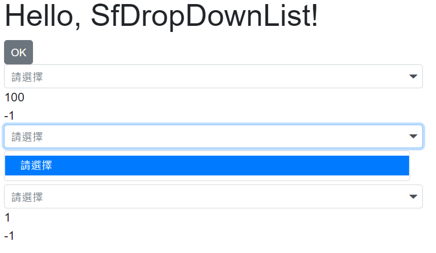

# Blazor SfDropDownList 聯動式下拉選單的設計

當我在進行 Xamarin.Forms App 專案開發教學的時候，這個需求是學員一定需要做的練習，畢竟，這樣的應用需求是個相當普遍的；在這篇文章中，將會說明如何在 Blazor 專案內，使用 Syncfusion 所提供的 SfDropDownList 元件，做出這樣的設計。

不過，在這篇文章中也會探討一些意外情況，也就是說，當使用其他方式來進行這樣需求的程式設計時候，會有意想不到的效果，也就是下拉選單的清單項目，無法正常顯示在螢幕上。

首先，先來看看這樣的需求，該如何來設計。

這篇文章的原始碼位於 [bzDropDownListCorrelation](https://github.com/vulcanlee/CSharp2021/tree/main/bzDropDownListCorrelation)

## 需求說明


在這個範例專案中，需要設計三個下拉選單，如上圖所示。

第一個下拉選單(在此稱為我的下拉選單)在程式啟動之後，將會有預設清單項目可以來選擇，而第二個(在此稱為你的下拉選單)下拉選單與第三個(在此稱為他的下拉選單)下拉選單則預設沒有任何項目可以選擇，必須要等到我的下拉選單選擇一個新的選單項目之後，底下的兩個下拉選單將會清空，並且會依據我的下拉選單所選擇的內容，建立其可以選擇的清單項目。



例如，在下圖中，在我的下拉選單中，選擇了 [我的選擇清單項目 8]，一旦我的下拉選單項目有變動，此時，將會依據剛剛選擇的 [我的選擇清單項目 8] 項目，建立起你的下拉選單與他的下拉選單可以使用的選擇清單項目，這個時候，將會看到如同下圖的樣貌。


另外，在每個下拉選單控制項的下方，將會有兩個數值，分別代表這個下拉選單控制項目的資料來源 DataSource 這個屬性所綁定的物件內，已經有多少的項目存在，另外一個數值則表示這個下拉選單所選擇項目 Id 值為多少。

每個下拉選單項目的 Id 值將會從 1 開始編碼，而當每個下拉選單建立之後，將會產生一個項目，名稱為 [請選擇]，而 Id 值為 -1，並且設定這個清單項目為預設的選擇項目。

## Problem.razor 下拉選單元件設計程式碼

在這個範例中，所有的測試功能，都設計在 [Problem.razor] Razor 元件內，並且在 [Index.razor] 首頁元件內，加入這個 [Problem.razor] 元件。

對於 [Index.razor] 元件，其原始碼如下

```html
@page "/"

<h1>Hello, SfDropDownList!</h1>

<Problem/>

<SurveyPrompt Title="How is Blazor working for you?" />
```

而 [Problem.razor] Razor 元件的程式碼如下

```html
@using Syncfusion.Blazor.DropDowns
@using Syncfusion.Blazor.Buttons
@using bzDropDownListCorrelation.Data
@inject ProblemViewModel RazorModel

<SfButton @onclick="Click">OK</SfButton>
<div>
    <SfDropDownList TValue="int" TItem="MyClass" Placeholder="我的條件"
                    Enabled="@RazorModel.ReadyGo"
                    DataSource="@RazorModel.MyClassList" @bind-Value="@RazorModel.QueryCondition.MyId">
        <DropDownListEvents TValue="int" TItem="MyClass"
                            ValueChange="RazorModel.MasterListChanged" />
        <DropDownListFieldSettings Text="Name" Value="Id" />
    </SfDropDownList>
</div>
<div>
    @RazorModel.MyClassList.Count()
</div>
<div>
    @RazorModel.QueryCondition.MyId
</div>

<div>
    <SfDropDownList TValue="int" TItem="YouClass" Placeholder="你的條件"
                    Enabled="@RazorModel.ReadyGo"
                    DataSource="@RazorModel.YourClassList" @bind-Value="@RazorModel.QueryCondition.YourId">
        <DropDownListEvents TValue="int" TItem="YouClass" />
        <DropDownListFieldSettings Text="Name" Value="Id" />
    </SfDropDownList>
</div>
<div>
    @RazorModel.YourClassList.Count()
</div>
<div>
    @RazorModel.QueryCondition.YourId
</div>

<div>
    <SfDropDownList TValue="int" TItem="YouClass" Placeholder="他的條件"
                    Enabled="@RazorModel.ReadyGo"
                    DataSource="@RazorModel.HisClassList" @bind-Value="@RazorModel.QueryCondition.HisId">
        <DropDownListEvents TValue="int" TItem="YouClass" />
        <DropDownListFieldSettings Text="Name" Value="Id" />
    </SfDropDownList>
</div>
<div>
    @RazorModel.HisClassList.Count()
</div>
<div>
    @RazorModel.QueryCondition.HisId
</div>


@code {

    protected async override Task OnInitializedAsync()
    {
        await RazorModel.ProblemViewModelInit();
    }
    protected override async Task OnAfterRenderAsync(bool firstRender)
    {
        if (firstRender == true)
        {
            #region 若把下拉選單的初始化呼叫動作放在這裡，需要額外呼叫，否則會無法生效
            //await RazorModel.ProblemViewModelInit();
            //StateHasChanged();
            #endregion
        }
    }
    void Click() { }
}
```

在這個 [Problem.razor] Razor 元件內，最上方有三行 Using ，這裡是在宣告這裡類別將會使用到的命名空間(注意，每個 Razor 元件，在建置期間，都會由編譯器產生成為一個類別，該類別的名稱，就是該元件的名稱)。

而對於 `@inject ProblemViewModel RazorModel` 則是宣告在這個元件內，將會由相依性注入容器注入一個 [ProblemViewModel] 類別執行個體，也就是說，這裡採用的類似於 MVVM 的設計方式，將畫面內容與商業邏輯分隔開來，所有在畫面上要看到的內容、大小、顏色、位置等等，都會在 Razor 元件內 (也就是通稱的 View) 使用 HTML + CSS 來設計，而對於該頁面的商業邏輯程式碼，將會移到 ViewModel 內來使用 C# 程式碼來進行設計；與傳統的 MVVM 最大的差異，那就是在這裡對於 View 與 ViewModel 之間的互動，不是透過 NotifyPropertyChanged 這樣的機制來運行，而是透過了 Blazor 內建的 MVU 機制來做到。

對於 [ProblemViewModel] 這個類別，將會於 [Startup] 類別內的 [ConfigureServices] 方法內，使用 `services.AddTransient<ProblemViewModel>();` 敘述進行註冊到相依性容器內，這樣當要注入到任何類別或者元件內的時候，就會使用暫時生命週期的方式，注入到指定的類別內。

至於 [ProblemViewModel] 類別內容，等下會繼續說明

[Problem.razor] Razor 元件首先宣告一個 OK 按鈕，而對於其綁定的 [@onclick] 事件方法 `void Click() { }`，似乎沒有做任何事情，那麼，為什麼需要在這裡放上一個這樣的按鈕呢？

對於這樣一個空白按鈕事件的設計，是為了要讓 Blazor 元件，可以觸發自動更新頁面的效果，怎麼說呢？在 Blazor 元件內，若想要手動觸發更新元件的效果時候，可以執行 [StateHasChanged()] 這個方法；而對於任何標籤 Element / Tag 有綁到 [@onclick] 這個事件的方法，只要觸發並且執行完成該事件的委派方法，則會自動地進行該元件更新的行為，就如同手動執行 [StateHasChanged()] 方法所得到相同效果。

因此，這樣的設計將會在等下會用到

接著，這裡宣告了三個 SfDropDownList ，分別代表 我的、你的、他的下拉選單控制項，每個控制項都透過了 [DataSource] 這個參數，指定該下拉選單的清單項目資料來源，而當使用者點選了該下拉選單，並且做出選擇之後，該遠則清單項目的 Id 值，將會儲存在 [RazorModel.QueryCondition] 類別內的某個屬性內。

使用 [我的下拉選單] 這個控制項來做說明，這個下拉選單的清單項目資料來源將會從 ViewModel , 也就是這個 ProblemViewModel 類別產生的執行個體, 物件內 [MyClassList] 這個集合清單屬性來獲取而得；當然，這個下拉選單內的清單項目想要顯示甚麼內容，就僅需要針對 [MyClassList] 這個集合性質物件來進行調整即可，對於綁定到的下拉選單控制項而言，就會顯示出相對應的最新清單項目內容。

在每個下拉選單控制項的下方，分別有這樣的宣告

```html
<div>
    @RazorModel.MyClassList.Count()
</div>
<div>
    @RazorModel.QueryCondition.MyId
</div>
```

這也是為了除錯方便，可以從畫面上看到現在這個下拉選單內的 [DataSource] 所指定的集合物件究竟有多少物件存在、當使用者點選該下拉選單的時候，就必須一定要能夠看到這些數量的清單項目在螢幕上，否則，就是所設計的元件出了問題；而第二個則是顯示使用者當時點選的項目是哪一個，將會在這裡即時顯示出來。

在這個元件的最後面，將會使用到兩個元件生命週期的事件，分別是： [Task OnInitializedAsync()] 與 [Task OnAfterRenderAsync(bool firstRender)]，在 [@code] 區段內的 C# 程式碼可以看的出來，對於 [ViewModel] 物件(也就是 [ProblemViewModel] 這個類別所注入的物件) 要進行相關資料初始化的時候，可以分別選擇這兩個事件來進行呼叫 [await RazorModel.ProblemViewModelInit()] 這個非同步方法，不過，在這裡會先使用 [Task OnInitializedAsync()] 這個生命週期事件來做為觸發與產生預設資料；當你使用的都是同步程式碼的時候(不含使用非同步的程式碼，但是使用封鎖式的等待作法)，原則上不會遇到太多詭異的問題，但是若使用到非同步程式呼叫的的時候，許多詭異的現象就會發生了。

## ProblemViewModel 的 ViewModel 程式碼

```csharp
using bzDropDownListCorrelation.Data;
using System.Collections.Generic;
using System.Threading.Tasks;

namespace bzDropDownListCorrelation
{
    public class ProblemViewModel
    {
        public ProblemViewModel(MyClassService myClassService,
            YourClassService youClassService)
        {
            MyClassService = myClassService;
            YourClassService = youClassService;
        }
        public List<MyClass> MyClassList { get; set; } = new List<MyClass>();
        public List<YouClass> YourClassList { get; set; } = new List<YouClass>();
        public List<YouClass> HisClassList { get; set; } = new List<YouClass>();
        public QueryCondition QueryCondition { get; set; } = new QueryCondition();
        public MyClassService MyClassService { get; }
        public YourClassService YourClassService { get; }
        public bool ReadyGo { get; set; } = false;

        public async Task ProblemViewModelInit()
        {
            var myLists = await MyClassService.Get();

            #region 使用 AddRange + await 會造成資料無法讀取進來
            //MyClassList.Clear();
            //MyClassList.Insert(0, new MyClass { Name = "請選擇", Id = -1 });
            //QueryCondition.MyId = -1;
            //MyClassList.AddRange(await MyClassService.Get());
            #endregion

            MyClassList.Clear();
            MyClassList = myLists;
            MyClassList.Insert(0, new MyClass { Name = "請選擇", Id = -1 });
            QueryCondition.MyId = -1;

            YourClassList.Clear();
            YourClassList.Insert(0, new YouClass { Name = "請選擇", Id = -1 });
            QueryCondition.YourId = -1;

            HisClassList.Clear();
            HisClassList.Insert(0, new YouClass { Name = "請選擇", Id = -1 });
            QueryCondition.HisId = -1;

            ReadyGo = true;
        }

        public async Task MasterListChanged(Syncfusion.Blazor.DropDowns.ChangeEventArgs<int, MyClass> args)
        {
            if (QueryCondition.MyId <= 0) return;

            var yourList = await YourClassService.Get("你的選擇清單項目", QueryCondition.MyId);
            var hisList = await YourClassService.Get("他的選擇清單項目", QueryCondition.MyId);

            #region 使用這個方式，會造成無法連動顯示
            //YourClassList.Clear();
            //YourClassList.Insert(0, new YouClass { Name = "請選擇", Id = -1 });
            //QueryCondition.YourId = -1;
            //YourClassList.AddRange(yourList);
            //YourClassList = yourList;
            #endregion

            YourClassList.Clear();
            YourClassList = yourList;
            YourClassList.Insert(0, new YouClass { Name = "請選擇", Id = -1 });
            QueryCondition.YourId = -1;


            HisClassList.Clear();
            HisClassList = hisList;
            HisClassList.Insert(0, new YouClass { Name = "請選擇", Id = -1 });
            QueryCondition.HisId = -1;
        }
    }
    public class QueryCondition
    {
        public int MyId { get; set; }
        public int YourId { get; set; }
        public int HisId { get; set; }
    }
}
```

## 執行結果

請按下 F5 開始執行這個專案，將會看到底下的執行結果

```
寫入檔案的路徑 D:\Vulcan\GitHub\CSharp2021\csObjectToFile\csObjectToFile\bin\Debug\net5.0\Data\myClass
```
