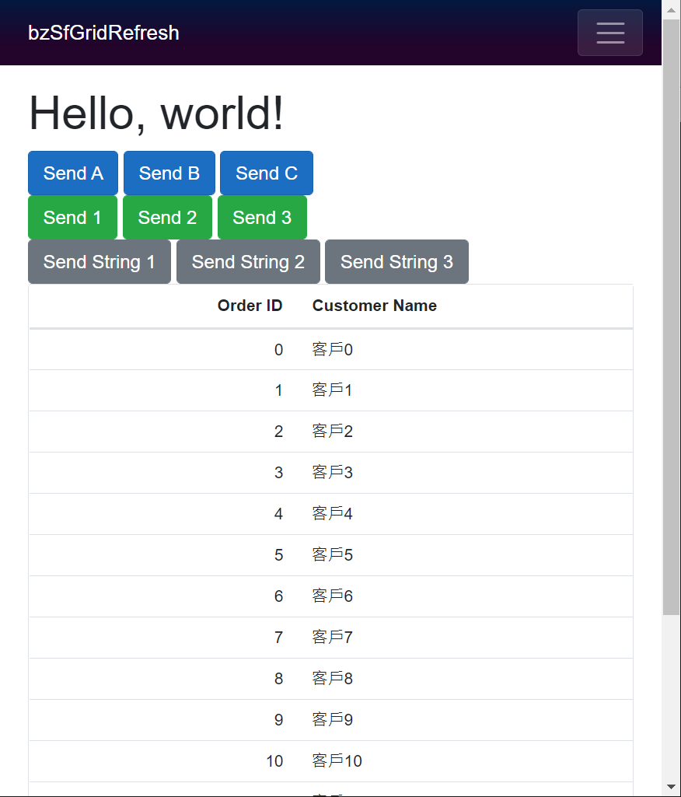
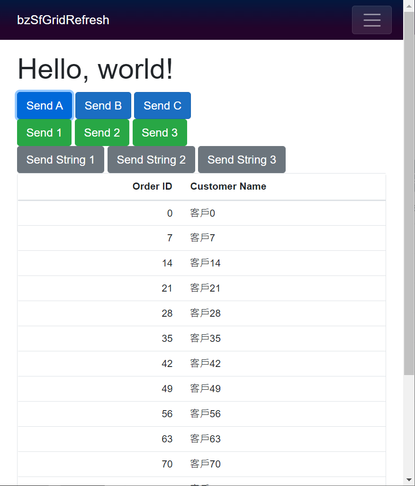
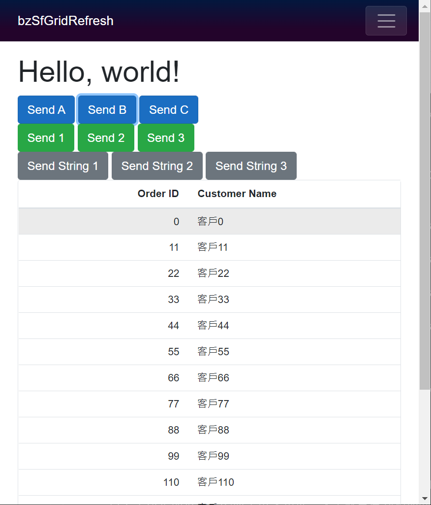
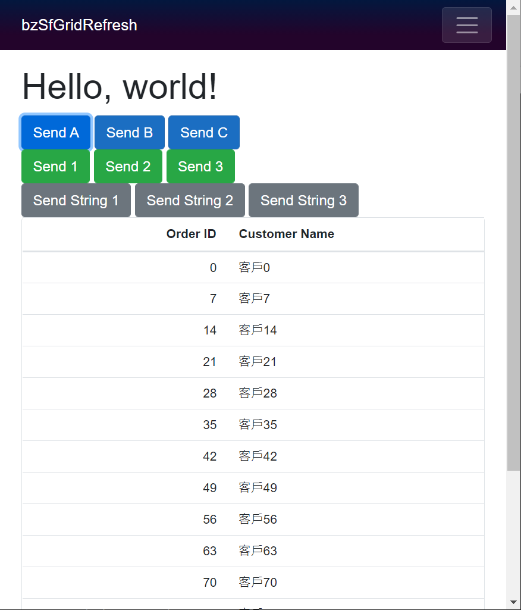

# Blazor SfGrid SfDataManager 的參數 Parameter 傳遞的異常設計分析 2

現在終於可以來嘗試解決使用 Syncfusion SfGrid 元件可以使用 SfDataManager 來指定客製化轉接器，取得 Grid 元件所要顯示的紀錄，卻會有問題的情況。

這篇文章接續 [Blazor SfGrid SfDataManager 的參數 Parameter 傳遞的異常設計分析 1](https://csharpkh.blogspot.com/2021/06/Blazor-Syncfusion-SfGrid-SfDataManager-Parameter-Asynchronous.html)

這個說明專案的原始碼位於 [bzSfGridRefresh](https://github.com/vulcanlee/CSharp2021/tree/master/bzSfGridRefresh)

## 使用各種方式，讓 Refresh 方法，取得最新的參數變更內容

打開 [Pages] 資料夾內的 Index.razor 檔案

確定該 Blazor 元件如底下內容

```html
@page "/"

<h1>Hello, world!</h1>

@*<Index1View />*@
<Index2View />
@*<Index3View />*@

<SurveyPrompt Title="How is Blazor working for you?" />
```

在這裡將會使用自行設計的一個 Blazor 元件，這個 Index2View.razor 元件的程式碼如下

```html
@using Syncfusion.Blazor.Grids;
@using Syncfusion.Blazor.Data;
@using Syncfusion.Blazor;

<div>
    <button class="btn btn-primary" @onclick="()=>OnSingleObjectClick(1)">Send A</button>
    <button class="btn btn-primary" @onclick="()=>OnSingleObjectClick(2)">Send B</button>
    <button class="btn btn-primary" @onclick="()=>OnSingleObjectClick(3)">Send C</button>
</div>
<div>
    <button class="btn btn-success" @onclick="()=>OnClassClick(1)">Send 1</button>
    <button class="btn btn-success" @onclick="()=>OnClassClick(2)">Send 2</button>
    <button class="btn btn-success" @onclick="()=>OnClassClick(2)">Send 3</button>
</div>
<div>
    <button class="btn btn-secondary" @onclick="()=>OnClassClick(3)">Send String 1</button>
    <button class="btn btn-secondary" @onclick="()=>OnClassStringClick(1)">Send String 2</button>
    <button class="btn btn-secondary" @onclick="()=>OnClassStringClick(2)">Send String 3</button>
</div>

<SfGrid @ref="Grid" TValue="Order" AllowPaging="true">
    <SfDataManager Adaptor="Adaptors.CustomAdaptor">
        <CustomAdaptorComponent CurrentTypeCondition="@CurrentTypeCondition"
                                FilterClass="@FilterObject" />
    </SfDataManager>
    <GridPageSettings PageSize="12" />
    <GridColumns>
        <GridColumn Field=@nameof(Order.OrderID) HeaderText="Order ID" IsIdentity="true" IsPrimaryKey="true" TextAlign="TextAlign.Right" Width="120">
        </GridColumn>
        <GridColumn Field=@nameof(Order.CustomerID) HeaderText="Customer Name" Width="150"></GridColumn>
    </GridColumns>
</SfGrid>

@code{
    SfGrid<Order> Grid { get; set; }
    public static List<Order> Orders { get; set; }
    public string CurrentTypeCondition { get; set; }
    public FilterClass FilterObject { get; set; } = new FilterClass();

    async Task OnSingleObjectClick(int i)
    {
        Console.WriteLine();
        Console.WriteLine();
        OutputHelper.Output("CurrentTypeCondition 準備要變更了");

        #region 使用同步方式來進行變更 CurrentTypeCondition
        if (i == 1)
        {
            CurrentTypeCondition = "A";
        }
        else if (i == 2)
        {
            CurrentTypeCondition = "B";
        }
        else if (i == 3)
        {
            CurrentTypeCondition = "C";
        }
        OutputHelper.Output("CurrentTypeCondition 已經變更了");
        #endregion

        #region 狀況 1 : 沒做任何事情
        OutputHelper.Output("沒做任何事情");
        #endregion

        #region 狀況 2 : 使用 Task.Yield()
        //OutputHelper.Output("Raise Task.Yield");
        //await Task.Yield();
        #endregion

        #region 狀況 3 : 使用 Task.Delay(100)
        //OutputHelper.Output("Raise Task.Delay");
        //await Task.Delay(100);
        #endregion

        #region 狀況 4 : 使用 StateHasChanged
        OutputHelper.Output("Raise StateHasChanged");
        //StateHasChanged();
        #endregion

        OutputHelper.Output("Raise Grid.Refresh");
        Grid.Refresh();
    }

    async Task OnClassClick(int i)
    {
        Console.WriteLine();
        Console.WriteLine();
        OutputHelper.Output("FilterObject.Id 準備要變更了");

        #region 使用同步方式來進行變更 FilterObject.Id
        FilterObject.Id = i;
        OutputHelper.Output("FilterObject.Id 已經變更了");
        #endregion

        #region 狀況 1 : 沒做任何事情
        OutputHelper.Output("沒做任何事情");
        #endregion

        #region 狀況 2 : 使用 Task.Yield()
        //OutputHelper.Output("Raise Task.Yield");
        //await Task.Yield();
        #endregion

        #region 狀況 3 : 使用 Task.Delay(100)
        //OutputHelper.Output("Raise Task.Delay");
        //await Task.Delay(100);
        #endregion

        #region 狀況 4 : 使用 StateHasChanged
        //OutputHelper.Output("Raise StateHasChanged");
        //StateHasChanged();
        #endregion

        OutputHelper.Output("Raise Grid.Refresh");
        Grid.Refresh();
    }

    async Task OnClassStringClick(int i)
    {
        Console.WriteLine();
        Console.WriteLine();
        OutputHelper.Output("FilterObject.Title 準備要變更了");

        #region 使用同步方式來進行變更 FilterObject.Title
        FilterObject.Title = i.ToString();
        OutputHelper.Output("FilterObject.Title 已經變更了");
        #endregion


        #region 狀況 1 : 沒做任何事情
        OutputHelper.Output("沒做任何事情");
        #endregion

        #region 狀況 2 : 使用 Task.Yield()
        //OutputHelper.Output("Raise Task.Yield");
        //await Task.Yield();
        #endregion

        #region 狀況 3 : 使用 Task.Delay(100)
        //OutputHelper.Output("Raise Task.Delay");
        //await Task.Delay(100);
        #endregion

        #region 狀況 4 : 使用 StateHasChanged
        //OutputHelper.Output("Raise StateHasChanged");
        //StateHasChanged();
        #endregion

        OutputHelper.Output("Raise Grid.Refresh");
        Grid.Refresh();
    }
}
```

在這個元件內，將會透過 CustomAdaptorComponent 這個轉接器元件來取得集合物件紀錄，其中這個元件 CustomAdaptorComponent 程式碼如下：

```html
@using Syncfusion.Blazor;
@using Syncfusion.Blazor.Data;

@inherits DataAdaptor<Order>

<CascadingValue Value="@this">
    @ChildContent
</CascadingValue>

@code {
    [Parameter]
    public RenderFragment ChildContent { get; set; }

    [Parameter]
    public FilterClass FilterClass { get; set; }

    private string myVar;

    [Parameter]
    public string CurrentTypeCondition
    {
        get { return myVar; }
        set
        {
            myVar = value;
            OutputHelper.Output($"CustomAdaptorComponent CurrentTypeCondition has changed {myVar}");
        }
    }

    public override async Task<object> ReadAsync(DataManagerRequest dataManagerRequest, string key = null)
    {

        #region 發出查詢要求
        List<Order> orders = new List<Order>();
        List<Order> resut = new List<Order>();
        for (int i = 0; i < 3000; i++)
        {
            orders.Add(new Order() { OrderID = i, CustomerID = $"客戶{i}" });
        }

        #region 使用 CurrentTypeCondition
        if (CurrentTypeCondition == "A")
        {
            resut = orders.Where(x => x.OrderID % 7 == 0).ToList();
        }
        else if (CurrentTypeCondition == "B")
        {
            resut = orders.Where(x => x.OrderID % 11 == 0).ToList();
        }
        else if (CurrentTypeCondition == "C")
        {
            resut = orders.Where(x => x.OrderID % 29 == 0).ToList();
        }
        else
        {
            resut = orders;
        }
        #endregion

        #region 使用 FilterClass.Id
        //if (FilterClass.Id == 1)
        //{
        //    resut = orders.Where(x => x.OrderID % 7 == 0).ToList();
        //}
        //else if (FilterClass.Id == 2)
        //{
        //    resut = orders.Where(x => x.OrderID % 11 == 0).ToList();
        //}
        //else if (FilterClass.Id == 3)
        //{
        //    resut = orders.Where(x => x.OrderID % 29 == 0).ToList();
        //}
        //else
        //{
        //    resut = orders;
        //}
        #endregion

        #region 使用 FilterClass.Title
        //if (FilterClass.Title == "1")
        //{
        //    resut = orders.Where(x => x.OrderID % 7 == 0).ToList();
        //}
        //else if (FilterClass.Title == "2")
        //{
        //    resut = orders.Where(x => x.OrderID % 11 == 0).ToList();
        //}
        //else if (FilterClass.Title == "3")
        //{
        //    resut = orders.Where(x => x.OrderID % 29 == 0).ToList();
        //}
        //else
        //{
        //    resut = orders;
        //}
        #endregion

        var myresult = resut.Take(12);
        var item = dataManagerRequest.RequiresCounts
            ? new DataResult() { Result = myresult, Count = resut.Count }
            : (object)orders;
        await Task.Yield();
        return item;
        #endregion
    }
}
```

在這裡有許多 region C# 程式碼，這裡將會針對不同情況來進行測試。

### 狀況 1 : 沒做任何事情

這裡有7種模擬狀況，請先將其他 #region 狀況內的程式碼註解起來，將 狀況 1 內的程式碼解除註解

```csharp
        #region 狀況 1 : 沒做任何事情
        OutputHelper.Output("沒做任何事情");
        #endregion
```

現在，執行這個專案，執行結果如下圖



接著點選 [Send A] 按鈕，從 Console 視窗內將會看到底下的輸出內容

```
CurrentTypeCondition 準備要變更了 (Thread:6) [SC:Yes]
CurrentTypeCondition 已經變更了 (Thread:6) [SC:Yes]
沒做任何事情 (Thread:6) [SC:Yes]
Raise Grid.Refresh (Thread:6) [SC:Yes]
CustomAdaptorComponent CurrentTypeCondition has changed  (Thread:6) [SC:Yes]
CustomAdaptorComponent CurrentTypeCondition has changed A (Thread:6) [SC:Yes]
CustomAdaptorComponent CurrentTypeCondition has changed A (Thread:17) [SC:Yes]
CustomAdaptorComponent CurrentTypeCondition has changed A (Thread:17) [SC:Yes]
```

在 Console 輸出內容可以看出， CurrentTypeCondition 變數值變動之後，再呼叫 Grid.Refesh() 方法之前，這個要傳遞到元件內的參數，是沒有產生，因為可以看到 `Raise Grid.Refresh (Thread:6) [SC:Yes]` 訊息出現之後，可以看到 `CustomAdaptorComponent CurrentTypeCondition has changed A (Thread:6) [SC:Yes]` 出現在 Console 視窗內。

可以看看瀏覽器顯示的內容，原則上，當按下 [Send A] 這個按鈕之後， 僅會顯示 OrderId 有 7 的質數的紀錄才會顯示出來，不過，卻沒有看到任何變化，這是因為當呼救 Grid.Refresh 這個方法的時候，所傳遞過去的參數沒有啟用作用。

現在，請再點選一次 [Send A] 這個按鈕



從瀏覽器畫面可以看出，現在的 Order ID 就僅會出現具有 7 這個質數的訂單紀錄

```
CurrentTypeCondition 準備要變更了 (Thread:6) [SC:Yes]
CurrentTypeCondition 已經變更了 (Thread:6) [SC:Yes]
沒做任何事情 (Thread:6) [SC:Yes]
Raise Grid.Refresh (Thread:6) [SC:Yes]
CustomAdaptorComponent CurrentTypeCondition has changed A (Thread:6) [SC:Yes]
CustomAdaptorComponent CurrentTypeCondition has changed A (Thread:6) [SC:Yes]
CustomAdaptorComponent CurrentTypeCondition has changed A (Thread:10) [SC:Yes]
CustomAdaptorComponent CurrentTypeCondition has changed A (Thread:10) [SC:Yes]
```

再度觀察 Console 視窗的輸出內容，其實已經明白了，因為在第一次按下按鈕之後，當該按鈕委派事件方法執行完畢之後，在同步內容訊息佇列內還有一個委派方法，當這個方法執行完畢之後，就已經將變更的物件，傳遞到元件內的參數變數內。

而第二次按下同一個按鈕之後，就直接使用這個內容來顯示到瀏覽器上。

可是，當點選 Send B 按鈕，應該要出現 Order ID 具有 11 的質數紀錄，這些紀錄要顯示在網頁上，可是卻沒有，然而，再次點選一次，就會看到預期的內容，如下圖




### 狀況 2 : 使用 Task.Yield()

這裡有7種模擬狀況，請先將其他 #region 狀況內的程式碼註解起來，將 狀況 2 內的程式碼解除註解

```csharp
        #region 狀況 2 : 使用 Task.Yield()
        OutputHelper.Output("Raise Task.Yield");
        await Task.Yield();
        #endregion
```

現在，執行這個專案，執行結果如下圖



接著點選 [Send A] 按鈕，從 Console 視窗內將會看到底下的輸出內容

```
CurrentTypeCondition 準備要變更了 (Thread:16) [SC:Yes]
CurrentTypeCondition 已經變更了 (Thread:16) [SC:Yes]
Raise Task.Yield (Thread:16) [SC:Yes]
CustomAdaptorComponent CurrentTypeCondition has changed  (Thread:16) [SC:Yes]
CustomAdaptorComponent CurrentTypeCondition has changed A (Thread:16) [SC:Yes]
Raise Grid.Refresh (Thread:11) [SC:Yes]
CustomAdaptorComponent CurrentTypeCondition has changed A (Thread:11) [SC:Yes]
CustomAdaptorComponent CurrentTypeCondition has changed A (Thread:11) [SC:Yes]
CustomAdaptorComponent CurrentTypeCondition has changed A (Thread:11) [SC:Yes]
CustomAdaptorComponent CurrentTypeCondition has changed A (Thread:11) [SC:Yes]
```

在 Console 輸出內容可以看出， CurrentTypeCondition 變數值變動之後，再呼叫 Grid.Refesh() 方法之前，有看到這個訊息 `CustomAdaptorComponent CurrentTypeCondition has changed A (Thread:16) [SC:Yes]` ，這表示了元件內的參數綁定已經生效了，此時可以從網頁上看到，這裡出現了正確且與其的結果。


