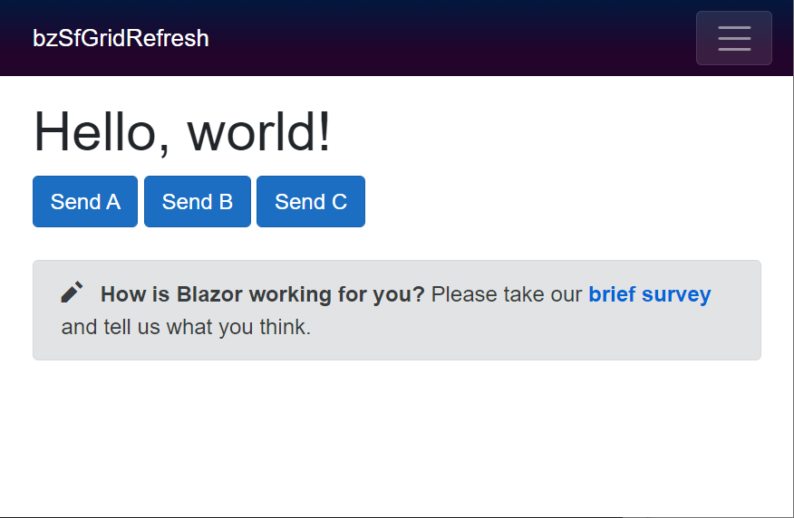
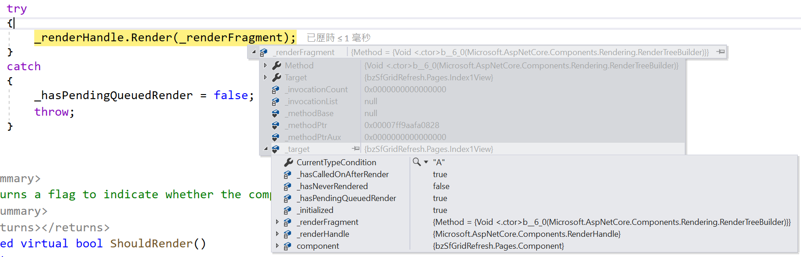

# Blazor SfGrid SfDataManager 的參數 Parameter 傳遞的異常設計分析 1

使用 Syncfusion SfGrid 元件可以使用 SfDataManager 來指定客製化轉接器，取得 Grid 元件所要顯示的紀錄，不過，需要根據使用者的操作，傳遞不同的參數數值到該客製化轉接器 Adapter 內，以便取得該參數數值所適合的相關集合物件，但是，對於許多大多數的開發者而言，面對到許多時候需要針具各種不同的情況，會發生不同的結果，這樣的困境會讓人無法適從。

因此，這篇文章將會是針對這樣的困境來進行說明，了解到發生了甚麼問題，以及要如何解決此一問題

這個說明專案的原始碼位於 [bzSfGridRefresh](https://github.com/vulcanlee/CSharp2021/tree/master/bzSfGridRefresh)

## 準備練習專案

由於這裡的專案將會使用到 Syncfusion 元件來做為講解，因此，首先需要建立一個 Blazor for Syncfusion 的專案，根據 Syncfusion 官方文件的說明，加入相關的程式碼，以便可以使用 Syncfusion 的元件。

## 先從 Blazor 預設功能來觀看元件間的參數傳遞

在此，先打開 [Pages] 資料夾內的 Index.razor 檔案

確定該 Blazor 元件如底下內容

```html
@page "/"

<h1>Hello, world!</h1>

@*<Index1View />*@
@*<Index2View />*@
<Index3View />

<SurveyPrompt Title="How is Blazor working for you?" />
```

在這裡將會使用自行設計的一個 Blazor 元件，這個 Index3View.razor 元件的程式碼如下

```html
@using Syncfusion.Blazor.Grids;
@using Syncfusion.Blazor.Data;
@using Syncfusion.Blazor;

<div>
    <button class="btn btn-primary" @onclick="()=>OnClick(1)">Send A</button>
    <button class="btn btn-primary" @onclick="()=>OnClick(2)">Send B</button>
    <button class="btn btn-primary" @onclick="()=>OnClick(3)">Send C</button>
</div>
<div>
    <Component @ref="component" CurrentTypeCondition="@CurrentTypeCondition" />
</div>

@code{
    public string CurrentTypeCondition { get; set; }
    Component component;

    async Task OnClick(int i)
    {
        Console.WriteLine();
        Console.WriteLine();
        OutputHelper.Output("CurrentTypeCondition 準備要變更了");

        #region 使用同步方式來進行變更 CurrentTypeCondition
        if (i == 1)
        {
            CurrentTypeCondition = "A";
        }
        else if (i == 2)
        {
            CurrentTypeCondition = "B";
        }
        else if (i == 3)
        {
            CurrentTypeCondition = "C";
        }
        OutputHelper.Output("CurrentTypeCondition 已經變更了");
        #endregion

        OutputHelper.Output("Raise component.Refresh");
        component.Refresh();
    }
}
```

在這個元件內，將會使用到一個 `Component.razor` 元件，並且使用了 `@ref="component"` 這個標記屬性來聲明，在這個元件內，可以使用 component 這個變數來存取這個元件，而這個 `Component.razor` 元件內有提供一個公開方法 Refresh ，當然，也可以透過這個變數來呼叫這個方法，例如： component.Refresh()

這裡在最上方加入了三個按鈕，每按下任一按鈕，將會透過 Blazor 參數傳遞的方式，將變更的數值，傳遞到這個 Component 元件內。

每個按鈕都會共用一個委派事件方法，在這個方法內將會在螢幕上顯示每個程式碼正在做甚麼事情，以及相關當時重要物件的變化值是多少。

此時，可以執行這個專案，將會看到執行結果



現在來看看這個元件做了甚麼事情？

首先，從底下的 HTML 標記可以看出，在這個 Index3View.razor 元件中，有參考到一個 Component.razor 元件。

```html
<Component @ref="component" CurrentTypeCondition="@CurrentTypeCondition" />
```

接下來看看這個 Component.razor 元件有甚麼內容

```html
<h3>@CurrentTypeCondition</h3>

@code {
    private string myVar;

    [Parameter]
    public string CurrentTypeCondition
    {
        get { return myVar; }
        set
        {
            myVar = value;
            OutputHelper.Output($"Component CurrentTypeCondition has changed {myVar}");
        }
    }

    public void Refresh()
    {
        OutputHelper.Output("Component Refresh() is running");
        OutputHelper.Output($"【In Component, CurrentTypeCondition is ■{CurrentTypeCondition}■】");
    }
}
```

在這個元件中非常的簡單，這裡有宣告一個參數 CurrentTypeCondition ，因為該參數有宣告 `[Parameter]`，因此，可以從別的元件中將該物件值傳入到這個元件內，在剛剛看到的 Index3View.razor 檔案內，就有看到這樣的標記宣告，`<Component @ref="component" CurrentTypeCondition="@CurrentTypeCondition" />`，這裡表示會將 Index3View.razor 元件中的 CurrentTypeCondition 物件值，透過 Blazor 參數傳遞綁定方式 (更多這方面的資訊，可以參考 [使用元件參數進行系結](https://docs.microsoft.com/zh-tw/aspnet/core/blazor/components/data-binding?view=aspnetcore-5.0#binding-with-component-parameters&WT.mc_id=DT-MVP-5002220))，如此，在 Component.razor 這個元件內，就會接收到這個參數。

為了想要知道這個元件內的 CurrentTypeCondition 參數數值何時產生了變化，也就是該參數數值已經變更了，這裡使用了 [含有支援欄位的屬性](https://docs.microsoft.com/zh-tw/dotnet/csharp/programming-guide/classes-and-structs/properties#properties-with-backing-fields?WT.mc_id=DT-MVP-5002220) 設計方式，從程式碼可以看出當這個參數屬性被設定並更成為別的物件值的時候，將會觸發 set 存取子，也就是會進而會執行 `OutputHelper.Output($"Component CurrentTypeCondition has changed {myVar}");` 這個敘述，這個支援方法 Output 將會把這裡的文字顯示在螢幕上，從底下的程式碼可以看到這個支援方法的定義。

```csharp
public class OutputHelper
{
    public static void Output(string message)
    {
        var foo = System.Threading.SynchronizationContext.Current == null ? "No" : "Yes";
        Console.WriteLine($"{message} " +
            $"(Thread:{System.Threading.Thread.CurrentThread.ManagedThreadId}) [SC:{foo}]");
    }
}
```

在這個 OutputHelper.Output 靜態方法中，會把傳入的字串，顯示在螢幕上，並且也會顯示當前的 執行緒 Thread Id 值為多少，其目的是要做為判斷，當有屬性物件的值被變更的時候，是在哪個執行緒下來執行的？另外，也會顯示當時所使用的執行緒是否是在 SynchronizationContext 下來執行，講白話一點，就是要觀察當屬性值被變更的時候，是否在 UI 執行緒來執行。

最後，在這個 Component.razor 元件內，也有設計一個公開方法 Refresh()，當這個方法被呼叫的時候，將會把當時看到的 屬性 CurrentTypeCondition 物件值顯示在螢幕上，也就是想要觀察這個方法 Refresh() 所看到的屬性值是甚麼？


## 執行並觀察元件間的參數傳遞的結果

當這個專案執行之後，點選 [Send A] 按鈕，將會從 Console 視窗中看到底下的輸出結果

```
CurrentTypeCondition 準備要變更了 (Thread:6) [SC:Yes]
CurrentTypeCondition 已經變更了 (Thread:6) [SC:Yes]
Raise component.Refresh (Thread:6) [SC:Yes]
Component Refresh() is running (Thread:6) [SC:Yes]
【In Component, CurrentTypeCondition is ■■】 (Thread:6) [SC:Yes]
Component CurrentTypeCondition has changed A (Thread:6) [SC:Yes]
```


從上面的執行結果可以看得出底下幾點

* 從螢幕上看出，有顯示 A 的文字
* 這表示了 Component 元件內的 CurrentTypeCondition 參數最終變成了 A
* 所有的輸出內容，都是在 SynchronizationContext 下來執行的(這可以從 SC:Yes 看的出來)

不過，這裡看出一個問題，那就是當 `component.Refresh();` 這個敘述被呼叫之後，在 Component 元件內的 Refresh 方法裡面，看到的參數 CurrentTypeCondition 卻是空值，不過，在前面確實已經在外部元件變更了這個要傳送過去的參數值。

那麼，為什麼螢幕上可以看到正確的參數變更後的結果，而在 Refresh 內卻看不到這樣的變更結果呢？

再度點選 [Send B] 按鈕，將會從 Console 視窗中看到底下的輸出結果

```
CurrentTypeCondition 準備要變更了 (Thread:11) [SC:Yes]
CurrentTypeCondition 已經變更了 (Thread:11) [SC:Yes]
Raise component.Refresh (Thread:11) [SC:Yes]
Component Refresh() is running (Thread:11) [SC:Yes]
【In Component, CurrentTypeCondition is ■A■】 (Thread:11) [SC:Yes]
Component CurrentTypeCondition has changed B (Thread:11) [SC:Yes]
```


從這裡，同樣可以看到按下 [Send B] 按鈕後，把參數變更為 B 的螢幕輸出結果。

不過，從倒數第二行的輸出內容看到 `【In Component, CurrentTypeCondition is ■A■】 (Thread:11) [SC:Yes]`，這表示了當呼叫了 `component.Refresh();` 這個方法之後，現在在這個方法內看到的參數值為 'A'，而不是我們剛剛變更的 'B'，這是發生了甚麼問題呢？

然而，在最後一行，卻發現到了 `Component CurrentTypeCondition has changed B (Thread:11) [SC:Yes]` 這樣的輸出內容，表示參數已經變更為 B 了。

>簡單來說，當使用者按下按鈕之後，參數的實際變更將會放入一個委派事件到 SynchronizationContext 內，等到該按鈕的委派方法執行完畢之後，Blazor 內部的同步內容 SynchronizationContext 將會取出剛剛加入的委派方法，執行參數變更的相關行為。因此，若使用這個觀點來理解，一切都可以解釋得通了。

## 使用各種方式，讓 Refresh 方法，取得最新的參數變更內容

打開 [Pages] 資料夾內的 Index.razor 檔案

確定該 Blazor 元件如底下內容

```html
@page "/"

<h1>Hello, world!</h1>

<Index1View />
@*<Index2View />*@
@*<Index3View />*@

<SurveyPrompt Title="How is Blazor working for you?" />
```

在這裡將會使用自行設計的一個 Blazor 元件，這個 Index1View.razor 元件的程式碼如下

```html
@using Syncfusion.Blazor.Grids;
@using Syncfusion.Blazor.Data;
@using Syncfusion.Blazor;

<div>
    <button class="btn btn-primary" @onclick="()=>OnClick(1)">Send A</button>
    <button class="btn btn-primary" @onclick="()=>OnClick(2)">Send B</button>
    <button class="btn btn-primary" @onclick="()=>OnClick(3)">Send C</button>
</div>
<div>
    <Component @ref="component" CurrentTypeCondition="@CurrentTypeCondition" />
</div>

@code{
    public string CurrentTypeCondition { get; set; }
    Component component;

    async Task OnClick(int i)
    {
        Console.WriteLine();
        Console.WriteLine();
        OutputHelper.Output("CurrentTypeCondition 準備要變更了");

        #region 使用同步方式來進行變更 CurrentTypeCondition 
        if (i == 1)
        {
            CurrentTypeCondition = "A";
        }
        else if (i == 2)
        {
            CurrentTypeCondition = "B";
        }
        else if (i == 3)
        {
            CurrentTypeCondition = "C";
        }
        OutputHelper.Output("CurrentTypeCondition 已經變更了");
        #endregion

        #region 使用其他執行緒來變更要傳遞參數的內容
        //var task = Task.Run(() =>
        //{
        //    if (i == 1)
        //    {
        //        CurrentTypeCondition = "A";
        //    }
        //    else if (i == 2)
        //    {
        //        CurrentTypeCondition = "B";
        //    }
        //    else if (i == 3)
        //    {
        //        CurrentTypeCondition = "C";
        //    }
        //    OutputHelper.Output("CurrentTypeCondition 已經變更了(在其他執行緒內)");
        //});

        //task.Wait();
        #endregion

        #region 狀況 1 : 沒做任何事情
        OutputHelper.Output("沒做任何事情");
        #endregion

        #region 狀況 2 : 使用 Task.Yield()
        //OutputHelper.Output("Raise Task.Yield");
        //await Task.Yield();
        #endregion

        #region 狀況 3 : 使用 Task.Delay(100)
        //OutputHelper.Output("Raise Task.Delay");
        //await Task.Delay(100);
        #endregion

        #region 狀況 4 : 使用 StateHasChanged
        //OutputHelper.Output("Raise StateHasChanged");
        //StateHasChanged();
        #endregion

        #region 狀況 5 : 使用 Task.Yield()，且又再度變更該參數內容
        //OutputHelper.Output("Raise Task.Yield");
        //await Task.Yield();
        //CurrentTypeCondition = "再度變更";
        #endregion

        #region 狀況 6 : 使用 Task.Yield()，且又再度變更該參數內容，並且發出 StateHasChanged
        //OutputHelper.Output("Raise Task.Yield");
        //await Task.Yield();
        //CurrentTypeCondition = "再度變更";
        //OutputHelper.Output("Raise StateHasChanged");
        //StateHasChanged();
        #endregion

        #region 狀況 7 : 使用 Task.Yield()，且又再度變更該參數內容，並且使用 await Task.Yield();
        //OutputHelper.Output("Raise Task.Yield");
        //await Task.Yield();
        //CurrentTypeCondition = "再度變更";
        //OutputHelper.Output("Raise Task.Yield");
        //await Task.Yield();
        #endregion

        OutputHelper.Output("Raise component.Refresh");
        component.Refresh();
    }
}
```

在這裡有許多 region C# 程式碼，這裡將會針對不同情況來進行測試。

### 狀況 1 : 沒做任何事情

這裡有7種模擬狀況，請先將其他 #region 狀況內的程式碼註解起來，將狀況1內的程式碼解除註解

```csharp
        #region 狀況 1 : 沒做任何事情
        OutputHelper.Output("沒做任何事情");
        #endregion
```

現在，執行這個專案，並且點選 [Send A] 按鈕，從 Console 視窗內將會看到底下的輸出內容

```
CurrentTypeCondition 準備要變更了 (Thread:5) [SC:Yes]
CurrentTypeCondition 已經變更了 (Thread:5) [SC:Yes]
沒做任何事情 (Thread:5) [SC:Yes]
Raise component.Refresh (Thread:5) [SC:Yes]
Component Refresh() is running (Thread:5) [SC:Yes]
【In Component, CurrentTypeCondition is ■■】 (Thread:5) [SC:Yes]
Component CurrentTypeCondition has changed A (Thread:5) [SC:Yes]
```

在 Console 輸出內容可以看出， CurrentTypeCondition 在這個同步程序中獲得變更，當 `Raise component.Refresh (Thread:5) [SC:Yes]` 訊息出來之後，就表示此時準備要呼叫 Component 元件內的 Refresh 的公開方法，而接下來的文字就是在 Refresh 方法內所顯示的內容 `【In Component, CurrentTypeCondition is ■■】 (Thread:5) [SC:Yes]`

此時，將會看到在 Refresh 內所看到的 這個參數的物件值，並沒有獲得更新(在剛剛已經透過參數綁定的方式，把 CurrentTypeCondition 參數值變更為 A

然而，最後一行顯示了 `Component CurrentTypeCondition has changed A (Thread:5) [SC:Yes]` 這個參數真的已經變更了

最後一行會把元件內的綁訂定參數有做了變動，如同前面所說明的，那是因為在 SynchronizationContext 內有一個等待執行的委派方法，那就是要進行元件參數的綁定設定工作，在這個按鈕事件執行完畢之後，SynchronizationContext就會檢查其 Message Queue 內是否還有其他待執行的方法，有的話，就會取出來進行執行。

### 狀況 2 : 使用 Task.Yield()

請進行其他7種模擬狀況，請先將其他 #region 狀況內的程式碼註解起來，將狀況 2 內的程式碼解除註解

```csharp
        #region 狀況 2 : 使用 Task.Yield()
        OutputHelper.Output("Raise Task.Yield");
        await Task.Yield();
        #endregion
```

現在，執行這個專案，並且點選 [Send A] 按鈕，從 Console 視窗內將會看到底下的輸出內容

```
CurrentTypeCondition 準備要變更了 (Thread:5) [SC:Yes]
CurrentTypeCondition 已經變更了 (Thread:5) [SC:Yes]
Raise Task.Yield (Thread:5) [SC:Yes]
Component CurrentTypeCondition has changed A (Thread:5) [SC:Yes]
Raise component.Refresh (Thread:9) [SC:Yes]
Component Refresh() is running (Thread:9) [SC:Yes]
【In Component, CurrentTypeCondition is ■A■】 (Thread:9) [SC:Yes]
```

在 Console 輸出內容可以看出， CurrentTypeCondition 在這個同步程序中獲得變更。

不過，可以看到，在出現了 `Raise Task.Yield (Thread:5) [SC:Yes]` 這行文字出現的時候，表示這個按鈕事件執行了 `await Task.Yield();` 敘述，一旦該敘述執行完成之後，該按鈕事件委派方法將會立即 Return，並且執行 Task.Yield() 這個非同步作業，而該方法很簡單的放棄當前執行續可以使用的 CPU 執行片段時間，從重新到工作排成 Scheduler Queue 佇列內進行排隊，等候下一次可以使用 CPU 並且執行程式碼的時間。

因為這個按鈕事件暫時 Return 了 (不過，當非同步作業完成之後，就會接著繼續往下執行)，所以， SynchronizationContext 就從他的 Message Queue 等待訊息佇列取出下一個要執行的委派方法，此時，要進行元件間資料綁定的作業就開始進行了，當然，就會看到了 `Component CurrentTypeCondition has changed A (Thread:5) [SC:Yes]` 訊息顯示在 Console 視窗上，一旦看到這個訊息，就表示了子元件的參數數值已經變更了。

接下來看到了 `Raise component.Refresh (Thread:5) [SC:Yes]` 訊息出來，就表示此時準備要呼叫 Component 元件內的 Refresh 的公開方法，而接下來的文字就是在 Refresh 方法內所顯示的內容 `【【In Component, CurrentTypeCondition is ■A■】 (Thread:9) [SC:Yes]`；你沒有看錯，此時，將會看到在 Refresh 內所看到的 這個參數的物件值，已經有獲得更新(也就是，在剛剛已經透過參數綁定的方式，把 CurrentTypeCondition 參數值變更為 A)

由於 SynchronizationContext 已經執行完成要進行資料綁定的委派工作，當然，也就不會在最後一行出現了 `Component CurrentTypeCondition has changed A (Thread:5) [SC:Yes]` 這樣的訊息囉。

### 狀況 3 : 使用 Task.Delay(100)

在這裡將會與前面運作模式差不多，只不過這裡將會執行 100ms 時間的非同步工作

### 狀況 4 : 使用 StateHasChanged

請進行其他7種模擬狀況，請先將其他 #region 狀況內的程式碼註解起來，將狀況 4 內的程式碼解除註解

```csharp
        OutputHelper.Output("Raise StateHasChanged");
        StateHasChanged();
```

這個 StateHasChanged() 將會觸發 Blazor 元件進行轉譯 Render [週期事件](https://docs.microsoft.com/zh-tw/aspnet/core/blazor/components/lifecycle?view=aspnetcore-5.0#lifecycle-events&WT.mc_id=DT-MVP-5002220) ，也就是會通知元件其狀態已變更。 在適用時，這會導致元件重新轉譯。

現在，執行這個專案，並且點選 [Send A] 按鈕，從 Console 視窗內將會看到底下的輸出內容

```
CurrentTypeCondition 準備要變更了 (Thread:4) [SC:Yes]
CurrentTypeCondition 已經變更了 (Thread:4) [SC:Yes]
Raise StateHasChanged (Thread:4) [SC:Yes]
Raise component.Refresh (Thread:4) [SC:Yes]
Component Refresh() is running (Thread:4) [SC:Yes]
【In Component, CurrentTypeCondition is ■■】 (Thread:4) [SC:Yes]
Component CurrentTypeCondition has changed A (Thread:4) [SC:Yes]
```

在 Console 輸出內容可以看出， CurrentTypeCondition 在這個同步程序中獲得變更。

當出現了訊息 `Raise StateHasChanged (Thread:4) [SC:Yes]` ，則表示要進行元件渲灠，為了知道這裡發生了甚麼事情，在 StataHasChanged() 這個方法設定中斷點，並且接著進行 逐步執行 ，將會看到進入到 ComponentBase.cs 內的 `protected void StateHasChanged()` 方法內，也就是底下的程式碼，從底下程式碼的方法註解中可以看出，`Notifies the component that its state has changed. When applicable, this will cause the component to be re-rendered` ，這句話從 Google 翻譯可以得到 `通知組件其狀態已更改。 如果適用，這將導致重新渲染組件`。

接著逐步執行之後，便會看到會執行這個方法 `_renderHandle.Render(_renderFragment);` ，而從這個 _renderFragment 變數，可以看到就是代表 `Method = {Void <.ctor>b__6_0(Microsoft.AspNetCore.Components.Rendering.RenderTreeBuilder)}` 這個委派方法，也就是會執行這個元件的 RenderTreeBuilder 重新渲灠工作，不過，這個工作將會排入到 SynchronizationContext 內的訊息佇列內，等候適當時機來執行。



```csharp
        /// <summary>
        /// Notifies the component that its state has changed. When applicable, this will
        /// cause the component to be re-rendered.
        /// </summary>
        protected void StateHasChanged()
        {
            if (_hasPendingQueuedRender)
            {
                return;
            }

            if (_hasNeverRendered || ShouldRender())
            {
                _hasPendingQueuedRender = true;

                try
                {
                    _renderHandle.Render(_renderFragment);
                }
                catch
                {
                    _hasPendingQueuedRender = false;
                    throw;
                }
            }
        }
```

在這個元件渲灠方法執行之後，發現到接著出現底下的內容

```
Raise component.Refresh (Thread:4) [SC:Yes]
Component Refresh() is running (Thread:4) [SC:Yes]
【In Component, CurrentTypeCondition is ■■】 (Thread:4) [SC:Yes]
```

從這裡看到了，當 Component.Refresh() 方法執行之後，在這個方法內所看到的Component.CurrentTypeCondition 參數物件的內容，竟然還是沒有變更的狀態。

在這個按鈕事件執行完畢之後，才會看到這樣的訊息 `Component CurrentTypeCondition has changed A (Thread:4) [SC:Yes]`，這個元件內的參數才獲得更新。

從這裡觀察到，StateHasChanged() 方法呼叫之後，就是將要元件重新渲灠的工作，排入到 SchronizationContext 的訊息佇列內，並不會立即的做元件參數綁定的物件值變更動作，真正的元件參數綁定，是在執行了 RenderTreeBuilder 方法之後，才會發生了。

### 狀況 7 : 使用 Task.Yield()，且又再度變更該參數內容，並且使用 await Task.Yield();

請進行其他7種模擬狀況，請先將其他 #region 狀況內的程式碼註解起來，將狀況 7 內的程式碼解除註解

```csharp
        OutputHelper.Output("Raise Task.Yield");
        await Task.Yield();
        CurrentTypeCondition = "再度變更";
        OutputHelper.Output("Raise Task.Yield");
        await Task.Yield();
```

現在，執行這個專案，並且點選 [Send A] 按鈕，從 Console 視窗內將會看到底下的輸出內容

```
CurrentTypeCondition 準備要變更了 (Thread:16) [SC:Yes]
CurrentTypeCondition 已經變更了 (Thread:16) [SC:Yes]
Raise Task.Yield (Thread:16) [SC:Yes]
Component CurrentTypeCondition has changed A (Thread:16) [SC:Yes]
Raise Task.Yield (Thread:4) [SC:Yes]
Raise component.Refresh (Thread:4) [SC:Yes]
Component Refresh() is running (Thread:4) [SC:Yes]
【In Component, CurrentTypeCondition is ■A■】 (Thread:4) [SC:Yes]
Component CurrentTypeCondition has changed 再度變更 (Thread:4) [SC:Yes]
```

在 Console 輸出內容可以看出， 當這個 CurrentTypeCondition 獲得變更後，立即顯示了 `Raise Task.Yield (Thread:16) [SC:Yes]` 文字，表示在這個按鈕事件觸發了一個 await 非同步作業，當然，該按鈕事件立即 Return 回去。

接著看到了 `Component CurrentTypeCondition has changed A (Thread:16) [SC:Yes]` 這樣的訊息，很明顯地知道，元件重新渲灠開始執行了，才會導致元件內的參數傳遞發生了效果。

不過，在第一次 await 敘述之後，就執行了 `CurrentTypeCondition = "再度變更";` 這樣的訊息，把這個 CurrentTypeCondition 變數值從 A 改成 再度變更 。

由於元件內的參數已經變成 A 了，這裡執行了 `CurrentTypeCondition = "再度變更";`，可想而知，元件內的參數在此時應該還沒有做變更。

當然，你可以覺得只要再度呼叫 `await Task.Yield();` 敘述之後，元件內的參數就會再度立即變更了，若你這樣想，你又要失望了，從執行結果可以看的出來，再呼叫 Refresh() 方法內，所看到的元件參數還是 A；不過，當這個按鈕事件執行完畢之後，該元件還是會繼續更新成功。

此時，若把 `狀況 7 : 使用 Task.Yield()，且又再度變更該參數內容，並且使用 await Task.Yield();` 這些敘述改成如下，也就是加入 StateHasChanged();

```csharp
        #region 狀況 7 : 使用 Task.Yield()，且又再度變更該參數內容，並且使用 await Task.Yield();
        OutputHelper.Output("Raise Task.Yield");
        await Task.Yield();
        CurrentTypeCondition = "再度變更";
        StateHasChanged();
        OutputHelper.Output("Raise Task.Yield");
        await Task.Yield();
        #endregion
```

再度執行後，將會看到底下的輸出內容，此時，在 Component.Refresh() 方法內，看到的參數物件值，已經是第二次再度變更的內容，也就是我們所期待的結果

```
CurrentTypeCondition 準備要變更了 (Thread:5) [SC:Yes]
CurrentTypeCondition 已經變更了 (Thread:5) [SC:Yes]
Raise Task.Yield (Thread:5) [SC:Yes]
Component CurrentTypeCondition has changed A (Thread:5) [SC:Yes]
Component CurrentTypeCondition has changed 再度變更 (Thread:17) [SC:Yes]
Raise Task.Yield (Thread:17) [SC:Yes]
Raise component.Refresh (Thread:15) [SC:Yes]
Component Refresh() is running (Thread:15) [SC:Yes]
【In Component, CurrentTypeCondition is ■再度變更■】 (Thread:15) [SC:Yes]
```


