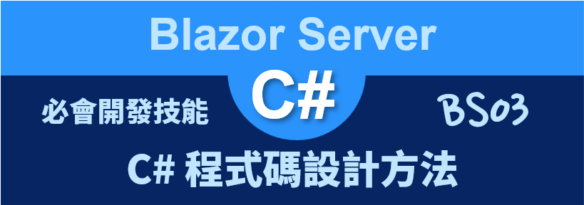
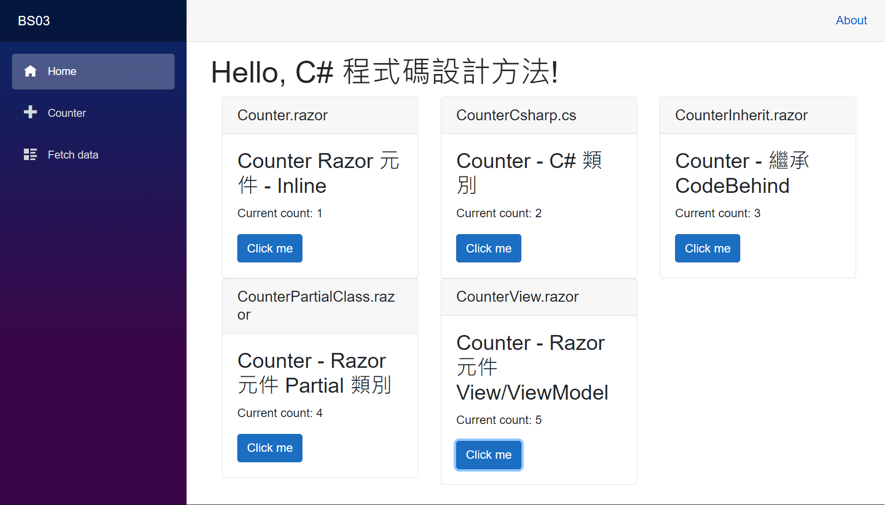

# Blazor Server 必會開發技能 - C# 程式碼設計方法



在進行 [Blazor](https://docs.microsoft.com/zh-tw/aspnet/core/blazor/?view=aspnetcore-5.0&WT.mc_id=DT-MVP-5002220) 專案開發的時候，會需要透過 HTML / CSS 來宣告網頁要呈現的內容，對於商業邏輯處理的部分，將會需要透過 C# 程式語言來進行設計；然而，在進行 Razor Component 元件 ( 也可以稱為 Blazor 元件) 設計的時候，對於 HTML 與 C# 這兩個語言的設計，將會有五種方式可以選擇，在這篇文章中將會針對這五種模式來進行開發體驗與說明。

這裡說明的範例專案原始碼位於 [BS03](https://github.com/vulcanlee/Blazor-Xamarin-Full-Stack-HOL/tree/main/Examples/BS03)

## 建立 Blazor Server-Side 的專案

* 打開 Visual Studio 2019
* 點選右下方的 [建立新的專案] 按鈕
* [建立新專案] 對話窗將會顯示在螢幕上
* 從[建立新專案] 對話窗的中間區域，找到 [Blazor 應用程式] 這個專案樣板選項，並且選擇這個項目
* 點選右下角的 [下一步] 按鈕
* 現在 [設定新的專案] 對話窗將會出現
* 請在這個對話窗內，輸入適當的 [專案名稱] 、 [位置] 、 [解決方案名稱]

  在這裡請輸入 [專案名稱] 為 `BS03`

* 完成後，請點選 [建立] 按鈕
* 當出現 [建立新的 Blazor 應用程式] 對話窗的時候
* 請選擇最新版本的 .NET Core 與 [Blazor 伺服器應用程式]
* 完成後，請點選 [建立] 按鈕

  稍微等會一段時間，Blazor 專案將會建立起來

## 使用 Razor 元件 - Inline 方式來設計元件

* 這樣的設計方式，可以直接參考這個專案範本所建立的 Counter 元件
* 從 Blazor 專案內的 [Pages] 資料夾找到並且打開 [Counter.razor] 檔案
* 這個檔案內容如下

```html
@page "/counter"

<h3>Counter Razor 元件 - Inline</h3>

<p>Current count: @currentCount</p>

<button class="btn btn-primary" @onclick="IncrementCount">Click me</button>

@code {
    private int currentCount = 0;

    private void IncrementCount()
    {
        currentCount++;
    }
}
```

這樣的設計方式將會把 HTML / C# 全部都寫在 .razor 的 Razor元件 檔案內，其中大約可以將這些內容區分成為三大部分，最前面的 [@page] 為 Razor Directive 指示詞，在這裡將會相關指示詞來宣告這個 [Razor元件] 會用到的其他功能，例如，可以加入其他 .NET 命名空間、從相依性注入容器 DI / IoC Container 內注入一個物件、繼承或者實作介面等等。

第二個部分就是要顯示這個元件會用到的相關 HTML 宣告標記語言程式碼，在這裡會使用 Blazor 框架內建的 資料綁定/繫節 Data Binding 功能，做出動態網頁的能力。例如要顯示一個 C# 執行個體的內容，可以使用 `@currentCount` 這樣的方式，想要綁定一個委派事件方法，可以使用 `@onclick="IncrementCount"` 這樣的方式來做到。

第三個部分將會使用 `@code{ ... }` 這個指示詞，在大括號區塊內來使用 C# 程式語言進行設計相關商業邏輯程式碼。

這樣的元件設計方法是最為簡單的，不過，因為 UI 設計(使用 HTML)程式碼與 商業邏輯(使用 C#)程式語言都混和在一起，使得設計一個元件可以在單一一個檔案就可以完成，不過，卻會造成 UI 與 商業邏輯都混和再一起了。

## 使用這個元件

* 打開 [Pages] 資料夾內的 [Index.razor] 檔案
* 請使用底下程式碼替換到這個檔案內容

```html
@page "/"

<h1>
    Hello, C# 程式碼設計方法!
</h1>

<div class="container-fluid">
    <div class="row">
        @*Razor 元件 - Inline*@
        <div class="col-4">
            <div class="card">
                <h5 class="card-header">Counter.razor</h5>
                <div class="card-body">
                    <Counter />
                </div>
            </div>
        </div>

        @*Counter - C# 類別*@

        @*Counter - 繼承 CodeBehind*@

        @*Razor 元件 Partial 類別*@

        @*Razor 元件 View/ViewModel*@

    </div>
</div>
```

要使用 [Razor 元件 - Inline 方式] 設計的元件，僅需要將這個元件檔案名稱加入到 HTML 標記內即可，例如： `<Counter />`。

## 使用 C# 類別 來設計元件

* 滑鼠右擊 Blazor 專案內的 [Pages] 資料夾
* 選擇 [加入] > [類別]
* 當 [新增項目 - BS03] 對話窗出現之後，請在下方名稱欄位內，輸入 `CounterCsharp`
* 最後點選 [新增] 按鈕
* 請依據底下程式碼替換到這個檔案內容

```csharp
namespace BS03.Pages
{
    public partial class CounterCsharp : Microsoft.AspNetCore.Components.ComponentBase
    {
        /// <summary>
        /// 這裡將會重新產生出最新狀態的轉譯樹
        /// </summary>
        /// <param name="__builder"></param>
        protected override void BuildRenderTree(Microsoft.AspNetCore.Components.Rendering.RenderTreeBuilder __builder)
        {
            __builder.AddMarkupContent(0, "<h3>Counter - C# 類別</h3>\r\n\r\n");
            __builder.OpenElement(1, "p");
            __builder.AddContent(2, "Current count: ");
            __builder.AddContent(3,
                   currentCount
            );
            __builder.CloseElement();
            __builder.AddMarkupContent(4, "\r\n\r\n");
            __builder.OpenElement(5, "button");
            __builder.AddAttribute(6, "class", "btn btn-primary");
            __builder.AddAttribute(7, "onclick", Microsoft.AspNetCore.Components.EventCallback.Factory.Create<Microsoft.AspNetCore.Components.Web.MouseEventArgs>(this,
                                          IncrementCount
            ));
            __builder.AddContent(8, "Click me");
            __builder.CloseElement();
        }

        int currentCount { get; set; } = 0;

        private void IncrementCount()
        {
            currentCount++;
        }
    }
}
```

要設計一個 Blazor 元件，可以完全都使用 C# 程式語言就可以進行設計，首先先來設計一個類別，該類別名稱就是這個 Razor 元件名稱，並且這個類別要繼承 ComponentBase 類別。

接著，需要覆寫 [BuildRenderTree] 方法，在這個方法內要將會要設計要顯示在網頁上的 DOM 物件內容，如同前面使用 HTML 的方法來進行設計網頁要出現的 UI 一樣。

對於 商業邏輯 部分當然就像是一般設計 C# 程式語言一樣，在這個類別內設計出相關 C# 程式碼即可。

## 使用這個元件

* 打開 [Pages] 資料夾內的 [Index.razor] 檔案
* 找到 `@*Counter - C# 類別*@` 關鍵字，在這個文字內加入底下的程式碼

```html
<div class="col-4">
    <div class="card">
        <h5 class="card-header">CounterCsharp.cs</h5>
        <div class="card-body">
            <CounterCsharp />
        </div>
    </div>
</div>
```

當要使用一個 C# 類別設計出來的 [Razor 元件] ，只需要使用這個類別名稱當作為一個 HTML 標籤來使用即可，如同這樣使用方式 `<CounterCsharp />`。

## 使用 繼承 來採用 CodeBehind 方式 來設計元件

* 滑鼠右擊 Blazor 專案內的 [Pages] 資料夾
* 選擇 [加入] > [類別]
* 當 [新增項目 - BS03] 對話窗出現之後，請在下方名稱欄位內，輸入 `CounterInherit.razor.cs`
* 最後點選 [新增] 按鈕
* 請依據底下程式碼替換到這個檔案內容

```csharp
using Microsoft.AspNetCore.Components;

namespace BS03.Pages
{
    public class CounterInheritBase : ComponentBase
    {
        public int currentCount = 0;

        public void IncrementCount()
        {
            currentCount++;
        }
    }
}
```

* 滑鼠右擊 Blazor 專案內的 [Pages] 資料夾
* 選擇 [加入] > [Razor元件]
* 當 [新增項目 - BS03] 對話窗出現之後，請在下方名稱欄位內，輸入 `CounterInherit.razor`
* 最後點選 [新增] 按鈕
* 請依據底下程式碼替換到這個檔案內容

```html
@inherits CounterInheritBase

<h3>Counter - 繼承 CodeBehind</h3>

<p>Current count: @currentCount</p>

<button class="btn btn-primary" @onclick="IncrementCount">Click me</button>
```

這是第一種將 UI 與 商業邏輯 拆開的做法，對於 UI 的部分，將會完全設計在副檔案名稱為 `.razor` 的檔案內 (CounterInherit.razor)，在這裡將會僅會使用 HTML 的宣告式標記語言，而對於 商業邏輯 部分，將會設計在一個 C# 檔案內，副檔案名稱為 `.razor.cs` 的檔案內 (CounterInherit.razor.cs)，在這裡將會僅使用 C# 程式語言來設計。

在 `.razor.cs` 檔案內，要使用 `public class CounterInheritBase : ComponentBase` 方式來建立一個類別，該類別要繼承 [ComponentBase] 類別，對於該類別的名稱將會 [元件名稱]+`Base` 組合。

在 `.razor` 檔案內，要使用 `@inherits` 指示詞 Directive 方式標示這個元件要繼承剛剛設計的 C# 類別，接著，就是要在這個檔案內來設計相關 HTML 宣告式標記語言。

這樣的設計特色將會是 UI 將會在 `.razor` 檔案內來設計，商業邏輯 將會在 `.razor.cs` 來設計。

## 使用這個元件

* 打開 [Pages] 資料夾內的 [Index.razor] 檔案
* 找到 `@*Counter - 繼承 CodeBehind*@` 關鍵字，在這個文字內加入底下的程式碼

```html
<div class="col-4">
    <div class="card">
        <h5 class="card-header">CounterInherit.razor</h5>
        <div class="card-body">
            <CounterInherit />
        </div>
    </div>
</div>
```

當要使用這樣的設計方式，也通稱為 Codebehind 設計模式，採用這樣方法設計出來的 [Razor 元件] ，只需要使用這個類別名稱當作為一個 HTML 標籤來使用即可，如同這樣使用方式 `<CounterInherit />`。


## 使用 Partial 類別 來設計元件

* 滑鼠右擊 Blazor 專案內的 [Pages] 資料夾
* 選擇 [加入] > [Razor元件]
* 當 [新增項目 - BS03] 對話窗出現之後，請在下方名稱欄位內，輸入 `CounterPartialClass.razor`
* 最後點選 [新增] 按鈕
* 請依據底下程式碼替換到這個檔案內容

```html
<h3>Counter - Razor 元件 Partial 類別</h3>

<p>Current count: @currentCount</p>

<button class="btn btn-primary" @onclick="IncrementCount">Click me</button>
```

* 滑鼠右擊 Blazor 專案內的 [Pages] 資料夾
* 選擇 [加入] > [類別]
* 當 [新增項目 - BS03] 對話窗出現之後，請在下方名稱欄位內，輸入 `CounterPartialClass.cs`
* 最後點選 [新增] 按鈕
* 請依據底下程式碼替換到這個檔案內容

```csharp
namespace BS03.Pages
{
    public partial class CounterPartialClass
    {
        private int currentCount = 0;

        void IncrementCount()
        {
            currentCount++;
        }
    }
}
```

這是第二種方式來將 UI 與 商業邏輯 拆開的做法，對於 UI 的部分，將會完全設計在副檔案名稱為 `.razor` 的檔案內 (CounterPartialClass.razor)，在這裡將會僅會使用 HTML 的宣告式標記語言，而對於 商業邏輯 部分，將會設計在一個 C# 類別，該類別名稱為一個 [partial] 部分類別，這裡將會設計在 `.cs` 的檔案內 (CounterPartialClass.cs)，在這裡將會僅使用 C# 程式語言來設計。

這樣的設計特色將會是 UI 將會在 `元件名稱.razor` 檔案內來設計，商業邏輯 將會在 `元件名稱.cs` 來設計。

## 使用這個元件

* 打開 [Pages] 資料夾內的 [Index.razor] 檔案
* 找到 `@*Razor 元件 Partial 類別*@` 關鍵字，在這個文字內加入底下的程式碼

```html
<div class="col-4">
    <div class="card">
        <h5 class="card-header">CounterPartialClass.razor</h5>
        <div class="card-body">
            <CounterPartialClass />
        </div>
    </div>
</div>
```

當要採用這樣方法設計出來的 [Razor 元件] ，只需要使用這個元件名稱當作為一個 HTML 標籤來使用即可，如同這樣使用方式 `<CounterPartialClass />`。


## 使用 View 與 ViewModel 來設計元件

* 滑鼠右擊 Blazor 專案內的 [Pages] 資料夾
* 選擇 [加入] > [Razor元件]
* 當 [新增項目 - BS03] 對話窗出現之後，請在下方名稱欄位內，輸入 `CounterView.razor`
* 最後點選 [新增] 按鈕
* 請依據底下程式碼替換到這個檔案內容

```html
@inject CounterViewModel CounterViewModel
<h3>Counter - Razor 元件 View/ViewModel</h3>

<p>Current count: @CounterViewModel.currentCount</p>

<button class="btn btn-primary" @onclick="CounterViewModel.IncrementCount">Click me</button>
```

* 滑鼠右擊 Blazor 專案內的 [Pages] 資料夾
* 選擇 [加入] > [類別]
* 當 [新增項目 - BS03] 對話窗出現之後，請在下方名稱欄位內，輸入 `CounterViewModel.cs`
* 最後點選 [新增] 按鈕
* 請依據底下程式碼替換到這個檔案內容

```csharp
namespace BS03.Pages
{
    public class CounterViewModel
    {
        public int currentCount { get; set; }

        public void IncrementCount()
        {
            currentCount++;
        }
    }
}
```

* 最後在專案根目錄下找到並且打開 [Startup.cs] 檔案
* 在 [Startup] 類別內找到 [ConfigureServices] 方法
* 在這個方法內加入底下的敘述

```csharp
#region 宣告要注入的 ViewModel 類別
services.AddTransient<CounterViewModel>();
#endregion
```

這是第三種方式來將 UI 與 商業邏輯 拆開的做法，對於 UI 的部分，將會完全設計在副檔案名稱為 `.razor` 的檔案內 (CounterView.razor)，在這裡將會僅會使用 HTML 的宣告式標記語言，而對於 商業邏輯 部分，將會設計在一個 C# 類別，這裡將會設計在 `.cs` 的檔案內 (CounterViewModel.cs)，在這裡將會僅使用 C# 程式語言來設計。

這兩個檔案的結合是透過 `@inject CounterViewModel CounterViewModel` 指示詞來透過相依性注入容器來注入這個 CounterViewModel 類別的執行個體，如此，在 View 中要綁定的 資料 物件或者 事件 委派方法，都會設計在這個 ViewModel 內。 

這樣的設計特色將會是 UI 將會在 `元件名稱View.razor` 檔案內來設計，商業邏輯 將會在 `ViewModel.cs` 來設計。

## 使用這個元件

* 打開 [Pages] 資料夾內的 [Index.razor] 檔案
* 找到 `@*Razor 元件 View/ViewModel*@` 關鍵字，在這個文字內加入底下的程式碼

```html
<div class="col-4">
    <div class="card">
        <h5 class="card-header">CounterView.razor</h5>
        <div class="card-body">
            <CounterView />
        </div>
    </div>
</div>
```

當要採用這樣方法設計出來的 [Razor 元件] ，只需要使用這個元件名稱當作為一個 HTML 標籤來使用即可，如同這樣使用方式 `<CounterView />`。

## 執行這個專案

* 按下 [F5] 按鍵，開始執行這個 Blazor 專案
* 一旦啟動完成，就會自動開以瀏覽器

  


