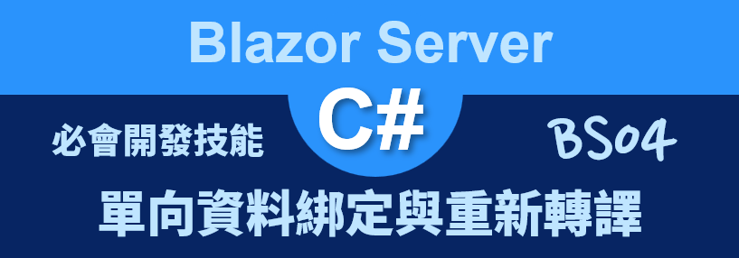
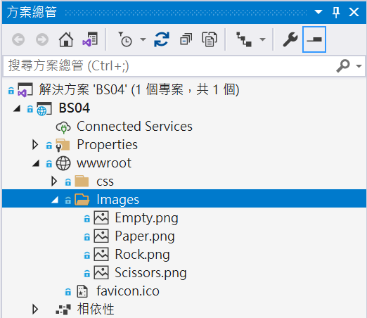
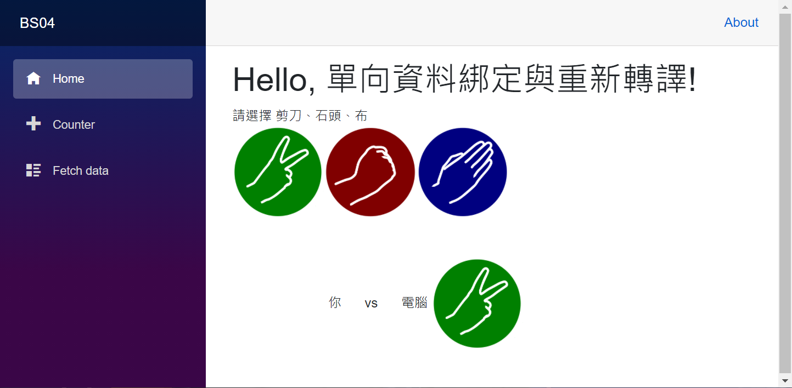
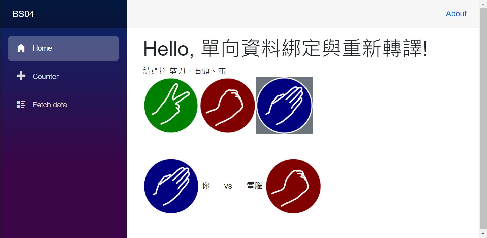

# Blazor Server 必會開發技能 - 單向資料綁定與重新轉譯



在這篇文章將會來使用 [Blazor](https://docs.microsoft.com/zh-tw/aspnet/core/blazor/?view=aspnetcore-5.0&WT.mc_id=DT-MVP-5002220) 技術來設計一個小遊戲，那就是一個剪刀、石頭、布的猜謎遊戲，在這個練習專案內將學習 Blazor 的單向資料綁定用法，除了可以透過資料綁定 Data Binding 的方式將 C# 變數物件值顯示在瀏覽器的網頁上，並且也可以使用資料綁定功能來進行要顯示圖片來源、要套用的 CSS 類別名稱等方式的資料綁定。

透過資料綁定的方法，可以做到當 C# 執行個體值有變動的時候，透過了轉譯 Render 機制將這些變動的差異內容更新到瀏覽器上的 DOM 內，如此，網頁顯示的內容就會進行更新了，從這裡可以看到一個相當好用的技能，那就是想要做到動態網頁、更新或者讀取網頁上的內容，不再需要透過 jQuery 或者 JavaScript 程式語言就可以做到這樣的能力，因此，採用 Blazor 技術所開發的專案，幾乎不再需要使用到 JavaScript 程式語言了。

這裡說明的範例專案原始碼位於 [BS04](https://github.com/vulcanlee/Blazor-Xamarin-Full-Stack-HOL/tree/main/Examples/BS04)

## 建立 Blazor Server-Side 的專案

* 打開 Visual Studio 2019
* 點選右下方的 [建立新的專案] 按鈕
* [建立新專案] 對話窗將會顯示在螢幕上
* 從[建立新專案] 對話窗的中間區域，找到 [Blazor 應用程式] 這個專案樣板選項，並且選擇這個項目
* 點選右下角的 [下一步] 按鈕
* 現在 [設定新的專案] 對話窗將會出現
* 請在這個對話窗內，輸入適當的 [專案名稱] 、 [位置] 、 [解決方案名稱]

  在這裡請輸入 [專案名稱] 為 `BS04`

* 完成後，請點選 [建立] 按鈕
* 當出現 [建立新的 Blazor 應用程式] 對話窗的時候
* 請選擇最新版本的 .NET Core 與 [Blazor 伺服器應用程式]
* 完成後，請點選 [建立] 按鈕

  稍微等會一段時間，Blazor 專案將會建立起來

## 加入靜態的剪刀、石頭、布的圖片檔案

* 從 [Images](https://github.com/vulcanlee/Blazor-Xamarin-Full-Stack-HOL/tree/main/Examples/BS04/BS04/wwwroot/Images) 這裡來下載該目錄下的四個圖片檔案到本機電腦上
* 滑鼠右擊這個專案根目錄下的 [wwwroot] 節點
* 點選 [加入] > [新增資料夾]
* 重新命名這個資料夾為 [Images]
* 使用檔案總管拖拉這剛剛下載的四個圖片檔案，到剛剛建立好的 [Images] 資料夾內

  

## 建立 Razor 元件

* 滑鼠右擊 Blazor 專案內的 [Pages] 資料夾
* 選擇 [加入] > [Razor元件]
* 當 [新增項目 - BS04] 對話窗出現之後，請在下方名稱欄位內，輸入 `GameView.razor`
* 最後點選 [新增] 按鈕
* 請依據底下程式碼替換到這個檔案內容

```html
@using System.Threading
@using System.Threading.Tasks

<div>
    <div>請選擇 剪刀、石頭、布</div>
    <div>
        @for (int i = 1; i <= 3; i++)
        {
            int idx = i;
            {await Choose(allItems[idx]); }">
        }
    </div>
    <div class="my-5">
        <span>
            
            你
        </span>
        <span class="mx-4"> vs </span>
        <span>
            電腦
            
        </span>
    </div>
</div>
@code {
    string GameMessage = "";
    List<GameItem> allItems = new List<GameItem>()
{
        new GameItem { Name = "Empty" },
        new GameItem { Name = "Scissors" },
        new GameItem { Name = "Rock" },
        new GameItem { Name = "Paper" },
    };
    int Computer = 1;
    int You = 0;

    async Task Choose(GameItem item)
    {
        for (int i = 1; i < allItems.Count; i++)
        {
            if (allItems[i].Name == item.Name)
            {
                allItems[i].Selected = true;
                You = i;
            }
            else
                allItems[i].Selected = false;
        }

        Random random = new Random();
        var count = random.Next(20, 35);

        for (int i = 0; i < count; i++)
        {
            Computer = (i % 3) + 1;
            await Task.Delay(100);
            StateHasChanged();
        }
    }

    public class GameItem
    {
        public string Name { get; set; }

        public string Image
        {
            get
            {
                return $"/Images/{Name}.png";
            }
        }
        public bool Selected { get; set; }
        public string Background
        {
            get
            {
                if (Selected == true)
                {
                    return "bg-secondary";
                }
                else
                {
                    return "";
                }
            }
        }
    }
}
```

在這個元件內使用了 `@for (int i = 1; i <= 3; i++)` 指示詞來建立一個三次的迴圈，分別要在網頁上顯示三個圖片 HTML 標籤，不過，這三個圖片標籤的圖片來源、使用的CSS，將會透過資料綁定的方式來套用的這些圖片屬性值。

另外，這裡也使用 `@onclick` 這個指示詞 Directive 來進行資料綁定到 C# 內的委派事件方法，這代表了當使用者在網頁上點選了這三個圖片的任何一個，將會觸發這裡所綁定的 Lambda 委派方法；當這個委派方法執行之後，將會採用發同步的方式來執行 `await Choose(allItems[idx]);` 敘述。

在 [Choose] 這個非同步方法內，將會建立一個 [Random] 類別物件，並且建立 20 ~ 35 之間的隨機亂數，接著進入迴圈內，每執行一次迴圈，將會暫時休息 0.1 秒，接著呼叫 `StateHasChanged()` 方法，這樣就會造成有動畫的效果，

```csharp
Random random = new Random();
var count = random.Next(20, 35);
for (int i = 0; i < count; i++)
{
    Computer = (i % 3) + 1;
    await Task.Delay(100);
    StateHasChanged();
}
```

## 使用這個元件

* 打開 [Pages] 資料夾內的 [Index.razor] 檔案
* 請使用底下程式碼替換到這個檔案內容

```html
@page "/"

<h1>
    Hello, 單向資料綁定與重新轉譯!
</h1>

<GameView/>
```

## 執行這個專案

* 按下 [F5] 按鍵，開始執行這個 Blazor 專案
* 一旦啟動完成，就會自動開以瀏覽器

  

* 此時，請猜測電腦會出哪個手勢，點選上方的三個手勢的其中一個，看看你是否會贏電腦
* 經過 2~3.5 秒後，電腦將會選出一個手勢

  

* 按下 [Shift] + [F5] 按鈕，終止這個專案執行
* 在 [GameView.razor] 檔案內，搜尋找到 `StateHasChanged()` 方法，將這個方法註解起來
* 按下 [F5] 按鍵，開始執行這個 Blazor 專案
* 一旦啟動完成，就會自動開以瀏覽器
* 點選上方的三個手勢的其中一個，現在就會看不到動畫效果


