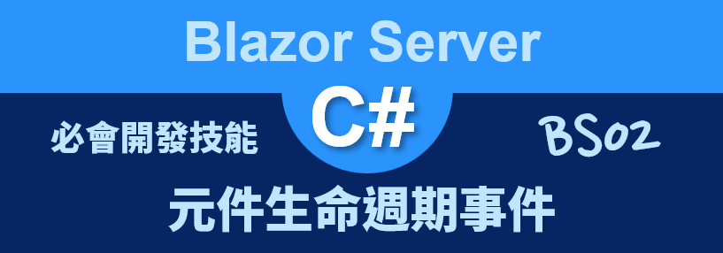

# Blazor Server 必會開發技能 - 元件生命週期事件



在進行 [Blazor](https://docs.microsoft.com/zh-tw/aspnet/core/blazor/?view=aspnetcore-5.0&WT.mc_id=DT-MVP-5002220) 專案開發的時候，會設計出許多的 Razor Component 元件 ( 也可以稱為 Blazor 元件)，並且將這些元件組合起來，便可以設計出相當優秀的 Web 頁面專案。

當使用預設的 Blazor Server 專案，每個頁面要顯示在網頁的時候，都會套用 [MainLayout.razor] Razor 元件經過 Render 轉譯的處理動作，便可以在瀏覽器上看到這個網頁內容，這裡可以從 [Pages] > [MainLayout.razor] 這個 Razor 元件檔案內容看出來。

```html
@inherits LayoutComponentBase

<div class="page">
    <div class="sidebar">
        <NavMenu />
    </div>

    <div class="main">
        <div class="top-row px-4">
            <a href="https://docs.microsoft.com/aspnet/" target="_blank">About</a>
        </div>

        <div class="content px-4">
            @Body
        </div>
    </div>
</div>
```

這個檔案將會在這個 Blazor 專案內用於版面配置的目的，也就是每個有使用 `@page ...` 這樣的 指示詞 Directive 的 Razor 元件，可以直接透過在瀏覽器上輸入適當的 URL，便可以顯示這個頁面；而所指定的頁面將會顯示在上面 [MainLayout.razor] 檔案內的 `@Body` 區域內。

另外，在這個 Razor 元件內也有一個 `<NavMenu />` ，這個元件將會用來顯示在網頁最左邊的功能選項清單之用，也就是說，最佳的 Blazor 專案設計策略，將會是將許多網頁上的區塊內容，切割成為不同的 Razor 元件，接著在進行組合成為一個複合式 Razor 元件，接著，就可以將這個複合式元件顯示到瀏覽器畫面上，如此，使用者就可以最終看到這個網頁內容。

對於在使用 Razor 元件進行程式設計的時候，將會需要了解到 Razor 元件的生命週期，也就是要來了解當 Razor 元件誕生之後，緊接著會觸發那些委派方法事件，如此，程式設計師便可以透過這些委派事件進行額外的商業邏輯設計。

例如：當這個元件建立之後，期望能夠設定一些預設值、從資料庫內讀需必要的紀錄並顯示到螢幕上等等需求，就需要使用到這些委派方法事件來做到，而在這些委派方法事件會在甚麼時候被觸發與這些委派方法事件的執行先後順序為何，便是在這篇文章可以來了解。

這裡說明的範例專案原始碼位於 [BS02](https://github.com/vulcanlee/Blazor-Xamarin-Full-Stack-HOL/tree/main/Examples/BS02)

## 建立 Blazor Server-Side 的專案

* 打開 Visual Studio 2019
* 點選右下方的 [建立新的專案] 按鈕
* [建立新專案] 對話窗將會顯示在螢幕上
* 從[建立新專案] 對話窗的中間區域，找到 [Blazor 應用程式] 這個專案樣板選項，並且選擇這個項目
* 點選右下角的 [下一步] 按鈕
* 現在 [設定新的專案] 對話窗將會出現
* 請在這個對話窗內，輸入適當的 [專案名稱] 、 [位置] 、 [解決方案名稱]

  在這裡請輸入 [專案名稱] 為 `BS02`

* 完成後，請點選 [建立] 按鈕
* 當出現 [建立新的 Blazor 應用程式] 對話窗的時候
* 請選擇最新版本的 .NET Core 與 [Blazor 伺服器應用程式]
* 完成後，請點選 [建立] 按鈕

  稍微等會一段時間，Blazor 專案將會建立起來

## 建立 Razor 元件

* 滑鼠右擊 Blazor 專案內的 [Pages] 資料夾
* 選擇 [加入] > [Razor 元件]
* 當 [新增項目 - BS02] 對話窗出現之後，請在下方名稱欄位內，輸入 `LifeCycleView`
* 最後點選 [新增] 按鈕
* 請依據底下程式碼替換到這個檔案內容

```html
<div class="card">
    <h5 class="card-header">LifeCycleView.razor</h5>
    <div class="card-body">
        <h3 class="text-primary">@Message</h3>
    </div>
</div>

@code {
    [Parameter]
    public string Message { get; set; }

    protected override void OnInitialized()
    {
        Console.WriteLine($"執行 OnInitialized");
    }
    protected override Task OnInitializedAsync()
    {
        Console.WriteLine($"執行 OnInitializedAsync");
        return Task.FromResult(0);
    }
    protected override void OnAfterRender(bool firstRender)
    {
        Console.WriteLine($"執行 OnAfterRender - {firstRender}");
    }
    protected override Task OnAfterRenderAsync(bool firstRender)
    {
        Console.WriteLine($"執行 OnAfterRenderAsync - {firstRender}");
        return Task.FromResult(0);
    }
    protected override void OnParametersSet()
    {
        Console.WriteLine($"執行 OnParametersSet");
    }
    protected override Task OnParametersSetAsync()
    {
        Console.WriteLine($"執行 OnParametersSetAsync");
        return Task.FromResult(0);
    }
    public override Task SetParametersAsync(ParameterView parameters)
    {
        Console.WriteLine($"執行 SetParametersAsync");
        return base.SetParametersAsync(parameters);
    }
    protected override bool ShouldRender()
    {
        Console.WriteLine($"執行 ShouldRender");
        return base.ShouldRender();
    }
}
```

在這個 [Razor 元件] 檔案中，僅有六行 HTML 標記的宣告，這裡使用 Bootstrap Card 的方式來呈現這個元件要顯示在網頁上的方式，並且在 Card 裡面顯示出這個元件參數內容，也就是 `@Message` 這個變數。

在底下 C# 程式碼中，將會使愈 C# [屬性 Attribute](https://docs.microsoft.com/zh-tw/dotnet/csharp/programming-guide/concepts/attributes?WT.mc_id=DT-MVP-5002220) `[Parameter]` 來標示出 [Message] 這個 C# 類別內的 [屬性 Property](https://docs.microsoft.com/zh-tw/dotnet/csharp/programming-guide/classes-and-structs/properties?WT.mc_id=DT-MVP-5002220) 是具備這個元件的參數，也就是說，當在使用 [LifeCycleView] 元件時候，可以透過這個使用 HTML 標記屬性方式，傳遞相關物件值到這個元件內的 [Message] 變數內。

由於每個 [Razor 元件] 都會由編譯器產生為一個類別，而這些類別將會繼承 [ComponentBase] 元件的選擇性基底類別，例如，在編譯器對於這個元件將會產生出這樣的類別宣告 ： `public partial class LifeCycleView : Microsoft.AspNetCore.Components.ComponentBase`

在 [ComponentBase] 類別內，將會有宣告了這些 OnInitialized 、 OnParametersSet 、 OnAfterRender 、 SetParametersAsync 同步的生命週期事件與這些 OnInitializedAsync 、 OnParametersSetAsync 、 OnAfterRenderAsync 、 ShouldRender 非同步的生命週期事件；而當在使用這些 Blazor 元件的時候，將會依序觸發這些生命週期事件

* 第一次使用這個 Razor 元件時候，會先建立這個元件之執行個體
* 當在第一次在要求時轉譯元件，將會觸發底下這兩個生命週期事件
* 執行 SetParametersAsync 方法來執行屬性注入，這代表在轉譯樹狀結構中設定元件父系所提供的參數
* 執行 OnInitialized 、 OnInitializedAsync ，代表元件準備好啟動時叫用的方法，在轉譯樹狀結構中從其父系收到其初始參數。
* 因為剛剛已經執行完成了 SetParametersAsync 方法，所以將會觸發 OnParametersSet 、 OnParametersSetAsync  ，這兩個方法表示當元件在轉譯樹狀結構中從其父系收到參數，且傳入值已指派給屬性時，將會觸發這兩個方法
* OnAfterRender 、 OnAfterRenderAsync 這表示每次轉譯元件之後叫用的方法
* ShouldRender 方法將會用於傳回布林值，指出元件是否應該要進行轉譯處理動作

在這個元件內將會覆寫上述的相關的生命週期事件方法，並且在這些事件方法內，使用 `Console.WriteLine` 方法顯示出一段文字，說明現在正在執行這個事件方法。

## 使用這個元件

* 打開 [Pages] 資料夾內的 [Index.razor] 檔案
* 請使用底下程式碼替換到這個檔案內容

```html
@page "/"

<h1>Hello, Blazor 生命週期事件!</h1>

<LifeCycleView Message="@MyMessage" />
<br />
<button class="btn btn-primary"
        @onclick="OnClick">
    進行資料綁定變更
</button>

<SurveyPrompt Title="How is Blazor working for you?" />

@code{
    public string MyMessage { get; set; } = "First";

    void OnClick()
    {
        Console.WriteLine();
        MyMessage = "文字變更了";
    }
}
```

當要使用一個 [Razor 元件] 或者 [Blazor 元件] 的時候，只需要使用這個元件的名稱當作為一個 HTML 標籤來使用即可，若想要傳遞引數到這個元件內，在這個元件標籤旁，標示這個參數的屬性名稱與要傳遞過去的物件值即可，如同上面程式碼使用方式 `<LifeCycleView Message="@MyMessage" />`。

在這個首頁元件內，另外宣告一個按鈕，當按下這個按鈕之後，將會變更所綁定的參數值。

## 執行這個專案

* 使用 [Kestrel](https://docs.microsoft.com/zh-tw/aspnet/core/fundamentals/servers/kestrel?view=aspnetcore-5.0&WT.mc_id=DT-MVP-5002220) 的方式來執行這個專案
* 按下 [F5] 按鍵，開始執行這個 Blazor 專案
* 一旦啟動完成，就會自動開以瀏覽器

  

* 此時，從 [命令提示字元視窗] 內將會看到底下的內容輸出

```
info: Microsoft.Hosting.Lifetime[0]
      Now listening on: https://localhost:5001
info: Microsoft.Hosting.Lifetime[0]
      Now listening on: http://localhost:5000
info: Microsoft.Hosting.Lifetime[0]
      Application started. Press Ctrl+C to shut down.
info: Microsoft.Hosting.Lifetime[0]
      Hosting environment: Development
info: Microsoft.Hosting.Lifetime[0]
      Content root path: D:\Vulcan\GitHub\Blazor-Xamarin-Full-Stack-HOL\Examples\BS02\BS02
執行 SetParametersAsync
執行 OnInitialized
執行 OnInitializedAsync
執行 OnParametersSet
執行 OnParametersSetAsync
執行 SetParametersAsync
執行 OnInitialized
執行 OnInitializedAsync
執行 OnParametersSet
執行 OnParametersSetAsync
執行 OnAfterRender - True
執行 OnAfterRenderAsync - True執行結果
```

* 在這裡將會看到 OnInitialized 這個方法有執行兩次，這是因為這個 Blazor 專案有宣告使用 ServerPrerendered ，這表示將元件轉譯為靜態 HTML，並包含 Blazor 伺服器端應用程式的標記，而第二次的轉譯行為，才是真正要輸出到瀏覽器的 DOM 物件清單內，如此才會讓使用者看到最後的網頁結果，這裡可以從在最後面才會有呼叫 OnAfterRender 來看出來
* 接著，點選 [進行資料綁定變更] 按鈕
* 此時當初所綁定的參數物件值變更了，所以觸發了 SetParametersAsync
* 當參數綁定行為處理完畢之後，將會觸發 OnParametersSet
* 接下來觸發 ShouldRender 方法，決定是否需要轉譯這次變更的網頁內容
* 一旦轉譯完成，將會觸發 OnAfterRender 方法
* 底下為按下這個按鈕的輸出內容

```
執行 SetParametersAsync
執行 OnParametersSet
執行 OnParametersSetAsync
執行 ShouldRender
執行 OnAfterRender - False
執行 OnAfterRenderAsync - False
```


