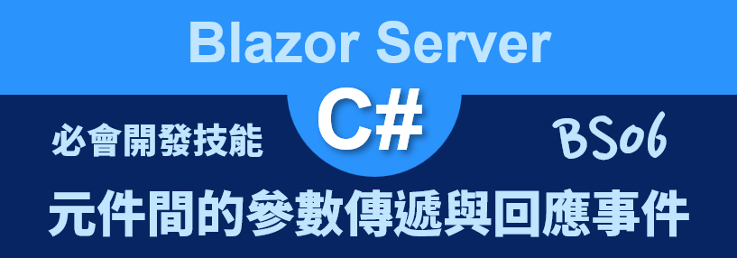
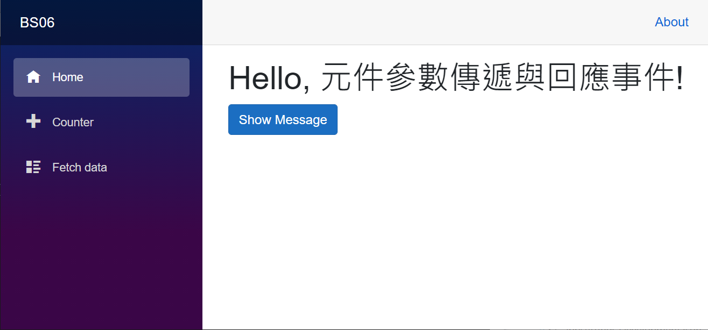
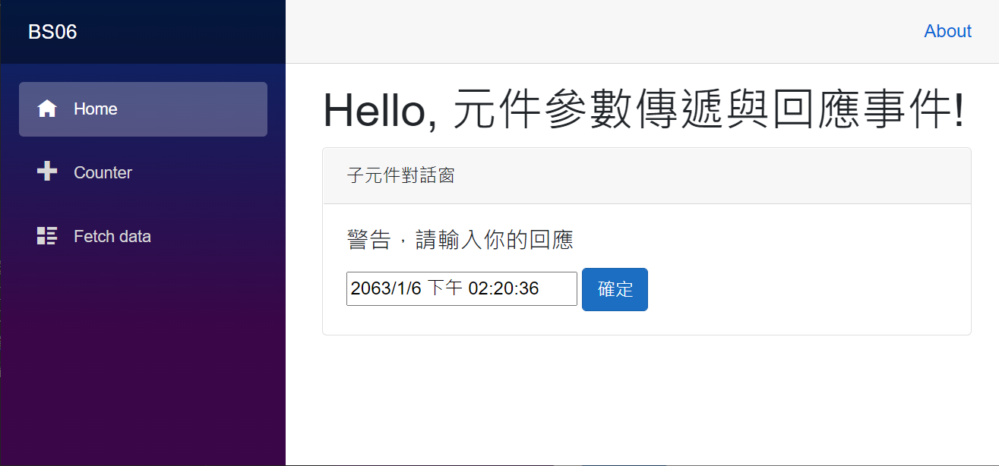
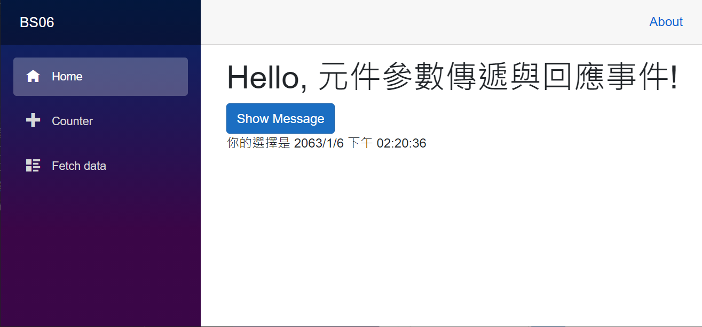

# Blazor Server 必會開發技能 - 元件間的參數傳遞與回應事件



對於在進行元件化設計的時候，將會有這些元件間互相傳遞資訊的需求，在這個練習 [Blazor](https://docs.microsoft.com/zh-tw/aspnet/core/blazor/?view=aspnetcore-5.0&WT.mc_id=DT-MVP-5002220) 專案內，將會設計一個子元件，這個子元件將會在 Index.razor 元件內會參考使用。

上層元件 (Index.razor) 提供一個按鈕，將會產生一個現在日期時間字串，透過綁定子元件參數的方式，把這個物件值傳遞到子元件內；而在子元件內會有一個文字輸入盒與一個按鈕，使用者在子元件內輸入任何文字到文字輸入盒內，接著按下按鈕，此時，會從子元件內把剛剛輸入的文字，傳遞到 Index.razor 元件內來顯示在網頁上。

這裡說明的範例專案原始碼位於 [BS06](https://github.com/vulcanlee/Blazor-Xamarin-Full-Stack-HOL/tree/main/Examples/BS06)

## 建立 Blazor Server-Side 的專案

* 打開 Visual Studio 2019
* 點選右下方的 [建立新的專案] 按鈕
* [建立新專案] 對話窗將會顯示在螢幕上
* 從[建立新專案] 對話窗的中間區域，找到 [Blazor 應用程式] 這個專案樣板選項，並且選擇這個項目
* 點選右下角的 [下一步] 按鈕
* 現在 [設定新的專案] 對話窗將會出現
* 請在這個對話窗內，輸入適當的 [專案名稱] 、 [位置] 、 [解決方案名稱]

  在這裡請輸入 [專案名稱] 為 `BS06`

* 完成後，請點選 [建立] 按鈕
* 當出現 [建立新的 Blazor 應用程式] 對話窗的時候
* 請選擇最新版本的 .NET Core 與 [Blazor 伺服器應用程式]
* 完成後，請點選 [建立] 按鈕

  稍微等會一段時間，Blazor 專案將會建立起來

## 設計子元件的程式碼

* 滑鼠右擊 Blazor 專案內的 [Pages] 資料夾
* 選擇 [加入] > [Razor元件]
* 當 [新增項目 - BS03] 對話窗出現之後，請在下方名稱欄位內，輸入 `ChildView.razor`
* 最後點選 [新增] 按鈕
* 請依據底下程式碼替換到這個檔案內容

```html
<div class="card">
    <div class="card-header">
        子元件對話窗
    </div>
    <div class="card-body">
        <h5 class="card-title">警告，請輸入你的回應</h5>
        <input class="card-text" @bind="Para1" />
        <button class="btn btn-primary" @onclick="CloseDialog">確定</button>
    </div>
</div>
@code {
    [Parameter]
    public string Para1 { get; set; }
    [Parameter]
    public EventCallback<string> OnBtnCloseCallback { get; set; }
    void CloseDialog()
    {
        OnBtnCloseCallback.InvokeAsync($"你的選擇是 {Para1}");
    }
}
```

在這個元件內將使用 `[Parameter]` 來標示兩個屬性為這個元件的參數，這代表當使用這個元件的時候，可以透過這兩個參數來接收到來自於父元件所要傳遞的物件值。

這裡也設計一個按鈕與該按鈕綁定的觸發事件，使用這按下這個按鈕之後，會將使用者輸入的內容值透過 [EventCallback] 物件來執行其委派方法，而該委派方法將會綁定在父元件內的某個方法，這也代表可以讓子元件來執行父元件內的程式碼，另外，因為這裡使用了 [EventCallback<string>] 泛型型別來宣告，這代表了當呼叫了這個 [EventCallback] 委派方法，將可以傳遞字串到父元件內。

## 修改參考子元件的 Index.razor 元件

* 打開 [Pages] 資料夾內的 [Index.razor] 檔案
* 請使用底下程式碼替換到這個檔案內容

```html
@page "/"

<h1>Hello, 元件參數傳遞與回應事件!</h1>

@if (ShowMessagebox == false)
{
    <div>
        <button class="btn btn-primary"
                @onclick="OnShowMessagebox">
            Show Message
        </button>
        <p>@ResponseMessage</p>
    </div>
}
else
{
    <ChildView Para1="@PassArgument" OnBtnCloseCallback="BtnCloseCallback" />
}

@code{
    public bool ShowMessagebox { get; set; } = false;
    public string PassArgument { get; set; }
    public string ResponseMessage { get; set; }
    void OnShowMessagebox()
    {
        PassArgument = DateTime.Now.ToString();
        ShowMessagebox = true;
    }
    void BtnCloseCallback(string message)
    {
        ShowMessagebox = false;
        ResponseMessage = message;
    }
}
```

在這個元件內有設計一個變數 [ShowMessagebox] ，透過這個變數來設定 true 或者 false ，便可以控制這個元件要顯示那些內容，因此，當 [ShowMessagebox] 這個變數設定為 false，會顯示一個按鈕與子元件要回傳的文字，若為 true，則會把按鈕隱藏起來，顯示子元件。

當按下按鈕之後，將會設定 [PassArgument] 這個屬性值為當前的時間字串，此時，因為在宣告子元件的時候，使用 `<ChildView Para1="@PassArgument" OnBtnCloseCallback="BtnCloseCallback" />` 這樣的宣告，所以，便可以透過資料綁定的方式，將這個 [PassArgument] 物件值傳遞到子元件內；而這裡也透過 [OnBtnCloseCallback] 這個子元件的參數名稱來綁定到 [BtnCloseCallback] 方法內，因此，在子元件內可以透過 [EventCallback] 物件來呼叫這個方法，並且可以傳遞引數到父元件內。

## 執行這個專案

* 按下 [F5] 按鍵，開始執行這個 Blazor 專案
* 一旦啟動完成，就會自動開以瀏覽器

  

* 請點選 [Show Message] 按鈕
* 現在子元件將會顯示出來，而且在父元件內會取得現在電腦時間，並且顯示在子元件內

  

* 請修改文字輸入盒內的文字內容
* 按下 [確定] 按鈕
* 此時，會把剛剛輸入的文字回傳到父元件內，並且顯示在網頁上

  


