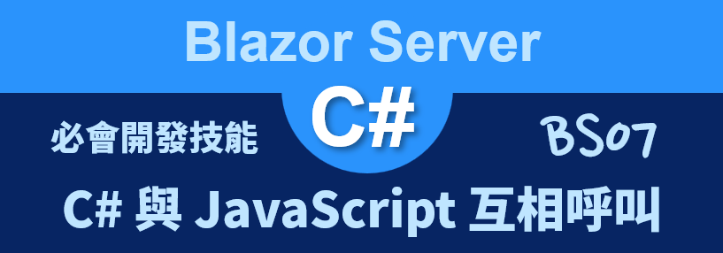
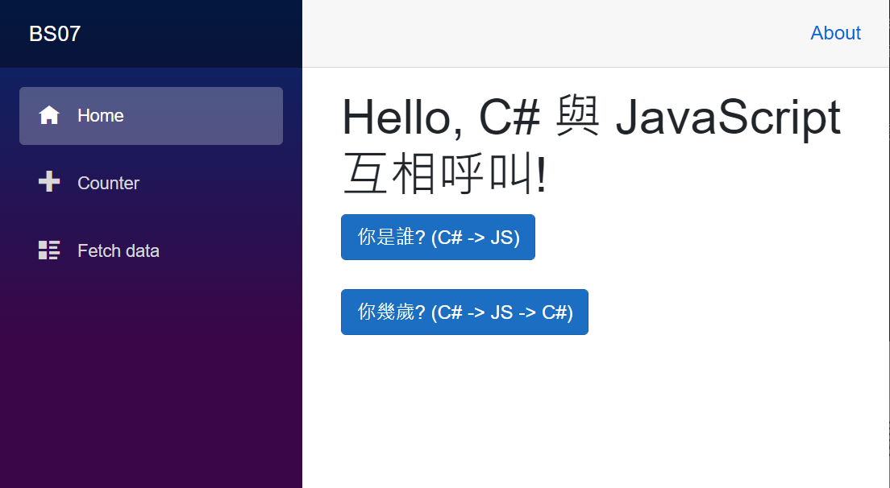
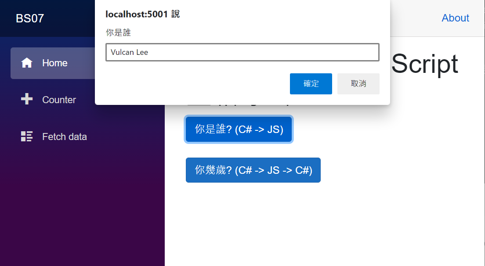
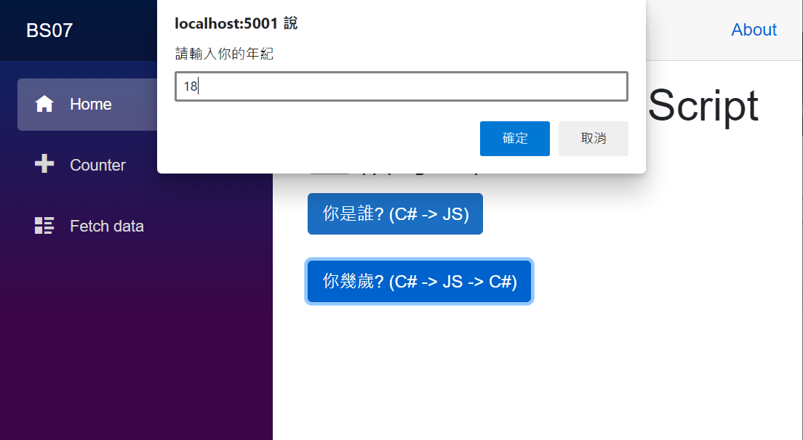
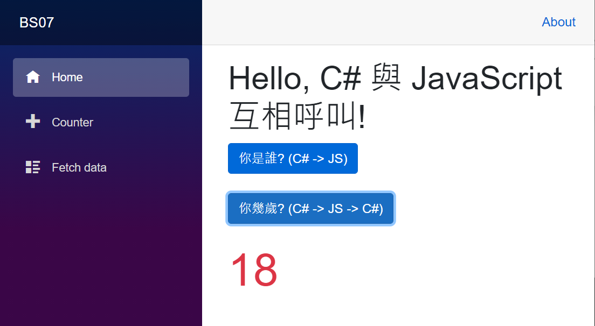

# Blazor Server 必會開發技能 - C# 與 JavaScript 互相呼叫



當在使用 [Blazor](https://docs.microsoft.com/zh-tw/aspnet/core/blazor/?view=aspnetcore-5.0&WT.mc_id=DT-MVP-5002220) 進行網站應用系統開發的時候，原則上，不再需要使用到 JavaScript 程式語言，不過，有些時候還是要需要能夠讓 C# 來呼叫 JavaScript 程式碼或者在 JavaScript 程式語言中來呼叫 .NET C# 的靜態或者執行個體公開方法，例如，想要把 Google Map 這樣的應用需求加入到 Blazor 專案內，就有可能需要進行這樣的設計，當然，也可以使用已經把這些需求打包成為 Blazor 套件來使用，在這篇文章將會來練習如何設計這樣的程式碼。

這裡說明的範例專案原始碼位於 [BS07](https://github.com/vulcanlee/Blazor-Xamarin-Full-Stack-HOL/tree/main/Examples/BS07)

## 建立 Blazor Server-Side 的專案

* 打開 Visual Studio 2019
* 點選右下方的 [建立新的專案] 按鈕
* [建立新專案] 對話窗將會顯示在螢幕上
* 從[建立新專案] 對話窗的中間區域，找到 [Blazor 應用程式] 這個專案樣板選項，並且選擇這個項目
* 點選右下角的 [下一步] 按鈕
* 現在 [設定新的專案] 對話窗將會出現
* 請在這個對話窗內，輸入適當的 [專案名稱] 、 [位置] 、 [解決方案名稱]

  在這裡請輸入 [專案名稱] 為 `BS07`

* 完成後，請點選 [建立] 按鈕
* 當出現 [建立新的 Blazor 應用程式] 對話窗的時候
* 請選擇最新版本的 .NET Core 與 [Blazor 伺服器應用程式]
* 完成後，請點選 [建立] 按鈕

  稍微等會一段時間，Blazor 專案將會建立起來

## 加入 JavaScript 程式碼

* 打開 [Pages] 資料夾內的 [_Host.cshtml] 檔案
* 在 `<head>` 區段加入底下的 JavaScript 程式碼

```JavaScript
@*客製化的 JavaScript*@
<script>
    window.helloWorld = {
        askYourName: function (title, hint) {
            return prompt(title, hint);
        },
        sayYourAgeToCsharp: function (dotNetHelper) {
            age = prompt('請輸入你的年紀', '所輸入數值將會傳遞給 C# 方法')
            dotNetHelper.invokeMethodAsync('GetStringFromJavaScript', age);
        },
    };
</script>
```

## 修改 Index.razor 元件

* 打開 [Pages] 資料夾內的 [Index.razor] 檔案
* 請使用底下程式碼替換到這個檔案內容

```html
@page "/"
@inject IJSRuntime JSRuntime
<h1>Hello, C# 與 JavaScript 互相呼叫!</h1>

<button class="btn btn-primary" @onclick="AskYourName">你是誰? (C# -> JS)</button>
<div class="display-4 text-success">@Name</div>
<button class="btn btn-primary my-4" @onclick="AskYourAge">你幾歲? (C# -> JS -> C#)</button>
<div class="display-4 text-danger">@Message</div>

@code {
    public string Name { get; set; }
    public string Message { get; set; }
    private DotNetObjectReference<Index> objRef;

    async Task AskYourName()
    {
        Name = await JSRuntime.InvokeAsync<string>(
            "helloWorld.askYourName", "你是誰", "請輸入你的姓名");
    }

    async Task AskYourAge()
    {
        DotNetObjectReference<Index> objRef = DotNetObjectReference.Create(this);
        await JSRuntime.InvokeVoidAsync("helloWorld.sayYourAgeToCsharp", objRef);
    }

    [JSInvokable]
    public void GetStringFromJavaScript(string message)
    {
        Message = message;
    }
}
```

首先來看看如何在 C# 程式碼內來呼叫 JavaScript 內的方法，要能夠做到這樣的程式設計，首先要先使用 `@inject` 指示詞 Directive 來注入 [IJSRuntime] 這個物件。

在 `[你是誰? (C# -> JS)]` 按鈕所綁定的委派事件中，使用了這樣的敘述 `Name = await JSRuntime.InvokeAsync<string>("helloWorld.askYourName", "你是誰", "請輸入你的姓名");` 來呼叫 JavaScript 方法，在 [JSRuntime.InvokeAsync] 方法的第一個參數將會是要呼叫的 [JavaScript] 方法名稱，而後的引數將會是要傳遞到 JavaScript 方法參數。

從這個 [window.helloWorld] 方法可以看出，該 [JavaScript] 方法使用了 [Prompt] 方法，要求使用者輸入一個文字字串，一旦使用者輸入完成後，就會回傳到 .NET C# 方法內了，因此，透過 [Name] 這個變數，就可以取得使用者輸入的文字內容

在這個 [你幾歲? (C# -> JS -> C#)] 按鈕中，將會呈現先使用 C# 呼叫一個 [JavaScript] 方法，接著，在 [JavaScript] 程式碼內，將會透過了 `dotNetHelper.invokeMethodAsync('GetStringFromJavaScript', age);` 方法來呼叫 .NET C# 內的 [GetStringFromJavaScript]。

首先，在 C# 按鈕方法內將會使用 `DotNetObjectReference<Index> objRef = DotNetObjectReference.Create(this);` 敘述來建立一個 [DotNetObjectReference<Index>] 物件，這裡的泛型型別參數將會表示將要採用執行個體的方法來呼叫，而不是使用靜態的方法 (要在 JavaScript 內呼叫 .NET 的靜態方法，需要使用 [DotNet.invokeMethodAsync] 方式)；這裡產生的物件將會傳入到 JavaScrip 內，接著，在 [JavaScript] 內就可以使用這個物件來呼叫 .NET C# 物件的方法了。

最後，為了要能夠讓 [JavaScript] 呼叫 .NET C# 的方法，該方法需要使用 `[JSInvokable]` 屬性標住在方法前面，代表這個方法可以被 .NET C# 呼叫之用。

## 執行這個專案

* 按下 [F5] 按鍵，開始執行這個 Blazor 專案
* 一旦啟動完成，就會自動開以瀏覽器

  

* 請點選 [你是誰? (C# -> JS)] 按鈕
* 現在在網頁上將會出現一個對話窗，請輸入任何文字並且點選 [確定] 按鈕

  

* 請點選 [你幾歲? (C# -> JS -> C#)] 按鈕
* 現在在網頁上將會出現一個對話窗，請輸入年紀並且點選 [確定] 按鈕

  

* 此時，可以從網頁上看到剛剛在使用 [JavaScript] 程式碼所取得的文字

  


