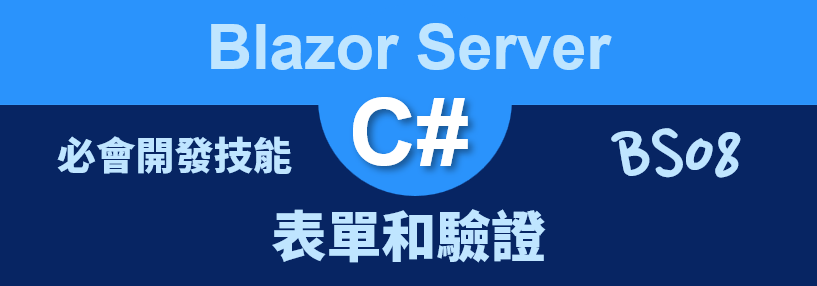
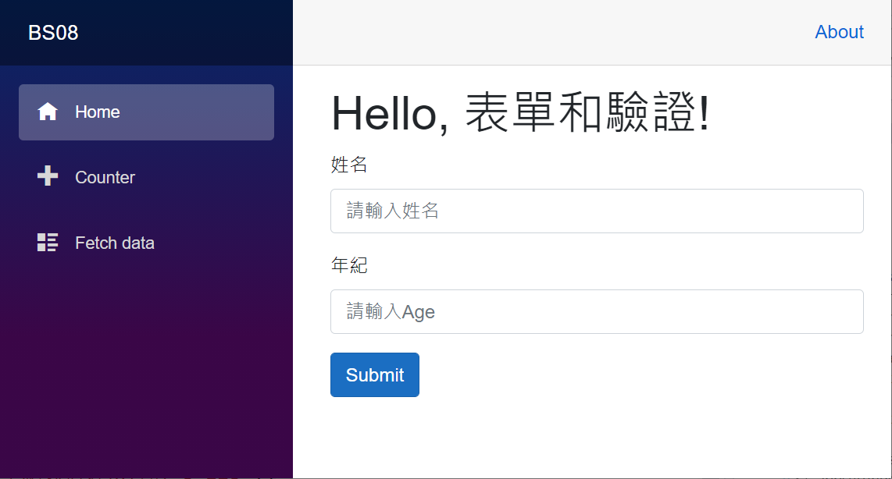
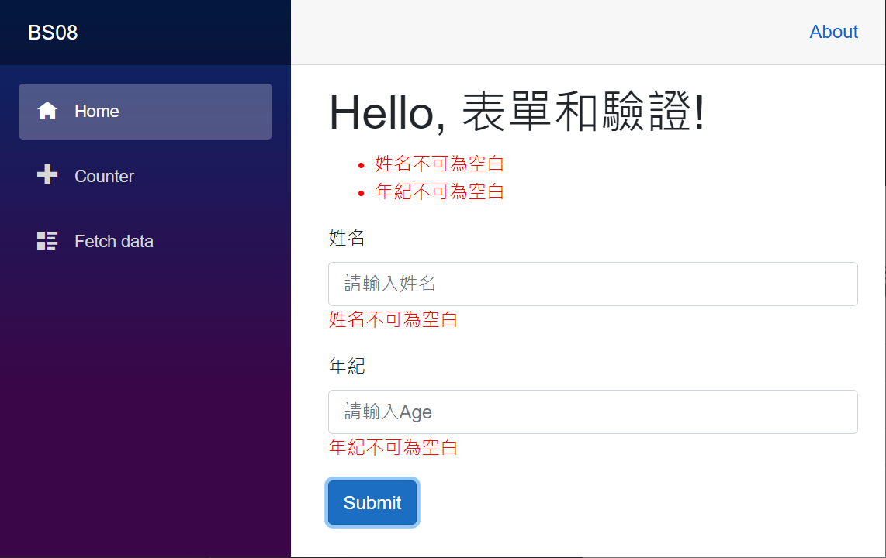
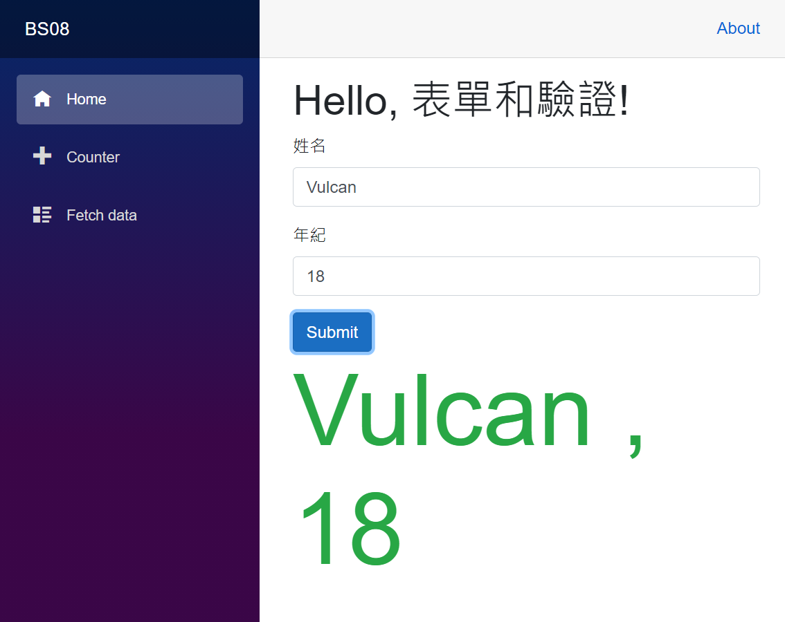

# Blazor Server 必會開發技能 - 表單和驗證



對於在進行元件化設計的時候，將會有這些元件間互相傳遞資訊的需求，在這個練習 [Blazor](https://docs.microsoft.com/zh-tw/aspnet/core/blazor/?view=aspnetcore-5.0&WT.mc_id=DT-MVP-5002220) 專案內，將會設計一個子元件，這個子元件將會在 Index.razor 元件內會參考使用。

上層元件 (Index.razor) 提供一個按鈕，將會產生一個現在日期時間字串，透過綁定子元件參數的方式，把這個物件值傳遞到子元件內；而在子元件內會有一個文字輸入盒與一個按鈕，使用者在子元件內輸入任何文字到文字輸入盒內，接著按下按鈕，此時，會從子元件內把剛剛輸入的文字，傳遞到 Index.razor 元件內來顯示在網頁上。

這裡說明的範例專案原始碼位於 [BS08](https://github.com/vulcanlee/Blazor-Xamarin-Full-Stack-HOL/tree/main/Examples/BS08)

## 建立 Blazor Server-Side 的專案

* 打開 Visual Studio 2019
* 點選右下方的 [建立新的專案] 按鈕
* [建立新專案] 對話窗將會顯示在螢幕上
* 從[建立新專案] 對話窗的中間區域，找到 [Blazor 應用程式] 這個專案樣板選項，並且選擇這個項目
* 點選右下角的 [下一步] 按鈕
* 現在 [設定新的專案] 對話窗將會出現
* 請在這個對話窗內，輸入適當的 [專案名稱] 、 [位置] 、 [解決方案名稱]

  在這裡請輸入 [專案名稱] 為 `BS08`

* 完成後，請點選 [建立] 按鈕
* 當出現 [建立新的 Blazor 應用程式] 對話窗的時候
* 請選擇最新版本的 .NET Core 與 [Blazor 伺服器應用程式]
* 完成後，請點選 [建立] 按鈕

  稍微等會一段時間，Blazor 專案將會建立起來

## 修改參考子元件的 Index.razor 元件

* 打開 [Pages] 資料夾內的 [Index.razor] 檔案
* 請使用底下程式碼替換到這個檔案內容

```html
@page "/"
@using System.ComponentModel.DataAnnotations

<h1>Hello, 表單和驗證!</h1>

<EditForm Model="@User" OnValidSubmit="@HandleValidSubmit">
    <DataAnnotationsValidator />
    <ValidationSummary />

    <div class="form-row">
        <div class="form-group col">
            <label class="control-label">姓名</label>
            <input class="form-control" @bind="@User.Name"
                   Placeholder="請輸入姓名" />
            <ValidationMessage For="@(() => User.Name)" />
        </div>
    </div>

    <div class="form-row">
        <div class="form-group col">
            <label class="control-label">年紀</label>
            <input class="form-control" @bind="@User.Age"
                   Placeholder="請輸入Age" />
            <ValidationMessage For="@(() => User.Age)" />
        </div>
    </div>

    <button class="btn btn-primary" type="submit">Submit</button>
</EditForm>

<div class="display-1 text-success">@Message</div>
@code{
    public UserData User { get; set; } = new();
    public string Message { get; set; }
    void HandleValidSubmit()
    {
        Message = $"{User.Name} , {User.Age}";
    }

    public class UserData
    {
        [Required(ErrorMessage = "姓名不可為空白")]
        public string Name { get; set; }
        [Required(ErrorMessage = "年紀不可為空白")]
        [Range(minimum:0, maximum:120, ErrorMessage ="年紀數值必須介於 0~120")]
        public string Age { get; set; }
    }
}
```

在 Blazor 開發框架下，提供了 [EditForm 類別](https://docs.microsoft.com/zh-tw/dotnet/api/microsoft.aspnetcore.components.forms.editform?view=aspnetcore-5.0&WT.mc_id=DT-MVP-5002220) 元件，該元件在進行轉譯過程可以將 form 元素的相關應用。 在這個範例中，提供了 [Model] 參數屬性，在這裡可以指定表單的最上層模型物件與針對此模型來建立編輯內容，而 [OnValidSubmit] 參數將會綁定一個方法，當進行提交表單的時候，若沒有違反表單驗證規則，這個委派方法將會被呼叫。

在 [EditForm] 內加入了兩個元件 `<DataAnnotationsValidator />` 與 `<ValidationSummary />`。 [DataAnnotationsValidator] 是提供將資料批註驗證支援加入至 EditContext，而 [ValidationSummary] 則是將違反表單驗證規則的所有訊息都集中顯示在這裡。

在這個 [EditForm] 區段內將會有兩個 `<div class="form-row">` ... `</div>` 宣告，分別使用了 `<input class="form-control" @bind="@User.Name" Placeholder="請輸入姓名" />` 與 `<input class="form-control" @bind="@User.Age" Placeholder="請輸入Age" />` HTML 標記，使用了雙向資料綁定提供使用者來輸入 姓名 與 年紀，其中每個文字輸入盒下方還有宣告 `<ValidationMessage For="@(() => User.Name)" />` ，這表示若這個欄位違反資料驗證的設定，將會顯示驗證訊息。

對於綁定的資料模型，這裡使用的是 [UserData]，這個類別內有兩個屬性，分別有使用 [Required] 與 [Range] 屬性宣告，定義這些屬性資料要具備甚麼樣的格式。

## 執行這個專案

* 按下 [F5] 按鍵，開始執行這個 Blazor 專案
* 一旦啟動完成，就會自動開以瀏覽器

  

* 請點選 [Submit] 按鈕
* 因為現在都沒有輸入任何資料，所以，違反資料驗證宣告，因此，將會將違反表單資料驗證的訊息，使用紅色的文字在網頁上

  

* 一旦輸入的文字內容都正確的話，就會出現如下圖畫面

  


