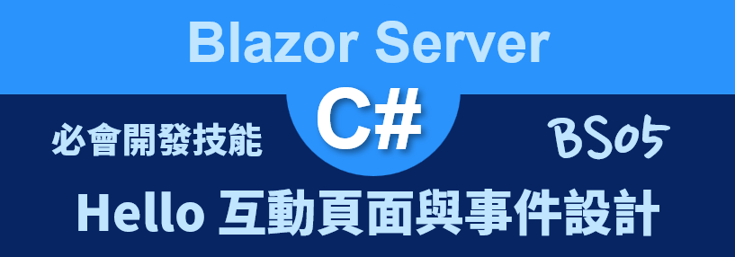
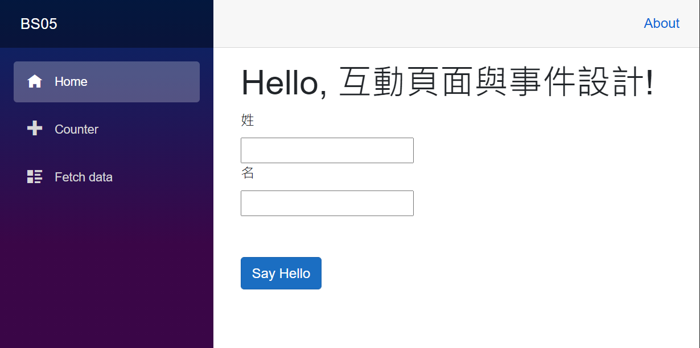
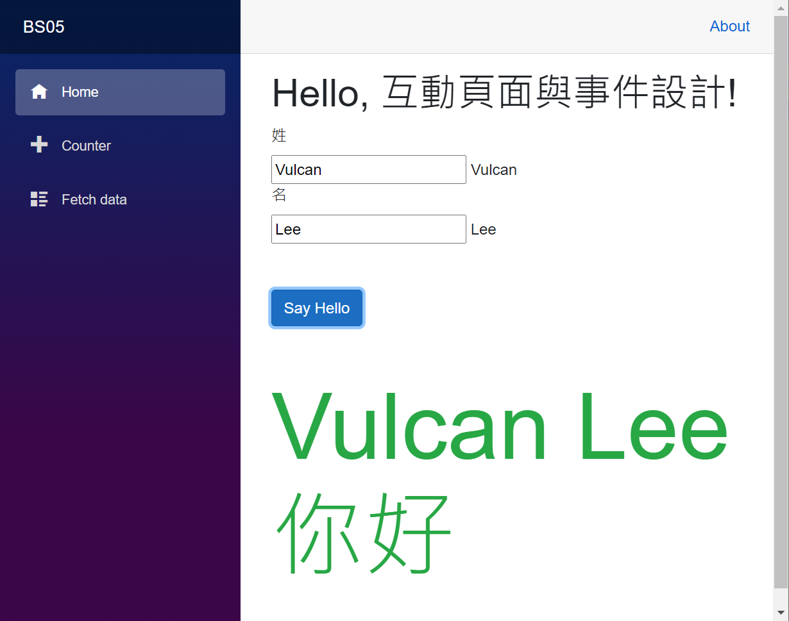

# Blazor Server 必會開發技能 - Hello 互動頁面與事件設計



在這篇文章將會來使用 [Blazor](https://docs.microsoft.com/zh-tw/aspnet/core/blazor/?view=aspnetcore-5.0&WT.mc_id=DT-MVP-5002220) 進行學習程式設計過程中，一定會學習的一個練習題，那就是 Hello World。

在這個練習中，將完全不需要用到 jQuery 或者 JavaScript 程式語言就可以做到動態網頁的效果，在完成設計的網頁上，將會有兩個文字輸入盒，分別代表要輸入 姓 與 名 這兩個欄位，另外再加入一個問安的按鈕，一旦輸入完成你的姓名並且按下問安按鈕之後，此時，在網頁的最下方將會出現向你問安的文字。

這裡說明的範例專案原始碼位於 [BS05](https://github.com/vulcanlee/Blazor-Xamarin-Full-Stack-HOL/tree/main/Examples/BS05)

## 建立 Blazor Server-Side 的專案

* 打開 Visual Studio 2019
* 點選右下方的 [建立新的專案] 按鈕
* [建立新專案] 對話窗將會顯示在螢幕上
* 從[建立新專案] 對話窗的中間區域，找到 [Blazor 應用程式] 這個專案樣板選項，並且選擇這個項目
* 點選右下角的 [下一步] 按鈕
* 現在 [設定新的專案] 對話窗將會出現
* 請在這個對話窗內，輸入適當的 [專案名稱] 、 [位置] 、 [解決方案名稱]

  在這裡請輸入 [專案名稱] 為 `BS05`

* 完成後，請點選 [建立] 按鈕
* 當出現 [建立新的 Blazor 應用程式] 對話窗的時候
* 請選擇最新版本的 .NET Core 與 [Blazor 伺服器應用程式]
* 完成後，請點選 [建立] 按鈕

  稍微等會一段時間，Blazor 專案將會建立起來

## 設計問安的程式碼

* 打開 [Pages] 資料夾內的 [Index.razor] 檔案
* 請使用底下程式碼替換到這個檔案內容

```html
@page "/"

<h1>Hello, 互動頁面與事件設計!</h1>

<div>
    <label>姓</label>
</div>
<div>
    <input @bind="@LastName" />
    @LastName
</div>

<div>
    <label>名</label>
</div>
<div>
    <input @bind-value="@FirstName" @bind-value:event="oninput" />
    @FirstName
</div>

<div>
    <button class="btn btn-primary" @onclick="SayHello">Say Hello</button>
</div>

<div class="my-5 display-1 text-success">
    @FullName
</div>

@code{
    public string FirstName { get; set; }
    public string LastName { get; set; }
    public string FullName { get; set; }

    void SayHello()
    {
        FullName = $"{LastName} {FirstName} 你好";
    }
}
```

當想要取得網頁上的使用者操作或者輸入的資料，需要使用 Blazor 的雙向資料綁定 Two Way Data Binding 機制，例如，在 `<input>` 這個 HTML 標籤而言，可以使用 `＠bind` 這樣 指示詞來指定要做雙向綁定的 C# 物件，如同這樣使用 `<input @bind="@LastName" />`。

若使用 `<input value="@LastName" />` 這樣的使用方式，則是宣告這個 Input 採用單向資料綁定 One Way Data Binding ，這代表了當使用 C# 變數 (這裡指的是 LastName 這個屬性物件) 其物件值有變動的時候，會透過單向資料綁定機制將這個物件值更新到瀏覽器的 DOM 上，進而將會造成在網頁上可以看到這個變數物件值；但是，反向運作將不會正常運作，也就是說，若使用者在網頁上進行輸入任何資料，這些異動的資料是不會更新到 C# 屬性變數。

若採用上面提到的雙向綁定宣告方式，當使用者輸入資料的過程中，這些輸入的資料當時還不會更新到 C# 變數內，這要一直等到當使用者點選到網頁的其他地方，也就是要造成對於當時的控制項的焦距 Focus 離開之後，就會觸發雙向綁定運作機制。

可是，若想要做到當使用者在輸入資料過程中，可以隨時透過 C# 變數得知使用者當時輸入了甚麼資料，可以使用 `<input @bind-value="@FirstName" @bind-value:event="oninput" />` 這樣的方式來做到。

當使用了 `@bind-value` 這樣的 指示詞 Directive 表示要進行 [value] 這個屬性的雙向資料綁定，這樣的用法將會可以指定要綁定的屬性名稱，而對於 `@bind-value:event="oninput"` 指示詞，則表示了當 value 這個屬性若有異動的時候，將會觸發 [oninput 事件](https://developer.mozilla.org/zh-CN/docs/Web/API/GlobalEventHandlers/oninput) 這個 DOM 事件，如此，將會進行 C# 物件屬性值更新；由這裡可以看的出來，當使用 `<input @bind="@LastName" />` 方式來宣告雙向資料綁定，則表示當使用者在輸入資料過程中，僅會在 [onchange 事件](https://developer.mozilla.org/zh-CN/docs/Web/API/GlobalEventHandlers/onchange) 被出發的時候，才會更新到 C# 屬性內。

## 執行這個專案

* 按下 [F5] 按鍵，開始執行這個 Blazor 專案
* 一旦啟動完成，就會自動開以瀏覽器

  

* 現在，請分別在 姓名 欄位輸入你的性與名，接著點選 [Say Hello] 按鈕
* 請在輸入 姓 或者 名 兩個欄位的時候，使用者所輸入的內容將會出現在文字輸入盒 [input] 的右方，這裡使用兩種的雙向綁定宣告，請體驗這兩種設計方式的不同在哪裡。
* 此時，透過雙向資料綁定機制的運作，在 C# 程式碼內將會抓取到剛剛在網頁輸入的欄位值，並且再度透過單向資料綁定機制，將你輸入的姓名組合起來並顯示在螢幕上，如下圖所示

  


