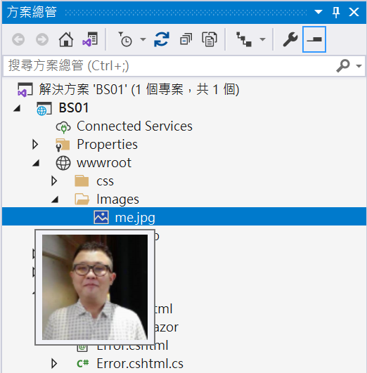
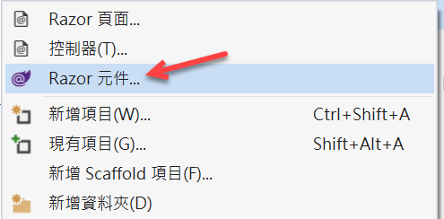
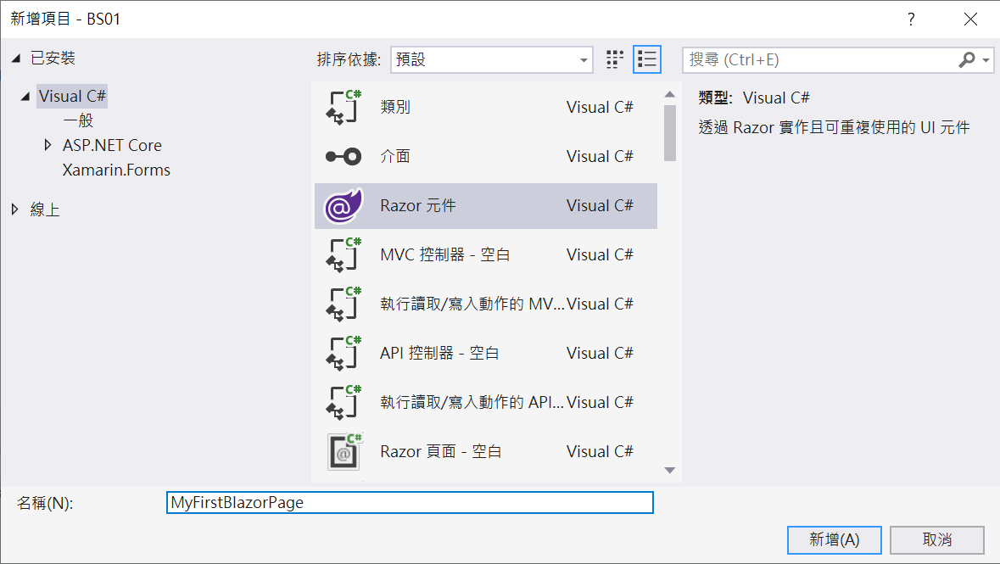
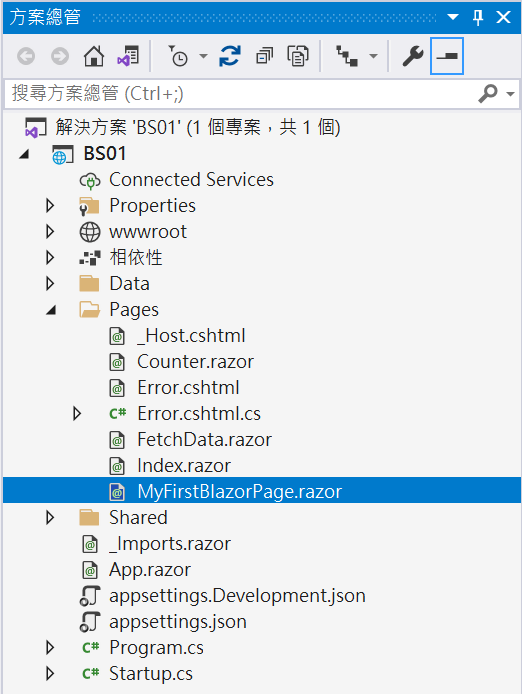
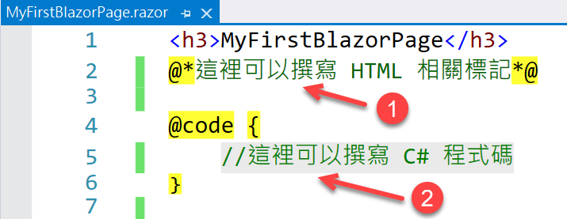
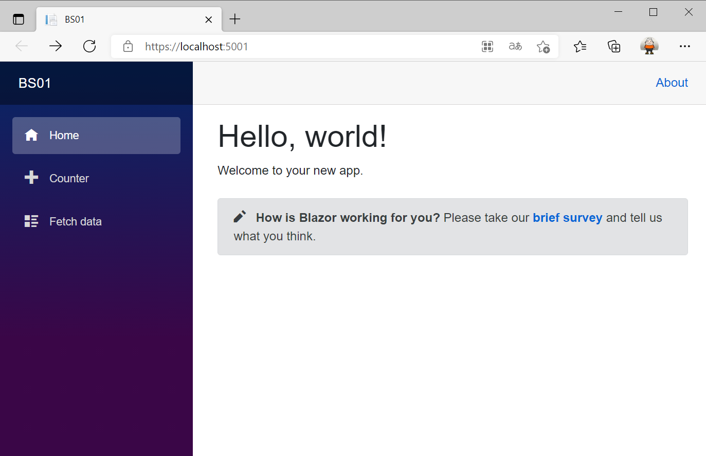

# Blazor Server 必會開發技能 - 建立一個新的頁面


在這篇文章將會說明在進行 [Blazor](https://docs.microsoft.com/zh-tw/aspnet/core/blazor/?view=aspnetcore-5.0&WT.mc_id=DT-MVP-5002220) 專案開發的時候，通常會使用存取資料庫的紀錄，在這個 [Blazor Server 快速開發專案樣板] 內，使用了 [Entity Framework Core 5](https://docs.microsoft.com/zh-tw/ef/core/what-is-new/ef-core-5.0/whatsnew?WT.mc_id=DT-MVP-5002220) Code First 方式來進行存取資料庫，並且在開發階段將會使用本機電腦上的 localDB 資料庫來進行開發。

這裡說明的範例專案原始碼位於 [https://github.com/vulcanlee/Blazor-Xamarin-Full-Stack-HOL](https://github.com/vulcanlee/Blazor-Xamarin-Full-Stack-HOL)

## 建立 Blazor Server-Side 的專案

* 打開 Visual Studio 2019
* 點選右下方的 [建立新的專案] 按鈕
* [建立新專案] 對話窗將會顯示在螢幕上
* 從[建立新專案] 對話窗的中間區域，找到 [Blazor 應用程式] 這個專案樣板選項，並且選擇這個項目
* 點選右下角的 [下一步] 按鈕
* 現在 [設定新的專案] 對話窗將會出現
* 請在這個對話窗內，輸入適當的 [專案名稱] 、 [位置] 、 [解決方案名稱]

  在這裡請輸入 [專案名稱] 為 `BS01`

* 完成後，請點選 [建立] 按鈕
* 當出現 [建立新的 Blazor 應用程式] 對話窗的時候
* 請選擇最新版本的 .NET Core 與 [Blazor 伺服器應用程式]
* 完成後，請點選 [建立] 按鈕

  稍微等會一段時間，Blazor 專案將會建立起來

## 加入靜態圖片資源

* 在 Blazor 專案內找到 [wwwroot] 節點
* 滑鼠右擊這個節點
* 從彈出功能表選擇 [新增] > [新增資料夾]
* 將這個新資料夾命名為 [Images]
* 找到一個圖片檔案，拖拉到 [Images] 資料夾內

  > 在這裡，作者是把本身 Facebook 網站上的大頭貼照片下載到本機電腦上，該圖片命名為 [me.jpg] ，接著，使用檔案總管拖拉到 Visual Studio 方案總管之 Blazor 專案下的 [wwwroot] > [Images] 目錄下

  

## 建立第一個 Blazor 專案的頁面

* 滑鼠右擊 Blazor 專案內的 [Pages] 資料夾
* 選擇 [加入] > [Razor 元件]

  > 這裡選擇的 [Razor 元件] 指的就是 [Blazor 元件 Component]，兩者指的是同一件事情，千萬要注意，在這裡不要選擇 [Razor 頁面] 這個選項

  

* 當 [新增項目 - BS01] 對話窗出現之後，請在下方名稱欄位內，輸入 `MyFirstBlazorPage`
* 最後點選 [新增] 按鈕

  

* 在 [方案總管] 視窗內的 Blazor 專案下，展開 [Pages] 資料夾，就可以看到 [MyFirstBlazorPage.razor] 這個 [Razor 元件] 已經建立起來了。

  

* 其中，[MyFirstBlazorPage.razor] 這個檔案也已經開啟了

  在下面圖片中可以看出，一個 Blazor 的開發者，可以在 [Razor 元件] 檔案內設計各種 HTML 的標記語言代碼

  

  另外，可以在這個 [Razor 元件] 檔案內使用 Inline 內嵌 方式來加入 C# 程式碼，
* 請依據底下程式碼輸入到這個檔案內 [MyFirstBlazorPage.razor]

  在最前面有使用 Directive 指示詞 `@page` 用來指定可以加入這樣的路由到 Blazor 專案內，關於更關這方面的資訊，可以參考 [路由範本](https://docs.microsoft.com/zh-tw/aspnet/core/blazor/fundamentals/routing?view=aspnetcore-5.0&WT.mc_id=DT-MVP-5002220)

  根據微軟官方的 [ASP.NET Core Razor 元件](https://docs.microsoft.com/zh-tw/aspnet/core/blazor/components/?view=aspnetcore-5.0&WT.mc_id=DT-MVP-5002220) 文件中有描述到：指示詞 Directive ，用於變更剖析元件標記的方式或函數。 例如，指示詞 @page 會指定具有路由範本的可路由元件，並可在瀏覽器中以特定 URL 直接觸達使用者的要求。

```html
@page "/MyFirstBlazorPage"

@*這裡可以撰寫 HTML 相關標記*@
<h3>MyFirstBlazorPage</h3>

<div>
    
</div>

<div>
    我使用
    <span class="text-danger">Blazor</span>
</div>

<div>
    我的名字叫做
    <span class="h3 text-danger">Vulcan Lee</span>
</div>

@code {
    //這裡可以撰寫 C# 程式碼
}
```

## 執行且觀看執行結果

* 按下 [F5] 按鍵，開始執行這個 Blazor 專案
* 一旦啟動完成，就會自動開以瀏覽器

  

* 在瀏覽器位址列輸入這個 `https://localhost:5001/MyFirstBlazorPage` 網址，就會看到如下圖執行結果

  
