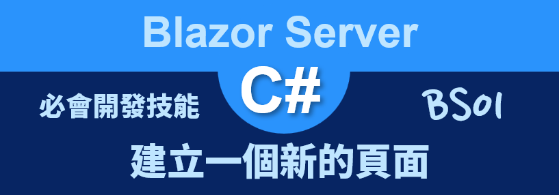
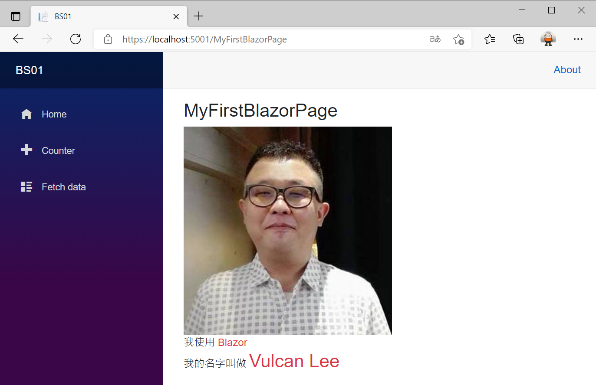
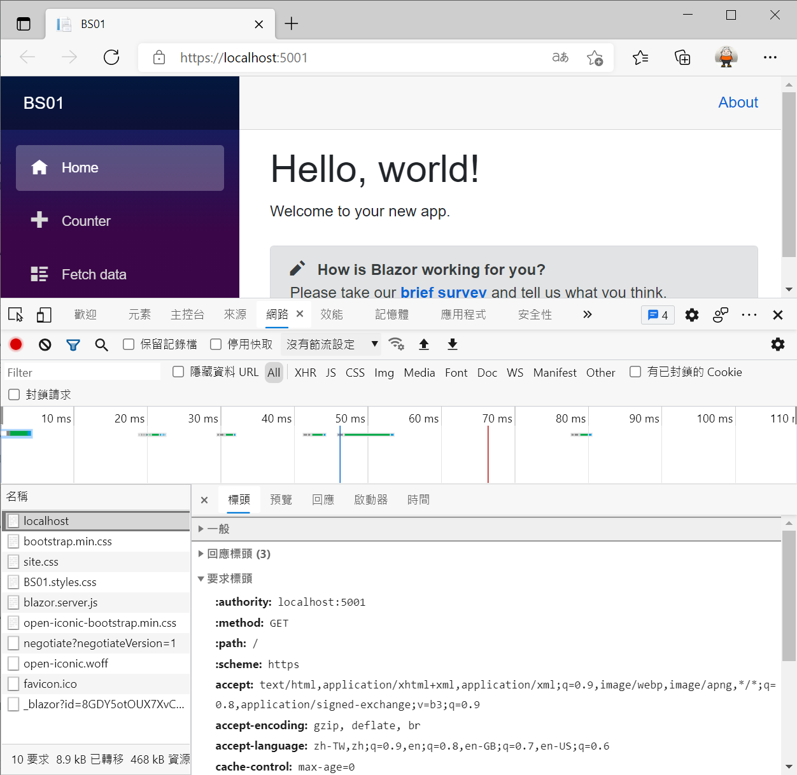
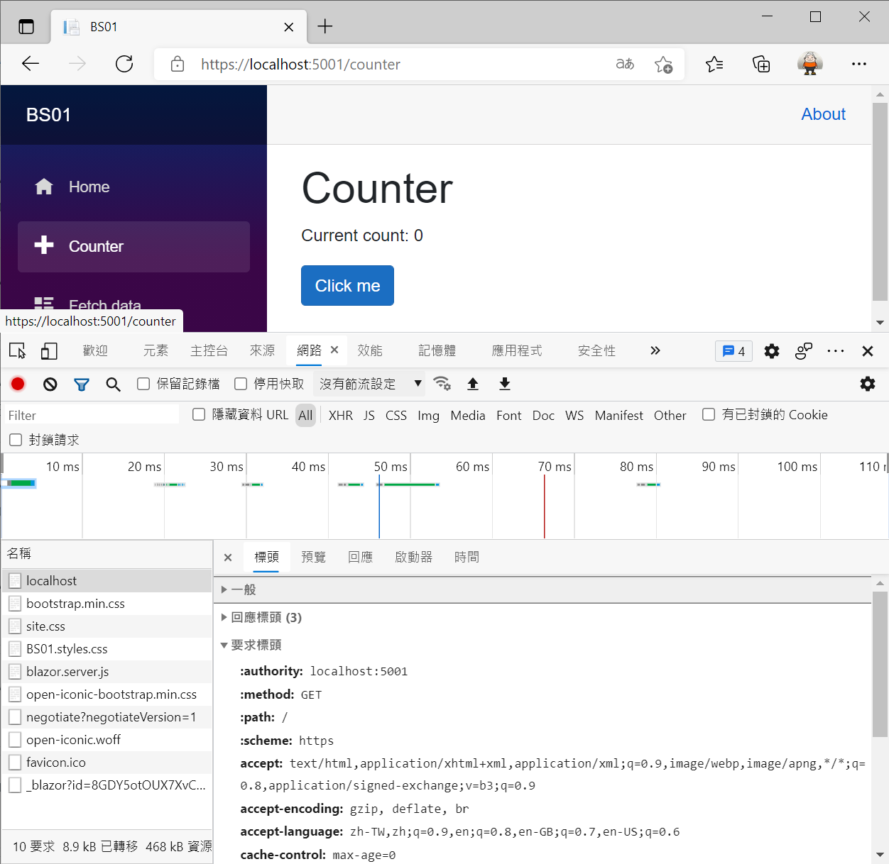
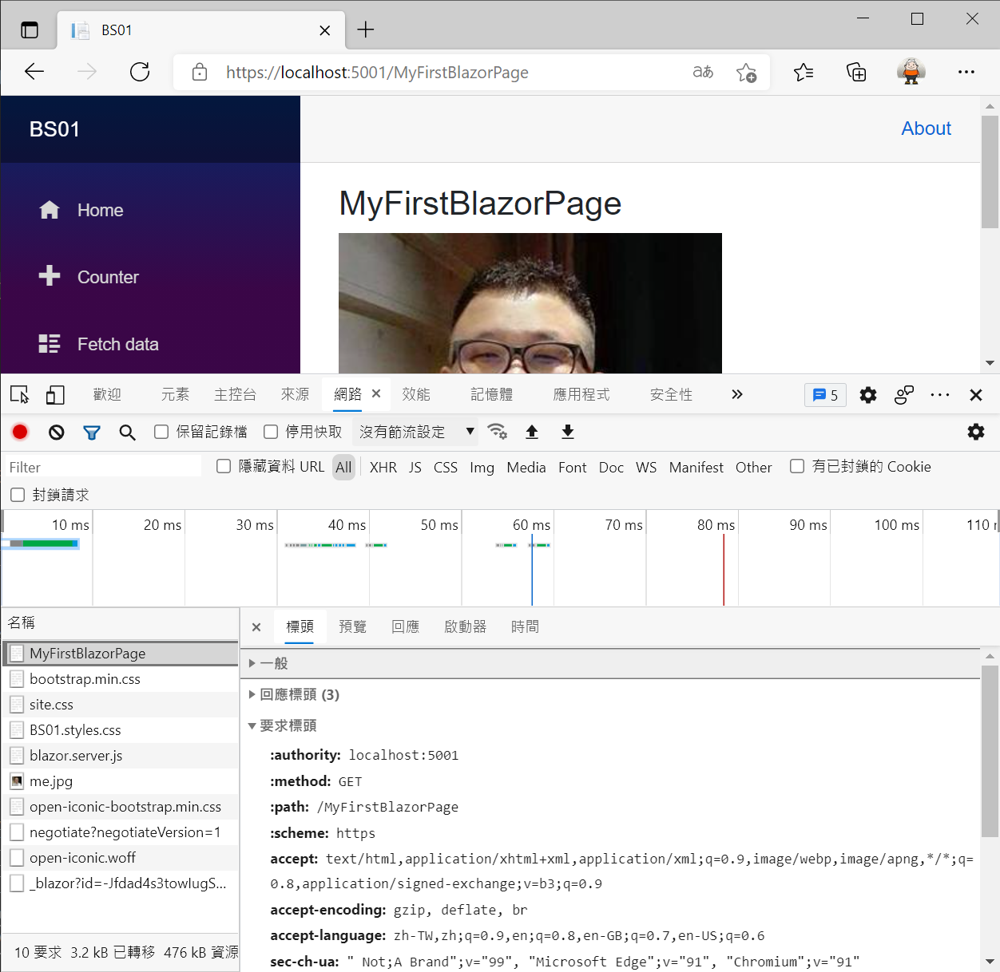
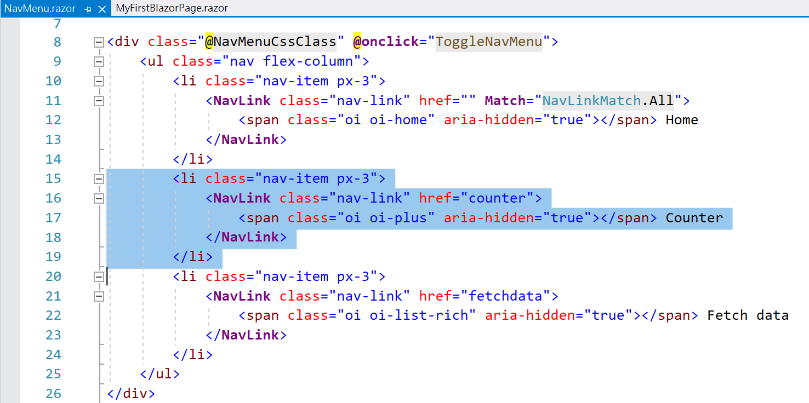
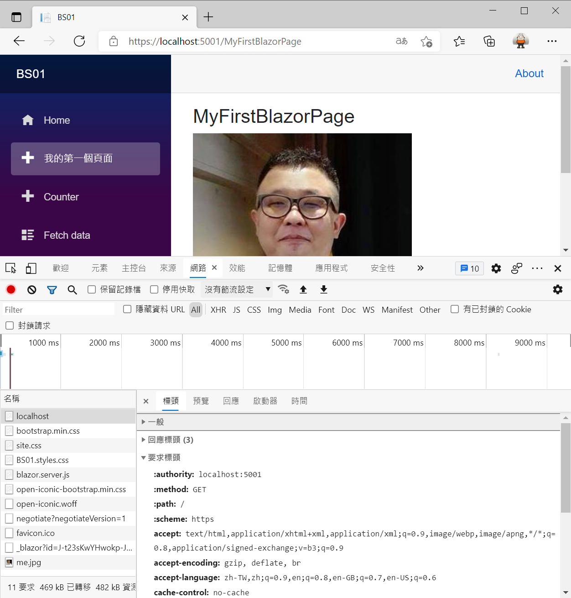

# Blazor Server 必會開發技能 - 建立一個新的頁面



對於許多網站開發者、尤其是使用 .NET C# 程式語言，第一次聽到 [Blazor](https://docs.microsoft.com/zh-tw/aspnet/core/blazor/?view=aspnetcore-5.0&WT.mc_id=DT-MVP-5002220) 這個 UI 開發框架，都會抱持著既期待又怕傷害的心情來面對這個工具；尤其，更進一步去了解之後，又發現到 [Blazor] 竟然又有 [Blazor WebAssembly](https://docs.microsoft.com/zh-tw/aspnet/core/blazor/host-and-deploy/webassembly?view=aspnetcore-5.0&WT.mc_id=DT-MVP-5002220) 與 [Blazor Server](https://docs.microsoft.com/zh-tw/aspnet/core/blazor/host-and-deploy/server?view=aspnetcore-5.0&WT.mc_id=DT-MVP-5002220) 兩種託管模式要來選擇。

相信許多人面對這樣的情境，都會有著選擇性的障礙與情緒極度不安的心情。首先，對於不想使用或者對於 .NET C# 這樣開發程式語言沒有信心的人，強烈建議你不要勉強自己來選擇 [Blazor] 這樣的開發方式，畢竟，在 [Blazor] 的開發模式下，是僅需要使用 .NET C# / HTML / CSS 這三套語言，就可以完成絕大部分的網站開發工作。

什麼，沒有看錯嗎？為什麼沒有 JavaScript 這個程式語言呢？

你沒有看錯，對於擁有 JavaScript 這個程式語言並且身懷絕技開發者而言，使用 [Blazor] 似乎沒有太多的用處，你僅需要的是要能夠精通與專注於 C# 程式語言的開發即可。

另外，要使用 [Blazor WebAssembly] 或者 [Blazor Server] 方式來開發專案，這裡有個建議，若僅是想要評估與學習如何使用 [Blazor] 這套 UI 框架來進行網站開發，可以直接使用 [Blazor Server] 的模式來開始學習；一旦絕大部分的 [Blazor] 功能都學會之後，想要切換到 [Blazor WebAssembley] 模式下來開發，只要相關的類別設計能夠充分使用相依性注入設計模式來開發，將會相當容易與快速的從 [Blazor Server] 轉換到 [Blazor WebAssembly]。

對於 [Blazor Server] 與 [Blazor WebAssembly] 的差異與比較，網路上存在著相當豐富的文字，到 Google 上搜尋就可以看到一大票的這樣文章。對於作者而言，因為本身所處的環境，相當適合於 [Blazor Server] 的開發，因此，從 2020年6月，一開始就選擇了 [Blazor Server] 這樣的模式來進行 Blazor 專案開發，到現在為止已經開發出快要7套以上的網站專案。

因此，建議對於想要使用 [Blazor] 來開發專案的讀者或者想要評估與測試 [Blazor] 這套開發工具的讀者，可以先採用 [Blazor Server] 的方式來著手進行。

大家一定相當的關心，整體成效如何呢？作者只能說：相當的讚、超乎預期的優異、快速開發且縮短時間、專案好維護，還有一個很重要的絕佳優勢那就是，當開發人力不足的時候，招募新人進來，只需要具備 .NET C# 的開發經驗，最多給予 1 個月的教育訓練，這些新招募進來的開發人員便可以瞬間變身成為一個網站開發工程師，光是這樣的好處，就十分值得採用 [Blazor] 來開發網站應用程式。

更多關於作者本身使用 [Blazor] 的實戰故事，可以參考 [Blazor實戰故事經驗分享 1 - 風起雲湧 如何從無到有建立Blazor團隊與採用全端開發方式設計出給上市企業使用的Web系統](https://csharpkh.blogspot.com/2020/11/Blazor-Server-Side-Full-Stack-Case-Study-JavaScript-Story.html) 與 [Blazor實戰故事經驗分享 2 - 風雲再現 探究 Blazor 可以快速開發出來內部細節](https://csharpkh.blogspot.com/2020/11/Blazor-Server-Side-Layer-Data-Case-Study-Story.html)

首先，先來看看如何在 [Blazor] 專案下建立一個新的網頁頁面。對於傳統的網專站專案開發想要完成這樣的需求，那就是要在該專案內建立一個 .html 的檔案即可，不過，使用 [Blazor] 完成這樣的需求，也是相當容易的。

這裡說明的範例專案原始碼位於 [BS01](https://github.com/vulcanlee/Blazor-Xamarin-Full-Stack-HOL/tree/main/Examples/BS01)

## 建立 Blazor Server-Side 的專案

* 打開 Visual Studio 2019
* 點選右下方的 [建立新的專案] 按鈕
* [建立新專案] 對話窗將會顯示在螢幕上
* 從[建立新專案] 對話窗的中間區域，找到 [Blazor 應用程式] 這個專案樣板選項，並且選擇這個項目
* 點選右下角的 [下一步] 按鈕
* 現在 [設定新的專案] 對話窗將會出現
* 請在這個對話窗內，輸入適當的 [專案名稱] 、 [位置] 、 [解決方案名稱]

  在這裡請輸入 [專案名稱] 為 `BS01`

* 完成後，請點選 [建立] 按鈕
* 當出現 [建立新的 Blazor 應用程式] 對話窗的時候
* 請選擇最新版本的 .NET Core 與 [Blazor 伺服器應用程式]
* 完成後，請點選 [建立] 按鈕

  稍微等會一段時間，Blazor 專案將會建立起來

## 加入靜態圖片資源

* 在 Blazor 專案內找到 [wwwroot] 節點
* 滑鼠右擊這個節點
* 從彈出功能表選擇 [新增] > [新增資料夾]
* 將這個新資料夾命名為 [Images]
* 找到一個圖片檔案，拖拉到 [Images] 資料夾內

  > 在這裡，作者是把本身 Facebook 網站上的大頭貼照片下載到本機電腦上，該圖片命名為 [me.jpg] ，接著，使用檔案總管拖拉到 Visual Studio 方案總管之 Blazor 專案下的 [wwwroot] > [Images] 目錄下

  

## 建立第一個 Blazor 專案的頁面

* 滑鼠右擊 Blazor 專案內的 [Pages] 資料夾
* 選擇 [加入] > [Razor 元件]

  > 這裡選擇的 [Razor 元件] 指的就是 [Blazor 元件 Component]，兩者指的是同一件事情，千萬要注意，在這裡不要選擇 [Razor 頁面] 這個選項

  

* 當 [新增項目 - BS01] 對話窗出現之後，請在下方名稱欄位內，輸入 `MyFirstBlazorPage`
* 最後點選 [新增] 按鈕

  

* 在 [方案總管] 視窗內的 Blazor 專案下，展開 [Pages] 資料夾，就可以看到 [MyFirstBlazorPage.razor] 這個 [Razor 元件] 已經建立起來了。

  

* 其中，[MyFirstBlazorPage.razor] 這個檔案也已經開啟了

  在下面圖片中可以看出，一個 Blazor 的開發者，可以在 [Razor 元件] 檔案內設計各種 HTML 的標記語言代碼

  

  另外，可以在這個 [Razor 元件] 檔案內使用 Inline 內嵌 方式來加入 C# 程式碼，
* 請依據底下程式碼輸入到這個檔案內 [MyFirstBlazorPage.razor]

  在最前面有使用 Directive 指示詞 `@page` 用來指定可以加入這樣的路由到 Blazor 專案內，關於更關這方面的資訊，可以參考 [路由範本](https://docs.microsoft.com/zh-tw/aspnet/core/blazor/fundamentals/routing?view=aspnetcore-5.0&WT.mc_id=DT-MVP-5002220)

  根據微軟官方的 [ASP.NET Core Razor 元件](https://docs.microsoft.com/zh-tw/aspnet/core/blazor/components/?view=aspnetcore-5.0&WT.mc_id=DT-MVP-5002220) 文件中有描述到：指示詞 Directive ，用於變更剖析元件標記的方式或函數。 例如，指示詞 @page 會指定具有路由範本的可路由元件，並可在瀏覽器中以特定 URL 直接觸達使用者的要求。

```html
@page "/MyFirstBlazorPage"

@*這裡可以撰寫 HTML 相關標記*@
<h3>MyFirstBlazorPage</h3>

<div>
    
</div>

<div>
    我使用
    <span class="text-danger">Blazor</span>
</div>

<div>
    我的名字叫做
    <span class="h3 text-danger">Vulcan Lee</span>
</div>

@code {
    //這裡可以撰寫 C# 程式碼
}
```

## 執行且觀看執行結果

* 按下 [F5] 按鍵，開始執行這個 Blazor 專案
* 一旦啟動完成，就會自動開以瀏覽器

  

* 在瀏覽器位址列輸入這個 `https://localhost:5001/MyFirstBlazorPage` 網址，就會看到如下圖執行結果

  

## 進階問題探討

* 為了方便進行說明問題，請先在 Visual Studio 按下 [Shift] + [F5] 來停止這個專案的執行
* 接著，請按下 [F5] 開始重新執行這個專案
* 一旦專案執行完成之後，請在瀏覽器上按下 [F12] 來使用 [開發人員工具]
* 請在 [開發人員工具] 視窗內，切換到 [網路] 分頁標籤頁次
* 接著點選最下方第一筆紀錄的 [localhost] 項目
* 現在可以看到當要開啟這個網頁時候，瀏覽器端送出的 HTTP Get 需求的相關封包內容

  

* 現在，可以點選這個網頁左邊功能項目清單的任何項目 [Home] [Counter] [Fetch data] 連結
* 此時，可以觀察 [開發人員工具] 內的 [網路] 分頁中的內容，是沒有任何變化的，不過，可以觀察到瀏覽器的位址列上的網址是有變化的，這似乎與其他開發工作所做出來的網站應用程式有所不同，Blazor Server 會有這樣的表現這是因為相關的頁面導航，都是透過 [SignalR](https://docs.microsoft.com/zh-tw/aspnet/core/tutorials/signalr?view=aspnetcore-5.0&tabs=visual-studio&WT.mc_id=DT-MVP-5002220) 來完成的，因此，不會每次都對遠端的 HTTP 伺服器發出 HTTP Request 請求。

  

* 現在瀏覽器位址列輸入這個 `https://localhost:5001/MyFirstBlazorPage` 網址
* 此時，可以從 [開發人員工具]  視窗中看到，左邊名稱欄位的第一筆紀錄是 [MyFirstBlazorPage]，而且在右邊視窗中可以驗證此時瀏覽器發出了一個 HTTP Get 請求，路徑為 /MyFirstBlazorPage 到 localhost:5001 伺服器上

  

* 同樣的，請點選該網頁最左邊的功能清單的任何項目，網頁一樣切換正常，並且同樣在 [開發人員工具] 視窗內沒有看到新的 HTTP 請求對 Web 伺服器送出

### 將 MyFirstBlazorPage 頁面加入到左邊功能表選項清單內

* 請展開 Blazor 專案內的 [Shared] 資料夾
* 在該資料夾內找到並且打開 [NavMenu.razor] 檔案
* 找到 Counter 這個功能表清單選項的程式碼，如下圖第15行~第19行

  

* 複製這段程式碼，並且修改成為 [MyFirstBlazorPage] 要使用的資訊

```html
<div class="@NavMenuCssClass" @onclick="ToggleNavMenu">
    <ul class="nav flex-column">
        <li class="nav-item px-3">
            <NavLink class="nav-link" href="" Match="NavLinkMatch.All">
                <span class="oi oi-home" aria-hidden="true"></span> Home
            </NavLink>
        </li>
        <li class="nav-item px-3">
            <NavLink class="nav-link" href="MyFirstBlazorPage">
                <span class="oi oi-plus" aria-hidden="true"></span> 我的第一個頁面
            </NavLink>
        </li>
        <li class="nav-item px-3">
            <NavLink class="nav-link" href="counter">
                <span class="oi oi-plus" aria-hidden="true"></span> Counter
            </NavLink>
        </li>
        <li class="nav-item px-3">
            <NavLink class="nav-link" href="fetchdata">
                <span class="oi oi-list-rich" aria-hidden="true"></span> Fetch data
            </NavLink>
        </li>
    </ul>
</div>
```

* 請重新執行這個 Blazor 專案
* 當瀏覽器出現後，可以在網頁的最左方看到四個功能表選項
* 請切換這四個功能表項目，確認網頁會正常顯示相關內容，並且從 [開發人員工具] 視窗內不會看到其他的 HTTP 請求發出，也就是相關的網頁切換運作動作，都是透過 [SignalR] 來完成的。

  

