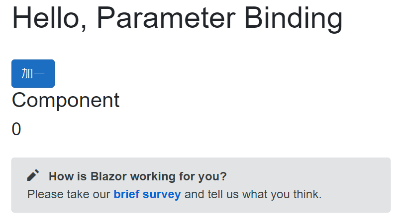

# Blazor 使用 Parameter 資料綁定方式的觸發時機

當在進行 [Blazor](https://docs.microsoft.com/zh-tw/aspnet/core/blazor/?view=aspnetcore-5.0&WT.mc_id=DT-MVP-5002220) 專案程式設計的時候，會將一個頁面切割成為不同的 Blazor 元件，接著便可以透過 Blazor 的 [使用元件參數進行系結](https://docs.microsoft.com/zh-tw/aspnet/core/blazor/components/data-binding?view=aspnetcore-5.0#binding-with-component-parameters&WT.mc_id=DT-MVP-5002220) 功能，將 A 元件內的物件值，透過安樹綁定的方式傳遞到元件 B 內。

不過，最近許多夥伴和我反映，他們設計了一個這樣的情境，在一個頁面元件上，使用者可以輸入相關的資料，一旦輸入完成之後，會按下送出按鈕，此時會呼叫 Syncfusion 的 DataGrid 這個元件的 Refresh 方法，請求 DataGrid 這個元件，依據剛剛輸入的內容，重新透過 Adapter 這個元件，從資料庫內抓取符合設定條件的紀錄出來，並且顯示在螢幕上。

這樣看是十分簡單設計需求，卻面臨到了一個十分詭異的現象，那就是當第一次點選送出按鈕之後，無法使用剛剛設定的內容來進行資料庫的查詢，進而取得符合的紀錄，而是需要按次點選一次該送出按鈕，此時才會取得所設定內容的相關紀錄。

通常，我都是鼓勵大家，若遇到這樣詭異的問題，並且需要請求他人的協助的時候，要能夠使用一個簡單的專案、描述如何做出這樣的專案，並且可以在這個執行中的專案上，進行甚麼樣的操作，以便可以重現每次都會遇到的問題。

若沒有辦法做到這樣的自我技能能力提升的情況，將會造成要幫你查看問題的人，很難在第一時間內找出問題，因為，他需要使用你開發的專案，在自己的電腦上跑起來這個專案(若沒有相關指引或者方法來說明如何建立起資料庫或者相關設定步驟，想要幫你解決問題的人，在第一時間內，是無法幫你解決問題的)，了解你專案上的商業邏輯，看懂你寫的程式碼(當然，若你的程式碼寫得十分混亂，或者使用很多非常規的寫法，就需要花費其他時間再來解決這些額外問題)，才有可能開始幫你看看到底是哪裡出了問題。

面對這個問題，我設計了一個簡單的專案，設計一個新的元件，該元件會接收一個可以綁定的參數與一個方法。當透過參數綁定成功之後，會將當時使用的執行緒ID 與訊息顯示在螢幕上，而當在其他元件要呼叫該元件的方法時候，也會顯示當時使用的執行緒ID 與訊息顯示在螢幕上

現在來看看如何做出這樣的範例成程式碼。

這篇文章的原始碼位於 [bzParameterBinding](https://github.com/vulcanlee/CSharp2021/tree/main/bzParameterBinding)

## 建立Blazor Server 應用程式專案

* 開啟 Visual Studio 2019
* 選擇右下方的 [建立新的專案] 按鈕
* 在 [建立新專案] 對話窗中
* 從右上方的專案類型下拉按鈕中，找到並選擇 [Web]
* 從可用專案範本清單內，找到並選擇 [空的 ASP.NET Core]
* 點選左下方 [下一步] 按鈕
* 在 [設定新的專案] 對話窗中
* 在 [專案名稱] 欄位中輸入 `bzParameterBinding`
* 點選左下方 [下一步] 按鈕
* 在 [其他資訊] 對話窗中
* 在 [目標 Framework] 下拉選單中，選擇 [.NET 5.0 (目前)]
* 點選左下方 [建立] 按鈕

## 建立一個新的元件

* 滑鼠右擊 [Pages] 資料夾
* 選擇 [加入] > [Razor 元件]
* 在 [新增項目 - bzParameterBinding] 對話窗內的 [名稱] 欄位，輸入 `Component.razor`
* 點選該對話窗右下方的 [新增] 按鈕
* 使用底下的內容替換原先檔案內容

```XML
<h3>Component</h3>
<h4>@MyProperty</h4>

@code {
    private int myVar;
    [Parameter]
    public int MyProperty
    {
        get { return myVar; }
        set
        {
            myVar = value;
            Console.WriteLine($"設定參數綁定 ({System.Threading.Thread.CurrentThread.ManagedThreadId})");
        }
    }
    protected override void OnParametersSet()
    {
        Console.WriteLine($"OnParametersSet ({System.Threading.Thread.CurrentThread.ManagedThreadId})");
    }
    public void ShowSomething()
    {
        Console.WriteLine($"呼叫方法 [{MyProperty}] ({System.Threading.Thread.CurrentThread.ManagedThreadId})");
    }
}
```

## 修正 Index.razor 元件

* 打開 [Pages] 資料夾內的 [Index.razor] 檔案
* 將該類別設計為底下內容
* 使用底下的內容替換原先檔案內容

```XML
@page "/"

<h1>Hello, Parameter Binding</h1>

<br />
<button class="btn btn-primary"
        @onclick="btnClick">
    加一
</button>
<br />
<Component @ref="component" MyProperty="counter" />

<SurveyPrompt Title="How is Blazor working for you?" />

@code{
    int counter = 0;
    Component component;
    async Task btnClick()
    {
        #region 使用同步方式來執行
        //Console.WriteLine();
        //Console.WriteLine($"觸發按鈕事件 ({System.Threading.Thread.CurrentThread.ManagedThreadId})");
        //counter++;
        //Console.WriteLine($"計數器 + 1 ({System.Threading.Thread.CurrentThread.ManagedThreadId})");
        //component.ShowSomething();
        #endregion

        #region 呼叫元件方法前，使用 await 
        //Console.WriteLine();
        //Console.WriteLine($"觸發按鈕事件 ({System.Threading.Thread.CurrentThread.ManagedThreadId})");
        //counter++;
        //Console.WriteLine($"計數器 + 1 ({System.Threading.Thread.CurrentThread.ManagedThreadId})");
        //await Task.Yield();
        //await Task.Delay(100);
        //component.ShowSomething();
        #endregion

        #region 將呼叫元件方法改成非同步方式呼叫
        //Console.WriteLine();
        //Console.WriteLine($"觸發按鈕事件 ({System.Threading.Thread.CurrentThread.ManagedThreadId})");
        //counter++;
        //Console.WriteLine($"計數器 + 1 ({System.Threading.Thread.CurrentThread.ManagedThreadId})");
        //var myTask = System.Threading.Tasks.Task.Run(() =>
        //{
        //    System.Threading.Thread.Sleep(100);
        //    component.ShowSomething();
        //});
        #endregion
    }

}
```

## 執行並且測試

* 首先，在 [Index.razor] 檔案中，找到 `#region 使用同步方式來執行` 文字
* 將 `#region 使用同步方式來執行` 與 `#endregion` 區段內的程式碼，解除其註解
* 按下 F5 開始執行這個專案
* 當專案一啟動執行，必且顯示 Index.razor 頁面後
* 可以從 Console 視窗中看到底下的輸出內容

```
info: Microsoft.Hosting.Lifetime[0]
      Now listening on: https://localhost:5001
info: Microsoft.Hosting.Lifetime[0]
      Now listening on: http://localhost:5000
info: Microsoft.Hosting.Lifetime[0]
      Application started. Press Ctrl+C to shut down.
info: Microsoft.Hosting.Lifetime[0]
      Hosting environment: Development
info: Microsoft.Hosting.Lifetime[0]
      Content root path: D:\Vulcan\Projects\bzParameterBinding\bzParameterBinding
設定參數綁定 (4)
OnParametersSet (4)
設定參數綁定 (14)
OnParametersSet (14)
```

從 Console 視窗中看到的輸出結果，顯示了兩次 [設定參數綁定] 的文字，這是因為第一次的文字輸出是因為 Blazor 內部的 Pre-render 機制所造成的，第二次的輸出內容，則是顯示該頁面到網頁上的時候，所造成的。

另外，這裡也看到了，當透過參數綁定把物件傳遞到其他元件內，會先把物件值更新到有標示 [Parameter] 的屬性上，接著便會觸發 Blazor 內建生命週期的 [OnParameterSet] 事件方法。

在瀏覽器上可以看底下的畫面



請點選 [加一] 這個按鈕，此時 Console 螢幕會出現底下內容

```
觸發按鈕事件 (4)
計數器 + 1 (4)
呼叫方法 [0] (4)
設定參數綁定 (4)
OnParametersSet (4)

觸發按鈕事件 (13)
計數器 + 1 (13)
呼叫方法 [1] (13)
設定參數綁定 (13)
OnParametersSet (13)
```

不論你點選幾次這個 [加一] 按鈕，你會發現到，當在這個按鈕事件程式碼執行完成之後，會把計數器 conuter 加一，接著執行 component.razor 這個元件的 ShowSomething 方法，也就是呼叫 `component.ShowSomething();`

最後從 Console 輸出內容看到，當 ShowSomething 方法執行完成之後，參數綁定的動作才會完成，然而，此時對於正在執行 ShowSomething() 方法的時候，所看到的參數綁定物件內容，卻不是父元件所傳送過來的物件值，因此，這樣的執行結果不是當初所要設計出來的結果，也是我們小夥伴所遇到的問題已經透過這樣的範例程式碼重現出來了。

## 使用暫停一段時間的非同步設計，執行並且測試

* 停止這個專案執行
* 首先將剛剛解除註解的程式碼重新註解起來
* 在 [Index.razor] 檔案中，找到 `#region 呼叫元件方法前，使用 await` 文字
* 將 `#region 呼叫元件方法前，使用 await` 與 `#endregion` 區段內的程式碼，解除其註解
* 按下 F5 開始執行這個專案
* 當專案一啟動執行，必且顯示 Index.razor 頁面後
* 可以從 Console 視窗中看到底下的輸出內容

```
info: Microsoft.Hosting.Lifetime[0]
      Now listening on: https://localhost:5001
info: Microsoft.Hosting.Lifetime[0]
      Now listening on: http://localhost:5000
info: Microsoft.Hosting.Lifetime[0]
      Application started. Press Ctrl+C to shut down.
info: Microsoft.Hosting.Lifetime[0]
      Hosting environment: Development
info: Microsoft.Hosting.Lifetime[0]
      Content root path: D:\Vulcan\Projects\bzParameterBinding\bzParameterBinding
設定參數綁定 (9)
OnParametersSet (9)
設定參數綁定 (4)
OnParametersSet (4)
```

從 Console 視窗中看到的輸出結果，顯示了兩次 [設定參數綁定] 的文字，這是因為第一次的文字輸出是因為 Blazor 內部的 Pre-render 機制所造成的，第二次的輸出內容，則是顯示該頁面到網頁上的時候，所造成的。

另外，這裡也看到了，當透過參數綁定把物件傳遞到其他元件內，會先把物件值更新到有標示 [Parameter] 的屬性上，接著便會觸發 Blazor 內建生命週期的 [OnParameterSet] 事件方法。

在瀏覽器上可以看底下的畫面


請點選 [加一] 這個按鈕，此時 Console 螢幕會出現底下內容

```
觸發按鈕事件 (9)
計數器 + 1 (9)
設定參數綁定 (9)
OnParametersSet (9)
呼叫方法 [1] (16)

觸發按鈕事件 (9)
計數器 + 1 (9)
設定參數綁定 (9)
OnParametersSet (9)
呼叫方法 [2] (4)

觸發按鈕事件 (6)
計數器 + 1 (6)
設定參數綁定 (6)
OnParametersSet (6)
呼叫方法 [3] (11)
```

現在，你將會發現到，當按下 [加一] 按鈕之後，計數器會加一，之後會執行 [await Task.Yield()] ，當然，也可以執行 [await Task.Delay(100)] 休息 0.1 秒，不論是哪種方式，當程式碼遇到 await 之後，將會立即 return 回去，而此時，將會發現到參數綁定的工作將會正確無誤的執行，一旦作業系統配置原先等待的程式碼可以繼續使用 CPU 來執行的時候，將會正確顯示出剛剛父元件所傳遞過去的物件值。

從輸出內容可以看到，當呼叫 [ShowSomething()] 方法的時候，使用的是另外一個執行緒，而不是原先的執行緒，若你對於 await 這個運算子有充分的了解，就會知道為什麼會是這樣的結果。

## 將呼叫元件方法改成非同步方式呼叫，執行並且測試

* 停止這個專案執行
* 首先將剛剛解除註解的程式碼重新註解起來
* 在 [Index.razor] 檔案中，找到 `#region 將呼叫元件方法改成非同步方式呼叫` 文字
* 將 `#region 將呼叫元件方法改成非同步方式呼叫` 與 `#endregion` 區段內的程式碼，解除其註解
* 按下 F5 開始執行這個專案
* 當專案一啟動執行，必且顯示 Index.razor 頁面後
* 可以從 Console 視窗中看到底下的輸出內容

```
info: Microsoft.Hosting.Lifetime[0]
      Now listening on: https://localhost:5001
info: Microsoft.Hosting.Lifetime[0]
      Now listening on: http://localhost:5000
info: Microsoft.Hosting.Lifetime[0]
      Application started. Press Ctrl+C to shut down.
info: Microsoft.Hosting.Lifetime[0]
      Hosting environment: Development
info: Microsoft.Hosting.Lifetime[0]
      Content root path: D:\Vulcan\Projects\bzParameterBinding\bzParameterBinding
設定參數綁定 (9)
OnParametersSet (9)
設定參數綁定 (6)
OnParametersSet (6)
```

請點選 [加一] 這個按鈕，此時 Console 螢幕會出現底下內容

```
觸發按鈕事件 (6)
計數器 + 1 (6)
設定參數綁定 (6)
OnParametersSet (6)
呼叫方法 [1] (10)

觸發按鈕事件 (10)
計數器 + 1 (10)
設定參數綁定 (10)
OnParametersSet (10)
呼叫方法 [2] (12)

觸發按鈕事件 (6)
計數器 + 1 (6)
設定參數綁定 (6)
OnParametersSet (6)
呼叫方法 [3] (4)
```

現在，你將會發現到，當按下 [加一] 按鈕之後，計數器會加一，接著使用一個非同步工作來執行 [component.ShowSomething();] 這個方法，將會得到你想要的執行結果；然而，你可能發現到了，在這個 非同步 工作內，有執行 [System.Threading.Thread.Sleep(100);] 這個敘述，在呼叫 [component.ShowSomething();] 這個方法前，休息了 0.1 秒的時間。

現在，請將 [System.Threading.Thread.Sleep(100);] 這個敘述註解起來，重新執行一次，接著點選三次 [加一] 按鈕，你將會看到決然不同的執行結果，你知道發生了甚麼問題嗎？

```
info: Microsoft.Hosting.Lifetime[0]
      Now listening on: https://localhost:5001
info: Microsoft.Hosting.Lifetime[0]
      Now listening on: http://localhost:5000
info: Microsoft.Hosting.Lifetime[0]
      Application started. Press Ctrl+C to shut down.
info: Microsoft.Hosting.Lifetime[0]
      Hosting environment: Development
info: Microsoft.Hosting.Lifetime[0]
      Content root path: D:\Vulcan\Projects\bzParameterBinding\bzParameterBinding
設定參數綁定 (5)
OnParametersSet (5)
設定參數綁定 (5)
OnParametersSet (5)

觸發按鈕事件 (5)
計數器 + 1 (5)
設定參數綁定 (5)
OnParametersSet (5)
呼叫方法 [1] (10)

觸發按鈕事件 (11)
計數器 + 1 (11)
呼叫方法 [1] (15)
設定參數綁定 (11)
OnParametersSet (11)

觸發按鈕事件 (9)
計數器 + 1 (9)
呼叫方法 [2] (4)
設定參數綁定 (9)
OnParametersSet (9)
```
