# ASP.NET Core 應該具備知識 - 從空白專案建立 Blazor 應用


## 建立一個 空白 ASP.NET Core 專案

* 開啟 Visual Studio 2019
* 在 [Visual Studio 2019] 對話窗中，點選右下方的 [建立新的專案] 選項

  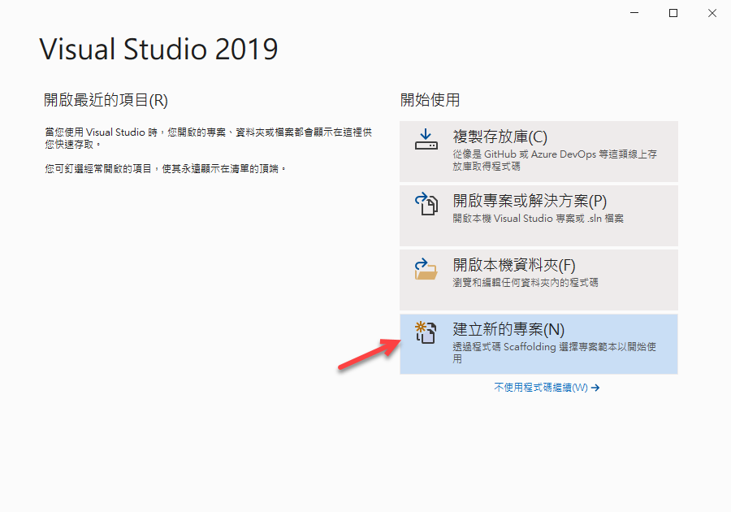

* 在 [建立新專案] 對話窗中，在中間上方的專案範本過濾條件中
  
  1. 設定程式語言為 [C#]
  2. 設定專案範本為 [Web]
  3. 選擇專案範本項目清單，點選 [空白 ASP.NET Core] 這個專案範本項目
    
     >可用於建立 ASP.NET Core 應用程式的空白專案範本，此範本不含任何內容。

  4. 點選右下方的 [下一步] 按鈕

  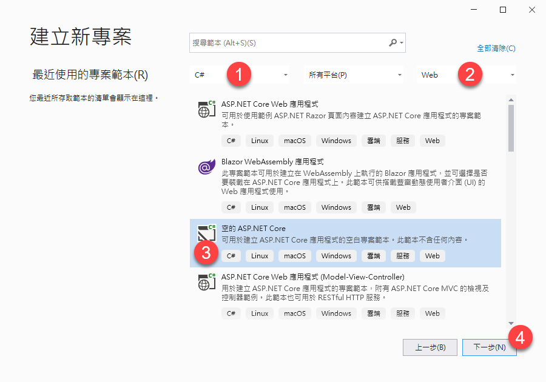

* 在 [設定新的專案] 對話窗出現後

  在 [專案名稱] 內，輸入 `AC99`

  點選右下角的 [下一步] 按鈕

  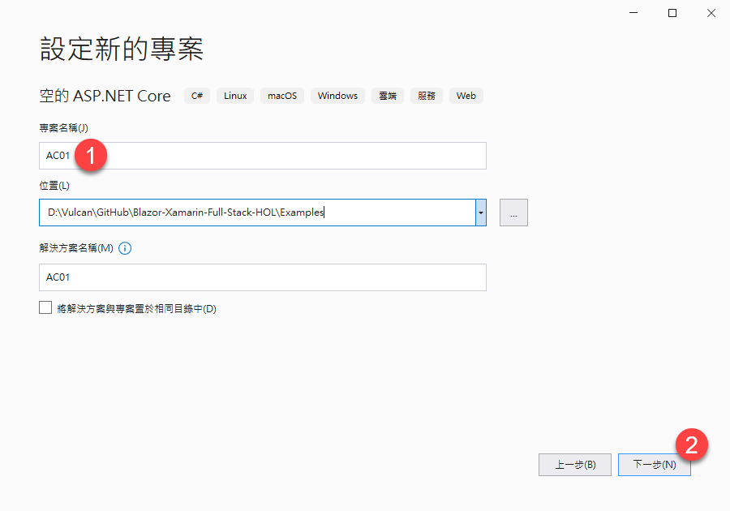

* 在 [其他資訊] 對話窗出現後，確認 [目標 Framework] 的下拉選單要選擇 [.NET 5.0 (目前)]
* 點選右下角的 [建立] 按鈕

  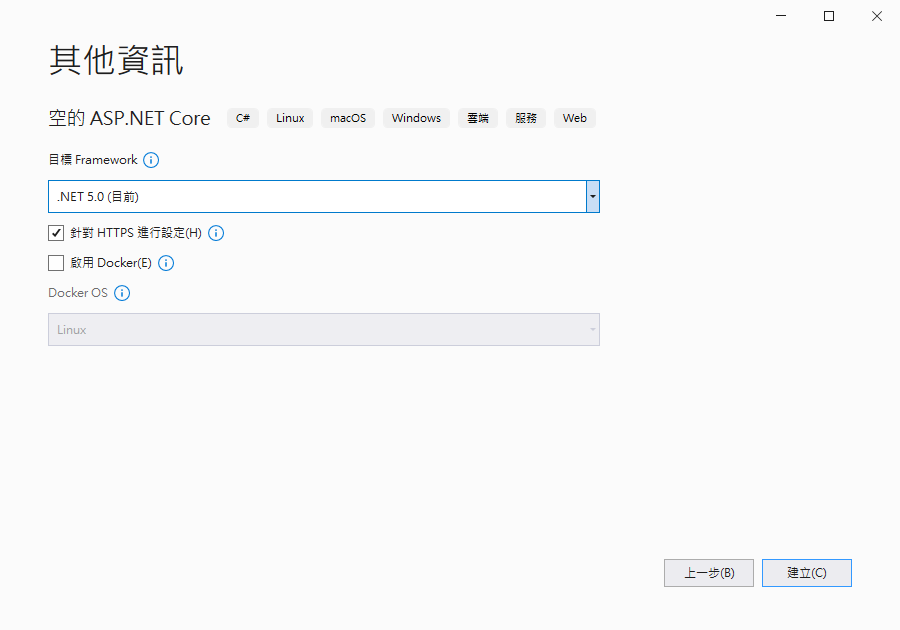

* 此時這個 [ASP.NET Core] 專案已經建立完成，從方案總管視窗內可以看到如下圖的結構

  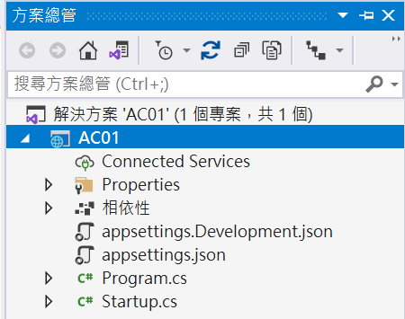

## 修正成為 Blazor 專案 - 啟動服務的設定與註冊

* 打開專案根目錄下 [Startup.cs] 檔案
* 搜尋找到 [ConfigureServices] 方法
* 這個方法內沒有任何的敘述
* 加入底下兩行 Blazor 需要用到的相依性注入宣告

```csharp
#region 這裡加入 Blazor 需要用到的相依性注入宣告
services.AddRazorPages();
services.AddServerSideBlazor();
#endregion
```
* 搜尋找到 [Configure] 方法
* 找到這個 `app.UseRouting();` 敘述
* 在這個敘述之前，要加入這個敘述 `app.UseStaticFiles();`，以便可以執行 SignalR 的 JavaScript 程式

```csharp
#region 要加入這個敘述，以便可以執行 SignalR 的 JavaScript 程式
app.UseStaticFiles();
#endregion
```

* 找到這個 `app.UseEndpoints` 敘述
* 使用底下的敘述用來啟動 SignalR 服務與註冊最終路由端點

```csharp
app.UseEndpoints(endpoints =>
{
    #region 啟動 SignalR 服務與註冊最終路由端點
    endpoints.MapBlazorHub();
    endpoints.MapFallbackToPage("/_Host");
    #endregion
});
```

## 修正成為 Blazor 專案 - 建立需要用到的基本檔案

* 滑鼠右擊專案節點
* 在彈出功能表中，選擇 [加入] > [新增項目]
* 出現 [新增項目 - AC99] 對話窗
* 依序點選 [已安裝] > [Visual C#] > [ASP.NET Core] > [Web] 節點
* 在中間的檔案類型清單中，點選 [Razor 元件]
* 在底下 [名稱] 欄位中輸入 `_Imports.razor`
* 最後點選 [新增] 按鈕

  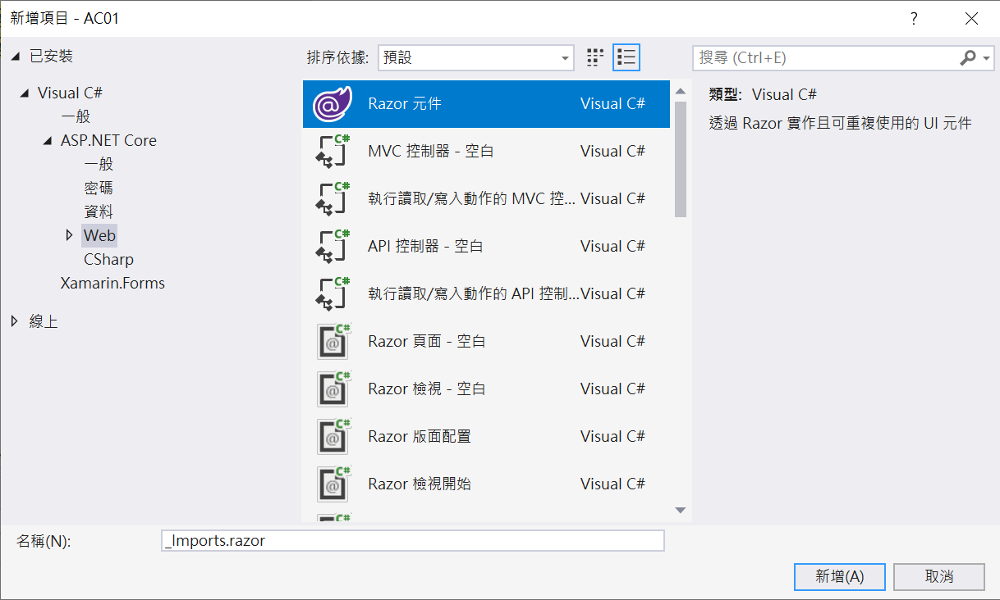

* 將底下的程式碼替換掉這個檔案內的內容

```html
@using System.Net.Http
@using Microsoft.AspNetCore.Authorization
@using Microsoft.AspNetCore.Components.Authorization
@using Microsoft.AspNetCore.Components.Forms
@using Microsoft.AspNetCore.Components.Routing
@using Microsoft.AspNetCore.Components.Web
@using Microsoft.AspNetCore.Components.Web.Virtualization
@using Microsoft.JSInterop
@using AC99
@using AC99.Shared
```


* 滑鼠右擊專案節點
* 在彈出功能表中，選擇 [加入] > [新增項目]
* 出現 [新增項目 - AC99] 對話窗
* 依序點選 [已安裝] > [Visual C#] > [ASP.NET Core] > [Web] 節點
* 在中間的檔案類型清單中，點選 [Razor 元件]
* 在底下 [名稱] 欄位中輸入 `App.razor`
* 最後點選 [新增] 按鈕
* 將底下的程式碼替換掉這個檔案內的內容

```html
<Router AppAssembly="@typeof(Program).Assembly" PreferExactMatches="@true">
    <Found Context="routeData">
        <RouteView RouteData="@routeData" DefaultLayout="@typeof(MainLayout)" />
    </Found>
    <NotFound>
        <LayoutView Layout="@typeof(MainLayout)">
            <p>Sorry, there's nothing at this address.</p>
        </LayoutView>
    </NotFound>
</Router>
```

* 滑鼠右擊專案節點
* 在彈出功能表中，選擇 [加入] > [新增資料夾]
* 命名這個資料夾為 [Shared]
* 滑鼠右擊 [Shared] 資料夾節點
* 在彈出功能表中，選擇 [加入] > [Razor 元件]

  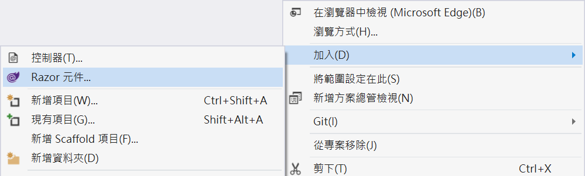

* 在底下 [名稱] 欄位中輸入 `MainLayout.razor`
* 最後點選 [新增] 按鈕
* 將底下的程式碼替換掉這個檔案內的內容

```html
@inherits LayoutComponentBase

<div class="page">
    <div class="main">
        <div class="content px-4">
            @Body
        </div>
    </div>
</div>
```

* 滑鼠右擊專案節點
* 在彈出功能表中，選擇 [加入] > [新增資料夾]
* 命名這個資料夾為 [Pages]
* 滑鼠右擊 [Pages] 資料夾節點
* 在彈出功能表中，選擇 [加入] > [Razor 頁面]

  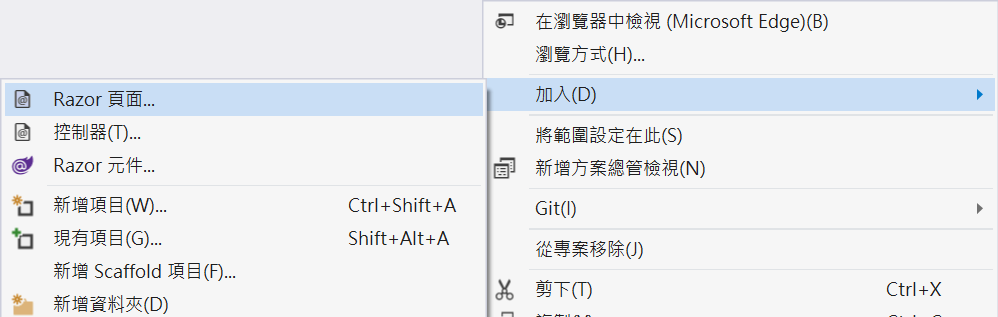

* 當出現 [新增 Scaffold 項目] 對話窗
* 點選 [Razor 頁面 - 空白] 這個項目
* 點選 [加入] 按鈕

  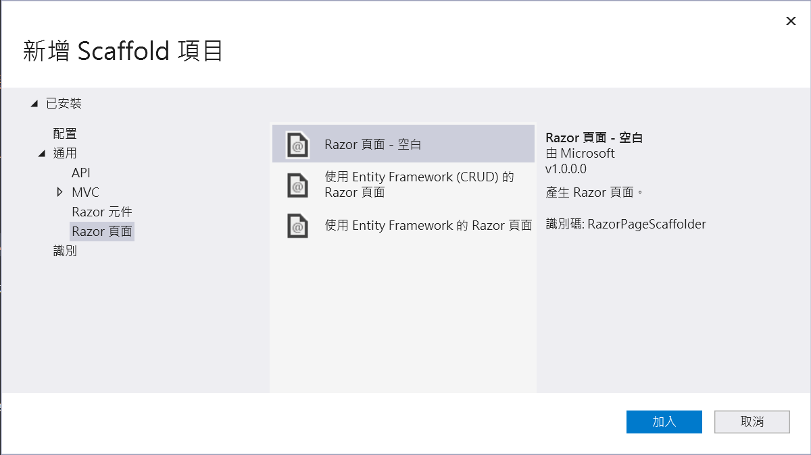

* 當出現 [新增項目 AC99] 對話窗
* 在底下 [名稱] 欄位中輸入 `_Host.cshtml`

  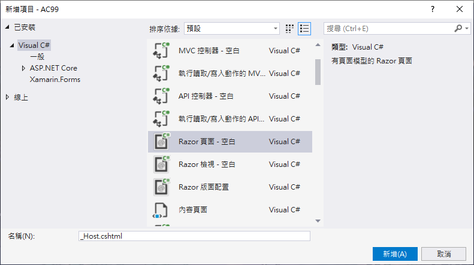

* 最後點選 [新增] 按鈕
* 打開 [_Host.cshtml] 檔案
* 將底下的程式碼替換掉這個檔案內的內容

```html
@page "/"
@namespace AC99.Pages
@addTagHelper *, Microsoft.AspNetCore.Mvc.TagHelpers
@{
    Layout = null;
}

<!DOCTYPE html>
<html lang="en">
<head>
    <meta charset="utf-8" />
    <meta name="viewport" content="width=device-width, initial-scale=1.0" />
    <title>AC99</title>
    <base href="~/" />
</head>
<body>
    <component type="typeof(App)" render-mode="ServerPrerendered" />
    <script src="_framework/blazor.server.js"></script>
</body>
</html>
```

* 滑鼠右擊 [Pages] 資料夾節點
* 在彈出功能表中，選擇 [加入] > [Razor 元件]
* 在底下 [名稱] 欄位中輸入 `Index.razor`
* 最後點選 [新增] 按鈕
* 將底下的程式碼替換掉這個檔案內的內容

```html
@page "/"

<h1>Hello, 這是從空白 ASP.NET Core 專案範本來建立一個 Blazor 專案!</h1>

<h2>體驗 ASP.NET Core 與 Blazor UI 開發框架的關係</h2>

<div>
    <span>你的名字</span>
    <input @bind="Name"/>
</div>
<div>
    <button @onclick="Submit">送出</button>
</div>
<div>
    @Message
</div>

@code{
    public string Name { get; set; }
    public string Message { get; set; }
    void Submit()
    {
        Message = $"你好 {Name}";
    }

}
```

## 執行這個專案

* 請按下 [F5] 按鍵，開始執行這個專案
* 瀏覽器的畫面如下

  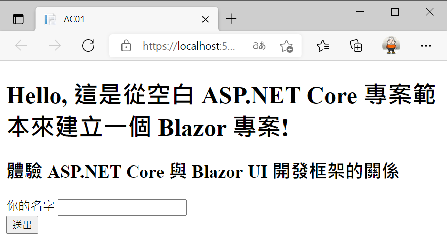

* 請在 [你的名字] 欄位中輸入的的名字
* 最後，點選 [送出] 按鈕
* 此時，可以在送出按鈕的下方看到向你問好的文字

  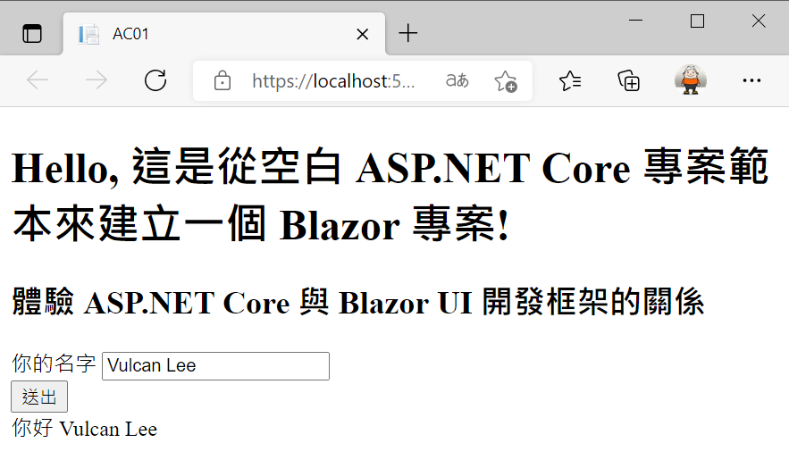

* 到了這裡可以證明，原先 建立一個 空白 ASP.NET Core 專案，經過稍加修正，已經可以進行 Blazor 專案開發了


