# ASP.NET Core 應該具備知識 - 設定


## 建立一個 ASP.NET Core Razor Page 專案

* 開啟 Visual Studio 2019
* 在 [Visual Studio 2019] 對話窗中，點選右下方的 [建立新的專案] 選項
* 在 [建立新專案] 對話窗中，在中間上方的專案範本過濾條件中
  
  1. 設定程式語言為 [C#]
  2. 設定專案範本為 [Web]
  3. 選擇專案範本項目清單，點選 [ASP.NET Core Web 應用程式] 這個專案範本項目

     >這個範本是可用於使用範例 ASP.NET Razor 頁面內容建立 ASP.NET Core 應用程式的專案範本。

     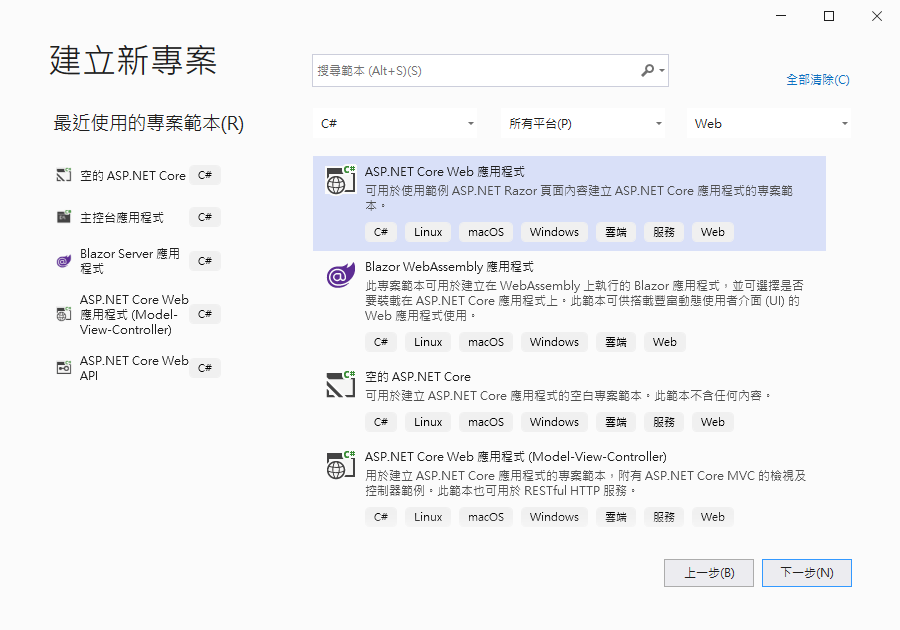

  4. 點選右下方的 [下一步] 按鈕
* 在 [設定新的專案] 對話窗出現後

  在 [專案名稱] 內，輸入 `AC05`

  點選右下角的 [下一步] 按鈕

* 在 [其他資訊] 對話窗出現後，確認 [目標 Framework] 的下拉選單要選擇 [.NET 5.0 (目前)]
* 點選右下角的 [建立] 按鈕
* 此時這個 [ASP.NET Core Web 應用程式] 專案已經建立完成，從方案總管視窗內可以看到如下圖的結構

  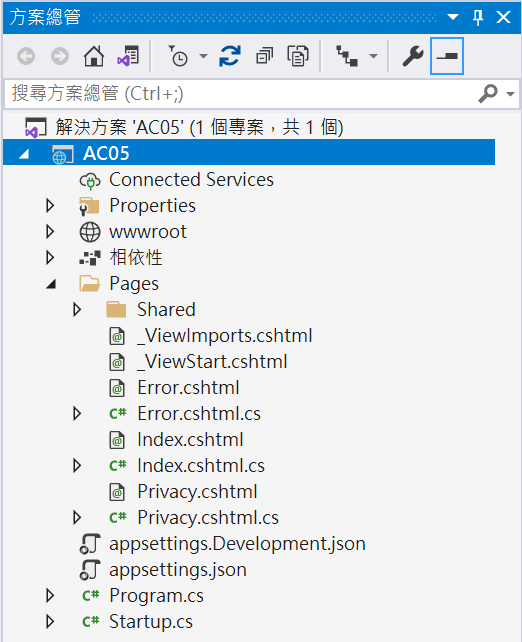

## 修正 appsettings.json 檔案

```json
{
  "Logging": {
    "LogLevel": {
      "Default": "Information",
      "Microsoft": "Warning",
      "Microsoft.Hosting.Lifetime": "Information"
    }
  },
  "AllowedHosts": "*",
  "MyEnglishName": "Vulcan Lee",
  "MyChineseName": "李進興",
  "IsNETDeveloper": true,
  "NETDeveloperYear": 10,
  "Position": {
    "ProjectName": "Backend",
    "Nest": {
      "IsNETDeveloper": true,
      "NETDeveloperYear": 10
    }
  }
}
```

## 修正 index.cshtml Razor 頁面

* 在 [Pages] 資料夾打開 [Index.cshtml] 檔案
* 使用底下程式碼體換這個檔案內容

```html
@page
@model IndexModel
@{
    ViewData["Title"] = "Home page";
}

<div class="text-center">
    <h1 class="display-4">Welcome</h1>
    <p>Learn about <a href="https://docs.microsoft.com/aspnet/core">building Web apps with ASP.NET Core</a>.</p>
</div>

<div>
    @foreach (var item in Model.AllConfigurationProvider)
    {
        <span class="mx-3 bg-secondary text-white">@item</span>
    }
</div>
<div>
    <span class="mx-3">MyEnglishName : @Model.MyEnglishName</span>
    <span class="mx-3">MyChineseName : @Model.MyChineseName</span>

</div>
<div>
    <span class="mx-3">IsNETDeveloper : @Model.IsNETDeveloper</span>
    <span class="mx-3">NETDeveloperYear : @Model.NETDeveloperYear</span>
</div>
<div>
    <span class="mx-3">ProjectName : @Model.ProjectName</span>
</div>
```

* 在 [Pages] 資料夾打開 [Index.cshtml.cs] 檔案
* 使用底下程式碼體換這個檔案內容

```csharp
using Microsoft.AspNetCore.Mvc;
using Microsoft.AspNetCore.Mvc.RazorPages;
using Microsoft.Extensions.Configuration;
using Microsoft.Extensions.Logging;
using System;
using System.Collections.Generic;
using System.Linq;
using System.Threading.Tasks;

namespace AC05.Pages
{
    public class IndexModel : PageModel
    {
        private readonly ILogger<IndexModel> _logger;
        private readonly IConfiguration configuration;

        public string MyEnglishName { get; set; }
        public string MyChineseName { get; set; }
        public bool IsNETDeveloper { get; set; }
        public int NETDeveloperYear { get; set; }
        public string ProjectName { get; set; }
        public List<string> AllConfigurationProvider { get; set; } = new();
        public IndexModel(ILogger<IndexModel> logger,
            IConfiguration configuration)
        {
            _logger = logger;
            this.configuration = configuration;
        }

        public void OnGet()
        {
            RetriveAllConfigurationProvider();
            RetriveConfigurationOneByOne();
        }
        public void RetriveConfigurationOneByOne()
        {
            MyEnglishName = configuration ["MyEnglishName"];
            MyChineseName = configuration ["MyChineseName"];
            IsNETDeveloper = configuration.GetValue<bool>("IsNETDeveloper");
            NETDeveloperYear = configuration.GetValue<int>("NETDeveloperYear");
            ProjectName = configuration["Position:ProjectName"];
        }
        public void RetriveAllConfigurationProvider()
        {
            IConfigurationRoot ConfigRoot = (IConfigurationRoot)configuration;
            foreach (var provider in ConfigRoot.Providers.ToList())
            {
                AllConfigurationProvider.Add(provider.ToString());
            }
        }
    }
}
```

## 執行這個專案

* 請按下 [F5] 按鍵，開始執行這個專案
* 瀏覽器的畫面如下

  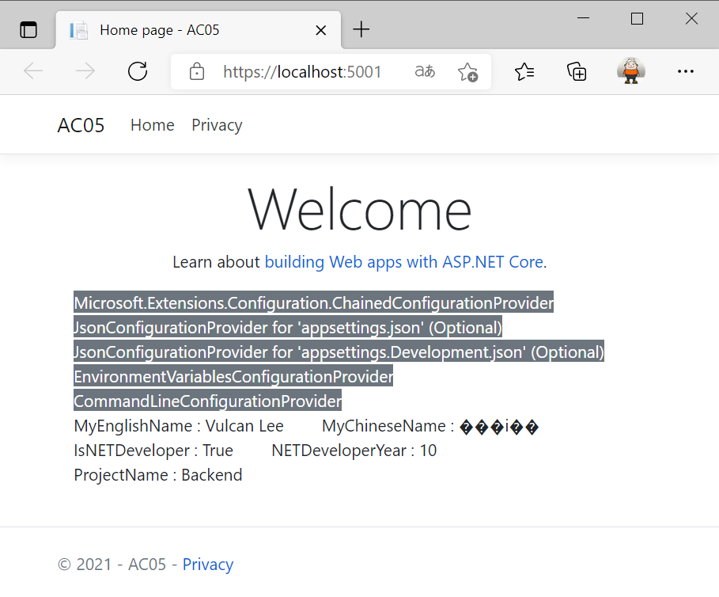

* 從螢幕輸出內容首先看到一個錯誤，那就是中文文字沒有顯示出來，而是顯示出 [���i��]
* 現在先來修正這個問題

## 修正 appsettings.json 檔案內容的編碼格式

* 請打開根目錄下 [appsettings.json] 檔案
* 從功能表上點選 [檔案] > [另存 appsettings.json 為]
* 在 [另存新檔] 對話窗的右下方
* 找到 [存檔] 按鈕右邊的黑色三角形，請點選這裡
* 此時彈出的子視窗
* 選擇 [以編碼方式儲存] 這個選項

  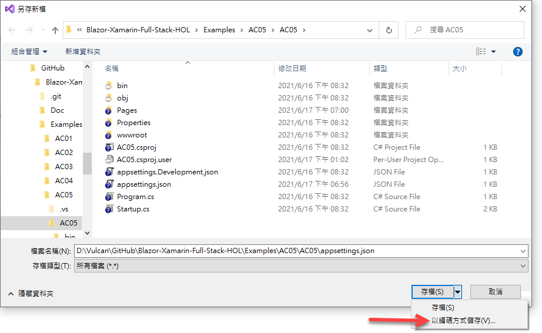

* 當出現 [確認另存新檔] 對話窗
* 請點選 [是] 這個按鈕
* 此時將會看到 [進階儲存選項] 對話窗，如下圖

  此時，這個檔案的 [編碼方式] 為 [繁體中文 (BIG5) - 字碼頁 950]

  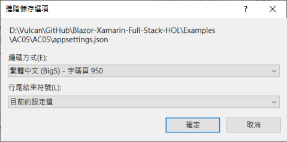

* 點選 [編碼方式] 下拉選單控制項
* 請選擇 [Unicode (UTF-8 有簽章) - 字碼頁 65001] 這個選項

  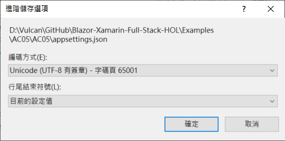

* 最後點選右下角的 [確定] 按鈕

## 再度重新執行這個專案

* 按下 [Shift] + [F5] 停止這個專案的執行
* 請按下 [F5] 按鍵，開始執行這個專案
* 瀏覽器的畫面如下

  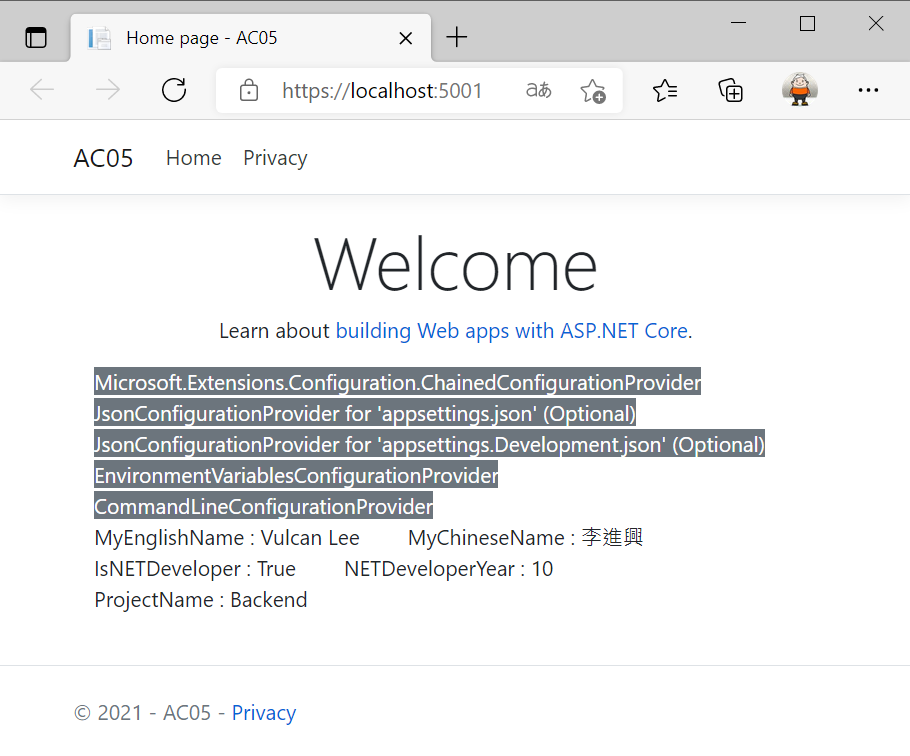

* 從螢幕輸出內容看到沒有亂碼囉

## 了解如何讀取 appsettings.json 內容

* 當想要取得 [appsettings.json] 的設定內容，首先要注入 [IConfiguration] 物件
* 在此可以打開 [Pages] > [Index.cshtml.cs] 檔案
* 在建構函式內有使用 `public IndexModel(ILogger<IndexModel> logger, IConfiguration configuration)` 這樣的參數，透過建構式注入方式取得 [IConfiguration] 物件
* 當要取得 [MyEnglishName] 參數的值，可以使用 `configuration ["MyEnglishName"]` 這樣的方式來取得，這樣取得的內容為字串
* 當然，也可以使用強型別的方式來某個設定內容，例如，對於 [IsNETDeveloper] 屬性鍵值在 [appsettings.json] 內表示為一個布林型別，此時，可以使用類似這樣 `configuration.GetValue<bool>("IsNETDeveloper")` 來取得，也就是呼叫這個 [GetValue] 方法，將型別透過泛型方法來傳遞過去，在這個方法內把要存取這個鍵值路徑字串傳遞過去。
* 對於一個複合的物件內的某個屬性值，可以使用類似這樣 `configuration["Position:ProjectName"]` 的方法來取得 [ProjectName] 這個屬性值

## 了解設定的提供者

ASP.NET Core 中的設定是使用一或多個設定提供者來執行。 設定提供者會使用各種設定來源從機碼值組讀取設定資料，想要知道這個專案到底可以使用那些設定提供者呢？

* 查看 [RetriveAllConfigurationProvider] 這個方法
* 首先將注入的 [IConfiguration] 物件轉型成為 [IConfigurationRoot]
* 這個 [IConfigurationRoot] 物件有個 [Providers] 集合屬性
* 接著可以把這個集合屬性設定到 Model 內的 [AllConfigurationProvider]
* 如此，就可以從網頁上看到這個專案啟用了底下的設定提供者

```
Microsoft.Extensions.Configuration.ChainedConfigurationProvider 
JsonConfigurationProvider for 'appsettings.json' (Optional) 
JsonConfigurationProvider for 'appsettings.Development.json' (Optional) 
EnvironmentVariablesConfigurationProvider CommandLineConfigurationProvider
```

從這裡可以看到，當使用類似這樣 `configuration ["MyEnglishName"]` 的敘述，會依照上述的提供者，依序來檢查是否有這個鍵值存在，若有則會取得這個鍵值的屬性值。若在更下方的設定提供者也有同樣的鍵值存在，則會採用下方的提供者內的鍵值的屬性值。

## 使用 appsettings.Development.json 覆蓋設定屬性值

* 請打開 [appsettings.Development.json] 檔案
* 使用底下內容來覆蓋這個檔案內容

```xml
{
  "DetailedErrors": true,
  "Logging": {
    "LogLevel": {
      "Default": "Information",
      "Microsoft": "Warning",
      "Microsoft.Hosting.Lifetime": "Information"
    }
  },
  "MyEnglishName": "Blazor Awesome"
}
```

* 按下 [Shift] + [F5] 停止這個專案的執行
* 請按下 [F5] 按鍵，開始執行這個專案
* 瀏覽器的畫面如下

  

* 從網頁內容可以看到，對於 [MyEnglishName] 鍵值的屬性值為 [Blazor Awesome]
* 這裡看到這裡的 [MyEnglishName] 鍵值的屬性值已經變更了

## 使用 EnvironmentVariablesConfigurationProvider

* 再來看看優先權更高的環境變數設定提供者
* 從專案的 [Properties] 節點內，找到 [launchSettings.json] 檔案
* 使用底下內容替換這個檔案內容

```json
{
  "iisSettings": {
    "windowsAuthentication": false,
    "anonymousAuthentication": true,
    "iisExpress": {
      "applicationUrl": "http://localhost:37770",
      "sslPort": 44356
    }
  },
  "profiles": {
    "IIS Express": {
      "commandName": "IISExpress",
      "launchBrowser": true,
      "environmentVariables": {
        "ASPNETCORE_ENVIRONMENT": "Development"
      }
    },
    "AC05": {
      "commandName": "Project",
      "dotnetRunMessages": "true",
      "launchBrowser": true,
      "applicationUrl": "https://localhost:5001;http://localhost:5000",
      "environmentVariables": {
        "ASPNETCORE_ENVIRONMENT": "Development",
        "MyEnglishName": "From Environment"
      }
    }
  }
}
```

* 在最下方的 ["AC05"] 節點內
* 找到一個 [environmentVariables] 鍵值
* 在這個鍵值內加入這個 `"MyEnglishName": "From Environment"` 屬性值定義
* 現在可以開始來進行測試
* 按下 [Shift] + [F5] 停止這個專案的執行
* 請按下 [F5] 按鍵，開始執行這個專案
* 瀏覽器的畫面如下

  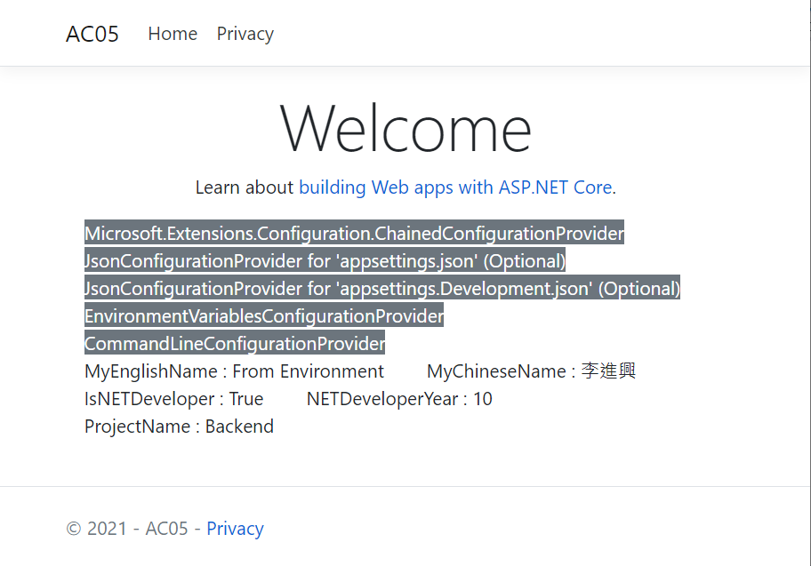

現在，對於 [MyEnglishName] 鍵值的屬性值為 [From Environment]

## 在正式執行階段來進行驗證

* 滑鼠右擊專案節點
* 從彈出功能表點選 [發佈] 選項
* 現在看到 [發佈] 對話窗顯示出來

  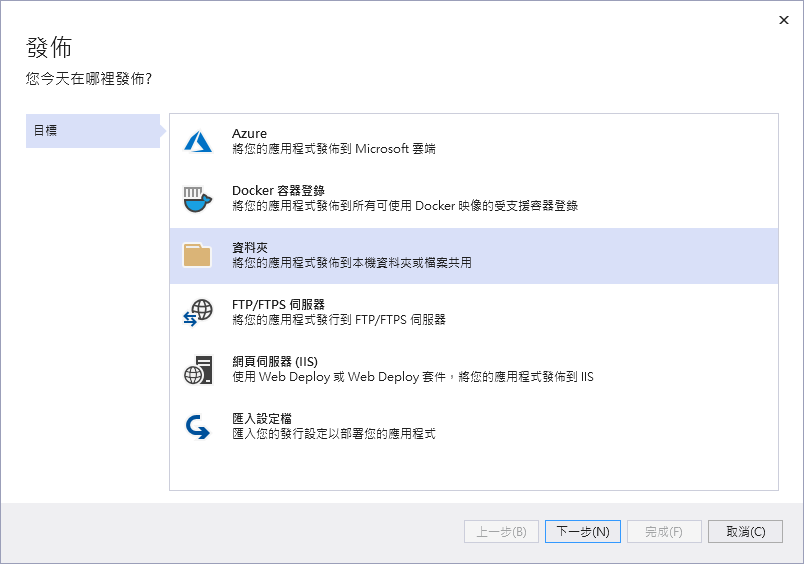

* 點選 [資料夾] 選項
* 點選右下角的 [下一步]
* 現在會看到底下畫面
* 點選右下角的 [完成]

  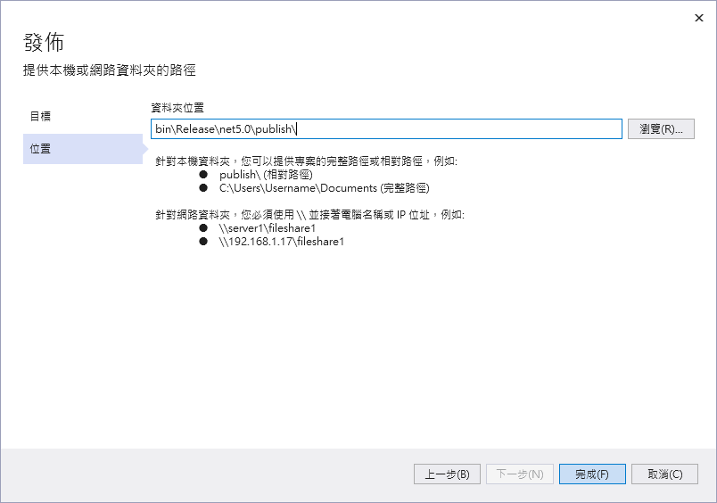

* 現在已經完成了 [發佈] 設定
* 請點選右上角 [發佈] 按鈕，開始進行 發佈 工作

  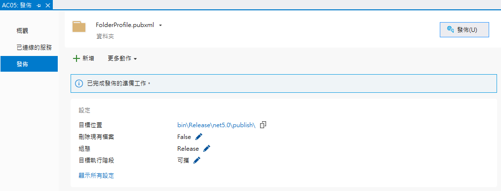

* 點選 [目標位置] 右邊的 [bin\Release\net5.0\publish\] 文字連結

  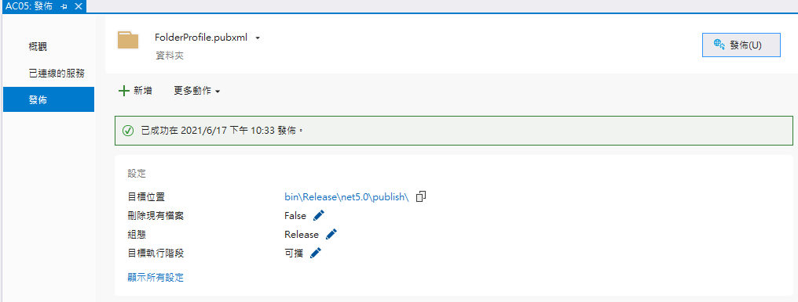

* 現在可以看到發佈後的相關檔案內容

  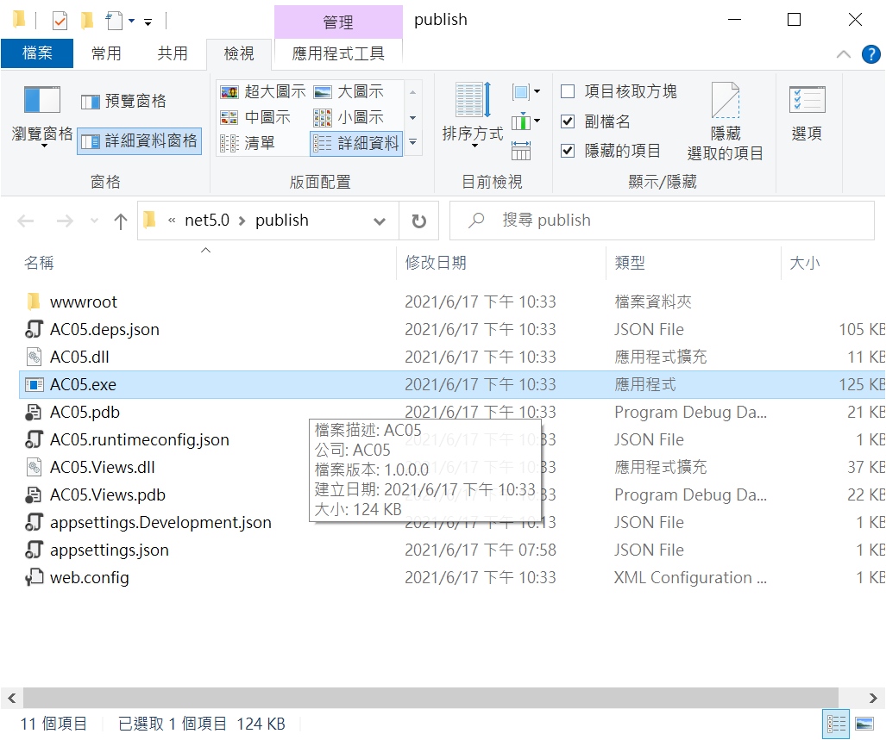

* 現在啟用 [命令提示字元視窗] ，切換到這個目錄下
* 請先設定環境變數
* 輸入 `set MyEnglishName="Set Environment"`
* 按下 [Enter] 按鍵
* 在這裡輸入 [AC05.exe] ，並且按下 [Enter] 按鍵

  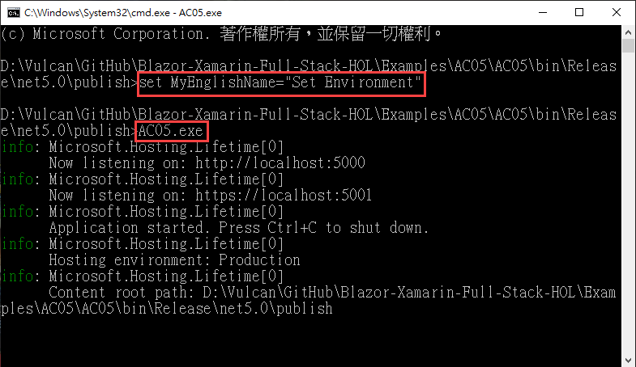

* 在瀏覽器中輸入 https://localhost:5001/
* 現在從瀏覽器的畫面可以看到，現在這個 [MyEnglishName] 設定的屬性值，已經修正為 [Set Environment]

  


