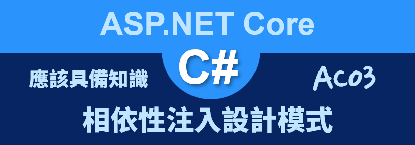
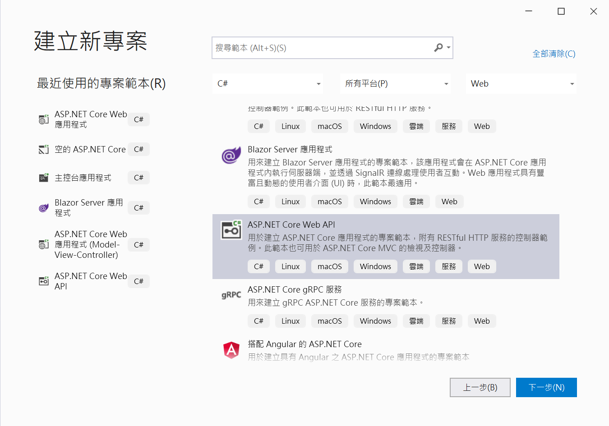
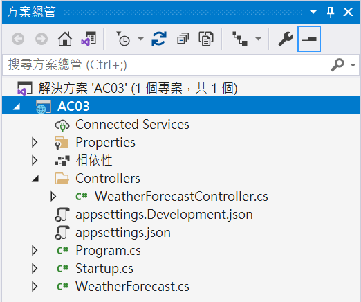
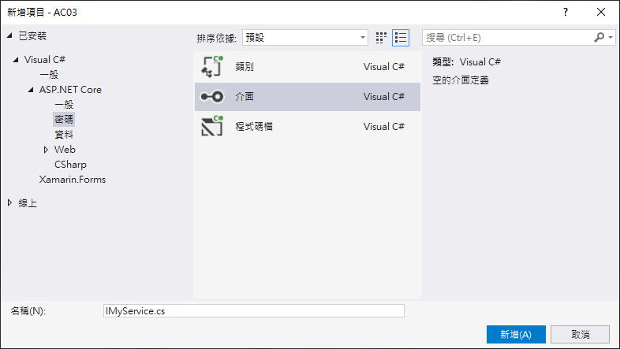
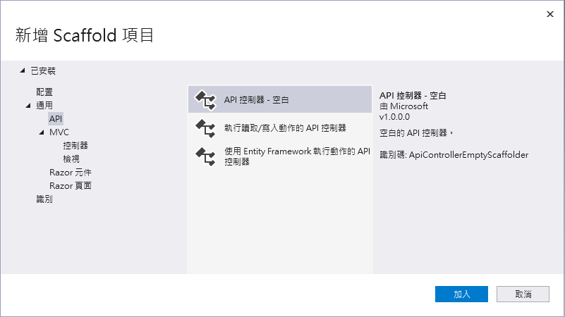
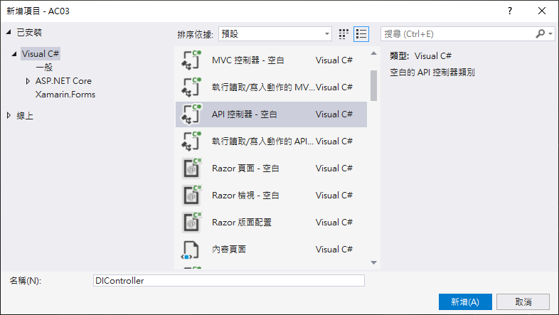
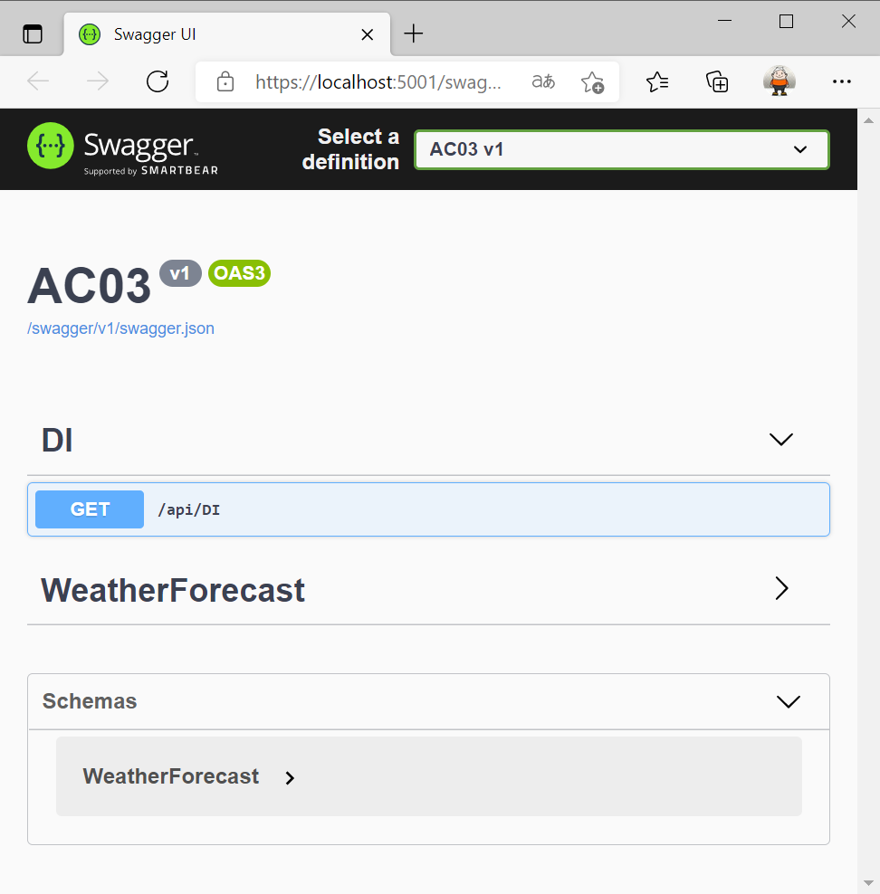
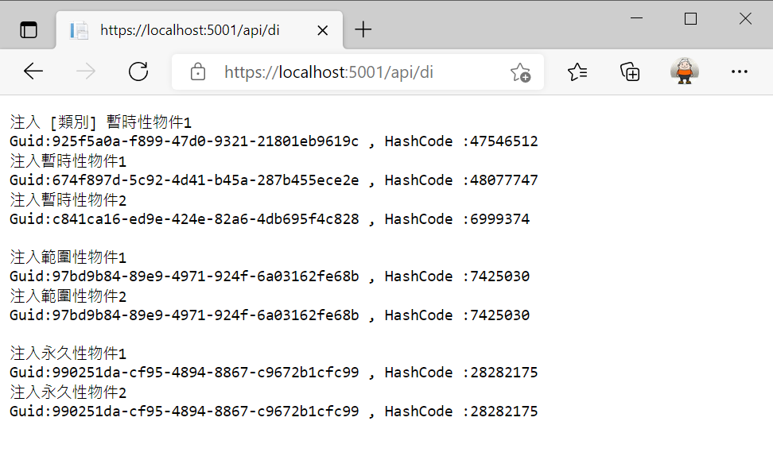
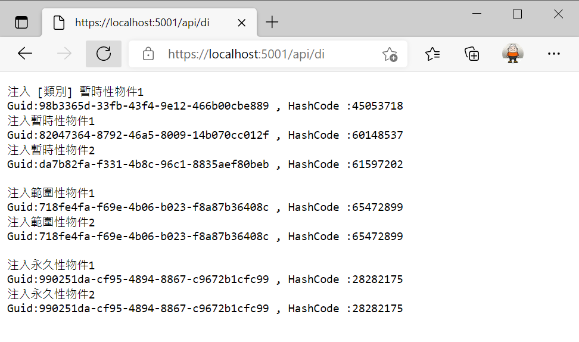

# ASP.NET Core 應該具備知識 - 相依性注入設計模式



## 建立一個 ASP.NET Core MVC 專案

* 開啟 Visual Studio 2019
* 在 [Visual Studio 2019] 對話窗中，點選右下方的 [建立新的專案] 選項
* 在 [建立新專案] 對話窗中，在中間上方的專案範本過濾條件中
  
  1. 設定程式語言為 [C#]
  2. 設定專案範本為 [Web]
  3. 選擇專案範本項目清單，點選 [ASP.NET Core Web API] 這個專案範本項目
  4. 點選右下方的 [下一步] 按鈕

  

* 在 [設定新的專案] 對話窗出現後

  在 [專案名稱] 內，輸入 `AC03`

  點選右下角的 [下一步] 按鈕

* 在 [其他資訊] 對話窗出現後，確認 [目標 Framework] 的下拉選單要選擇 [.NET 5.0 (目前)]
* 點選右下角的 [建立] 按鈕
* 此時這個 [ASP.NET Core Web API] 專案已經建立完成，從方案總管視窗內可以看到如下圖的結構

  

## 建立服務類別與介面

* 滑鼠右擊專案節點
* 從彈出功能表來選取 [加入] > [新增資料夾]
* 將這個資料夾命名為 `Services`
* 滑鼠右擊剛剛建立的 [Services] 資料夾
* 從彈出功能表點選 [加入] > [類別]
* 當出現 [新增項目 - AC03] 對話窗
* 在中間區域的樣板清單項目，點選 [介面] 項目
* 在下方 [名稱] 欄位輸入 [IMyService.cs]
* 在右下方點選 [新增] 按鈕

  

* 使用底下的程式碼替換掉這個檔案原先內容

```csharp
using System;

namespace AC03.Services
{
    public interface IMyService
    {
        Guid Guid { get; set; }
        int HashCode { get; }
    }
    public interface IMyServiceTransient : IMyService { }
    public interface IMyServiceScoped : IMyService { }
    public interface IMyServiceSingleton : IMyService { }
}
```

為了要能夠充分表現出 [.NET Core 中的相依性插入](https://docs.microsoft.com/zh-tw/aspnet/core/fundamentals/dependency-injection?view=aspnetcore-5.0&WT.mc_id=DT-MVP-5002220) 所支援相依性注入的三中生命週期，在這個檔案中，將會宣告四個介面

其中 [IMyService] 為基底介面的宣告，在這裡宣告會有兩個屬性，一個是型別為 [Guid] 的唯一識別碼屬性，另外一個透過 .NET 本身的 [object] 物件的 [GetHashCode] 方法來目前物件的雜湊碼；在這裡是要透過這兩個屬性來判斷出當時注入的物件，是否為同一個

[IMyServiceTransient] 介面將會是用來取得注入 Transient 暫時性 的物件，這代表了每次透過相依性注入機制來取得或者注入一個物件的時候，相依性注入的 Container 容器都會每次重新建立出一個新的物件出來；這些注入得到的物件當沒有使用後，將會被記憶體回收機制回收。

[IMyServiceScoped] 介面將會是用來取得注入 Scoped 範圍 的物件，當使用相依性注入容器來註冊具有範圍性的後，每次需要注入這樣類型物件的時候，會判斷當時若有使用 HTTP Request 請求，對於同一個 HTTP 請求，第一次將會產生出一個新的注入物件，而在同一個 HTTP 請求想要注入這樣具有範圍性的物件，將不再建立新的物件，相依性注入容器而是將剛剛剛產生的物件直接回傳回去，因此，在同一個 HTTP Request 請求要注入具有範圍性的物件，將會取得相同的物件；這些注入得到的物件當同一個 HTTP 請求內都沒有使用後，將會被記憶體回收機制回收。
  
[IMyServiceSingleton] 介面將會是用來取得注入 Singleton 單一  的物件，這代表了每次透過相依性注入機制來取得或者注入一個物件的時候，相依性注入的 Container 容器僅僅會在第一次的時候來建立出一個新的物件出來，之後同樣的 單一 注入物件請求，大家都會取得同一個物件。

* 滑鼠右擊 [Services] 資料夾
* 從彈出功能表點選 [加入] > [類別]
* 在下方 [名稱] 欄位輸入 [MyService.cs]
* 在右下方點選 [新增] 按鈕
* 使用底下的程式碼替換掉這個檔案原先內容

```csharp
using System;

namespace AC03.Services
{
    public class MyService : IMyService, IMyServiceTransient, IMyServiceScoped, IMyServiceSingleton
    {
        public int HashCode
        {
            get
            {
                return this.GetHashCode();
            }
        }
        public Guid Guid { get; set; } = Guid.NewGuid();
    }
}
```

在這裡很簡單的實作這兩個屬性，只是分別宣告其預設值。

## 進行相依性服務的註冊 Registration

* 在專案根目錄下找到並且打開 [Startup.cs] 檔案
* 找到 [ConfigureServices] 方法，在這個方法內加入底下的程式碼

```csharp
#region 註冊客製化的服務
services.AddTransient<IMyServiceTransient, MyService>();
services.AddScoped<IMyServiceScoped, MyService>();
services.AddSingleton<IMyServiceSingleton, MyService>();
services.AddTransient<MyService>();
#endregion
```

在這裡分別使用不同的介面來對相依性注入容器宣告都要注入同一個類型的物件，甚至在最後一行的程式碼，也可以直接使用實體類別來進行註冊，不需要使用到介面。

## 開始使用 IoC Container 反轉控制容器 來注入物件

* 滑鼠右擊 [Controllers] 資料夾
* 從彈出功能表清單中點選 [加入] > [控制器]
* 當 [新增 Scaffold 項目] 對話窗出現之後
* 依序點選 [已安裝] > [通用] > [API] > [API 控制器 - 空白]
* 點選右下角的 [加入] 按鈕

  

* 現在將會看到 [新增項目 - AC03] 對話窗
* 在下方的 [名稱] 欄位中輸入 `DIController`
* 點選右下方 [新增] 按鈕

  

* 使用底下的程式碼替換這個檔案內容

```csharp
using AC03.Services;
using Microsoft.AspNetCore.Mvc;
using System;
using System.Text;

namespace AC03.Controllers
{
    [Route("api/[controller]")]
    [ApiController]
    public class DIController : ControllerBase
    {
        private readonly IMyServiceTransient myServiceTransient1;
        private readonly IMyServiceTransient myServiceTransient2;
        private readonly IMyServiceScoped myServiceScoped1;
        private readonly IMyServiceScoped myServiceScoped2;
        private readonly IMyServiceSingleton myServiceSingleton1;
        private readonly IMyServiceSingleton myServiceSingleton2;
        private readonly MyService myService;

        public DIController(IMyServiceTransient myServiceTransient1, IMyServiceTransient myServiceTransient2,
            IMyServiceScoped myServiceScoped1, IMyServiceScoped myServiceScoped2,
            IMyServiceSingleton myServiceSingleton1, IMyServiceSingleton myServiceSingleton2, MyService myService)
        {
            this.myServiceTransient1 = myServiceTransient1;
            this.myServiceTransient2 = myServiceTransient2;
            this.myServiceScoped1 = myServiceScoped1;
            this.myServiceScoped2 = myServiceScoped2;
            this.myServiceSingleton1 = myServiceSingleton1;
            this.myServiceSingleton2 = myServiceSingleton2;
            this.myService = myService;
        }

        [HttpGet]
        public string Get()
        {
            StringBuilder result = new StringBuilder();

            result.Append($"注入 [類別] 暫時性物件1 " + Environment.NewLine);
            result.Append($"Guid:{myService.Guid} , HashCode :{myService.HashCode}" +
                Environment.NewLine);
            result.Append($"注入暫時性物件1 " + Environment.NewLine);
            result.Append($"Guid:{myServiceTransient1.Guid} , HashCode :{myServiceTransient1.HashCode}" +
                Environment.NewLine);
            result.Append($"注入暫時性物件2 " + Environment.NewLine);
            result.Append($"Guid:{myServiceTransient2.Guid} , HashCode :{myServiceTransient2.HashCode}" +
                Environment.NewLine + Environment.NewLine);
            result.Append($"注入範圍性物件1 " + Environment.NewLine);
            result.Append($"Guid:{myServiceScoped1.Guid} , HashCode :{myServiceScoped1.HashCode}" +
                Environment.NewLine);
            result.Append($"注入範圍性物件2 " + Environment.NewLine);
            result.Append($"Guid:{myServiceScoped2.Guid} , HashCode :{myServiceScoped2.HashCode}" +
                Environment.NewLine + Environment.NewLine);
            result.Append($"注入永久性物件1 " + Environment.NewLine);
            result.Append($"Guid:{myServiceSingleton1.Guid} , HashCode :{myServiceSingleton1.HashCode}" +
                Environment.NewLine);
            result.Append($"注入永久性物件2 " + Environment.NewLine);
            result.Append($"Guid:{myServiceSingleton2.Guid} , HashCode :{myServiceSingleton2.HashCode}" +
                Environment.NewLine);

            return result.ToString();
        }
    }
}
```

在這個控制器類別中，可以看到使用這樣的建構函式 `public DIController(IMyServiceTransient myServiceTransient1, IMyServiceTransient myServiceTransient2,IMyServiceScoped myServiceScoped1, IMyServiceScoped myServiceScoped2,IMyServiceSingleton myServiceSingleton1, IMyServiceSingleton myServiceSingleton2, MyService myService)` 宣告，這代表了當產生了 [DIController] 控制器物件，將會透過 相依性注入容器 Dependency Injection Container 或者 反轉控制容器 Inversion of Control IoC Container 來依據當時註冊的生命週期設定，注入適當的物件到建構函式內，在建構式內將會把這些注入的參數指派給該類別的欄位。

## 執行這個專案

* 請按下 [F5] 按鍵，開始執行這個專案
* 瀏覽器的畫面如下

  

* 請在瀏覽器網址列上輸入 `https://localhost:5001/api/di`

  

從這個 [DIController] 控制器提供的 [Get] 方法執行結果看出

```
注入 [類別] 暫時性物件1 
Guid:925f5a0a-f899-47d0-9321-21801eb9619c , HashCode :47546512
```

在進行相依性注入設計過程中，在進行註冊的過程中，是可以直接類別，而不一定要透過介面，上面的執行結果看到直接注入一個類別的執行結果

接下來要來看看採用暫時性生命週期的注入方式所執行的結果，結果如下

```
注入暫時性物件1 
Guid:674f897d-5c92-4d41-b45a-287b455ece2e , HashCode :48077747
注入暫時性物件2 
Guid:c841ca16-ed9e-424e-82a6-4db695f4c828 , HashCode :6999374
```

從上面看到的執行結果，在同一個 HTTP 請求中，使用 [IMyServiceTransient] 來注入兩個物件，從 [HashCode] 與 [Guid] 看出這兩個注入的物件為不同的物件。

現在來看看具範圍性的注入行為

```
注入範圍性物件1 
Guid:97bd9b84-89e9-4971-924f-6a03162fe68b , HashCode :7425030
注入範圍性物件2 
Guid:97bd9b84-89e9-4971-924f-6a03162fe68b , HashCode :7425030
```

上面為採用範圍性的注入物件，從 [HashCode] 與 [Guid] 看出這兩個注入的物件為指向同一個物件，這裡可以看出與短暫性注入的方式不同。

最後來看看單一性的注入行為

```
注入永久性物件1 
Guid:990251da-cf95-4894-8867-c9672b1cfc99 , HashCode :28282175
注入永久性物件2 
Guid:990251da-cf95-4894-8867-c9672b1cfc99 , HashCode :28282175
```

乍看之下，採用單一性的注入得到的物件似乎與具範圍性方式注入的物件得到相同的結果，因為，所注入的兩個單一性注入物件，都指向同一個物件。

現在請重新整理呼叫這個 [Get] Web API 網頁，將會得到下圖畫面

  

從第二次的執行結果可以看到，在注入範圍性物件將會得到底下的結果

```
注入範圍性物件1 
Guid:718fe4fa-f69e-4b06-b023-f8a87b36408c , HashCode :65472899
注入範圍性物件2 
Guid:718fe4fa-f69e-4b06-b023-f8a87b36408c , HashCode :65472899
```

這與第一次呼叫這個 Web API 所得到物件將會不同(可以從 Hash Code 或者從 Guid 的物件值簡單判斷出來，會有這樣的結果那是因為這是兩個不同的 HTTP 請求，因此，對於具有範圍性的相依性注入行為發生的時候，會在這次新的 HTTP 請求發生的時候，將會產生新的物件。

最後，對於第二次呼叫單一性的注入行為，得到底下的結果

```
注入永久性物件1 
Guid:990251da-cf95-4894-8867-c9672b1cfc99 , HashCode :28282175
注入永久性物件2 
Guid:990251da-cf95-4894-8867-c9672b1cfc99 , HashCode :28282175
```

從這裡便可以看出 [範圍性] 相依性注入 與 [單一性] 相依性注入的差異，在採用單一性注入的時候，不論在任何時候(只要這個應用程式沒有重新啟動)，當使用單一性注入請求，將會得到相同的物件，就算在不同的 HTTP 請求發生的時候，不會得到不同的物件

