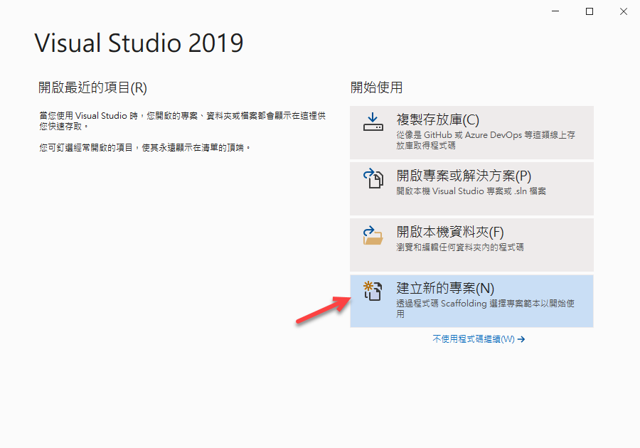
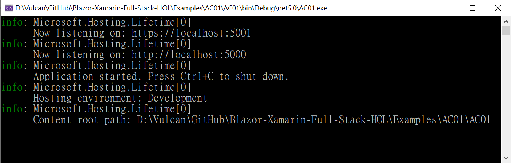

# ASP.NET Core 應該具備知識 - 應用程式啟動與Startup類別


## 建立一個 空白 ASP.NET Core 專案

* 開啟 Visual Studio 2019
* 在 [Visual Studio 2019] 對話窗中，點選右下方的 [建立新的專案] 選項

  

* 在 [建立新專案] 對話窗中，在中間上方的專案範本過濾條件中
  
  1. 設定程式語言為 [C#]
  2. 設定專案範本為 [Web]
  3. 選擇專案範本項目清單，點選 [空白 ASP.NET Core] 這個專案範本項目
  4. 點選右下方的 [下一步] 按鈕

  

* 在 [設定新的專案] 對話窗出現後

  在 [專案名稱] 內，輸入 `AC01`

  點選右下角的 [下一步] 按鈕

  

* 在 [其他資訊] 對話窗出現後，確認 [目標 Framework] 的下拉選單要選擇 [.NET 5.0 (目前)]
* 點選右下角的 [建立] 按鈕

  

* 此時這個 [ASP.NET Core] 專案已經建立完成，從方案總管視窗內可以看到如下圖的結構

  

## 執行這個專案

* 請按下 [F5] 按鍵，開始執行這個專案
* 瀏覽器的畫面如下

  

## 專案檔

* 滑鼠右擊這個專案節點
* 從彈出功能表中點選 [編輯專案檔]
* 將會看到底下內容

  根據為微軟官方文件上的描述，[專案檔](https://docs.microsoft.com/zh-tw/visualstudio/ide/solutions-and-projects-in-visual-studio?view=vs-2019#project-file&WT.mc_id=DT-MVP-5002220) 是以 MSBUILD XML 架構為基礎。 在邏輯上，專案會包含編譯成可執行檔、程式庫或網站的所有檔案。 這些檔案可以包含原始程式碼、圖示、影像、資料檔案等等。 專案也包含編譯器設定和其他組態檔，這些是您的程式與其通訊的各種服務或元件所需的項目。

```xml
<Project Sdk="Microsoft.NET.Sdk.Web">

  <PropertyGroup>
    <TargetFramework>net5.0</TargetFramework>
  </PropertyGroup>

</Project>
```

第一行將會定義這個專案的開發框架，這裡使用的是 [Microsoft.NET.Sdk.Web]；若建立起一個 [主控台應用程式]，並且觀察其 [專案檔] 的內容，將會如下

```xml
<Project Sdk="Microsoft.NET.Sdk">

  <PropertyGroup>
    <OutputType>Exe</OutputType>
    <TargetFramework>net5.0</TargetFramework>
  </PropertyGroup>

</Project>
```

從這裡可以很明確地看出，這裡使用的是 [Microsoft.NET.Sdk] 開發框架來建立這個專案

這個時候要分別針對這兩個方案總管來進行底下的操作

* 在 [方案總管] 內找到專案節點
* 找到並且展開 [相依性] 節點
* 此時可以看到 [分析器] 與 [架構] 這兩個節點
* 請展開 [架構] 這個節點
* 在左下圖為 [.NET Core] 這個專案中的 [架構] 節點下的清單，從這裡可以看的出來，這些清單項目為要開發 [.NET Core] 專案會使用到這個框架下的相關可以用到的 API 套件，這些項目都包含在 [Microsoft.NETCore.App] 內
* 在右下圖為 [ASP.NET Core] 這樣類型的專案內的 [結構] 節點下的清單，在這裡除了同樣包含 [Microsoft.NETCore.App] 這個框架套件組合，也包含了 [Microsoft.ASPNetCore.App] 這個框架套件組合
* 這些的差異都取決於 [專案檔] 第一行的定義為 `<Project Sdk="Microsoft.NET.Sdk">` 或者 `<Project Sdk="Microsoft.NET.Sdk.Web">` 而會有不同的結果
* 一旦在專案內包含了不同的框架套件組合，在專案內程式碼內就可以使用這些開發框架所提供的 API

  

## 專案進入點

對於 [ASP.NET Core] 類型的專案其同樣也是一個 [.NET Core] 採用的 [主控台應用程式] 專案，在剛剛建立的 [空白 ASP.NET Core] 專案內

* 打開根目錄下的 [Program.cs] 檔案
* 這個檔案內的程式碼如下

```csharp
using Microsoft.AspNetCore.Hosting;
using Microsoft.Extensions.Configuration;
using Microsoft.Extensions.Hosting;
using Microsoft.Extensions.Logging;
using System;
using System.Collections.Generic;
using System.Linq;
using System.Threading.Tasks;

namespace AC01
{
    public class Program
    {
        public static void Main(string[] args)
        {
            CreateHostBuilder(args).Build().Run();
        }

        public static IHostBuilder CreateHostBuilder(string[] args) =>
            Host.CreateDefaultBuilder(args)
                .ConfigureWebHostDefaults(webBuilder =>
                {
                    webBuilder.UseStartup<Startup>();
                });
    }
}
```

對於 [主控台應用程式] 類型的專案，程式的進入點為一個靜態 [Main] 的方法，程式碼將會從這裡開始來執行，例如，對於 [主控台應用程式] 內的 [Program.cs] 檔案內容如下

```csharp
using System;

namespace ConsoleApp1
{
    class Program
    {
        static void Main(string[] args)
        {
            Console.WriteLine("Hello World!");
        }
    }
}
```

在 [ASP.NET Core] 專案內的 [Main] 方法裡面僅有一行 `CreateHostBuilder(args).Build().Run();` 程式碼，這裡先透過 [CreateHostBuilder] 方法來取得一個 [IHostBuilder] 實作物件，接著使用 [Build] 方法來建置這個 Web Server，最後啟動這個 Web Server；這個 [Main] 方法將還不會結束，因為 Web Server 還持續在執行，一直到這個 Web Server 停止運作，這個 [主控台應用程式] 才會結束執行。

若使用 [Kestrol] Web 伺服器來啟動，將會在這個專案啟動的時候，顯示一個 [命令提示字元視窗]，從這個 [命令提示字元視窗] 顯示的文字可以看出，想要結束這個 Web Server，可以在這個 [命令提示字元視窗] 按下 [Ctrl] + [C] 按鍵，就可以結束這個 [ASP.NET Core] 的 Web Server。



對於 [CreateHostBuilder] 方法，使用了 [Host.CreateDefaultBuilder 方法](https://docs.microsoft.com/zh-tw/dotnet/api/microsoft.extensions.hosting.host.createdefaultbuilder?view=dotnet-plat-ext-5.0#Microsoft_Extensions_Hosting_Host_CreateDefaultBuilder_System_String___&WT.mc_id=DT-MVP-5002220) 來使用預先設定的預設值，初始化 HostBuilder 類別的新執行個體。接著使用 [UseStartup](https://docs.microsoft.com/zh-tw/dotnet/api/microsoft.aspnetcore.hosting.webhostbuilderextensions.usestartup?view=aspnetcore-5.0&WT.mc_id=DT-MVP-5002220) 方法來指定要供 web 主機使用的啟動類型。

## ASP.NET Core 中的應用程式啟動

對於這個 Web Server 究竟要如何運作呢？在剛剛有看到使用了 [UseStartup] 方法，搭配用了泛型參數來定這個 [Startup 類別](https://docs.microsoft.com/zh-tw/aspnet/core/fundamentals/startup?view=aspnetcore-5.0&WT.mc_id=DT-MVP-5002220) 來啟動 Web Server 

* 從專案的根目錄下可以找到並且打開 [Startup.cs] 檔案
* 這個檔案內的程式碼如下

```csharp
using Microsoft.AspNetCore.Builder;
using Microsoft.AspNetCore.Hosting;
using Microsoft.AspNetCore.Http;
using Microsoft.Extensions.DependencyInjection;
using Microsoft.Extensions.Hosting;
using System;
using System.Collections.Generic;
using System.Linq;
using System.Threading.Tasks;

namespace AC01
{
    public class Startup
    {
        // This method gets called by the runtime. Use this method to add services to the container.
        // For more information on how to configure your application, visit https://go.microsoft.com/fwlink/?LinkID=398940
        public void ConfigureServices(IServiceCollection services)
        {
        }

        // This method gets called by the runtime. Use this method to configure the HTTP request pipeline.
        public void Configure(IApplicationBuilder app, IWebHostEnvironment env)
        {
            if (env.IsDevelopment())
            {
                app.UseDeveloperExceptionPage();
            }

            app.UseRouting();

            app.UseEndpoints(endpoints =>
            {
                endpoints.MapGet("/", async context =>
                {
                    await context.Response.WriteAsync("Hello World!");
                });
            });
        }
    }
}
```

這個 [Startup] 類別相當的簡單，這個類別沒有繼承任何其他基底類別，也沒有實作任何的介面，在這個方法內必須要提供 [ConfigureServices] 與 [Configure] 這兩個方法。

ConfigureServices 方法來設定應用程式的服務，這些服務將會使用 [ASP.NET Core] 內提供的預設 相依性注入 Dependency Injection Container 容器來進行註冊 Register 這些服務，一旦把這些服務註冊到 IoC 容器內，在這個 Web 專案內若想要使用這個服務，就不再需要使用 new 運算子來建立這些服務的執行個體 (因為一旦使用這樣的方式取得這些服務的物件，就會產生緊密耦合的關係)，而可以透過相依性注入的方式來注入這些服務的物件，對於一般相依性注入容器可以提供這三種方式來注入這些服務物件，建構函式注入、屬性注入、函式注入；如此，可以讓整個 Web Server 專案形成具有鬆散耦合的關係。

而對 Configure 方法來建立應用程式的要求處理管線，當這個 Web Server 啟動之後，遠端設備若對這個 Web Server 發出一個 HTTP Request 請求，此時，將會逐一執行在 [Configure] 方法內的所設定中介軟體。

若在瀏覽器上輸入 `https://localhost:5001/` 網址，瀏覽器會出現 [Hello World!] 文字，這是因為在這個 [Configure] 方法的最後面有看到一個 [UseEndpoints]() 中介軟體，將端點執行新增至中介軟體管線；接著使用了 [MapGet] 方法指定當 HTTP Request 請求服務的端點為首頁的時候，此時，就直接顯示 [Hello World!] 文字在瀏覽器上。

```csharp
app.UseEndpoints(endpoints =>
{
    endpoints.MapGet("/", async context =>
    {
        await context.Response.WriteAsync("Hello World!");
    });
});
```

若此時在瀏覽器網址列上輸入 `https://localhost:5001/Vulcan` 這個服務端點網址，因為這個 `/Vulcan` 端點沒有註冊在中介軟體內，因此在 [Configure] 方法內所定義的中介軟體將無法提供產生這個服務端點的網頁內容，此時，將會看到底下的網頁畫面，產生 [此網址找不到網頁] 這樣的錯誤訊息。


