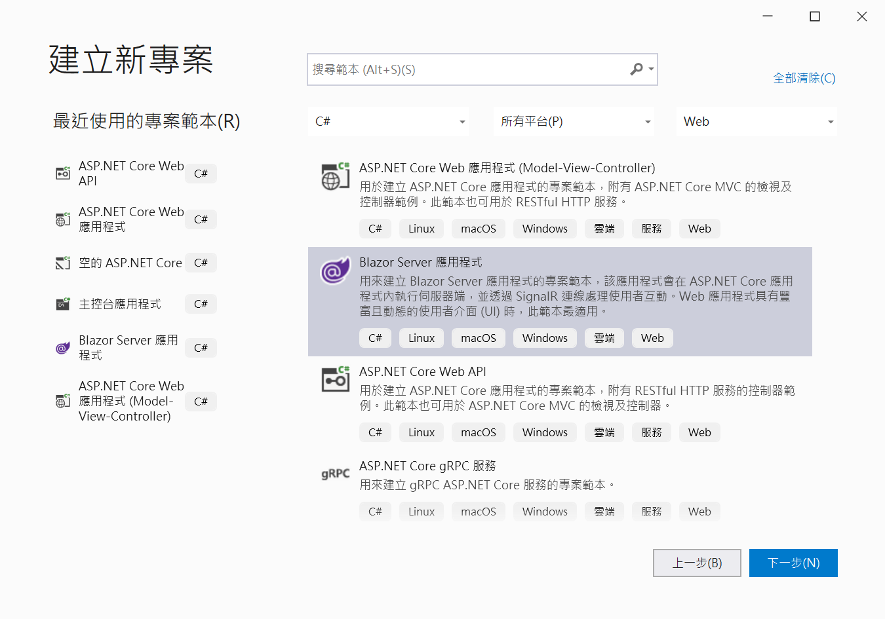
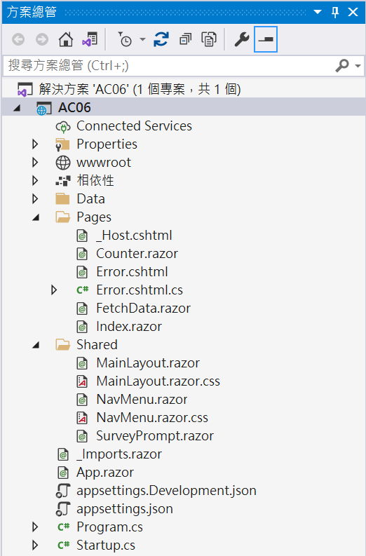
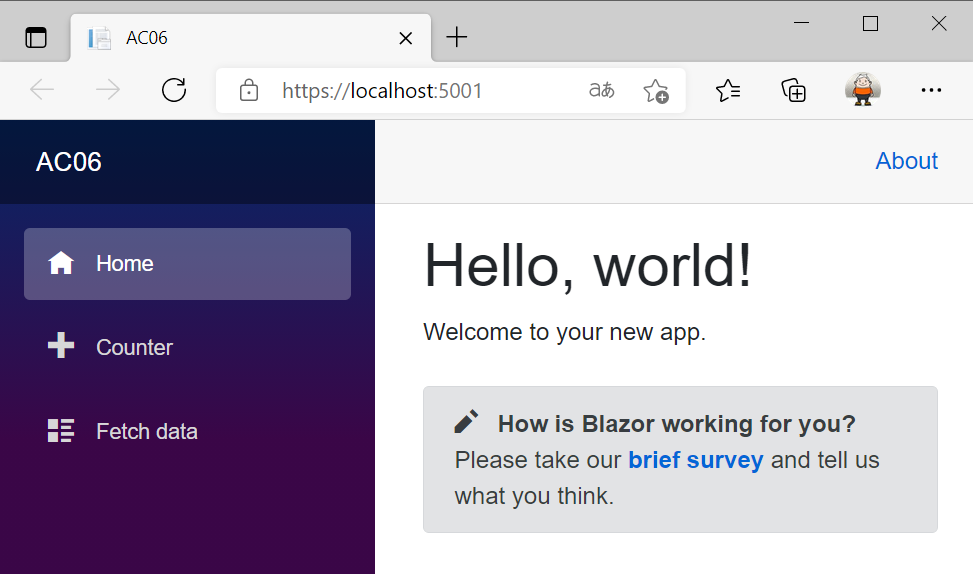
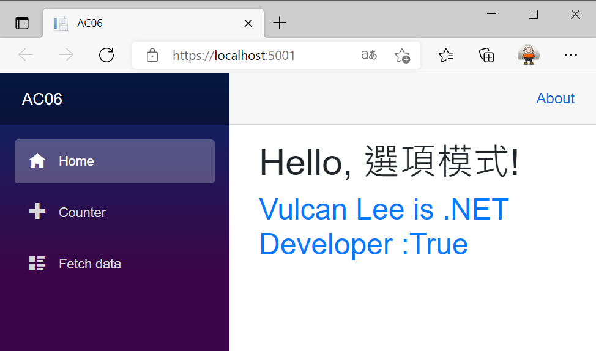

# ASP.NET Core 應該具備知識 - 選項模式


## 建立一個 ASP.NET Core Blazor Server 專案

* 開啟 Visual Studio 2019
* 在 [Visual Studio 2019] 對話窗中，點選右下方的 [建立新的專案] 選項
* 在 [建立新專案] 對話窗中，在中間上方的專案範本過濾條件中
  
  1. 設定程式語言為 [C#]
  2. 設定專案範本為 [Web]
  3. 選擇專案範本項目清單，點選 [Blazor Server 應用程式] 這個專案範本項目

     >用來建立 Blazor Server 應用程式的專案範本，該應用程式會在 ASP.NET Core 應用程式內執行伺服器端，並透過 SignalR 連線處理使用者互動。Web 應用程式具有豐富且動態的使用者介面 (UI) 時，此範本最適用。

     

  4. 點選右下方的 [下一步] 按鈕
* 在 [設定新的專案] 對話窗出現後

  在 [專案名稱] 內，輸入 `AC06`

  點選右下角的 [下一步] 按鈕

* 在 [其他資訊] 對話窗出現後，確認 [目標 Framework] 的下拉選單要選擇 [.NET 5.0 (目前)]
* 點選右下角的 [建立] 按鈕
* 此時這個 [ASP.NET Core Web 應用程式] 專案已經建立完成，從方案總管視窗內可以看到如下圖的結構

  

## 執行這個專案

* 請按下 [F5] 按鍵，開始執行這個專案
* 瀏覽器的畫面如下

  

## 修正 appsettings.json 檔案

* 在專案根目錄下找到並且打開 [appsettings.json] 檔案
* 使用底下 JSON 定義更新這個檔案內容

```json
{
  "Logging": {
    "LogLevel": {
      "Default": "Information",
      "Microsoft": "Warning",
      "Microsoft.Hosting.Lifetime": "Information"
    }
  },
  "AllowedHosts": "*",
  "Custom": {
    "MyEnglishName": "Vulcan Lee",
    "IsNETDeveloper": true,
    "NETDeveloperYear": 10,
    "Nest": {
      "IsNETDeveloper": true,
      "NETDeveloperYear": 10
    }
  }
}
```

## 建立 階層設定 對應的類別

* 滑鼠右擊 [Data] 資料夾
* 從彈出功能表清單點選 [加入] > [類別]
* 在出現 [新增項目 - AC06] 對話窗
* 在下方 [名稱] 欄位內輸入 `CustomMapClass`
* 點選右下方 [新增] 按鈕
* 使用底下程式碼替換掉這個檔案內容

```csharp
namespace AC06.Data
{
    public class CustomMapClass
    {
        public string MyEnglishName { get; set; }
        public bool IsNETDeveloper { get; set; }
        public int NETDeveloperYear { get; set; }
        public Nest Nest { get; set; }
    }

    public class Nest
    {
        public bool IsNETDeveloper { get; set; }
        public int NETDeveloperYear { get; set; }
    }
}
```

## 修正 Index.razor 元件頁面

* 在 [Pages] 資料夾下找到並且打開 [Index.razor] 檔案
* 使用底下的程式碼取代這個檔案內容

```html
@page "/"
@using Microsoft.Extensions.Configuration
@using Data
@inject IConfiguration configuration

<h1>Hello, 選項模式!</h1>
<h2 class="text-primary">@Message1</h2>

@code{

    public string Message1 { get; set; }

    protected override void OnAfterRender(bool firstRender)
    {
        var customMapClass = new CustomMapClass();
        configuration.GetSection("Custom").Bind(customMapClass);
        Message1 = $"{customMapClass.MyEnglishName} is .NET Developer :" +
                $"{customMapClass.Nest.IsNETDeveloper}";
        StateHasChanged();
    }
}
```

## 執行這個專案

* 按下 [Shift] + [F5] 來停止這個專案執行
* 請按下 [F5] 按鍵，開始執行這個專案
* 瀏覽器的畫面如下

  

從這裡可以看到使用了 [ConfigurationBinder.Bind 方法](https://docs.microsoft.com/zh-tw/dotnet/api/microsoft.extensions.configuration.configurationbinder.bind?view=dotnet-plat-ext-5.0&WT.mc_id=DT-MVP-5002220) 來做到嘗試將屬性名稱與組態索引鍵以遞迴方式比對，以將指定的物件執行個體繫結至組態值

因此，一旦完成這個 [Bind] 方法呼叫之後，從 設定 系統便可以讀取到相關設定屬性值，所以，透過 [customMapClass] 變數便可以使用強型別來取得相關設定屬性值。

## 使用強型別方式的 選項介面 來取得設定屬性值

* 在專案根目錄打開 [Startup.cs] 檔案
* 找到這個 [Configuration] 方法
* 接著加入底下的程式碼到這個方法內

```csharp
services.Configure<CustomMapClass>(Configuration.GetSection("Custom"));
```

## 修正 Index.razor 元件頁面

* 在 [Pages] 資料夾下找到並且打開 [Index.razor] 檔案
* 使用底下的程式碼取代這個檔案內容

```html
@page "/"
@using Microsoft.Extensions.Configuration
@using Microsoft.Extensions.Options
@using Data
@inject IConfiguration configuration
@inject IOptions<CustomMapClass> customMapClassOption

<h1>Hello, 選項模式!</h1>
<h2 class="text-primary">@Message1</h2>
<h2 class="text-success">@Message2</h2>

@code{

    public string Message1 { get; set; }
    public string Message2 { get; set; }

    protected override void OnAfterRender(bool firstRender)
    {
        var customMapClass = new CustomMapClass();
        configuration.GetSection("Custom").Bind(customMapClass);
        Message1 = $"{customMapClass.MyEnglishName} is .NET Developer :" +
                $"{customMapClass.Nest.IsNETDeveloper}";
        var customMapOption = customMapClassOption.Value;
        Message2 = $"{customMapOption.MyEnglishName} is .NET Developer :" +
            $"{customMapOption.Nest.IsNETDeveloper}";
        StateHasChanged();
    }
}
```

在這裡注入了 [IOptions<CustomMapClass>] 物件到 [customMapClassOption] 變數內，透過這個屬性內的 [Value] 屬性，便可以使用強型別方式來取得對應在設定內的相關屬性值。

## 執行這個專案

* 按下 [Shift] + [F5] 來停止這個專案執行
* 請按下 [F5] 按鍵，開始執行這個專案
* 瀏覽器的畫面如下

  


