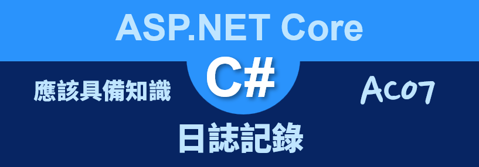
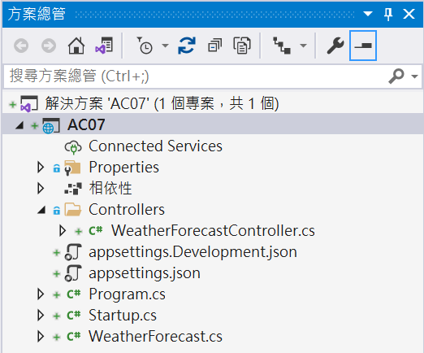
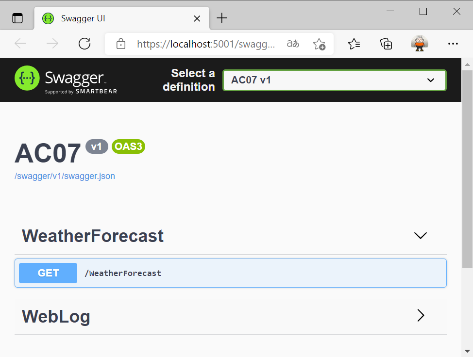
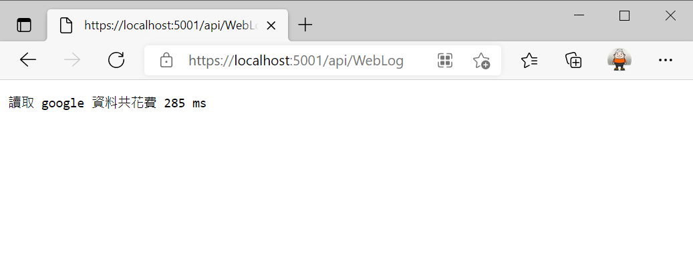
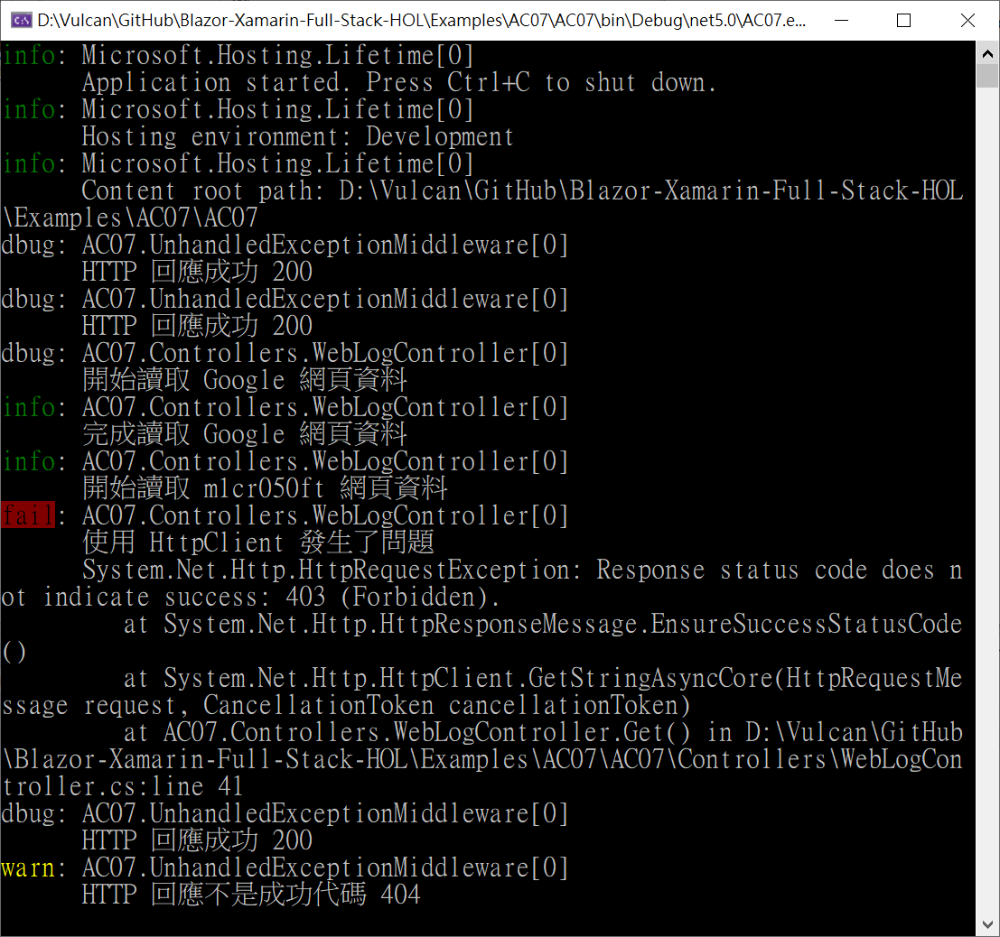

# ASP.NET Core 應該具備知識 - 日誌記錄



## 建立一個 ASP.NET Core MVC 專案

* 開啟 Visual Studio 2019
* 在 [Visual Studio 2019] 對話窗中，點選右下方的 [建立新的專案] 選項
* 在 [建立新專案] 對話窗中，在中間上方的專案範本過濾條件中
  
  1. 設定程式語言為 [C#]
  2. 設定專案範本為 [Web]
  3. 選擇專案範本項目清單，點選 [ASP.NET Core Web API] 這個專案範本項目

     >用於建立 ASP.NET Core 應用程式的專案範本，附有 RESTful HTTP 服務的控制器範例。此範本也可用於 ASP.NET Core MVC 的檢視及控制器。

  4. 點選右下方的 [下一步] 按鈕

* 在 [設定新的專案] 對話窗出現後

  在 [專案名稱] 內，輸入 `AC07`

  點選右下角的 [下一步] 按鈕

* 在 [其他資訊] 對話窗出現後，確認 [目標 Framework] 的下拉選單要選擇 [.NET 5.0 (目前)]
* 點選右下角的 [建立] 按鈕

  

## 建立服務類別與介面

* 滑鼠右擊專案節點
* 從彈出功能表來選取 [加入] > [類別]
* 當出現 [新增項目 - AC07] 對話窗
* 在下方 [名稱] 欄位輸入 [UnhandledExceptionMiddleware.cs]
* 在右下方點選 [新增] 按鈕
* 使用底下的程式碼替換掉這個檔案原先內容

```csharp
using Microsoft.AspNetCore.Http;
using Microsoft.Extensions.Logging;
using System;
using System.Threading.Tasks;

namespace AC07
{
    public class UnhandledExceptionMiddleware
    {
        private readonly ILogger logger;
        private readonly RequestDelegate next;

        public UnhandledExceptionMiddleware(ILogger<UnhandledExceptionMiddleware> logger, RequestDelegate next)
        {
            this.logger = logger;
            this.next = next;
        }

        public async Task Invoke(HttpContext context)
        {
            try
            {
                await next(context);
                if(IsSuccessStatusCode(context.Response))
                {
                    logger.LogDebug($"HTTP 回應成功 {context.Response.StatusCode}");
                }
                else
                {
                    logger.LogWarning($"HTTP 回應不是成功代碼 {context.Response.StatusCode}");
                }
            }
            catch (Exception exception)
            {
                logger.LogError(exception,
                    $"Request {context.Request?.Method}: {context.Request?.Path.Value} failed");
            }
        }
        public bool IsSuccessStatusCode(HttpResponse response)
        {
            return response.StatusCode >= 200 && response.StatusCode <= 299;
        }
    }
}
```

## 設計新的 API 控制器

* 滑鼠右擊 [Controllers] 資料夾
* 從彈出功能表清單中點選 [加入] > [控制器]
* 當 [新增 Scaffold 項目] 對話窗出現之後
* 依序點選 [已安裝] > [通用] > [API] > [API 控制器 - 空白]
* 點選右下角的 [加入] 按鈕
* 現在將會看到 [新增項目 - AC07] 對話窗
* 在下方的 [名稱] 欄位中輸入 `WebLogController`
* 點選右下方 [新增] 按鈕
* 使用底下的程式碼替換這個檔案內容

```csharp
using Microsoft.AspNetCore.Mvc;
using Microsoft.Extensions.Logging;
using System;
using System.Diagnostics;
using System.Net.Http;
using System.Text;
using System.Threading.Tasks;

namespace AC07.Controllers
{
    [Route("api/[controller]")]
    [ApiController]
    public class WebLogController : ControllerBase
    {
        public WebLogController(ILogger<WebLogController> logger)
        {
            Logger = logger;
        }

        public ILogger<WebLogController> Logger { get; }

        [HttpGet]
        public async Task<string> Get()
        {
            StringBuilder result = new StringBuilder();

            var client = new HttpClient();

            try
            {
                Stopwatch stopwatch = new Stopwatch();
                stopwatch.Start();
                
                Logger.LogDebug($"開始讀取 Google 網頁資料");
                string message = await client.GetStringAsync("http://www.google.com");
                Logger.LogInformation($"完成讀取 Google 網頁資料");
                stopwatch.Stop();
                result.Append($"讀取 google 資料共花費 {stopwatch.ElapsedMilliseconds} ms" + Environment.NewLine);
                
                Logger.LogInformation($"開始讀取 m1cr050ft 網頁資料");
                message = await client.GetStringAsync("http://www.m1cr050ft.com");
                Logger.LogInformation($"完成讀取 m1cr050ft 網頁資料");
                result.Append($"讀取 micr0s0ft 資料共花費 {stopwatch.ElapsedMilliseconds} ms" + Environment.NewLine);
            }
            catch (Exception ex)
            {
                Logger.LogError(ex, $"使用 HttpClient 發生了問題");
            }

            return result.ToString();
        }
    }
}
```

## 執行這個專案

* 請按下 [F5] 按鍵，開始執行這個專案
* 瀏覽器的畫面如下

  

* 請在瀏覽器上輸入 `https://localhost:5001/api/WebLog` 網址
* 將會看到底下的畫面
 
  

* 切換到執行這個專案的 [命令提示字元視窗] 下
* 將會看到底下的內容

```
info: AC07.Controllers.WebLogController[0]
      完成讀取 Google 網頁資料
info: AC07.Controllers.WebLogController[0]
      開始讀取 m1cr050ft 網頁資料
fail: AC07.Controllers.WebLogController[0]
      使用 HttpClient 發生了問題
      System.Net.Http.HttpRequestException: Response status code does not indicate success: 403 (Forbidden).
         at System.Net.Http.HttpResponseMessage.EnsureSuccessStatusCode()
         at System.Net.Http.HttpClient.GetStringAsyncCore(HttpRequestMessage request, CancellationToken cancellationToken)
         at AC07.Controllers.WebLogController.Get() in D:\Vulcan\GitHub\Blazor-Xamarin-Full-Stack-HOL\Examples\AC07\AC07\Controllers\WebLogController.cs:line 41
warn: AC07.UnhandledExceptionMiddleware[0]
      HTTP 回應不是成功代碼 404
```

* 在這個 `public async Task<string> Get()` 方法內，看到原本對於有呼叫 `Logger.LogDebug($"開始讀取 Google 網頁資料");` 方法，要把這段文字內容寫入到日誌提供者內，可是卻沒有看到；而其他有使用到 [Logger] 物件所產出的日誌輸出，都可以在 [命令提示字元視窗] 下看到。

對於呼叫 `await client.GetStringAsync("http://www.m1cr050ft.com");` 方法之後，因為該網址不存在，所以，會拋出例外異常，這裡也會被 `try {...} catch{...}` 敘述捕捉起來，並且透過 `Logger.LogError(ex, $"使用 HttpClient 發生了問題");` 敘述將這個例外異常訊息寫入到日誌提供者內。

## 修正那些日誌資訊可以看得到

現在要來解決為什麼執行 `Logger.LogDebug($"開始讀取 Google 網頁資料");` 敘述，但是在 [命令提示字元視窗] 內沒有出現；要理解這個問題，要先來看看 [appsettings.json]這個檔案的內。

* 底下為 [appsettings.json] 檔案內的內容

```json
{
  "Logging": {
    "LogLevel": {
      "Default": "Information",
      "Microsoft": "Warning",
      "Microsoft.Hosting.Lifetime": "Information"
    }
  },
  "AllowedHosts": "*"
}
```

Logging屬性可以有 LogLevel 和記錄提供者屬性。 會 LogLevel 指定要記錄所選分類的最低層級。 在先前的 JSON 中 Information ， Warning 會指定和記錄層級。 LogLevel指出記錄檔的嚴重性，範圍從0到6：

Trace= 0、 Debug = 1、 Information = 2、 Warning = 3、 Error = 4、 Critical = 5 和 None = 6。

當 LogLevel 指定時，會針對指定層級和更新版本中的訊息啟用記錄。 在先前的 JSON 中， Default 類別目錄會針對 Information 和更高版本進行記錄。 例如， Information Warning 會記錄、、 Error 和 Critical 訊息。 如果未 LogLevel 指定，則記錄預設為 Information 層級。

* 在第一個 [Logging] 屬性是用來設定日誌輸出設定
* 從 [LogLevel] > [Default] 的屬性值看到，這個日誌提供者僅會針對 [Information] 以上等級的日誌才會寫入輸出
* 若此時變更 [Logging] > [LogLevel] > [Default] 屬性值為 [Trace]
* 按下 [Ctrl] + [F5] 按鈕，停止這個專案執行
* 請按下 [F5] 按鍵，開始執行這個專案
* 請在瀏覽器上輸入 `https://localhost:5001/api/WebLog` 網址
* 切換到執行這個專案的 [命令提示字元視窗] 下
* 將會看到底下的內容

```
info: AC07.Controllers.WebLogController[0]
      完成讀取 Google 網頁資料
info: AC07.Controllers.WebLogController[0]
      開始讀取 m1cr050ft 網頁資料
fail: AC07.Controllers.WebLogController[0]
      使用 HttpClient 發生了問題
      System.Net.Http.HttpRequestException: Response status code does not indicate success: 403 (Forbidden).
         at System.Net.Http.HttpResponseMessage.EnsureSuccessStatusCode()
         at System.Net.Http.HttpClient.GetStringAsyncCore(HttpRequestMessage request, CancellationToken cancellationToken)
         at AC07.Controllers.WebLogController.Get() in D:\Vulcan\GitHub\Blazor-Xamarin-Full-Stack-HOL\Examples\AC07\AC07\Controllers\WebLogController.cs:line 41
warn: AC07.UnhandledExceptionMiddleware[0]
      HTTP 回應不是成功代碼 404
```

* 不過，還是沒有看到 `Logger.LogDebug($"開始讀取 Google 網頁資料");` 這個日誌的輸出
* 這是因為對於 [ASP.NET Core 設定] 功能
* 對於在開發除錯模式下
* 當要讀取 設定 屬性值，會先讀取 [appsettings.json] 內的設定屬性值
* 底下為 [appsettings.Development.json] 檔案內的內容

```json
{
  "Logging": {
    "LogLevel": {
      "Default": "Information",
      "Microsoft": "Warning",
      "Microsoft.Hosting.Lifetime": "Information"
    }
  }
}
```

* 接著，會來讀取 [appsettings.Development.json] 內的設定屬性值，並且會優先使用這個檔案內的屬性值

因此，雖然在 [appsettings.json] 內變更 [Logging] > [LogLevel] > [Default] 屬性值為 [Trace]，不過在 [appsettings.Development.json] 內的 [Logging] > [LogLevel] > [Default] 屬性值為 [Information]，所以，還是排除掉了 [Debug] 這個等級的日誌訊息。

* 現在修正 [appsettings.Development.json] 內的 [Logging] > [LogLevel] > [Default] 屬性值為 [Trace]
* 按下 [Ctrl] + [F5] 按鈕，停止這個專案執行
* 請按下 [F5] 按鍵，開始執行這個專案
* 請在瀏覽器上輸入 `https://localhost:5001/api/WebLog` 網址
* 切換到執行這個專案的 [命令提示字元視窗] 下
* 將會看到底下的內容

  

```
dbug: AC07.UnhandledExceptionMiddleware[0]
      HTTP 回應成功 200
dbug: AC07.UnhandledExceptionMiddleware[0]
      HTTP 回應成功 200
dbug: AC07.Controllers.WebLogController[0]
      開始讀取 Google 網頁資料
info: AC07.Controllers.WebLogController[0]
      完成讀取 Google 網頁資料
info: AC07.Controllers.WebLogController[0]
      開始讀取 m1cr050ft 網頁資料
fail: AC07.Controllers.WebLogController[0]
      使用 HttpClient 發生了問題
      System.Net.Http.HttpRequestException: Response status code does not indicate success: 403 (Forbidden).
         at System.Net.Http.HttpResponseMessage.EnsureSuccessStatusCode()
         at System.Net.Http.HttpClient.GetStringAsyncCore(HttpRequestMessage request, CancellationToken cancellationToken)
         at AC07.Controllers.WebLogController.Get() in D:\Vulcan\GitHub\Blazor-Xamarin-Full-Stack-HOL\Examples\AC07\AC07\Controllers\WebLogController.cs:line 41
dbug: AC07.UnhandledExceptionMiddleware[0]
      HTTP 回應成功 200
warn: AC07.UnhandledExceptionMiddleware[0]
      HTTP 回應不是成功代碼 404
```


