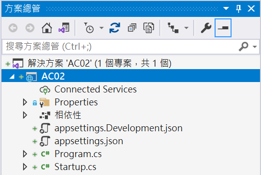
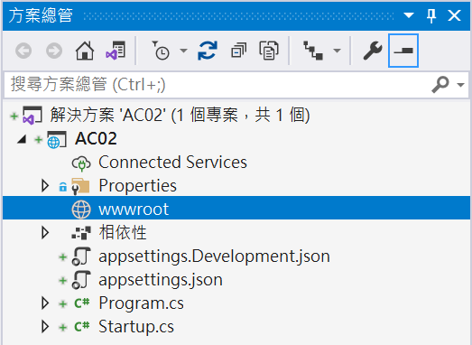
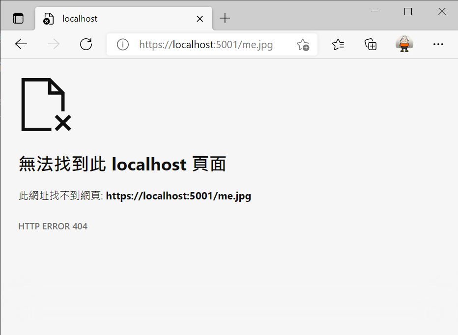

# ASP.NET Core 應該具備知識 - 靜態檔案


## 建立一個 空白 ASP.NET Core 專案

首先來建立一個測試用的專案，這裡使用的是 [空白 ASP.NET Core]

* 開啟 Visual Studio 2019
* 在 [Visual Studio 2019] 對話窗中，點選右下方的 [建立新的專案] 選項
* 在 [建立新專案] 對話窗中，在中間上方的專案範本過濾條件中
  
  1. 設定程式語言為 [C#]
  2. 設定專案範本為 [Web]
  3. 選擇專案範本項目清單，點選 [空白 ASP.NET Core] 這個專案範本項目
  4. 點選右下方的 [下一步] 按鈕

* 在 [設定新的專案] 對話窗出現後

  在 [專案名稱] 內，輸入 `AC02`

  點選右下角的 [下一步] 按鈕

* 在 [其他資訊] 對話窗出現後
* 確認 [目標 Framework] 的下拉選單要選擇 [.NET 5.0 (目前)]
* 點選右下角的 [建立] 按鈕

* 此時這個 [ASP.NET Core] 專案已經建立完成
* 從方案總管視窗內可以看到如下圖的結構

  

## 在專案中存放靜態圖片檔案

靜態檔案會儲存在專案的 web 根目錄 中，而 [Web 根目錄](https://docs.microsoft.com/zh-tw/aspnet/core/fundamentals/?view=aspnetcore-5.0&tabs=windows#web-root&WT.mc_id=DT-MVP-5002220) 表示公用靜態資源檔的基底路徑，在這個目錄下可以存放如：樣式表單 (.css)、JavaScript (.js)、影像 (.png、 .jpg) 等類型的檔案。

不過，在這個 [] 類型的專案內，似乎沒有看到這樣的目錄存在，因此，可以透過底下程序來建立起來

* 滑鼠右擊專案節點
* 從彈出功能表中點選 [加入] > [新增資料夾]
* 將這個資料夾命名為 `wwwroot`

  

* 從上面截圖可以看到在 [方案總管] 視窗內出現了一個新的 [wwwroot] 資料夾，不過，該資料夾的代表圖示變成一個 [地球] 圖示，這代表了這個資料夾為 [Web 根目錄]
* 請找到一個圖片檔案，這裡找到一個 [me.jpg] 圖片檔案，請使用 [檔案總管] 拖拉到 [me.jpg] 圖片檔案到 [方案總管] 內的 [wwwroot] 資料夾

  

## 執行這個專案

* 請按下 [F5] 按鍵，開始執行這個專案
* 請輸入 `https://localhost:5001/me.jpg` 服務端點
* 可是卻沒有看到圖片，瀏覽器的畫面如下

  

* 這裡出現了 HTTP 404 的錯誤代碼，代表找不到這個圖片資源檔案

## 加入使用靜態資源檔案的中介軟體

* 剛剛明明有加入 [wwwroot] 資料夾與圖片檔案，但是卻沒有從瀏覽器看到圖片
* 在專案根目錄中打開 [Startup.cs] 檔案
* 找到 [Configure] 方法
* 將這個 `app.UseStaticFiles();` 敘述加入到 `app.UseRouting();` 敘述前
* 底下為完成後的 [Configure] 方法

```csharp
public void Configure(IApplicationBuilder app, IWebHostEnvironment env)
{
    if (env.IsDevelopment())
    {
        app.UseDeveloperExceptionPage();
    }

    #region 啟用靜態檔案服務
    app.UseStaticFiles();
    #endregion

    app.UseRouting();
    app.UseEndpoints(endpoints =>
    {
        endpoints.MapGet("/", async context =>
        {
            await context.Response.WriteAsync("Hello World!");
        });
    });
}
```

* 這裡的 [UseStaticFiles 方法](https://docs.microsoft.com/zh-tw/dotnet/api/microsoft.aspnetcore.builder.staticfileextensions.usestaticfiles?view=aspnetcore-5.0&WT.mc_id=DT-MVP-5002220) 針對目前的要求路徑啟用靜態檔案服務

## 再度執行這個專案

* 請按下 [Ctrl] + [F5] 按鈕，停止執行這個專案
* 請按下 [F5] 按鍵，開始執行這個專案
* 請輸入 `https://localhost:5001/me.jpg` 服務端點
* 現在卻可以看到圖片，瀏覽器的畫面如下

  

