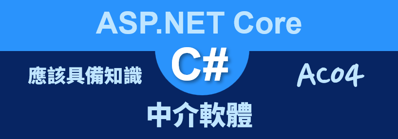
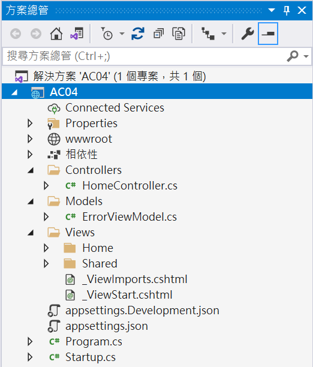
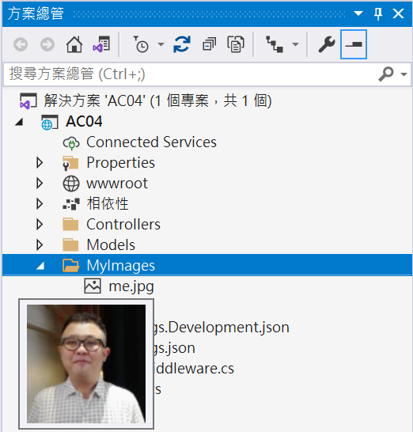
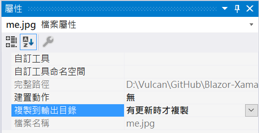
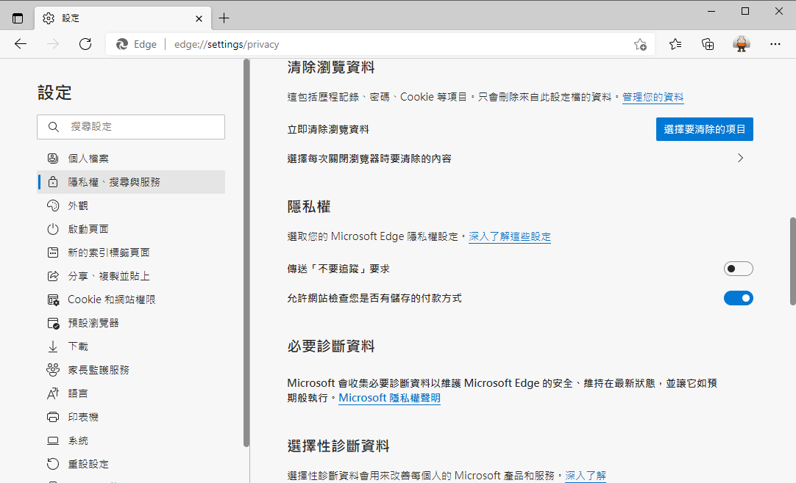
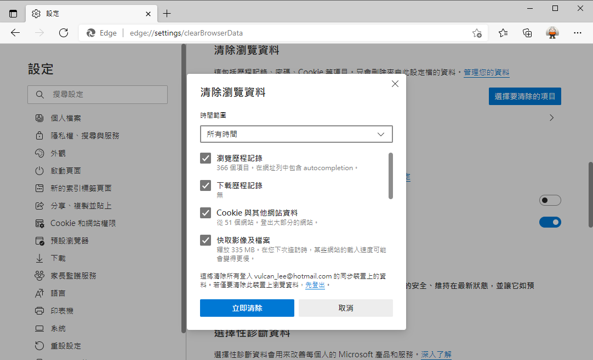
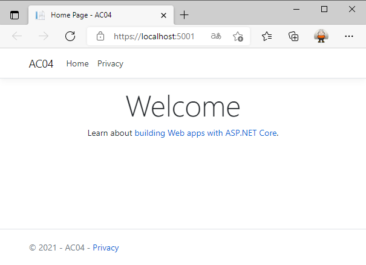
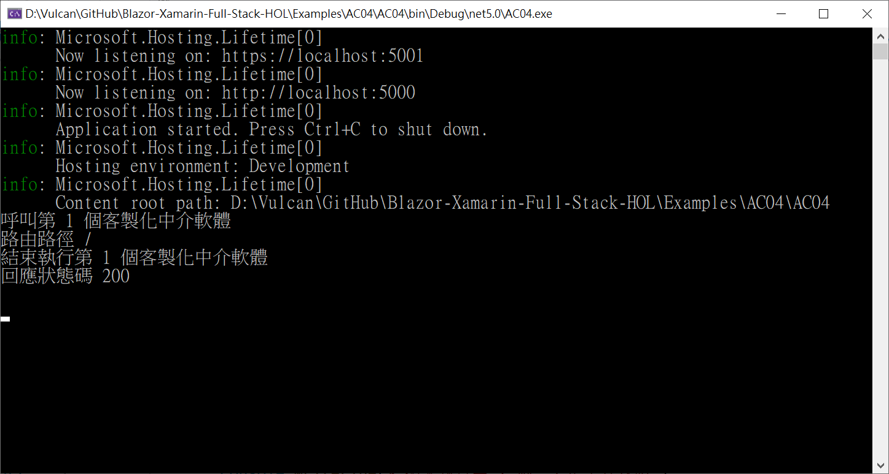
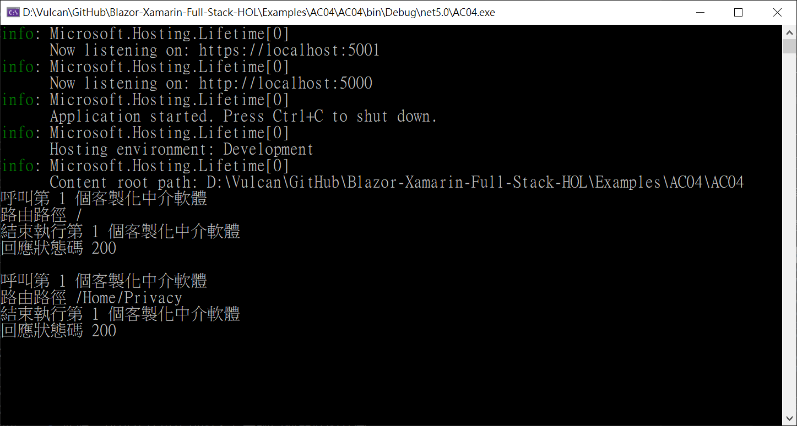
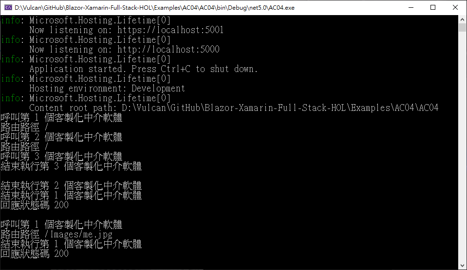

# ASP.NET Core 應該具備知識 - 中介軟體



## 建立一個 空白 ASP.NET Core 專案

* 開啟 Visual Studio 2019
* 在 [Visual Studio 2019] 對話窗中，點選右下方的 [建立新的專案] 選項
* 在 [建立新專案] 對話窗中，在中間上方的專案範本過濾條件中
  
  1. 設定程式語言為 [C#]
  2. 設定專案範本為 [Web]
  3. 選擇專案範本項目清單，點選 [ASP.NET Core Web 應用程式 (Model-View-Controller)] 這個專案範本項目
  4. 點選右下方的 [下一步] 按鈕
* 在 [設定新的專案] 對話窗出現後

  在 [專案名稱] 內，輸入 `AC04`

  點選右下角的 [下一步] 按鈕

* 在 [其他資訊] 對話窗出現後，確認 [目標 Framework] 的下拉選單要選擇 [.NET 5.0 (目前)]
* 點選右下角的 [建立] 按鈕
* 此時這個 [ASP.NET Core Web 應用程式 (Model-View-Controller)] 專案已經建立完成，從方案總管視窗內可以看到如下圖的結構

  

* 請打開根目錄下的 [Startup.cs] 檔案，中介軟體將會在這裡進行設計

```csharp
using Microsoft.AspNetCore.Builder;
using Microsoft.AspNetCore.Hosting;
using Microsoft.AspNetCore.HttpsPolicy;
using Microsoft.Extensions.Configuration;
using Microsoft.Extensions.DependencyInjection;
using Microsoft.Extensions.Hosting;
using System;
using System.Collections.Generic;
using System.Linq;
using System.Threading.Tasks;

namespace AC04
{
    public class Startup
    {
        public Startup(IConfiguration configuration)
        {
            Configuration = configuration;
        }

        public IConfiguration Configuration { get; }

        // This method gets called by the runtime. Use this method to add services to the container.
        public void ConfigureServices(IServiceCollection services)
        {
            services.AddControllersWithViews();
        }

        // This method gets called by the runtime. Use this method to configure the HTTP request pipeline.
        public void Configure(IApplicationBuilder app, IWebHostEnvironment env)
        {
            if (env.IsDevelopment())
            {
                app.UseDeveloperExceptionPage();
            }
            else
            {
                app.UseExceptionHandler("/Home/Error");
                // The default HSTS value is 30 days. You may want to change this for production scenarios, see https://aka.ms/aspnetcore-hsts.
                app.UseHsts();
            }
            app.UseHttpsRedirection();
            app.UseStaticFiles();

            app.UseRouting();

            app.UseAuthorization();

            app.UseEndpoints(endpoints =>
            {
                endpoints.MapControllerRoute(
                    name: "default",
                    pattern: "{controller=Home}/{action=Index}/{id?}");
            });
        }
    }
}
```

## 加入一個客製化的圖片資料夾與圖片檔案

* 滑鼠右擊專案節點
* 從彈出功能表中選取 [加入] > [新增資料夾]
* 命名這個新資料夾為 [MyImages]
* 請自行找到一個圖片檔案
* 在這裡將會使用一個 [me.jpg] 圖片檔案
* 使用檔案總管拖拉這個檔案到 [MyImages] 資料夾內

  

* 滑鼠右擊這個  [me.jpg] 圖片檔案
* 從彈出功能表點選 [屬性] 選項
* 從 [屬性] 視窗，設定 [複製到輸出目錄] 項目為 [有更新時才複製]

  

## 加入客製化的中介軟體

* 在根目錄下找到 [Startup.cs] 檔案
* 打開 [Startup.cs] 檔案並且搜尋 [Configure] 方法
* 在該方法的第一行，插入底下程式碼

```csharp
#region Case 1 自行客製中介軟體 1
app.Use(async (context, next) =>
{
    // 呼叫下一個中介軟體要執行的內容，在這裡不要寫入任何內容到 HTTP Responet 回應內
    Console.WriteLine($"呼叫第 1 個客製化中介軟體");
    Console.WriteLine($"路由路徑 {context.Request.Path}");
    await next.Invoke();
    // 自這裡進行寫入日誌或其他工作，在這裡不要寫入任何內容到 HTTP Responet 回應內
    Console.WriteLine($"結束執行第 1 個客製化中介軟體");
    Console.WriteLine($"回應狀態碼 {context.Response.StatusCode}");
    Console.WriteLine();
});
#endregion
```

## 執行這個專案 - Case1 中介軟體

* 為了做出更加詳細的測試，請先將瀏覽器的快取內容
* 這裡使用的是 微軟 Chrome 瀏覽器
* 點選瀏覽器右上方的 `...` 
* 在彈出功能表選出 [設定] 選項
* 在 [設定] 網頁上，點選左方功能清單中的 [隱私權、搜尋與服務] 項目
* 在右方的網頁中，找到 [清除瀏覽資料] > [立即清除瀏覽資料] 右方的 [選擇要清除的項目]

  

* 此時看到 [清除瀏覽資料] 對話窗
* 依照預設值設定內容，點選下方的 [立即清除] 按鈕

  

* 稍微等候一下，相關的快取檔案就會清除了
* 請切換使用 Kestrol Web 伺服器模式，按下 [F5] 按鍵，開始執行這個專案
* 瀏覽器的畫面如下

  

* 當開啟了 [https://localhost:5001/] 網址之後，可以在 [命令提示字元視窗] 看到底下的內容

```
呼叫第 1 個客製化中介軟體
路由路徑 /
結束執行第 1 個客製化中介軟體
回應狀態碼 200

呼叫第 1 個客製化中介軟體
呼叫第 1 個客製化中介軟體
呼叫第 1 個客製化中介軟體
路由路徑 /js/site.js
路由路徑 /css/site.css
呼叫第 1 個客製化中介軟體
路由路徑 /lib/jquery/dist/jquery.min.js
路由路徑 /lib/bootstrap/dist/css/bootstrap.min.css
呼叫第 1 個客製化中介軟體
路由路徑 /lib/bootstrap/dist/js/bootstrap.bundle.min.js
結束執行第 1 個客製化中介軟體
結束執行第 1 個客製化中介軟體
回應狀態碼 200

回應狀態碼 200

結束執行第 1 個客製化中介軟體
結束執行第 1 個客製化中介軟體
結束執行第 1 個客製化中介軟體
回應狀態碼 200

回應狀態碼 200

回應狀態碼 200

呼叫第 1 個客製化中介軟體
路由路徑 /favicon.ico
結束執行第 1 個客製化中介軟體
回應狀態碼 200
```

* 從上面的內容可以看出，當開啟一個 ASP.NET MVC 網頁的時候，並不是只有一個 HTTP Request 請求對 Web 伺服器上來執行
* 這裡會有 `路由路徑 /` 、 `路由路徑 /js/site.js` 、 `路由路徑 /css/site.css` 、 `路由路徑 /lib/jquery/dist/jquery.min.js` 、 `路由路徑 /lib/bootstrap/dist/css/bootstrap.min.css` 、 `路由路徑 /lib/bootstrap/dist/js/bootstrap.bundle.min.js` 、 `路由路徑 /favicon.ico` 7 個 HTTP Request 請求，因為為了要顯示這個網頁，需要從 Web 伺服器讀取相關的 JavaScript 檔案，以便可以在瀏覽器端執行
* 現在可以按下 [Shift] + [F5] 按鍵，停止這個專案執行
* 接著再度按下 [F5] 按鍵，開始執行這個專案
* 當瀏覽器顯示之後，當開啟了 [https://localhost:5001/] 網址
* 請切換到 [命令提示字元視窗] 看到底下的內容

  

  因為許多檔案或者程式都已經讀取到瀏覽器快取儲存體內，因此，此時只會有一個 HTTP Request 請求產生

* 請點選瀏覽器畫面上的 [Privacy] 連結文字
* 此時，從 [命令提示字元視窗] 內，僅會看到有 `路由路徑 /Home/Privacy` 請求產生

  

* 到了這裡可以理解到 ASP.NET Core 中介軟體運作的方式與設計架構

## 設計一個新的客製化中介軟體類別

* 滑鼠右擊專案節點
* 從彈出功能表中選取 [加入] > [類別]
* 在下方 [名稱] 欄位內輸入 `CustomMiddleware.cs`
* 點選右下方 [新增] 按鈕

```csharp
public class CustomMiddleware
{
    private readonly RequestDelegate _next;
    public CustomMiddleware(RequestDelegate next)
    {
        _next = next;
    }
    public async Task Invoke(HttpContext httpContext, IConfiguration configuration)
    {
        // 呼叫下一個中介軟體要執行的內容，在這裡不要寫入任何內容到 HTTP Responet 回應內
        Console.WriteLine($"呼叫第 3 個客製化中介軟體");
        await _next(httpContext);
        // 自這裡進行寫入日誌或其他工作，在這裡不要寫入任何內容到 HTTP Responet 回應內
        Console.WriteLine($"結束執行第 3 個客製化中介軟體");
        Console.WriteLine();
    }
}
public static class CustomMiddlewareExtensions
{
    public static IApplicationBuilder UseCustomMiddleware(this IApplicationBuilder builder)
    {
        return builder.UseMiddleware<CustomMiddleware>();
    }
}
```

## 再加入其他客製化的中介軟體

* 在根目錄下找到 [Startup.cs] 檔案
* 打開 [Startup.cs] 檔案並且搜尋找到 [app.UseStaticFiles();] 敘述
* 在該敘述下方加入底下程式碼

```csharp
#region Case 2 加入額外的提供靜態檔案的選項 StaticFileOptions 
app.UseStaticFiles(new StaticFileOptions()
{
    FileProvider = new PhysicalFileProvider(
                    Path.Combine(Directory.GetCurrentDirectory(), "MyImages")),
    RequestPath = "/Images"
});
#endregion
```

* 找到 [app.UseAuthorization();] 敘述
* 在該敘述下方加入底下程式碼

```csharp
#region Case 3 自行客製中介軟體 2
app.Use(async (context, next) =>
{
    Console.WriteLine($"呼叫第 2 個客製化中介軟體");
    Console.WriteLine($"路由路徑 {context.Request.Path}");
    // 限制這個 端點 僅能夠看到 "Hello World!" 文字
    if (context.Request.Path == "/Vulcan")
    {
        await context.Response.WriteAsync("Hello World!");
        return;
    }
    
    await next.Invoke();
    // 自這裡進行寫入日誌或其他工作，在這裡不要寫入任何內容到 HTTP Responet 回應內
    Console.WriteLine($"結束執行第 2 個客製化中介軟體");
});
#endregion
#region Case 4 自行客製中介軟體 3
app.UseCustomMiddleware();
#endregion
```

## 執行這個專案 - Case2 中介軟體

* 現在額外加入了三個中介軟體到 ASP.NET Core 專案內
* 若該專案上在執行階段，請按下 [Shift] + [F5] 來終止這個專案執行，接著請按下 [F5] 按鍵，開始執行這個專案
* 當開啟了 [https://localhost:5001/] 網址之後，可以在 [命令提示字元視窗] 看到底下的內容

```
info: Microsoft.Hosting.Lifetime[0]
      Now listening on: https://localhost:5001
info: Microsoft.Hosting.Lifetime[0]
      Now listening on: http://localhost:5000
info: Microsoft.Hosting.Lifetime[0]
      Application started. Press Ctrl+C to shut down.
info: Microsoft.Hosting.Lifetime[0]
      Hosting environment: Development
info: Microsoft.Hosting.Lifetime[0]
      Content root path: D:\Vulcan\GitHub\Blazor-Xamarin-Full-Stack-HOL\Examples\AC04\AC04
呼叫第 1 個客製化中介軟體
路由路徑 /
呼叫第 2 個客製化中介軟體
路由路徑 /
呼叫第 3 個客製化中介軟體
結束執行第 3 個客製化中介軟體

結束執行第 2 個客製化中介軟體
結束執行第 1 個客製化中介軟體
回應狀態碼 200
```

* 從 [命令提示字元視窗] 輸出的內容可以看到，這裡專案額外加入的 [Case1] 、 [Case2] 、 [Case3] 、 [Case4] 都有被執行到，不過因為 [Case2] 是採用 ASP.NET Core 內建提供的中介軟體，因此，沒有訊息顯示在 [命令提示字元視窗] 內

* 請在瀏覽器位址列上輸入 `https://localhost:5001/Images/me.jpg` 服務端點
* 此時，可以在瀏覽器看到這個 [me.jpg] 圖片檔案
* 而在 [命令提示字元視窗] 內會看到底下內容

  

```
info: Microsoft.Hosting.Lifetime[0]
      Now listening on: https://localhost:5001
info: Microsoft.Hosting.Lifetime[0]
      Now listening on: http://localhost:5000
info: Microsoft.Hosting.Lifetime[0]
      Application started. Press Ctrl+C to shut down.
info: Microsoft.Hosting.Lifetime[0]
      Hosting environment: Development
info: Microsoft.Hosting.Lifetime[0]
      Content root path: D:\Vulcan\GitHub\Blazor-Xamarin-Full-Stack-HOL\Examples\AC04\AC04
呼叫第 1 個客製化中介軟體
路由路徑 /
呼叫第 2 個客製化中介軟體
路由路徑 /
呼叫第 3 個客製化中介軟體
結束執行第 3 個客製化中介軟體

結束執行第 2 個客製化中介軟體
結束執行第 1 個客製化中介軟體
回應狀態碼 200

呼叫第 1 個客製化中介軟體
路由路徑 /Images/me.jpg
結束執行第 1 個客製化中介軟體
回應狀態碼 200
```

* 在這個 `https://localhost:5001/Images/me.jpg` 服務端點請求中，僅會執行了 [case1] 與 [case2] 這兩個中介軟體，因為在執行完成 [case2] 這個中介軟體之後，這個 HTTP 請求就會立即結束

## 執行這個專案 - Case3 中介軟體

* 請在瀏覽器位址列上輸入 `https://localhost:5001/Vulcan` 服務端點
* 此時，可以在瀏覽器看到僅僅 `Hello World!` 文字顯示在網頁上
* 而在 [命令提示字元視窗] 內，僅有增加底下內容

```
呼叫第 1 個客製化中介軟體
路由路徑 /Vulcan
呼叫第 2 個客製化中介軟體
路由路徑 /Vulcan
結束執行第 1 個客製化中介軟體
回應狀態碼 200
```

* 在這裡將會看到 [Case3] 這個中介軟體被執行到了，而 [Case4] 中介軟體沒有被執行到
* 這是因為當 [Case3] 中介軟體執行的時候，檢查到服務端點路徑為 `/Vulcan`，此時，會使用這個 `context.Response.WriteAsync` 方法來產生 HTTP Response 回應內容，並且立即返回，也就會造成底下的中介軟體不會繼續執行。

## Case4 中介軟體的設計與使用說明

對於 Case4 中介軟體的設計與使用方式，則是透過一個延伸方法來做到，這裡透過 `app.UseCustomMiddleware();` 敘述來做到加入這個中介軟體到 HTTP 管道中

這裡使用加入一個新的類別 [CustomMiddleware] ，在建構函式內注入一個 [RequestDelegate] 物件，接著在這個類別內加入一個 [Invoke] 方法，滿足 HTTP 中介軟體的需求，在此方法內將會進行呼叫下一個中介軟體前後要處理的工作。

比較有趣的事情，當想要注入一個物件的時候，可以透過在 [Invoke] 方法參數來宣告，在這裡就會採用了方法注入的方式來注入想要的物件，例如，在這個範例中，將會注入一個 [IConfiguration] 物件
