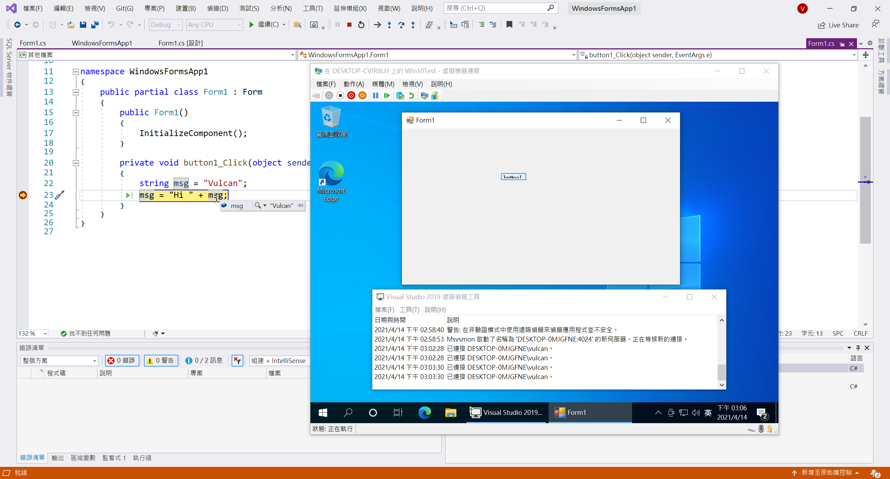

# 使用 Visual Studio 2019 進行遠端 Windows Forms 應用程式除錯

## 安裝 Visual Studio 2019 遠端工具

* 請在遠端電腦上，通常是沒有安裝 Visual Studio 2019 開發工具的電腦
* 打開網址 [https://visualstudio.microsoft.com/zh-hant/downloads/](https://visualstudio.microsoft.com/zh-hant/downloads/)
* 在下方找到 [Visual Studio 2019 的工具] > [Visual Studio 2019 遠端工具]

  > 您可利用 Visual Studio 2019 遠端工具，在未安裝 Visual Studio 的電腦上進行應用程式部署、遠端偵錯、遠端測試、效能分析以及單元測試。

  

* 下載並且安裝 Visual Studio 2019 遠端工具
* 當出現 [Visual Studio 2019 遠端工具安裝程式] 視窗
* 勾選 [我同意授權條款及條件]
* 點選 [安裝] 按鈕

  

  

* 一旦安裝完成後，點選 [關閉] 按鈕

  

## 設定遠端偵錯程式
* 在遠端電腦上，從 [開始] 找到 [Remote Debugger]
* 啟動執行這個城市
  
  

* 當 [遠端偵測組態] 是窗出現之後，確認相關設定無誤
* 點選 [設定遠端偵測] 按鈕
  
  

* 此時將會出現 [Visual Studio 2019 遠端偵測工具視窗]
  
  

## 建立 Windows Forms 專案，並且開始進行遠端偵錯

* 請在開發者電腦上開啟 Visual Studio 2019
* 建立一個 Windows Forms 專案
* 隨意加入一些程式碼，並且在任意程式碼上，加入中斷點

  

* 打開該 Windows Forms 的專案屬性視窗 (可以使用滑鼠雙擊 Properties 節點)
* 切換到 [偵錯] 標籤頁次
* 找到 [使用遠端電腦] 欄位，輸入剛剛那台遠端電腦的 IP
* 找到 [驗證模式] 欄位，選擇輸入 [Windows 驗證]

  

* 建置這個專案，確定沒有錯誤產生
* 在遠端電腦上建立資料夾，其路徑與 Visual Studio 電腦上的 Debug 資料夾相同，接著從 Visual Studio 電腦複製您剛才建置的可執行檔到遠端電腦上新建立的資料夾
* 現在可以開始進行該專案的除錯
* 此時會出現 [Windows 安全性] 視窗
* 請在這裡輸入遠端電腦的認證之帳密

  

* 現在可以在遠端電腦上看到這個 Windows Forms 程式跑起來了

  

* 點選遠端電腦上 [Form1] 視窗內的 [button1] 按鈕
* 若此時 Visual Studio 停在剛剛設定的中斷點上，那就表示這個遠端專案除錯正確無誤運作中

  

