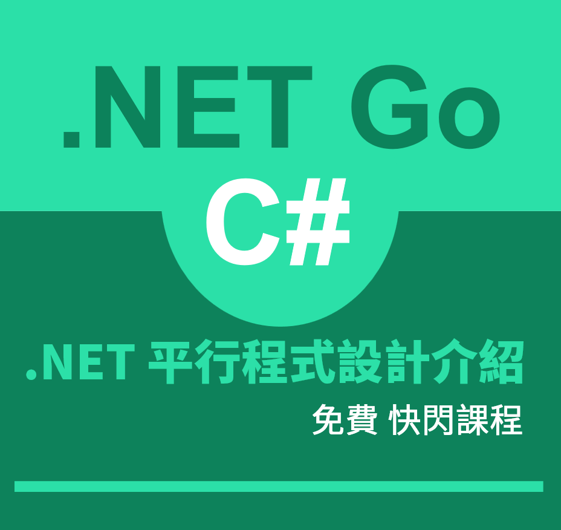

# 2021年04月 .NET 平行程式設計介紹 免費課程

## 課程名稱
.NET 平行程式設計介紹

## 課程介紹
平行程式設計是很早以前就存在的一個設計方式，隨著電腦處理器數量不斷的增加，更加凸顯這門技術的重要性，也是絕大部分程式設計師夢幻的開發技術，它可以提升整體應用程式的執行效能與改善流暢反應的使用者體驗；不過，平行程式設計也存在著以難以理解與複雜設計方法而著名，讓許多程式設計師無法輕鬆駕馭這個設計方法。

在這個技術分享課程中，首先會透過一個範例專案，讓大家體會到非同步/平行技術所帶來的好處與想要解決的問題，緊接著將會帶領大家一窺 .NET 開發環境中的各種非同步程式設計技術有哪些設計模式，並且了解 .NET 提供了可以用於平行計算的原理與相關 API；這些內容將會透過一個使用同步設計的專案來開始，逐步使用各種 .NET 提供的非同步/平行設計技術，明瞭到如何使用這些非同步/平行開發技術來完成同樣使用同步方式所設計的專案程式碼，並且知道整體上改善了多少執行效能。

透過本課程的介紹，可以程式開發人員具備了非同步/平行相關知識，與實際操作這些程式碼開如何設計出來，當然，也能夠發現到整體的應用程式執行效能與總處理量徹底的大幅提升與設計出具有流暢反應應用程式。

## 本課程將會涵蓋底下主題

同步 Synchronous  與非同步 Asynchronous 程式設計、平行 Parallelism 與並行 Concurrency 計算、執行緒 Thread、多執行緒、執行緒集區 ThreadPool、工作 Task 程式設計、用 APM、EAP、TAP 非同程式設計、用 async await 做出以同步方式來設計非同步應用需求、常見早期非同步程式設計 Timer BackgroundWorker、平行資料 Parallel.For Parallel.Foreach、平行查詢 PLINQ 處理程式設計

## 參加條件
* 具備 C# 程式語言開發經驗
* 了解泛型、委派、Lambda的使用方式
* 擁有基本電腦架構運作知識
* 對多執行緒開發有興趣
* 能夠熱情參與課程互動
* 具有 .NET Core 開發環境(VS4W / VS Code / VS4M 皆可)

## 報名方式

* 請先使用該 [表單](https://forms.office.com/Pages/ResponsePage.aspx?id=DQSIkWdsW0yxEjajBLZtrQAAAAAAAAAAAAEXiDYu_HJUMjcwUVYxMFNTOEZUWVdVQUJWNEFXRkNJOS4u) 填寫報名資訊與對課程期望
* 或者掃描底下 QRCode，填寫

* 由於座位有限，若成功報名且可以參加本免費課程者，將會透過 FB 私訊通知
* 也會於 FB [Xamarin Blazor 實驗室](https://www.facebook.com/vulcanlabtw) 公告相關訊息

## 開課時間
2021.04.24 (六) 下午 13:00 ~ 16:00

## 上課地點
高雄市鼓山區大順一路439號6樓之3 [地圖](https://www.google.com.tw/maps/place/804%E9%AB%98%E9%9B%84%E5%B8%82%E9%BC%93%E5%B1%B1%E5%8C%BA%E5%A4%A7%E9%A0%86%E4%B8%80%E8%B7%AF439%E8%99%9F9%E8%99%9F%E6%A8%93%E4%B9%8B3/@22.6557144,120.3004975,17z/data=!3m1!4b1!4m5!3m4!1s0x346e04fe86e55555:0x4191a31bd8c1f2c!8m2!3d22.6557144!4d120.3026915)

(凹子底捷運站1號出口，在大順路與博愛路的彰化銀行樓上)

## 課程費用
免費

## 其他說明
* 本課程使用的程式語言為 .NET / C#
* 預計時間約為3小時
* 若報名無故沒來參加，將會禁止日後參加本單位舉辦的相關課程
* 請自行攜帶可以開發與執行 .NET Core 或者 .NET Framework 筆電，進行現場實作練習
* 該課程以互動提問、討論方式設計，若無法適應此教學方式，請勿報名參加
* 若有上網需求，請自備可以透過電腦聯網的行動裝置
* 本課程不提供上課簡報檔案
