# Xamarin.Forms 之 Visual Studio 2019 安裝說明

在這篇文章中，將會說明對於要參加 .NET Go 教育訓練課程，且要學習 Xamarin.Forms 工具使用的課程，你的 Visual Studio 2019 這個軟體與電腦的需要按照底下安裝步驟與說明內容進行設定

## 啟動 Hyper-V

* 接著，你需要重新開機

  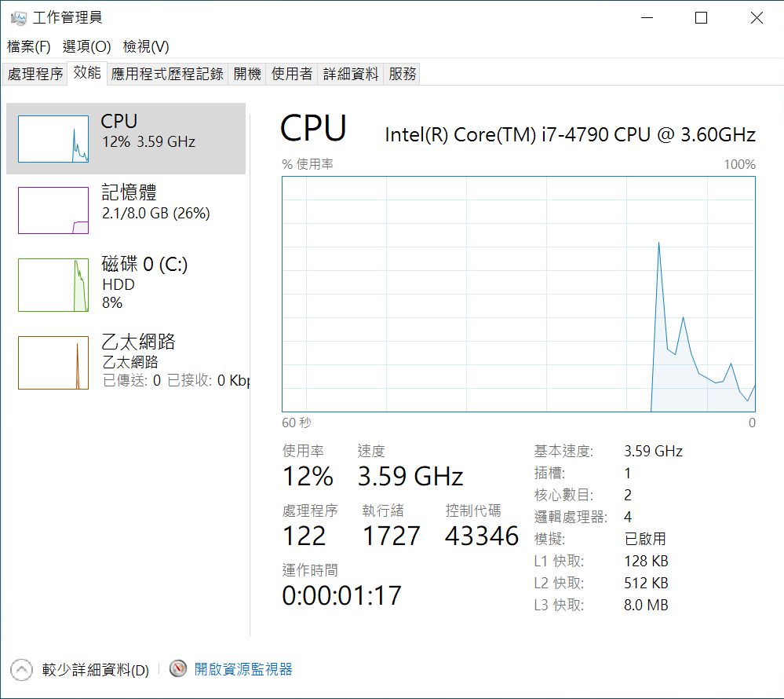

* 請先點選左下方的 [視窗] 圖示，接著點選 [齒輪] 圖示的設定選項，便會看到下圖畫面

  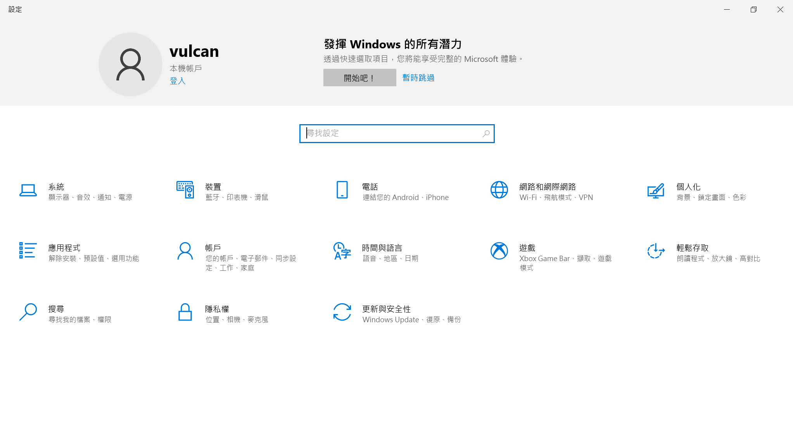

* 點選 [應用程式] 的圖示，緊接著會看到底下的 [應用程式與功能] 這個視窗

* 請點選這個 [應用程式與功能] 內的 [程式和功能] 選項

  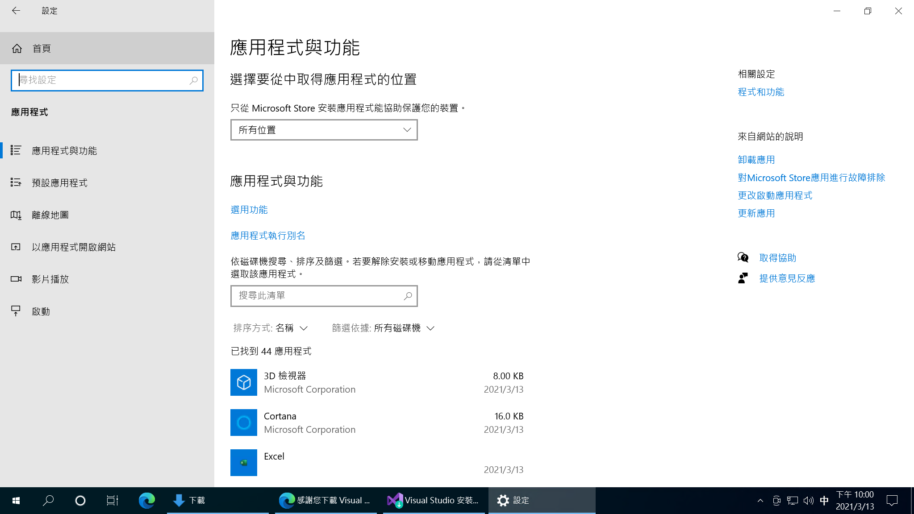

* 當 [程式和功能] 視窗出現之後，點選左邊的 [開啟或關閉 Windows 功能] 選項

  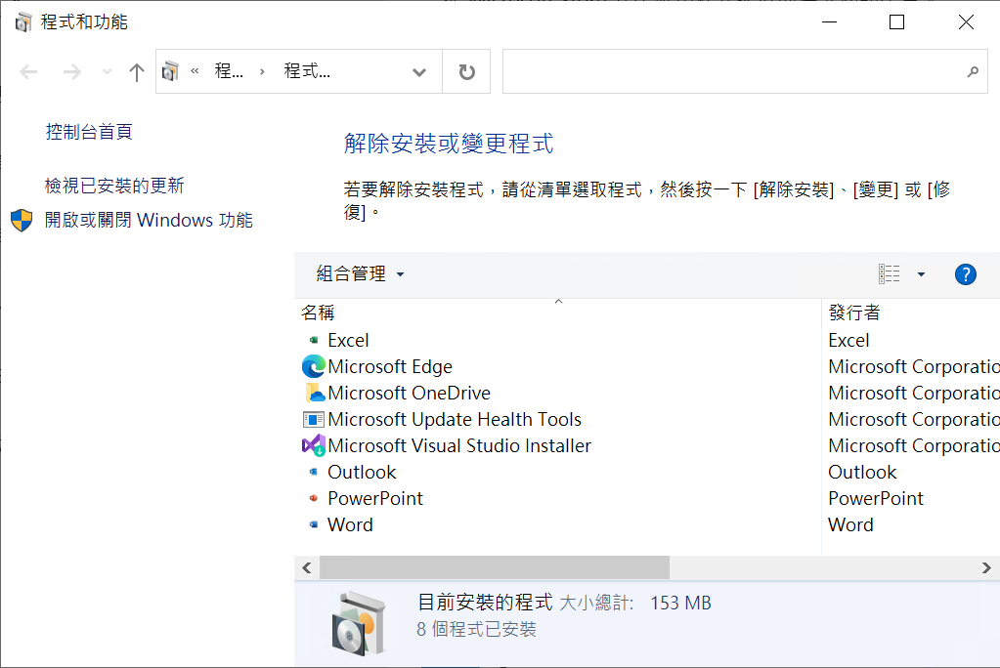

* 在 [Windows 功能] 視窗出現之後，勾選 [Hyper-V] 這個選項

  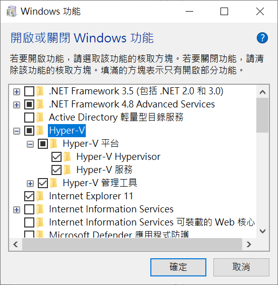

* 接著 勾選 [Windows Hypervisor 平台] 這個選項

  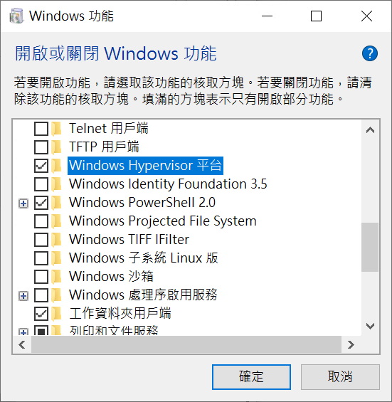

* 最後點選右下方的 [確定] 按鈕

* 接著，你需要重新開機

  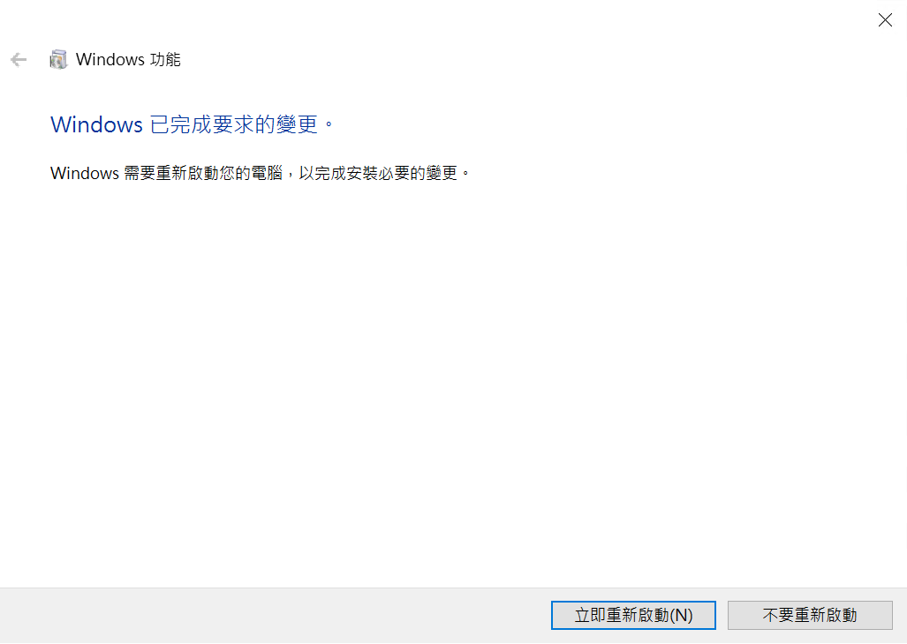

## 安裝 Visual Studio 2019

* 打開 [Visual Studio 2019 下載](https://visualstudio.microsoft.com/zh-hant/downloads/) 網頁

  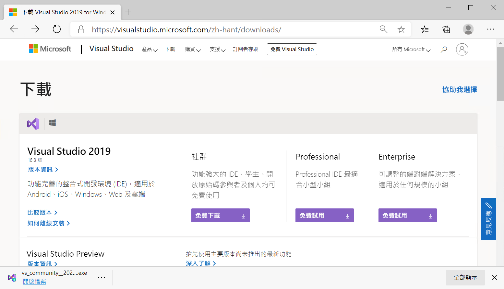

* 原則上，可以下載 [社群] 這個免費的版本，若你本身擁有 Visual Studio 其他付費版本的使用授權，可以依照你購買的使用者授權，下載 [Professional] 或者 [Enterprise] 版本

* 點選你選擇的 Visual Studio 2019 版本的 [免費下載] 或者 [免費試用] 按鈕
* 當安裝檔案下載完成之後，開啟下載的安裝檔案

  

* 當 Visual Studio Installer 視窗出現之後，點選該視窗右下方的 [繼續] 按鈕

  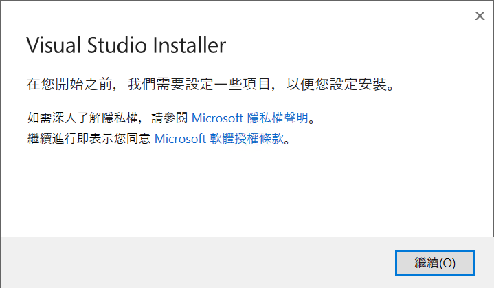

* 現在將會看到 Visual Studio 2019 安裝程式的工作負載頁次畫面

  

* 請勾選 [使用 .NET 進行行動開發] 之 工作負載 選項

  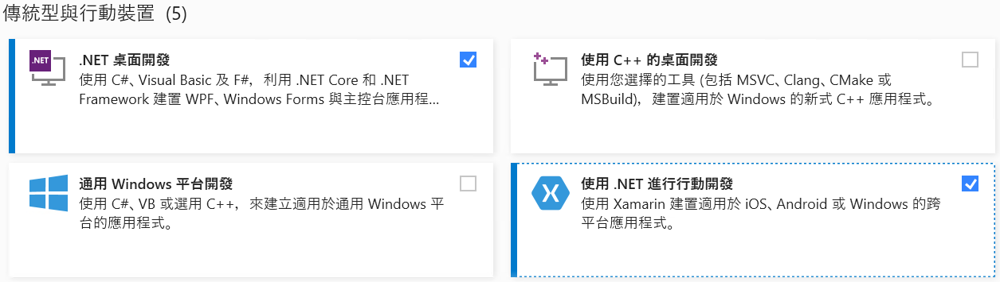
 
* 請勾選 [.NET Core 跨平台開發] 之 工作負載 選項

  
   
* 在 Visual Studio 2019 安裝程式畫面右下方，點選 [安裝] 按鈕
   
* Visual Studio 安裝程式對話窗將會顯示正在進行安裝軟體的進度

  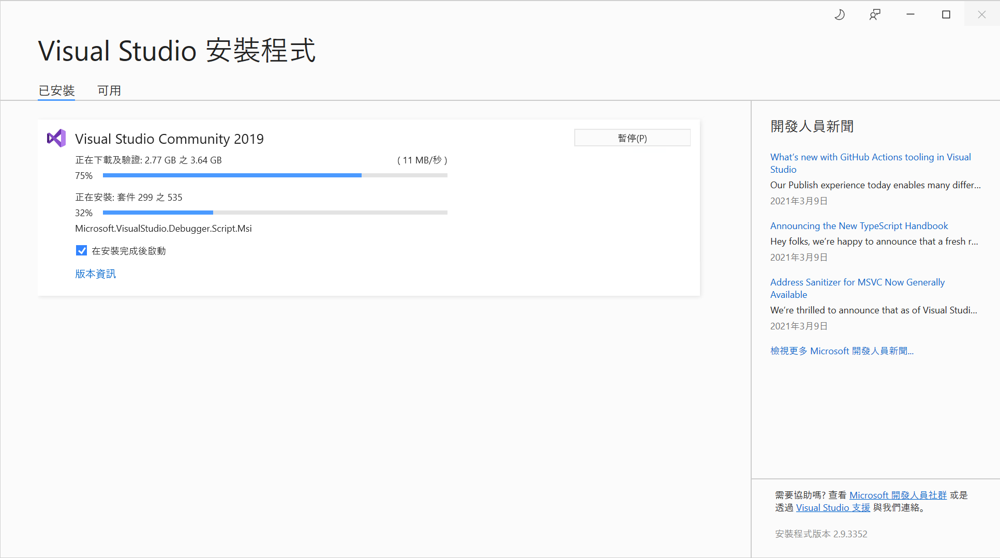
   
* Visual Studio 安裝完成後，會顯示下圖，若此時你不想登入，可以點選 [不是現在，以後再說]，若想要登入，你需要擁有 Micosoft 帳號 (例如 @Hotmail.com 或者  @outlook.com 帳號)

  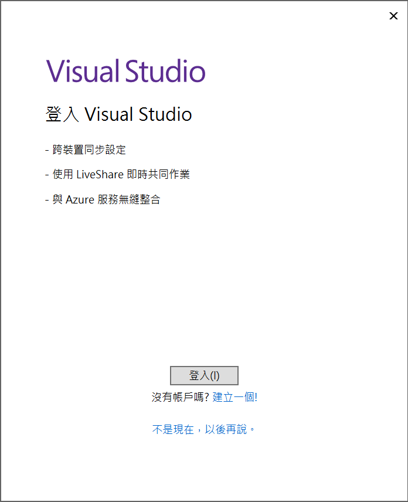
   
* 接下來需要設定你喜歡的色彩佈景主題，在這裡，可以選擇預設值，接著按下 [啟動 Visual Studio] 按鈕

  
   
* 現在若看到下面的畫面，則表示你的 Visual Studio 安裝完成了

  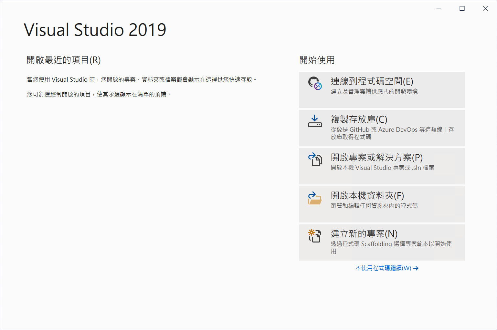

* 

