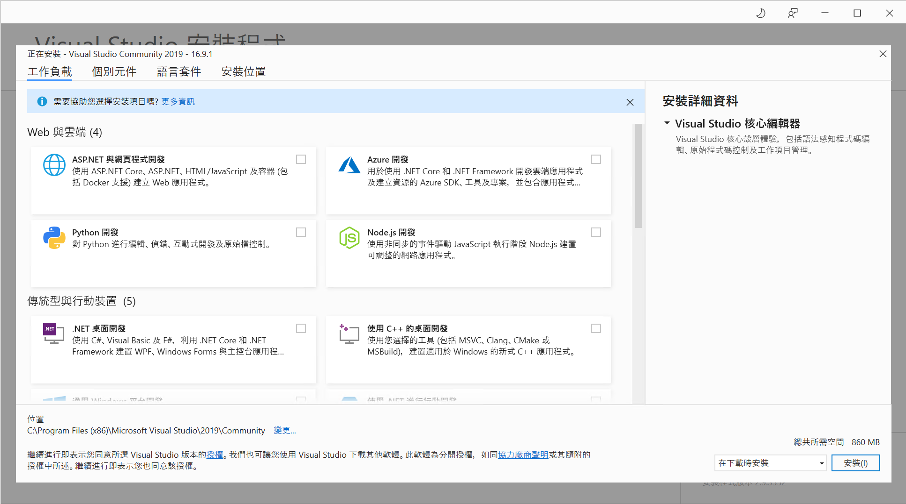
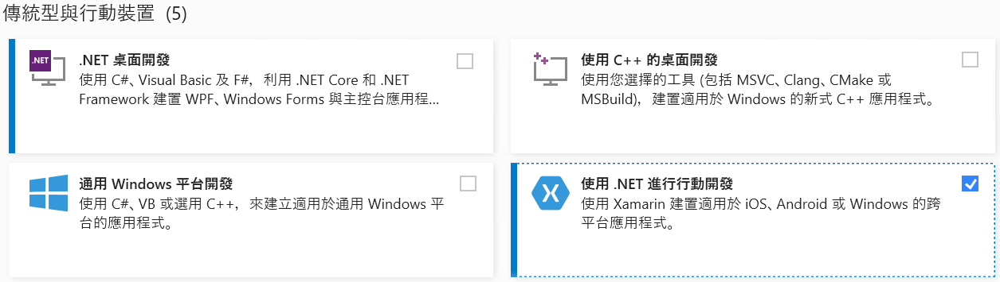
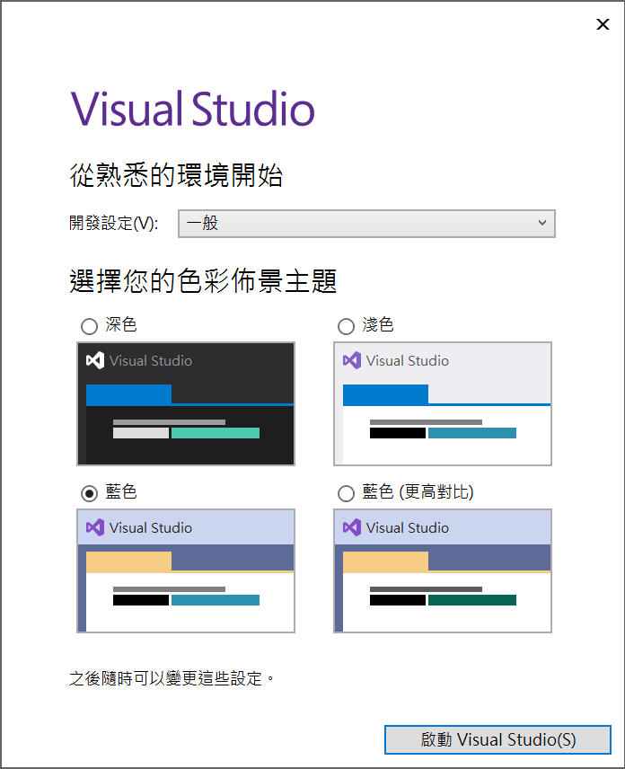
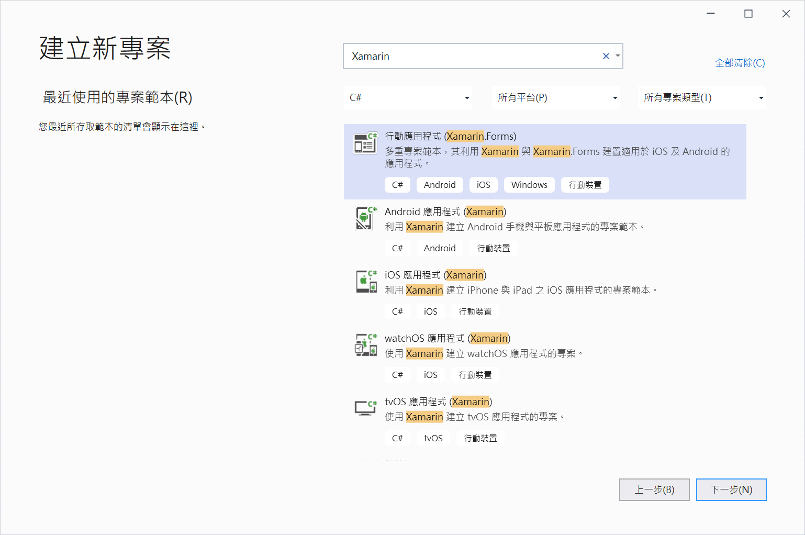
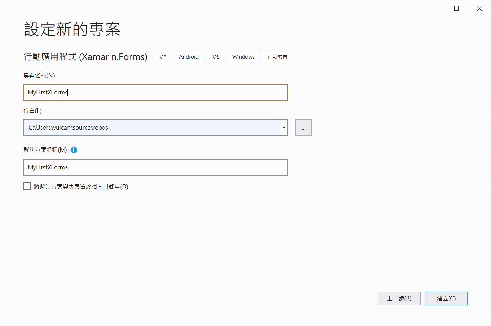

# Xamarin.Forms 之 Visual Studio 2019 完整安裝攻略說明

在這篇文章中，將會說明對於要參加 .NET Go 教育訓練課程，且要學習 Xamarin.Forms 工具使用的課程，你的 Visual Studio 2019 這個軟體與電腦的需要按照底下安裝步驟與說明內容進行設定

## 確認與啟用虛擬化技術

* 首先，若你的電腦安裝的不是 Windows 10 Professional 以上的版本，請重新安裝一台至少為 Windows 10 Profession 版本的作業系統

  > 若你的電腦為 家用版 Home Edition，請不要嘗試去做升級為 Professional 版本的工作，你需要重新安裝一台至少為 Windows 10 Profession 版本的作業系統，否則，**請不要繼續底下的相關安裝設定工作**
* 請確認你的電腦 BIOS 或者 UEFI 有啟用虛擬化技術，這部分可以參考 [Step-By-Step: Enabling Hyper-V for use on Windows 10](https://techcommunity.microsoft.com/t5/itops-talk-blog/step-by-step-enabling-hyper-v-for-use-on-windows-10/ba-p/267945) 文章

  

* 現在，可以繼續來進行底下的其他安裝與設定工作

## 啟動 Hyper-V

* 一旦完成上面提到 [確認與啟用虛擬化技術] 檢查與設定工作，請進行開機
* 作業系統開機完成後，打開 [工作管理員] > [效能] 標籤頁次
* 從右下方將會看到 [模擬] 欄位將會顯示 [已啟用]，表示這台電腦具備可以使用虛擬化的技術

  

* 請先點選左下方的 [視窗] 圖示，接著點選 [齒輪] 圖示的設定選項，便會看到下圖畫面

  

* 點選 [應用程式] 的圖示，緊接著會看到底下的 [應用程式與功能] 這個視窗

* 請點選這個 [應用程式與功能] 內的 [程式和功能] 選項

  

* 當 [程式和功能] 視窗出現之後，點選左邊的 [開啟或關閉 Windows 功能] 選項

  

* 在 [Windows 功能] 視窗出現之後，勾選 [Hyper-V] 這個選項

  

* 接著 勾選 [Windows Hypervisor 平台] 這個選項

  

* 最後點選右下方的 [確定] 按鈕

* 接著，你需要重新開機

  

## 安裝 Visual Studio 2019

* 打開 [Visual Studio 2019 下載](https://visualstudio.microsoft.com/zh-hant/downloads/) 網頁

  

* 原則上，可以下載 [社群] 這個免費的版本，若你本身擁有 Visual Studio 其他付費版本的使用授權，可以依照你購買的使用者授權，下載 [Professional] 或者 [Enterprise] 版本

* 點選你選擇的 Visual Studio 2019 版本的 [免費下載] 或者 [免費試用] 按鈕
* 當安裝檔案下載完成之後，開啟下載的安裝檔案

  

* 當 Visual Studio Installer 視窗出現之後，點選該視窗右下方的 [繼續] 按鈕

  

* 現在將會看到 Visual Studio 2019 安裝程式的工作負載頁次畫面

  

* 請勾選 [使用 .NET 進行行動開發] 之 工作負載 選項

  
 
* 請勾選 [.NET Core 跨平台開發] 之 工作負載 選項

  

  > 選擇這個是某些課程將會帶領大家進行透過 Xamarin.Forms 應用程式，可以存取後端 Web API 教學與練習
   
* 在 Visual Studio 2019 安裝程式畫面右下方，點選 [安裝] 按鈕
   
* Visual Studio 安裝程式對話窗將會顯示正在進行安裝軟體的進度

  
   
* Visual Studio 安裝完成後，會顯示下圖，若此時你不想登入，可以點選 [不是現在，以後再說]，若想要登入，你需要擁有 Micosoft 帳號 (例如 @Hotmail.com 或者  @outlook.com 帳號)

  
   
* 接下來需要設定你喜歡的色彩佈景主題，在這裡，可以選擇預設值，接著按下 [啟動 Visual Studio] 按鈕

  
   
* 現在若看到下面的畫面，則表示你的 Visual Studio 安裝完成了

  

## 進行 Android 開發環境的設定

* 在 Visual Studio 2019 對話窗的右下方，點選 [建立新的專案] 按鈕
* 現在會看到 [建立新專案] 對話窗
* 在上方文字搜尋盒內輸入 `Xamarin` 文字，將會看到所有與 Xamarin 有關的專案範本都會顯示出來
* 請選擇 [行動應用程式 (Xamarin.Forms)] 選項
* 點選 [下一步] 按鈕

  

* 在 [設定新的專案] 對話窗內
  * 於 [專案名稱] 欄位內，輸入要建立的專案名稱
  * 這裡輸入 `MyFirstForms` (當然，你可以輸入任何的專案名稱)

  > 請注意，檔案名稱、路徑位置名稱，不要有中文字或者特殊符號文字
  >
  > 路徑位置請不要設定到你的桌面上
  >
  > 建議在你電腦的根目錄下，建立一個練習用的目錄，將這裡的路徑位置指向剛剛建立的目錄

  

* 若有看到 [Windows 安全性警訊] 視窗出現，請點選 [允許存取] 按鈕

  

* 此時將會看到 [新增行動應用程式] 對話窗出現
* 請選擇 [空白] 這個選項
* 點選右下方的 [建立] 按鈕

  

* 稍待一段時間，這個 Xamarin.Forms 專案將會建立完成

  

* 原則上，對於第一次安裝好且第一次建立完成 Xamarin.Forms 的專案，應該會看到底下的 [Android SDK - 接受授權] 這個對話窗
* 請點選右下方的 [接受] 按鈕

  

  

* 若沒有看到上面的視窗，但是卻在 [錯誤清單] 視窗內看到底下的錯誤訊息，請使用滑鼠雙擊這個訊息，就會看到上述的視窗。

  

* 若沒有看到上面的視窗，但是卻在 [錯誤清單] 視窗內看到底下的錯誤訊息，請使用滑鼠雙擊這個訊息，就會看到上述的視窗。

  

