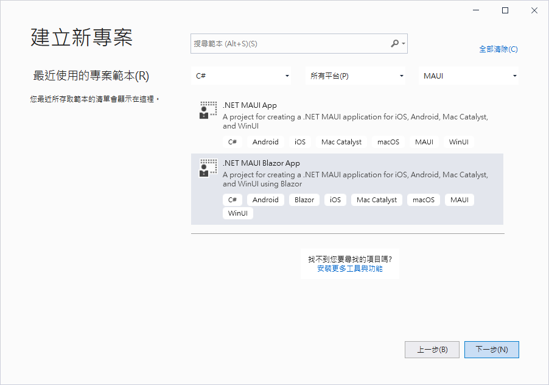
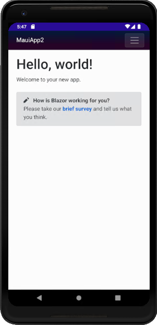
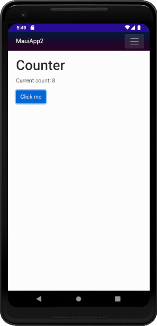
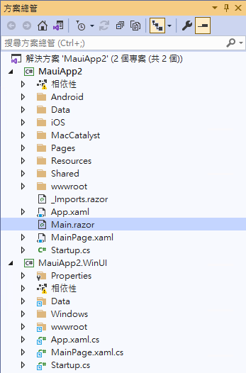
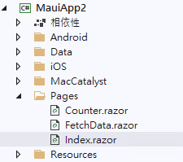

# .NET 6 Preview 5 MAUI Blazor App 體驗使用經驗 2


在上一篇文章中，[.NET 6 Preview 5 MAUI App 體驗使用經驗 1](https://csharpkh.blogspot.com/2021/06/NET-Preview6-MAUI.html)，實際體驗建立一個 Maui App 的專案，也看到了執行結果；在這篇文章中，將會來體驗看看建立一個 [Maui Blazor App] 專案，這個專案顧名思義就是採用 Blazor 的開發方式來建立跨平台的應用程式。

作者本身對於這樣的技術感到相當的興奮，因為一旦這個功能趨近於成熟並且正式推出之後，對於一個身為 Blazor WASM 或者 Blazor Server 的開發者而言，可以很容易的自動切換本身成為一個跨平台的專案開發人員。

* 首先，先要建立一個 [.NET MAUI Blazor App] 專案

  

* 現在來在 Android 平台下來執行這個 [.NET MAUI Blazor App] 專案
* 底下將會是啟動後的首頁畫面

  

* 點選右上方的漢堡按鈕，從彈出清單內可以切換到 [Counter] 這個頁面

  

* 當專案建立完成後， [方案總管] 的結構如下

  

* 其中在 MauiApp2 的專案內，將會看到 [MainPage.xaml] 這個檔案
* 先來查看 [MainPage.xaml] 這個檔案
* 在這個主要頁面內，只有使用了一個 BlazorWebView 控制項，並沒有其他的 XAML 項目在使用，在這裡將會使用這個 Web View 元件來顯示 Blazor 元件

```
<ContentPage xmlns="http://schemas.microsoft.com/dotnet/2021/maui"
			 xmlns:x="http://schemas.microsoft.com/winfx/2009/xaml"
			 xmlns:b="clr-namespace:Microsoft.AspNetCore.Components.WebView.Maui;assembly=Microsoft.AspNetCore.Components.WebView.Maui"
			 xmlns:local="clr-namespace:MauiApp2"
			 x:Class="MauiApp2.MainPage"
			 BackgroundColor="{DynamicResource PageBackgroundColor}">

	<b:BlazorWebView HostPage="wwwroot/index.html">
		<b:BlazorWebView.RootComponents>
			<b:RootComponent Selector="app" ComponentType="{x:Type local:Main}" />
		</b:BlazorWebView.RootComponents>
	</b:BlazorWebView>
</ContentPage>
```

* 打開 [Main.razor] 檔案，將會看到底下程式碼

```html
<Router AppAssembly="@GetType().Assembly">
	<Found Context="routeData">
		<RouteView RouteData="@routeData" DefaultLayout="@typeof(MainLayout)" />
	</Found>
	<NotFound>
		<LayoutView Layout="@typeof(MainLayout)">
			<p>Sorry, there's nothing at this address.</p>
		</LayoutView>
	</NotFound>
</Router>
```

* 對於有在使用 Blazor 來開發專案的開發者而言將並不陌生，這裡是 Blazor 專案內的起始進入點
* 由這裡可以看出，對於 [MAUI Blazor App] 專案將會採用 Razor 元件來進行設計的
* 接著展開 [Pages] 資料夾

  

* 在這個資料夾內，將會看到有三個 Razor 元件頁面，如同採用 Web 方式開發的專案一樣的內容
* 打開 [Pages] > [Counter.razor] ，其程式碼應該不會太意外，如同底下

```html
@page "/counter"

<h1>Counter</h1>

<p>Current count: @currentCount</p>

<button class="btn btn-primary" @onclick="IncrementCount">Click me</button>

@code {
	private int currentCount = 0;

	private void IncrementCount()
	{
		currentCount++;
	}
}
```

