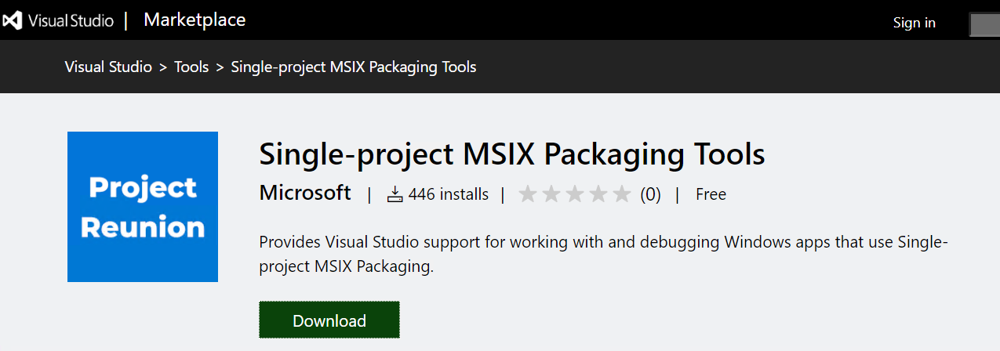
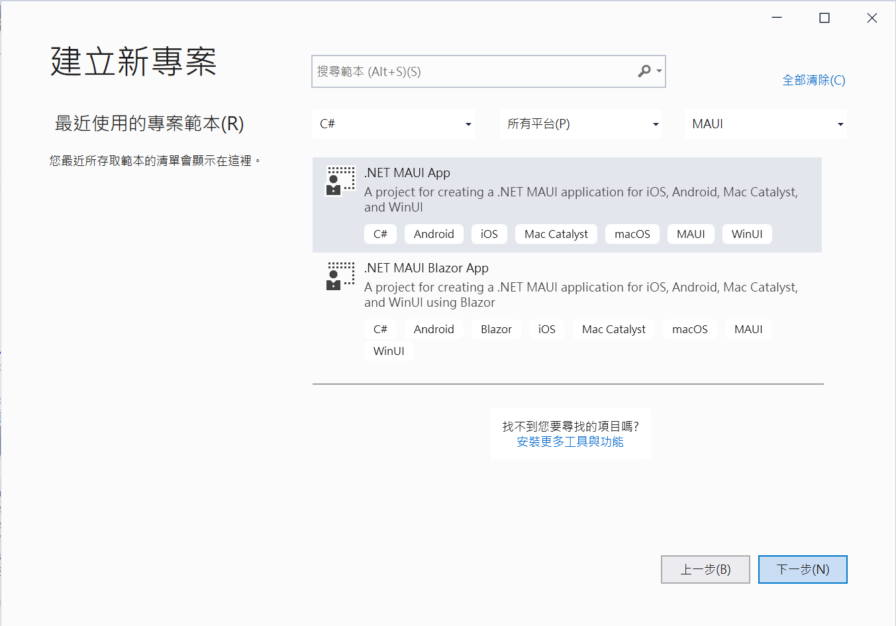
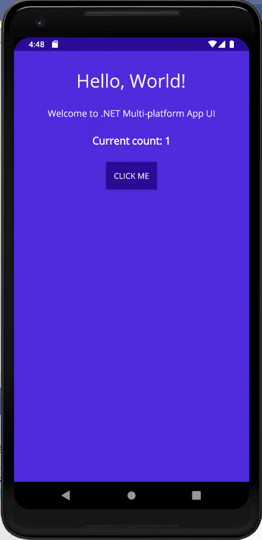

# .NET 6 Preview 5 MAUI App 體驗使用經驗 1


2021 年 6 月 17 日，微軟發表的 .NET 6 Preview 5 ， [Announcing .NET 6 Preview 5](https://devblogs.microsoft.com/dotnet/announcing-net-6-preview-5/) ，所以，這篇文章將會來驗看看有那些新功能與不錯的特色推出。

為了要能夠輕鬆的進行使用 .NET 6 Preview 5 這個系統，特別重新安裝作業系統到最新的 Windows Updates，接著安裝 [Visual Studio 2019 Preview](https://visualstudio.microsoft.com/zh-hant/vs/preview/) 工具，並使用 [Download .NET 6.0](https://dotnet.microsoft.com/download/dotnet/6.0) 文章來進行安裝最新的 .NET 6.0 Preview 5 相關軟體。


為了要能夠順利建立專案等環境，這裡還需要安裝兩個 Visual Studio 擴充功能 [Project Reunion (Preview)](https://marketplace.visualstudio.com/items?itemName=ProjectReunion.MicrosoftProjectReunionPreview) 與 [Single-project MSIX Packaging Tools](https://marketplace.visualstudio.com/items?itemName=ProjectReunion.MicrosoftSingleProjectMSIXPackagingTools) ，這裡將會安裝 Windows UI Library (WinUI) 開發環境到 Visual Studio 內。




以上的準備工作若都完成後，將會根據 [Announcing .NET MAUI Preview 5](https://devblogs.microsoft.com/dotnet/announcing-net-maui-preview-5/) 與 [.NET Multi-platform App UI documentation](https://docs.microsoft.com/zh-tw/dotnet/maui/) 文章來進行 Maui 的安裝與設定

## 安裝與檢查 Maui 是否完整

為了要驗證 Maui 開發環境是否完整，可以透過底下的程序來進行檢查是否欠缺甚麼元件尚未安裝，或者需要進行升級。

首先安裝 maui-check 這個工具，這裡可以透過底下的指令來完成，請在命令提示字元視窗內執行這個指令

`dotnet tool install -g redth.net.maui.check`

一旦安裝完成之後，就可以執行 [maui-check] 指令，請在命令提示字元視窗內執行這個指令

`maui-check`


在作者本身的環境為全新安裝的 Windows 10 作業系統，並且升級到最新 Windows Update，接著安裝 Visual Studio 2019 Preview 版本，並選取了需要用到的 [工作負載]；而當執行了 maui-check 指令之後，會出現文章最後面所列出的相關內容，不過，在這裡檢查出底下的問題，這些問題應該是安裝好工具之後，尚未做相關的初始化設定所導致的，不過，因為 maui-check 的幫忙，可以順利修正這些問題

* ? Recommendation: Install OpenJDK11

  在這裡將會發現預設 Android SDK 安裝好之後，沒有使用 [Microsoft OpenJDK]，因此，將會詢問是否要更換使用 [OpenJDK] 呢？在這裡將會回答 Yes，使用 [OpenJDK] 來替換

```
! Attempt to fix? [y/n] (y): y
? Attempting to fix: OpenJDK 11.0
  Installing Download and Install Microsoft OpenJDK 11...
  Installed Download and Install Microsoft OpenJDK 11.
```

* ? Recommendation: Install or Update Android SDK packages

  接下來則是發現到 Android SDK 預設安裝後，並不是最新的版本，因此將會建議來更新到最新版本，或者安裝尚未發現到的 SDK 軟體，在這裡回答 Yes

```
Your Android SDK has missing or outdated packages.
You can use the Android SDK Manager to install / update them.
For more information see: https://aka.ms/dotnet-androidsdk-help

! Attempt to fix? [y/n] (y): y
```

* ? Recommendation: Install Missing SDK Workloads

  在預設安裝 Visual Studio 的環境內發現到欠缺一些 SDK 工作負載，因此，回答 Yes 來進行安裝

```
! Attempt to fix? [y/n] (y): y
```

* ? Recommendation: Install Missing SDK Packs

  最後發現到有些 SDK Pack 沒有安裝，因此，回答 Yes 來進行安裝

```
! Attempt to fix? [y/n] (y): y
```

這裡將會是已經更新到最新狀態的結果

```
      _   _   _____   _____     __  __      _      _   _   ___
     | \ | | | ____| |_   _|   |  \/  |    / \    | | | | |_ _|
     |  \| | |  _|     | |     | |\/| |   / _ \   | | | |  | |
  _  | |\  | | |___    | |     | |  | |  / ___ \  | |_| |  | |
 (_) |_| \_| |_____|   |_|     |_|  |_| /_/   \_\  \___/  |___|

? .NET MAUI Check v0.5.6.0 ?
────────────────────────────────────────────────────────────────────────────────────────────────────────────────────────
This tool will attempt to evaluate your .NET MAUI development environment.
If problems are detected, this tool may offer the option to try and fix them for you, or suggest a way to fix them
yourself.

Thanks for choosing .NET MAUI!
────────────────────────────────────────────────────────────────────────────────────────────────────────────────────────
? Synchronizing configuration... ok
? Scheduling appointments... ok

? OpenJDK 11.0 Checkup...
  – 11.0.10 (C:\Program Files\Microsoft\jdk-11.0.10.9-hotspot\bin\..)
  – 1.8.0-25 (C:\Program Files\Android\Jdk\microsoft_dist_openjdk_1.8.0.25)

? Visual Studio 16.10.0 Checkup...
  – 16.11.0-pre.2.0 - C:\Program Files (x86)\Microsoft Visual Studio\2019\Preview

? Android SDK Checkup...
  – emulator (30.6.5)
  – build-tools;30.0.2 (30.0.2)
  – platforms;android-30 (3)
  – system-images;android-30;google_apis;x86 (9)
  – platform-tools (30.0.4)

? Android Emulator Checkup...
  ! Unable to find any Android Emulators.  You can use Visual Studio to create one if necessary:
https://docs.microsoft.com/xamarin/android/get-started/installation/android-emulator/device-manager

? .NET SDK Checkup...
  – 5.0.400-preview.21277.10 - C:\Program Files\dotnet\sdk\5.0.400-preview.21277.10
  – 6.0.100-preview.5.21302.13 - C:\Program Files\dotnet\sdk\6.0.100-preview.5.21302.13

? .NET SDK - Workload Deduplication Checkup...

? .NET SDK - EnableWorkloadResolver.sentinel Checkup...
  – C:\Program Files (x86)\Microsoft Visual
Studio\2019\Preview\MSBuild\Current\Bin\SdkResolvers\Microsoft.DotNet.MSBuildSdkResolver\EnableWorkloadResolver.sentinel
exists.

? .NET SDK - Workloads (6.0.100-preview.5.21302.13) Checkup...
  – microsoft-android-sdk-full (Microsoft.NET.Sdk.Android.Manifest-6.0.100 : 30.0.100-preview.5.28) installed.
  – microsoft-ios-sdk-full (Microsoft.NET.Sdk.iOS.Manifest-6.0.100 : 14.5.100-preview.5.894) installed.
  – microsoft-maccatalyst-sdk-full (Microsoft.NET.Sdk.MacCatalyst.Manifest-6.0.100 : 14.5.100-preview.5.894) installed.
  – microsoft-tvos-sdk-full (Microsoft.NET.Sdk.tvOS.Manifest-6.0.100 : 14.5.100-preview.5.894) installed.
  – microsoft-macos-sdk-full (Microsoft.NET.Sdk.macOS.Manifest-6.0.100 : 11.3.100-preview.5.894) installed.

? .NET SDK - Packs (6.0.100-preview.5.21302.13) Checkup...
  – Microsoft.Maui.Templates (6.0.100-preview.5.794) installed.
  – Microsoft.Android.Sdk (30.0.100-preview.5.28) installed.
  – Microsoft.Android.Sdk.BundleTool (30.0.100-preview.5.28) installed.
  – Microsoft.Android.Ref (30.0.100-preview.5.28) installed.
  – Microsoft.Android.Templates (30.0.100-preview.5.28) installed.
  – Microsoft.iOS.Sdk (14.5.100-preview.5.894) installed.
  – Microsoft.iOS.Windows.Sdk (14.5.100-preview.5.894) installed.
  – Microsoft.iOS.Ref (14.5.100-preview.5.894) installed.
  – Microsoft.iOS.Templates (14.5.100-preview.5.894) installed.
  – Microsoft.MacCatalyst.Sdk (14.5.100-preview.5.894) installed.
  – Microsoft.MacCatalyst.Ref (14.5.100-preview.5.894) installed.
  – Microsoft.MacCatalyst.Templates (14.5.100-preview.5.894) installed.
  – Microsoft.tvOS.Sdk (14.5.100-preview.5.894) installed.
  – Microsoft.tvOS.Ref (14.5.100-preview.5.894) installed.
  – Microsoft.tvOS.Templates (14.5.100-preview.5.894) installed.
  – Microsoft.macOS.Sdk (11.3.100-preview.5.894) installed.
  – Microsoft.macOS.Ref (11.3.100-preview.5.894) installed.
  – Microsoft.macOS.Templates (11.3.100-preview.5.894) installed.
────────────────────────────────────────────────────────────────────────────────────────────────────────────────────────


! Things look almost great, except some pesky warning(s) which may or may not be a problem, but at least if they are,
you'll know where to start searching!

Press enter to exit...
```

## 建立 Maui 的專案

* 現在可以開啟 Visual Studio
* 建立一個新的專案
* 在 [建立新專案] 對話窗內切換選擇 [所有專案類型] 下拉選單控制項內的清單項目為 [MAUI]


* 在中間的清單內點選 [.NET MAUI App] 項目
* 點選 [下一步] 按鈕

  

* 在 [設定新的專案] 對話窗內，點選 [建立] 按鈕
* 稍微等候將會建立這個 [.NET MAUI App] 專案
* 一旦專案建立之後，依據底下截圖，切換使用 [Android] 平台來執行這個專案

  

* 底下截圖將會執行後的結果

  

* 現在來查看 [方案總管] 視窗，為 [Maui] 專案的結構

  

* 其中，將會看到 [MainPage.xaml] 檔案，將會是這個頁面的設計內容

```xml
<ContentPage xmlns="http://schemas.microsoft.com/dotnet/2021/maui"
             xmlns:x="http://schemas.microsoft.com/winfx/2009/xaml"
             x:Class="MauiApp1.MainPage"
             BackgroundColor="{DynamicResource PageBackgroundColor}">

    <ScrollView Padding="{OnPlatform iOS='30,60,30,30', Default='30'}">
        <StackLayout>
            <Grid RowSpacing="25" RowDefinitions="Auto,Auto,Auto,Auto,*">
            
                <Label Text="Hello, World!"
                    Grid.Row="0"
                    SemanticProperties.HeadingLevel="Level1"
                    FontSize="32"
                    HorizontalOptions="CenterAndExpand" />

                <Label Text="Welcome to .NET Multi-platform App UI"
                    Grid.Row="1"
                    SemanticProperties.Hint="Counts the number of times you click" 
                    FontSize="16"
                    HorizontalOptions="CenterAndExpand" />

                <Label Text="Current count: 0"
                    Grid.Row="2"
                    SemanticProperties.Hint="Counts the number of times you click"
                    FontSize="18"
                    FontAttributes="Bold"
                    x:Name="CounterLabel"
                    HorizontalOptions="Center" />

                <Button Text="Click me"
                    Grid.Row="3"
                    SemanticProperties.Hint="Counts the number of times you click"
                    Clicked="OnCounterClicked"
                    HorizontalOptions="Center" />

                <Image Grid.Row="4"
                    Source="dotnet_bot.png"
                    SemanticProperties.Description="Cute dotnet bot waving hi to you!"
                    WidthRequest="300"
                    HorizontalOptions="Center" />

            </Grid>
        </StackLayout>
    </ScrollView>
</ContentPage>
```

## 使用 WinUI 的方式來執行

* 切換到 MauiApp1.WinUI 專案為預設起始專案
* 執行這個 WinUI 專案，將會看到底下的執行結果

  

## 執行 maui-check 的執行結果

```
      _   _   _____   _____     __  __      _      _   _   ___
     | \ | | | ____| |_   _|   |  \/  |    / \    | | | | |_ _|
     |  \| | |  _|     | |     | |\/| |   / _ \   | | | |  | |
  _  | |\  | | |___    | |     | |  | |  / ___ \  | |_| |  | |
 (_) |_| \_| |_____|   |_|     |_|  |_| /_/   \_\  \___/  |___|

? .NET MAUI Check v0.5.6.0 ?
────────────────────────────────────────────────────────────────────────────────────────────────────────────────────────
This tool will attempt to evaluate your .NET MAUI development environment.
If problems are detected, this tool may offer the option to try and fix them for you, or suggest a way to fix them
yourself.

Thanks for choosing .NET MAUI!
────────────────────────────────────────────────────────────────────────────────────────────────────────────────────────
? Synchronizing configuration... ok
? Scheduling appointments... ok

? OpenJDK 11.0 Checkup...
  – 1.8.0-25 (C:\Program Files\Android\Jdk\microsoft_dist_openjdk_1.8.0.25)

────────────────────────────────────────────────────────────────────────────────────────────────────────────────────────
? Recommendation: Install OpenJDK11
────────────────────────────────────────────────────────────────────────────────────────────────────────────────────────

! Attempt to fix? [y/n] (y): y
? Attempting to fix: OpenJDK 11.0
  Installing Download and Install Microsoft OpenJDK 11...
  Installed Download and Install Microsoft OpenJDK 11.
Fix applied.  Checking again...

? OpenJDK 11.0 Checkup...
  – 11.0.10 (C:\Program Files\Microsoft\jdk-11.0.10.9-hotspot\bin\..)
  – Set Environemnt Variable: JAVA_HOME=C:\Program Files\Microsoft\jdk-11.0.10.9-hotspot
  – 1.8.0-25 (C:\Program Files\Android\Jdk\microsoft_dist_openjdk_1.8.0.25)

? Visual Studio 16.10.0 Checkup...
  – 16.11.0-pre.2.0 - C:\Program Files (x86)\Microsoft Visual Studio\2019\Preview

? Android SDK Checkup...
  × emulator (30.4.5) missing.
  – build-tools;30.0.2 (30.0.2)
  – platforms;android-30 (3)
  × system-images;android-30;google_apis;x86 (9) missing.
  – platform-tools (30.0.4)

────────────────────────────────────────────────────────────────────────────────────────────────────────────────────────
? Recommendation: Install or Update Android SDK packages
Your Android SDK has missing or outdated packages.
You can use the Android SDK Manager to install / update them.
For more information see: https://aka.ms/dotnet-androidsdk-help
────────────────────────────────────────────────────────────────────────────────────────────────────────────────────────

! Attempt to fix? [y/n] (y): y
? Attempting to fix: Android SDK
  – Downloading https://dl.google.com/android/repository/sys-img/google_apis/x86-30_r09.zip ...
  – Downloading https://dl.google.com/android/repository/3534162-studio.sdk-patcher.zip ...
  – Downloading https://dl.google.com/android/repository/emulator-windows_x64-7324830.zip ...
  – Downloaded 10% of 3534162-studio.sdk-patcher.zip ...
  – Downloaded 20% of 3534162-studio.sdk-patcher.zip ...
  – Downloaded 30% of 3534162-studio.sdk-patcher.zip ...
  – Downloaded 40% of 3534162-studio.sdk-patcher.zip ...
  – Downloaded 50% of 3534162-studio.sdk-patcher.zip ...
  – Downloaded 61% of 3534162-studio.sdk-patcher.zip ...
  – Downloaded 72% of 3534162-studio.sdk-patcher.zip ...
  – Downloaded 82% of 3534162-studio.sdk-patcher.zip ...
  – Downloaded 93% of 3534162-studio.sdk-patcher.zip ...
  – Wrote 'https://dl.google.com/android/repository/3534162-studio.sdk-patcher.zip' to
'C:\Users\vulcan\AppData\Local\Temp\tmp9F13.tmp'.
  – Downloaded 10% of emulator-windows_x64-7324830.zip ...
  – Downloaded 20% of emulator-windows_x64-7324830.zip ...
  – Downloaded 30% of emulator-windows_x64-7324830.zip ...
  – Downloaded 40% of emulator-windows_x64-7324830.zip ...
  – Downloaded 50% of emulator-windows_x64-7324830.zip ...
  – Downloaded 10% of x86-30_r09.zip ...
  – Downloaded 60% of emulator-windows_x64-7324830.zip ...
  – Downloaded 70% of emulator-windows_x64-7324830.zip ...
  – Downloaded 80% of emulator-windows_x64-7324830.zip ...
  – Downloaded 90% of emulator-windows_x64-7324830.zip ...
  – Wrote 'https://dl.google.com/android/repository/emulator-windows_x64-7324830.zip' to
'C:\Users\vulcan\AppData\Local\Temp\tmp9F12.tmp'.
  – Downloaded 20% of x86-30_r09.zip ...
  – Downloaded 30% of x86-30_r09.zip ...
  – Downloaded 40% of x86-30_r09.zip ...
  – Downloaded 50% of x86-30_r09.zip ...
  – Downloaded 60% of x86-30_r09.zip ...
  – Downloaded 70% of x86-30_r09.zip ...
  – Downloaded 80% of x86-30_r09.zip ...
  – Downloaded 90% of x86-30_r09.zip ...
  – Wrote 'https://dl.google.com/android/repository/sys-img/google_apis/x86-30_r09.zip' to
'C:\Users\vulcan\AppData\Local\Temp\tmp9F14.tmp'.
Fix applied.  Checking again...

? Android SDK Checkup...
  – emulator (30.6.5)
  – build-tools;30.0.2 (30.0.2)
  – platforms;android-30 (3)
  – system-images;android-30;google_apis;x86 (9)
  – platform-tools (30.0.4)

? Android Emulator Checkup...
  ! Unable to find any Android Emulators.  You can use Visual Studio to create one if necessary:
https://docs.microsoft.com/xamarin/android/get-started/installation/android-emulator/device-manager

? .NET SDK Checkup...
  – 5.0.400-preview.21277.10 - C:\Program Files\dotnet\sdk\5.0.400-preview.21277.10
  – 6.0.100-preview.5.21302.13 - C:\Program Files\dotnet\sdk\6.0.100-preview.5.21302.13

? .NET SDK - Workload Deduplication Checkup...

? .NET SDK - EnableWorkloadResolver.sentinel Checkup...
  – C:\Program Files (x86)\Microsoft Visual
Studio\2019\Preview\MSBuild\Current\Bin\SdkResolvers\Microsoft.DotNet.MSBuildSdkResolver\EnableWorkloadResolver.sentinel
exists.

? .NET SDK - Workloads (6.0.100-preview.5.21302.13) Checkup...
  × microsoft-android-sdk-full (Microsoft.NET.Sdk.Android.Manifest-6.0.100 : 30.0.100-preview.5.28) not installed.
  × microsoft-ios-sdk-full (Microsoft.NET.Sdk.iOS.Manifest-6.0.100 : 14.5.100-preview.5.894) not installed.
  × microsoft-maccatalyst-sdk-full (Microsoft.NET.Sdk.MacCatalyst.Manifest-6.0.100 : 14.5.100-preview.5.894) not
installed.
  × microsoft-tvos-sdk-full (Microsoft.NET.Sdk.tvOS.Manifest-6.0.100 : 14.5.100-preview.5.894) not installed.
  × microsoft-macos-sdk-full (Microsoft.NET.Sdk.macOS.Manifest-6.0.100 : 11.3.100-preview.5.894) not installed.

────────────────────────────────────────────────────────────────────────────────────────────────────────────────────────
? Recommendation: Install Missing SDK Workloads
────────────────────────────────────────────────────────────────────────────────────────────────────────────────────────

! Attempt to fix? [y/n] (y): y
? Attempting to fix: .NET SDK - Workloads (6.0.100-preview.5.21302.13)
  Installing Workload: microsoft-android-sdk-full...
  Installed Workload: microsoft-android-sdk-full.
Fix applied.  Checking again...
? Attempting to fix: .NET SDK - Workloads (6.0.100-preview.5.21302.13)
  Installing Workload: microsoft-ios-sdk-full...
  Installed Workload: microsoft-ios-sdk-full.
Fix applied.  Checking again...
? Attempting to fix: .NET SDK - Workloads (6.0.100-preview.5.21302.13)
  Installing Workload: microsoft-maccatalyst-sdk-full...
  Installed Workload: microsoft-maccatalyst-sdk-full.
Fix applied.  Checking again...
? Attempting to fix: .NET SDK - Workloads (6.0.100-preview.5.21302.13)
  Installing Workload: microsoft-tvos-sdk-full...
  Installed Workload: microsoft-tvos-sdk-full.
Fix applied.  Checking again...
? Attempting to fix: .NET SDK - Workloads (6.0.100-preview.5.21302.13)
  Installing Workload: microsoft-macos-sdk-full...
  Installed Workload: microsoft-macos-sdk-full.
Fix applied.  Checking again...

? .NET SDK - Workloads (6.0.100-preview.5.21302.13) Checkup...
  – microsoft-android-sdk-full (Microsoft.NET.Sdk.Android.Manifest-6.0.100 : 30.0.100-preview.5.28) installed.
  – microsoft-ios-sdk-full (Microsoft.NET.Sdk.iOS.Manifest-6.0.100 : 14.5.100-preview.5.894) installed.
  – microsoft-maccatalyst-sdk-full (Microsoft.NET.Sdk.MacCatalyst.Manifest-6.0.100 : 14.5.100-preview.5.894) installed.
  – microsoft-tvos-sdk-full (Microsoft.NET.Sdk.tvOS.Manifest-6.0.100 : 14.5.100-preview.5.894) installed.
  – microsoft-macos-sdk-full (Microsoft.NET.Sdk.macOS.Manifest-6.0.100 : 11.3.100-preview.5.894) installed.

? .NET SDK - Packs (6.0.100-preview.5.21302.13) Checkup...
  ! Microsoft.Maui.Templates (6.0.100-preview.5.794) not installed.
  ! Microsoft.Android.Sdk (30.0.100-preview.5.28) not installed.
  ! Microsoft.Android.Sdk.BundleTool (30.0.100-preview.5.28) not installed.
  ! Microsoft.Android.Ref (30.0.100-preview.5.28) not installed.
  ! Microsoft.Android.Templates (30.0.100-preview.5.28) not installed.
  ! Microsoft.iOS.Sdk (14.5.100-preview.5.894) not installed.
  ! Microsoft.iOS.Windows.Sdk (14.5.100-preview.5.894) not installed.
  ! Microsoft.iOS.Ref (14.5.100-preview.5.894) not installed.
  ! Microsoft.iOS.Templates (14.5.100-preview.5.894) not installed.
  ! Microsoft.MacCatalyst.Sdk (14.5.100-preview.5.894) not installed.
  ! Microsoft.MacCatalyst.Ref (14.5.100-preview.5.894) not installed.
  ! Microsoft.MacCatalyst.Templates (14.5.100-preview.5.894) not installed.
  ! Microsoft.tvOS.Sdk (14.5.100-preview.5.894) not installed.
  ! Microsoft.tvOS.Ref (14.5.100-preview.5.894) not installed.
  ! Microsoft.tvOS.Templates (14.5.100-preview.5.894) not installed.
  ! Microsoft.macOS.Sdk (11.3.100-preview.5.894) not installed.
  ! Microsoft.macOS.Ref (11.3.100-preview.5.894) not installed.
  ! Microsoft.macOS.Templates (11.3.100-preview.5.894) not installed.

────────────────────────────────────────────────────────────────────────────────────────────────────────────────────────
? Recommendation: Install Missing SDK Packs
────────────────────────────────────────────────────────────────────────────────────────────────────────────────────────

! Attempt to fix? [y/n] (y): y
? Attempting to fix: .NET SDK - Packs (6.0.100-preview.5.21302.13)
  Installing Pack: Microsoft.Maui.Templates...
  Installed Pack: Microsoft.Maui.Templates.
Fix applied.  Checking again...
? Attempting to fix: .NET SDK - Packs (6.0.100-preview.5.21302.13)
  Installing Pack: Microsoft.Android.Sdk...
  Installed Pack: Microsoft.Android.Sdk.
Fix applied.  Checking again...
? Attempting to fix: .NET SDK - Packs (6.0.100-preview.5.21302.13)
  Installing Pack: Microsoft.Android.Sdk.BundleTool...
  Installed Pack: Microsoft.Android.Sdk.BundleTool.
Fix applied.  Checking again...
? Attempting to fix: .NET SDK - Packs (6.0.100-preview.5.21302.13)
  Installing Pack: Microsoft.Android.Ref...
  Installed Pack: Microsoft.Android.Ref.
Fix applied.  Checking again...
? Attempting to fix: .NET SDK - Packs (6.0.100-preview.5.21302.13)
  Installing Pack: Microsoft.Android.Templates...
  Installed Pack: Microsoft.Android.Templates.
Fix applied.  Checking again...
? Attempting to fix: .NET SDK - Packs (6.0.100-preview.5.21302.13)
  Installing Pack: Microsoft.iOS.Sdk...
  Installed Pack: Microsoft.iOS.Sdk.
Fix applied.  Checking again...
? Attempting to fix: .NET SDK - Packs (6.0.100-preview.5.21302.13)
  Installing Pack: Microsoft.iOS.Windows.Sdk...
  Installed Pack: Microsoft.iOS.Windows.Sdk.
Fix applied.  Checking again...
? Attempting to fix: .NET SDK - Packs (6.0.100-preview.5.21302.13)
  Installing Pack: Microsoft.iOS.Ref...
  Installed Pack: Microsoft.iOS.Ref.
Fix applied.  Checking again...
? Attempting to fix: .NET SDK - Packs (6.0.100-preview.5.21302.13)
  Installing Pack: Microsoft.iOS.Templates...
  Installed Pack: Microsoft.iOS.Templates.
Fix applied.  Checking again...
? Attempting to fix: .NET SDK - Packs (6.0.100-preview.5.21302.13)
  Installing Pack: Microsoft.MacCatalyst.Sdk...
  Installed Pack: Microsoft.MacCatalyst.Sdk.
Fix applied.  Checking again...
? Attempting to fix: .NET SDK - Packs (6.0.100-preview.5.21302.13)
  Installing Pack: Microsoft.MacCatalyst.Ref...
  Installed Pack: Microsoft.MacCatalyst.Ref.
Fix applied.  Checking again...
? Attempting to fix: .NET SDK - Packs (6.0.100-preview.5.21302.13)
  Installing Pack: Microsoft.MacCatalyst.Templates...
  Installed Pack: Microsoft.MacCatalyst.Templates.
Fix applied.  Checking again...
? Attempting to fix: .NET SDK - Packs (6.0.100-preview.5.21302.13)
  Installing Pack: Microsoft.tvOS.Sdk...
  Installed Pack: Microsoft.tvOS.Sdk.
Fix applied.  Checking again...
? Attempting to fix: .NET SDK - Packs (6.0.100-preview.5.21302.13)
  Installing Pack: Microsoft.tvOS.Ref...
  Installed Pack: Microsoft.tvOS.Ref.
Fix applied.  Checking again...
? Attempting to fix: .NET SDK - Packs (6.0.100-preview.5.21302.13)
  Installing Pack: Microsoft.tvOS.Templates...
  Installed Pack: Microsoft.tvOS.Templates.
Fix applied.  Checking again...
? Attempting to fix: .NET SDK - Packs (6.0.100-preview.5.21302.13)
  Installing Pack: Microsoft.macOS.Sdk...
  Installed Pack: Microsoft.macOS.Sdk.
Fix applied.  Checking again...
? Attempting to fix: .NET SDK - Packs (6.0.100-preview.5.21302.13)
  Installing Pack: Microsoft.macOS.Ref...
  Installed Pack: Microsoft.macOS.Ref.
Fix applied.  Checking again...
? Attempting to fix: .NET SDK - Packs (6.0.100-preview.5.21302.13)
  Installing Pack: Microsoft.macOS.Templates...
  Installed Pack: Microsoft.macOS.Templates.
Fix applied.  Checking again...

? .NET SDK - Packs (6.0.100-preview.5.21302.13) Checkup...
  – Microsoft.Maui.Templates (6.0.100-preview.5.794) installed.
  – Microsoft.Android.Sdk (30.0.100-preview.5.28) installed.
  – Microsoft.Android.Sdk.BundleTool (30.0.100-preview.5.28) installed.
  – Microsoft.Android.Ref (30.0.100-preview.5.28) installed.
  – Microsoft.Android.Templates (30.0.100-preview.5.28) installed.
  – Microsoft.iOS.Sdk (14.5.100-preview.5.894) installed.
  – Microsoft.iOS.Windows.Sdk (14.5.100-preview.5.894) installed.
  – Microsoft.iOS.Ref (14.5.100-preview.5.894) installed.
  – Microsoft.iOS.Templates (14.5.100-preview.5.894) installed.
  – Microsoft.MacCatalyst.Sdk (14.5.100-preview.5.894) installed.
  – Microsoft.MacCatalyst.Ref (14.5.100-preview.5.894) installed.
  – Microsoft.MacCatalyst.Templates (14.5.100-preview.5.894) installed.
  – Microsoft.tvOS.Sdk (14.5.100-preview.5.894) installed.
  – Microsoft.tvOS.Ref (14.5.100-preview.5.894) installed.
  – Microsoft.tvOS.Templates (14.5.100-preview.5.894) installed.
  – Microsoft.macOS.Sdk (11.3.100-preview.5.894) installed.
  – Microsoft.macOS.Ref (11.3.100-preview.5.894) installed.
  – Microsoft.macOS.Templates (11.3.100-preview.5.894) installed.
────────────────────────────────────────────────────────────────────────────────────────────────────────────────────────


! Things look almost great, except some pesky warning(s) which may or may not be a problem, but at least if they are,
you'll know where to start searching!

Press enter to exit...
```


[Announcing .NET 6 Preview 5](https://devblogs.microsoft.com/dotnet/announcing-net-6-preview-5/)

[Announcing .NET MAUI Preview 5](https://devblogs.microsoft.com/dotnet/announcing-net-maui-preview-5/)

[Download .NET 6.0](https://dotnet.microsoft.com/download/dotnet/6.0)

[.NET Multi-platform App UI documentation](https://docs.microsoft.com/zh-tw/dotnet/maui/)

[]()

