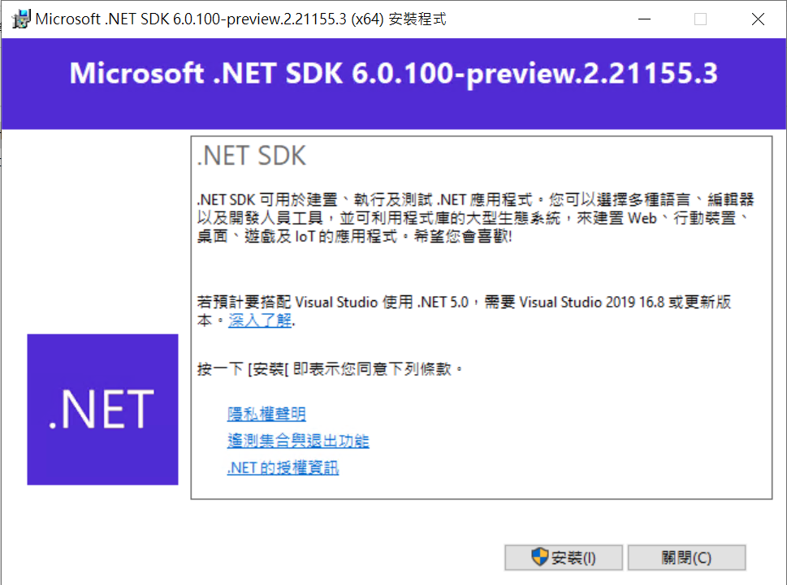
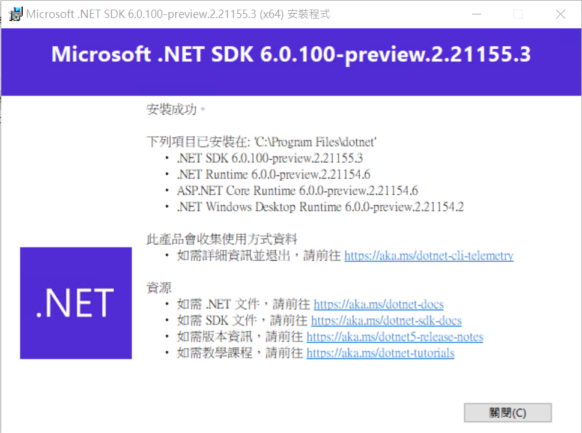
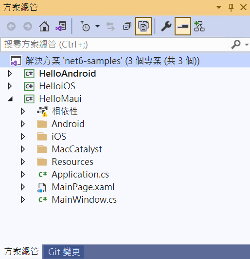
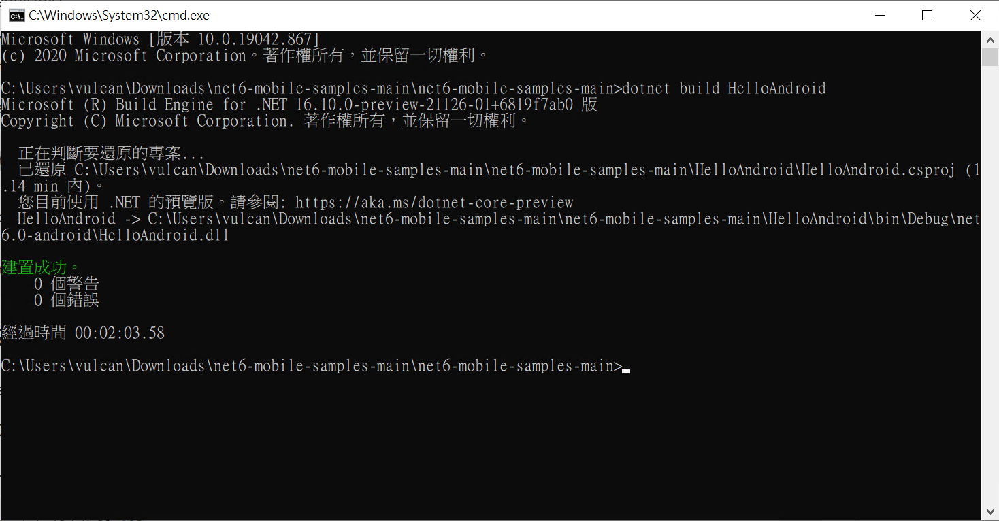
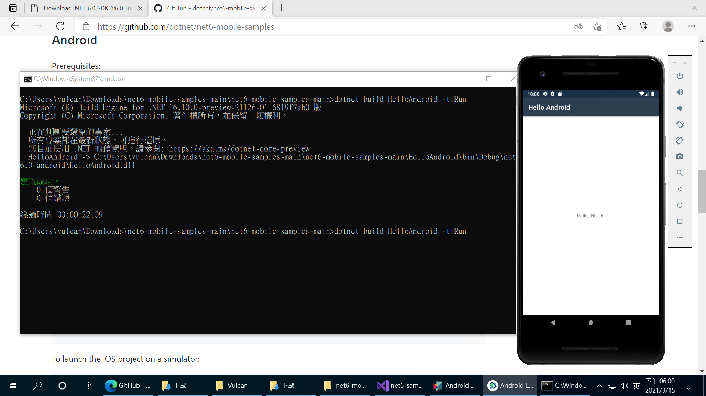
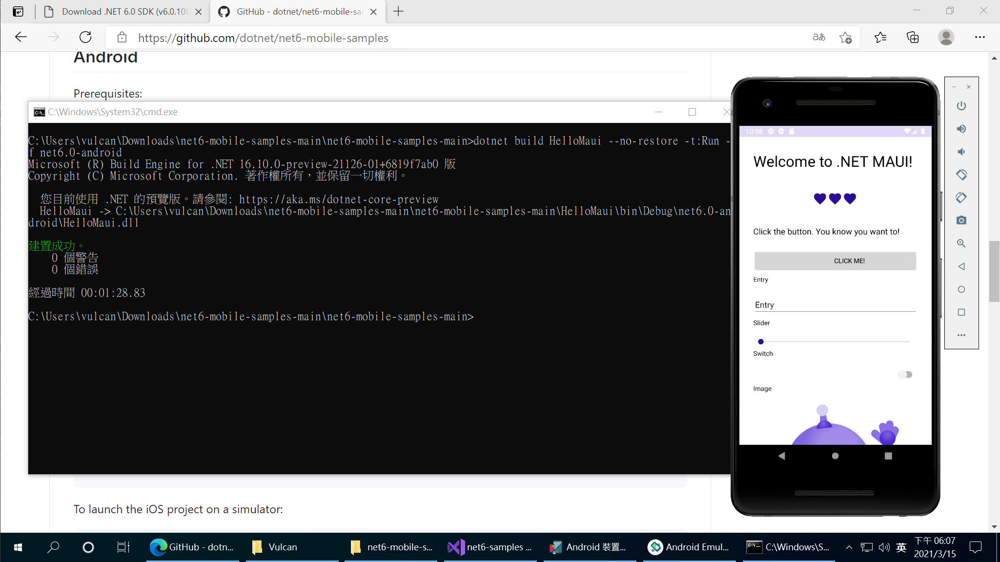

# .NET 6 preview2 初體驗 - 執行 Maui 專案

在 03月11日，微軟發表了 [Announcing .NET 6 Preview 2](https://devblogs.microsoft.com/dotnet/announcing-net-6-preview-2?WT.mc_id=DT-MVP-5002220) ，由於本身就已經從事於 Xamarin.Forms 多年教學與開發經驗，並且坐進也在使用 Blazor 進行各種專案開發，理所當然地對於 .NET 6 有著極高的興趣，所以，就在今天建立起一個 Windows 10 作業系統環境，一開始將 Hyper-V 相關服務開啟。

## 安裝 Visual Studio 2019 Preview
接著就到 [Visual Studio Preview](https://visualstudio.microsoft.com/zh-hant/vs/preview/) 網站下在 Visual Studio 2019 Preview IDE 到系統上。

## 安裝 .NET 6 SDK 
最後，從 [Download .NET 6.0](https://dotnet.microsoft.com/download/dotnet/6.0) 來下載 [SDK 6.0.100-preview.2.21155.3](https://dotnet.microsoft.com/download/dotnet/thank-you/sdk-6.0.100-preview.2-windows-x64-installer) 並且安裝到這台電腦上，下載下來的檔案名稱為 dotnet-sdk-6.0.100-preview.2.21155.3-win-x64.exe。

請執行這個安裝檔案，就會出現底下畫面

請點選 [安裝] 按鈕

安裝完成之後，請點選 [關閉] 按鈕

## 設定 Visual Studio 2019 可以使用 .NET 6 Preview 

打開 Visual Studio 2019

點選 [工具] > [選項]

## .NET 6 的 Maui 範例程式碼的安裝設定

根據 [net6-mobile-samples](https://github.com/dotnet/net6-mobile-samples) 網頁說明，還需要額外安裝

Android:

Windows: [Microsoft.NET.Workload.Android.11.0.200.148.msi](https://dl.internalx.com/vsts-devdiv/Xamarin.Android/public/net6/4534967/main/f4d8fe238b15eadfc7842749bf13e5fca3e2f2d2/Microsoft.NET.Workload.Android.11.0.200.148.msi)

iOS:

Windows: [Microsoft.NET.Workload.iOS.14.4.100-ci.main.1192.msi](https://bosstoragemirror.azureedge.net/wrench/main/98c8649d0c7d1e3c4c8d8d09e022befa853fb1e7/4541181/package/Microsoft.NET.Workload.iOS.14.4.100-ci.main.1192.msi)

## 執行 .NET 6 的 原生 Android 範例程式碼

這裡是現在 .NET6 Preview 2 的 Maui 範例 方案內容

請下載這個專案 Repository [net6-mobile-samples](https://github.com/dotnet/net6-mobile-samples) ，現階段似乎無法透過 Visual Studio 2019 來執行這些範例程式碼，因此，根據文件上的說明，打開命令提示字元視窗，切換到該專案的目錄下。

輸入這個命令 `dotnet build HelloAndroid`

接著輸入 `dotnet build HelloAndroid -t:Run`

## 執行 .NET 6 的 Maui for Android 範例程式碼

請下載這個專案 Repository [net6-mobile-samples](https://github.com/dotnet/net6-mobile-samples) ，現階段似乎無法透過 Visual Studio 2019 來執行這些範例程式碼，因此，根據文件上的說明，打開命令提示字元視窗，切換到該專案的目錄下。

輸入這個命令 `dotnet build HelloMaui --no-restore -t:Run -f net6.0-android`

