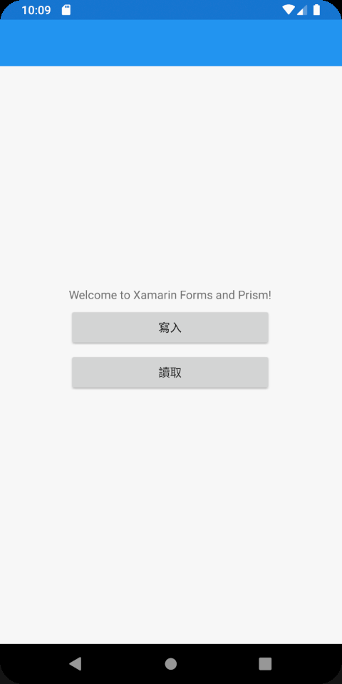
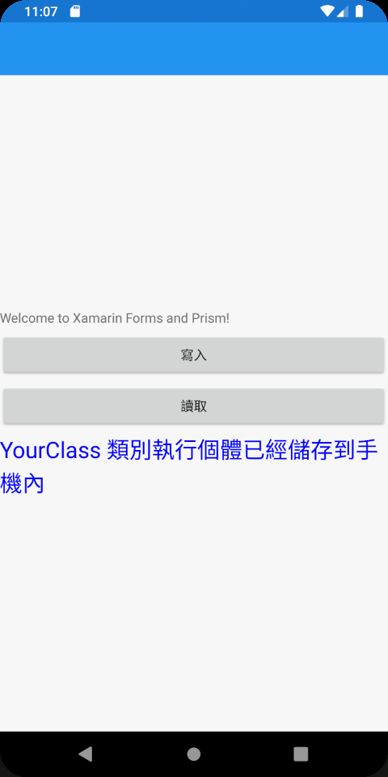
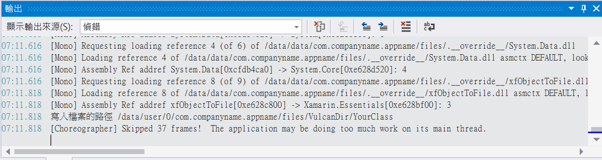
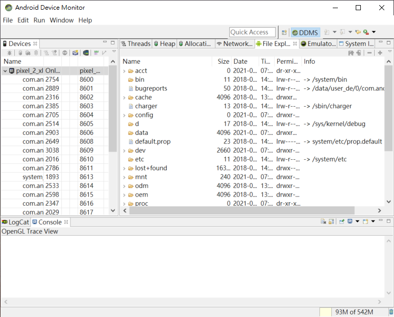
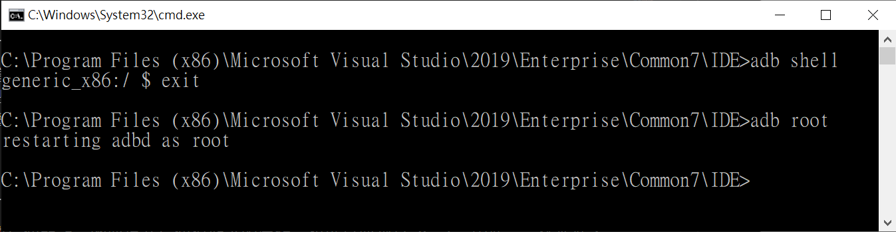
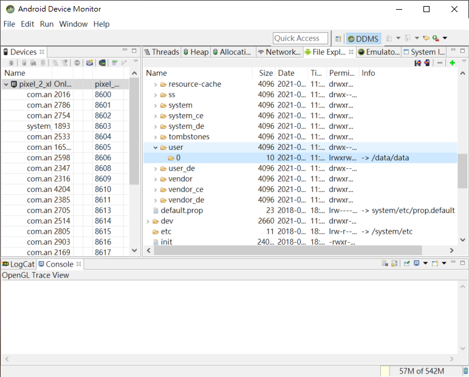
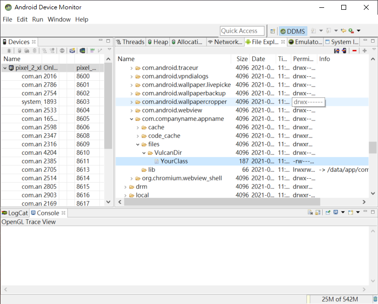
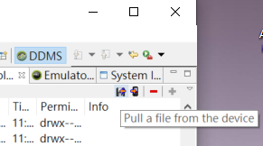
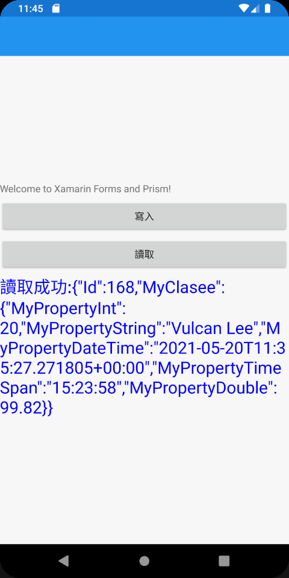

# 快取 Web API 內容 2 : 在 Xamarin.Forms 專案內，將 .NET 物件永久保存儲存，並可以讀取回應用程式內

在上一篇 [快取 Web API 內容 1 : 將 .NET 物件永久保存儲存，並可以讀取回應用程式內](https://csharpkh.blogspot.com/2021/05/NET-Object-JSON-File-Persisten-read-Write-Cache-Directory.html) 文章中有說明如何將 .NET 物件序列化成為 JSON 物件，接著寫入到檔案內，藉以儲存該 .NET 物件當時的狀態；另外，也說明如何從檔案內讀取之前儲存的 JSON 文字內容，並且反序列化成為 .NET 物件的做法。

其中，[StorageUtility] 這個類別提供了兩個方法，可以將會把文字內容寫入到指定目錄下的指定檔案名稱，另外一個則可以從指定的目錄與檔案名稱讀取文字內容回來；另外 [StorageJSONService] 則是一個泛型類別，可以將指定的類別型別的物件，寫入到檔案內，或者從檔案內把這個物件的狀態讀取回來。

這些操作都是使用 Console 類型的專案來實作，那麼，對於 Xamarin.Forms 的專案內，這樣的需求是該要如何實踐出來呢？在這篇文章中將會說明該如何做到。

這篇文章的原始碼位於 [xfObjectToFile](https://github.com/vulcanlee/CSharp2021/tree/main/xfObjectToFile)

## 範例專案設計說明

在這裡將會建立一個 Xamarin.Forms for Prism 的專案，當然，要直接建立一個 Visual Studio 預設專案樣板的 Xamarin.Forms 專案也是可以的。接著，會安裝兩個 NuGet 套件到 Xamarin.Forms 專案內： [Newtonsoft.Json] & [PropertyChanged.Fody]。

在這個專案的首頁畫面中，將會設計兩個按鈕與一個文字控制項，該文字控制項將會用來顯示執行狀態結果，底下將會是這個專案執行後的螢幕截圖。



## MainPage.xaml

首先，來看看這個唯一的一個手機頁面的宣告內容，在這裡透過資料綁定，將兩個按鈕的 Command 屬性，分別綁定到 ViewModel 內的兩個命令物件上，如此，當這些按鈕被觸發的時候，將會執行所指定的命令委派方法；而最後一個 Label 控制項，則是綁定 ViewModel 內的 Message 屬性，用來顯示 ViewModel 程式碼的執行結果內容。

```xml
<?xml version="1.0" encoding="utf-8" ?>
<ContentPage xmlns="http://xamarin.com/schemas/2014/forms"
             xmlns:x="http://schemas.microsoft.com/winfx/2009/xaml"
             x:Class="xfObjectToFile.Views.MainPage"
             Title="{Binding Title}">

    <StackLayout HorizontalOptions="CenterAndExpand" VerticalOptions="CenterAndExpand">
        <Label Text="Welcome to Xamarin Forms and Prism!" />
        <Button Text="寫入"
                Command="{Binding WriteCommand}"/>
        <Button Text="讀取"
                Command="{Binding ReadCommand}"/>
        <Label Text="{Binding Message}"
               FontSize="24" TextColor="Blue"/>
    </StackLayout>

</ContentPage>
```

## MainPageViewModel.cs

對於 View 的 XAML 文件，可以說是相當的簡單，現在來看看這個頁面(View)相對應的 ViewModel 類別的程式碼；這個 MainPageViewModel 已經經過重構，可以用於 Prism 這個套件與使用 PropertyChanged.Fody 這個套件來簡化資料綁定的宣告，若讀者使用的不是這兩個環境，請自行修正相關程式碼。

對於 WriteCommand 這個命令物件，其委派方法將會建立一個 [YourClass] 類別執行個體，這個類別內也有一個型別為 MyClasee 的屬性，形成一個複合式的物件。

接著，將會使用 `await StorageJSONService<YourClass>.WriteToDataFileAsync("VulcanDir", nameof(YourClass), yourClass);` 這樣的敘述，把這個 .NET 物件 (yourClass) 寫入到檔案內，而要寫入的目錄名稱將會是 [VulcanDir]，最後，使用 `Message = "YourClass 類別執行個體已經儲存到手機內";` 敘述將此處理結果顯示到螢幕上。

```csharp
using Prism.Commands;
using Prism.Mvvm;
using Prism.Navigation;
using System;
using System.Collections.Generic;
using System.Linq;
using System.Text;

namespace xfObjectToFile.ViewModels
{
    using System.ComponentModel;
    using Newtonsoft.Json;
    using Prism.Events;
    using Prism.Navigation;
    using Prism.Services;
    using xfObjectToFile.Storages;

    public class MainPageViewModel : INotifyPropertyChanged, INavigationAware
    {
        public event PropertyChangedEventHandler PropertyChanged;

        private readonly INavigationService navigationService;
        public DelegateCommand WriteCommand { get; set; }
        public DelegateCommand ReadCommand { get; set; }
        public string Message { get; set; }
        public MainPageViewModel(INavigationService navigationService)
        {
            this.navigationService = navigationService;
            WriteCommand = new DelegateCommand(async () =>
            {
                var yourClass = new YourClass()
                {
                    Id = 168,
                    MyClasee = new MyClass()
                    {
                        MyPropertyInt = 20,
                        MyPropertyString = "Vulcan Lee",
                        MyPropertyDateTime = DateTime.Now.AddDays(-3),
                        MyPropertyDouble = 99.82,
                        MyPropertyTimeSpan = new TimeSpan(15, 23, 58),
                    }
                };
                await StorageJSONService<YourClass>.WriteToDataFileAsync(
                    "VulcanDir", nameof(YourClass), yourClass);
                Message = "YourClass 類別執行個體已經儲存到手機內";

            });
            ReadCommand = new DelegateCommand(async () =>
            {
                var yourClass = await StorageJSONService<YourClass>.ReadFromFileAsync(
                      "VulcanDir", nameof(YourClass));
                string json = JsonConvert.SerializeObject(yourClass);
                Message = $"讀取成功:{json}";
            });
        }

        public void OnNavigatedFrom(INavigationParameters parameters)
        {
        }

        public void OnNavigatedTo(INavigationParameters parameters)
        {
        }

    }
}
```

這裡將會產生一個問題，就是這個檔案究竟寫到哪個目錄下，也就是該檔案寫入的絕對目錄是在哪裡？

這裡需要來看看 [StorageUtility] 這個類別，例如，在這個類別內的 [WriteToDataFileAsync] 方法，使用這個敘述 `string rootPath = FileSystem.AppDataDirectory;` 來取得這個 App 可以存取的根路徑是在哪裡，而不是使用之前 Console 專案內使用的 `string rootPath = Environment.CurrentDirectory;` 敘述來取得。

首先要先知道，每個應用程式安裝到手機內之後，原則上僅能夠存取本身應用程式安裝下的目錄，不能夠存取其他應用程式安裝的目錄，因為這些目錄受到保護，這樣的規則適用於 iOS & Android 系統下。所以，讀者也可以使用類似檔案總管的App來試用看看，因為，你也無法透過類似這樣的檔案總管看到這些受保護的目錄。

在這個 [StorageUtility] 類別內的 [WriteToDataFileAsync] / [ReadFromDataFileAsync] 方法內，有這個敘述 `Console.WriteLine($"寫入檔案的路徑 {fooPath}");`，這個敘述將會顯示出真正要讀寫的檔案完整目錄是甚麼？這些內容可以從 Visual Studio 的輸出視窗內顯示出來。

現在，可以執行這個專案，點選寫入按鈕，會出現如下圖畫面



接著，請從 Visual Studio 的輸出視窗，可以看到如下面截圖畫面，在輸出視窗的倒數第二行可以看到這樣的內容：

```
寫入檔案的路徑 /data/user/0/com.companyname.appname/files/VulcanDir/YourClass
```



因此，可以看到這個應用程式資料的根目錄是位於 /data/user/0/com.companyname.appname

現在，透過 Android SDK 工具來查看該模擬器的檔案系統，看看是否可以看到這些目錄

點選 Visual Studio 功能表的 [工具] > [Android] > [Android 裝置監視器]


由於這個應用程式資料的根目錄是位於 /data/user/0/com.companyname.appname，因此，點選 [Android 裝置監視器] 右方的 [data] 目錄節點左方的 `>` 符號，嘗試展開這個節點，不過，卻會看到如同下方的結果，無法展開 [data] 目錄下有哪些檔案或者目錄。



要解決這個問題，需要提升這個模擬器的層級，也就是要越獄 Root，因此，請依據底下的做法，讓這個模擬器可以看到這些受保護的目錄內容。

* 點選 Visual Studio 功能表的 [工具] > [Android] > [Android adb 命令提示字元]
* 輸入 `adb shell` 命令，並且按下 [Enter] 按鍵
* 將會看到這樣的內容 `generic_x86:/ $` 這表示你不具備管理者權限
* 接著輸入 `exit` + [Enter] 按鍵，離開除錯環境
* 接這在命令提示字元下輸入 `adb root` 命令，並且按下 [Enter] 按鍵
* 現在將會看到這樣的內容 `restarting adbd as root`
* 請關閉與重新開啟模擬器，這樣就會越獄成功



請先再度執行這個範例專案，執行完成之後，點選 [寫入] 按鈕

現在，透過 [Android 裝置監視器] 中，展開 [data] 目錄，看到如下圖的畫面

當展開到 [data] > [user] > [0] 這個目錄之後，就再也無法展開，從 [0] 這個目錄的右方，可以看到這個目錄是 [data] > [data] 這個目錄的捷徑。



因此，從目錄 [data] > [data] 繼續來展開，將會看到 `com.companyname.appname/files/VulcanDir` 這個目錄下的內容了

在這個目錄下，將會看到一個檔案，就是剛剛寫入的檔案



點選 [YourClass] 這個檔案，接著在螢幕右上方找到下載檔案的這個按鈕，當游標移動到這個按鈕之後，將會顯示出 [Pull a file from the device] 這樣的文字。

現在會看到一個名為 [Get Device File] 的對話窗出現，請選擇你要儲存的目錄，點選 [存檔] 按鈕，此時就會從手機模擬器裝置內，把這個檔案下載到你的電腦上。



使用任何文字編輯器來查看這個檔案內容，就會看到如下的內容。

這就是剛剛寫入到檔案內的 .NET 物件內容(這裡是經過 JSON 序列化處理)

```json
{"Id":168,"MyClasee":{"MyPropertyInt":20,"MyPropertyString":"Vulcan Lee","MyPropertyDateTime":"2021-05-20T11:35:27.271805+00:00","MyPropertyTimeSpan":"15:23:58","MyPropertyDouble":99.82}}
```

最後，在模擬器上，點選讀取按鈕，確認可以從手機中把資料讀取出來，如下圖所示



